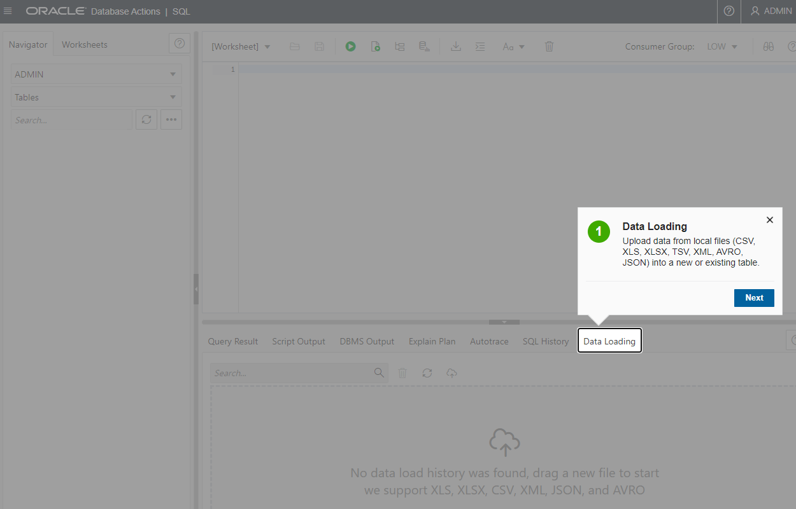
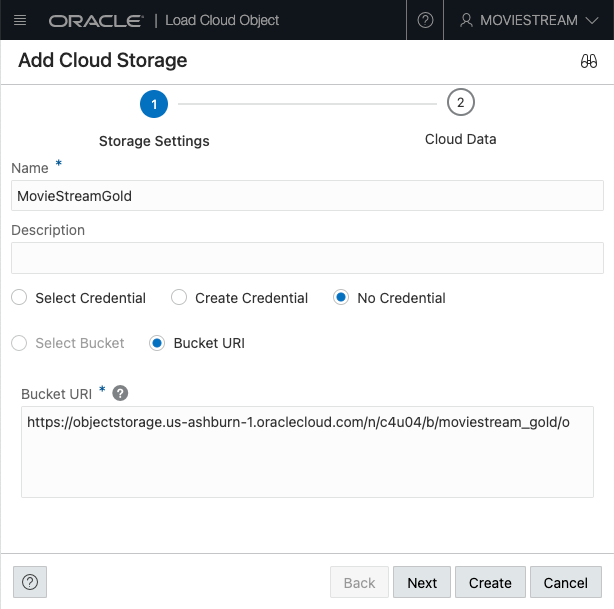

# Use Data Tools to create a user and load data

## Introduction

#### Video Preview

[](youtube:0_BOgvJw4N0)

In this lab, you will create a new database user, then load and link data from the MovieStream data lake on [Oracle Cloud Infrastructure Object Storage](https://www.oracle.com/cloud/storage/object-storage.html) into an Oracle Autonomous Database instance in preparation for exploration and analysis.

You can load data into your Autonomous Database (either Oracle Autonomous Data Warehouse or Oracle Autonomous Transaction Processing) using the built-in tools as in this lab, or you can use other Oracle and third party data integration tools. With the built-in tools, you can load data:

+ from files in your local device
+ from tables in remote databases
+ from files stored in cloud-based object storage (Oracle Cloud Infrastructure Object Storage, Amazon S3, Microsoft Azure Blob Storage, Google Cloud Storage)

You can also leave data in place in cloud object storage, and link to it from your Autonomous Database.

> **Note:** While this lab uses Oracle Autonomous Data Warehouse, the steps are identical for loading data into an Oracle Autonomous Transaction Processing database.

Estimated Time: 15 minutes

### About product

In this lab, we will learn more about the autonomous database's built-in Data Load tool - see the [documentation](https://docs.oracle.com/en/cloud/paas/autonomous-database/adbsa/data-load.html#GUID-E810061A-42B3-485F-92B8-3B872D790D85) for more information.

We will also learn how to exercise features of the DBMS\_CLOUD package to link and load data into the autonomous database using SQL scripts. For more information about DBMS_CLOUD, see its [documentation](https://docs.oracle.com/en/cloud/paas/autonomous-database/adbsa/dbms-cloud-package.html).

### Objectives

In this lab, you will:
* Create a database user and update the user's profile to grant more privileges
* Log in as the user
* Learn how to define object storage credentials for your autonomous database
* Learn how to load data from object storage using Data Tools
* Load data using a script


### Prerequisites

- This lab requires completion of Lab 1, **Provision an ADB Instance**, in the Contents menu on the left.

## Task 1: Create a database user

When you create a new data warehouse, you automatically get an account called ADMIN that is your super administrator user. In the real world, you will definitely want to keep your data warehouse data separate from the administration processes. Therefore, you will need to know how to create separate new users and grant them access to your data warehouse. This section will guide you through this process using the "New User" wizard within the Database Actions set of tools.

For this workshop we need to create one new user.

1. Navigate to the Details page of the Autonomous Database you provisioned in the "Provision an ADW Instance" lab. In this example, the database name is "My Quick Start ADW." Click the **Database Actions** button.

    

You will automatically log in as the ADMIN user.

2. On the Database Actions home page, click the **Database Users** card.

    

3.  You can see that your ADMIN user appears as the current user.  On the right-hand side, click the **+ Create User** button.

    

5. The **Create User**  form will appear on the right-hand side of your browser window. Use the settings below to complete the form:

 - username: **MOVIESTREAM**
 - password: create a suitably strong password, and make note of it, as you will need to provide it in an upcoming step.

    >**Note:** Rules for User Passwords: Autonomous Database requires strong passwords. User passwords user must meet the following default password complexity rules:

    - Password must be between 12 and 30 characters long

    - Must include at least one uppercase letter, one lowercase letter, and one numeric character

    - Limit passwords to a maximum of 30 characters

    - Cannot contain the username

    - Cannot be one of the last four passwords used for the same username

    - Cannot contain the double quote (") or exclamation (!) characters

    There is more information available in the documentation about password rules and how to create your own password rules; see here: [Create Users on Autonomous Database](https://docs.oracle.com/en/cloud/paas/autonomous-database/adbsa/manage-users-create.html#GUID-B5846072-995B-4B81-BDCB-AF530BC42847)

- Toggle the **Graph** button to **On**.
- Toggle the **Web Access** button to **On**.
- Toggle the **OML** button to **On**.
- In the upper right section of the Create User dialog, select **UNLIMITED** from the drop down menu for Quota on tablespace DATA.

- Leave the **Password Expired** toggle button as off (Note: this controls whether the user is prompted to change their password when they next log in).
- Leave the **Account is Locked** toggle button as off. 

- Click **Create User** at the bottom of the form.

    

Now that you have created a user with several roles, let's see how easy it is to grant some more roles.

## Task 2: Update the user's profile to grant more privileges

You learned how to use the Create User dialog to create a new user. You can also create and modify users using SQL. This is useful when you don't have access to the user interface or you want to run scripts to create/alter many users. Open the SQL worksheet as the ADMIN user to update the MOVIESTREAM user you just created.

1. The Database Users page now shows your new MOVIESTREAM user in addition to the ADMIN user. Click **Database Actions** in the upper left corner of the page, to return to the Database Actions launch page.

    

2.  In the Development section of the Database Actions page, click the **SQL** card to open a new SQL worksheet:

    

    This will open up a new window that should look something like the screenshot below. The first time you open SQL Worksheet, a series of pop-up informational boxes introduce you to the main features. Click Next to take a tour through the informational boxes.

    


3. In the SQL Worksheet, paste in this code and run it using the **Run Script** button:

    ```
    <copy>
    grant execute on dbms_cloud to moviestream;
    grant execute on dbms_cloud_repo to moviestream;
    grant create table to moviestream;
    grant create view to moviestream;
    grant all on directory data_pump_dir to moviestream;
    grant create procedure to moviestream;
    grant create sequence to moviestream;
    grant create job to moviestream;
    </copy>
    ```


## Task 3: Log in as the MOVIESTREAM user

Now you need to switch from the ADMIN user to the MOVIESTREAM user, before starting the next lab on data loading.

1. In the upper right corner of the page, click the drop-down menu for ADMIN, and click **Sign Out**.

    

2. On the next screen, click **Sign in**.

    

3. Enter the username MOVIESTREAM and the password you defined when you created this user.

    

4. This will launch the Database Actions home page.

    


## Task 4: Load data from files in Object Storage using Data Tools

In this step we will perform some simple data loading tasks, to load in CSV files from object storage into tables in our autonomous database.

1. Under **What do you want to do with your data?** select **LOAD DATA**, and under **Where is your data?** select **CLOUD STORAGE**, then click **Next**

    

2. You will need to set up a cloud storage location. A cloud storage location is an object storage bucket that contains your source data. Click **Done** to set up a location.

    

3. Fill in the cloud location details:

    - In the **Name** field, enter 'MovieStreamGold'.

        **Note:** Take care not to use spaces in the name.

    - Select **No Credential** as this is a public bucket.

    - Copy and paste the following URI into the URI + Bucket field:

    ```
    <copy>
    https://objectstorage.us-ashburn-1.oraclecloud.com/n/c4u04/b/moviestream_gold/o
    </copy>
    ```

    
    
    - Then click **Create**. This will return you to the **Load Cloud Object** page.

3. From the MOVIESTREAMGOLD location, drag the **customer_contact** folder over to the right hand pane. Note that a dialog box appears asking if we want to load all the files in this folder to a single target table. In this case, we only have a single file, but we do want to load this into a single table. Click **OK**.

4. Next, drag the **genre** folder over to the right hand pane. Again, click **OK** to load all files into a single table.

5. Click on the pencil icon for the **customer_contact** task to view the settings for this load task.

    

6. Here we can see the list of columns and data types that will be created from the csv file. They all look correct, so click **Close** to close the settings viewer.

7. Click on the pencil icon for the **genre** task to view its settings. This should show just two columns to be created - **GENRE_ID** and **NAME**. Click **Close** to close the settings viewer.

8. Now click on the Play button to run the data load job.

    

    The job should take about 20 seconds to run.

9. Check that both data load cards have green tick marks in them, indicating that the data load tasks have completed successfully.

    


## Task 5: Load and link more data using SQL scripting

We have now learned how easy it is to load data using the Data Load tool. However, we can also load data using SQL scripts which exercise the same database APIs in the DBMS\_CLOUD package.

The DBMS\_CLOUD package is a feature of the autonomous database that enables us to extend the database to load from, and link to, cloud data storage systems such as Oracle Cloud Infrastructure Object Storage, Amazon S3, and Microsoft Azure Blob Storage. For more information see the [DBMS\_CLOUD documentation](https://docs.oracle.com/en/cloud/paas/autonomous-database/adbsa/dbms-cloud-package.html).

In this step, we will use some additional features of the DBMS\_CLOUD APIs to load in some more files, including Parquet and JSON files.

>**Note** [Parquet](https://parquet.apache.org/documentation/latest/) is a common big data file format, where often many parquet files are used to store large volumes of data with a common type and with a common set of columns; in this case, the customer sales data for MovieStream.

1. Click on the menu in the very top left of your screen. In the **Development** section, click on **SQL** to open a SQL Worksheet.

    

2. Copy and paste the following script into the Worksheet. This script will create PL/SQL procedures based on the lab_setup.sql file found in github.

```
<copy>
-- Install the setup file from github 
declare
    l_owner     varchar2(100) := 'oracle';
    l_repo_name varchar2(100) := 'learning-library';
    l_file_path varchar2(200) := 'data-management-library/autonomous-database/shared/movie-stream-story-lite/add-data-scripts/lab_setup.sql';
BEGIN
    dbms_cloud_repo.install_file(
        repo => dbms_cloud_repo.init_github_repo(                 
                 repo_name       => l_repo_name,
                 owner           => l_owner
                ),
        file_path     =>     l_file_path,
        stop_on_error => false
  );
END;
/
</copy>
```

Click the **Run Script** button to run the script.


3. A PL/SQL procedure called add_datasets was installed by the previous step.  Run that procedure to load the rest of the data.
```
<copy>
-- Run the PLSQL procedure that loads the rest of the dataset
BEGIN
    add_datasets;
END;
/
</copy>
```  

Click the **Run Script** button to run the script.

> **Note** The script should take around 4-5 minutes to run as it uses a number of scripts to load and links a number of data files, and to generate additional views and tables used in later analysis steps.

10. When the script has completed, you should see a message like this in the Script Output window:

    

11. In the left hand pane, next to the Search box, click on the Refresh button to refresh the set of tables and views in the MOVIESTREAM user's schema. You should see a list of tables and views including **CUSTOMER**, **CUSTSALES** and **TIME** amongst others:

    

This completes the Data Load lab. We now have a full set of structured tables loaded into the Autonomous Database from the MovieStream data lake. We will be working with these tables in later labs.

Please *proceed to the next lab*.

## Acknowledgements

* **Author** - Mike Matthews, Autonomous Database Product Management
* **Contributors** -  Rick Green, Principal Developer, Database User Assistance, Marty Gubar, Autonomous Database Product Management
* **Last Updated By/Date** - Marty Gubar, March 2022
