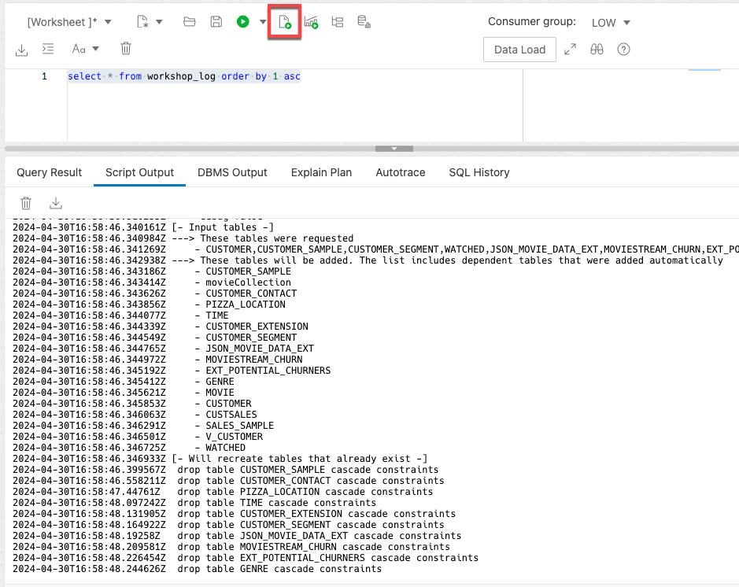

# Use Data Tools to create a user and load data

## Introduction

#### Video Preview

<!--[](youtube:0_BOgvJw4N0)-->

In this lab, you will create a new database user, then load and link data from the MovieStream data lake on [Oracle Cloud Infrastructure Object Storage](https://www.oracle.com/cloud/storage/object-storage.html) into an Oracle Autonomous Database instance in preparation for exploration and analysis.

You can load data into your Autonomous Database (either Oracle Autonomous Data Warehouse or Oracle Autonomous Transaction Processing) using the built-in tools as in this lab, or you can use other Oracle and third party data integration tools. With the built-in tools, you can load data:

+ from files in your local device
+ from tables in remote databases
+ from files stored in cloud-based object storage (Oracle Cloud Infrastructure Object Storage, Amazon S3, Microsoft Azure Blob Storage, Google Cloud Storage)

You can also leave data in place in cloud object storage, and link to it from your Autonomous Database.

> **Note:** While this lab uses Oracle Autonomous Data Warehouse, the steps are identical for loading data into an Oracle Autonomous Transaction Processing database.

Estimated Time: 15 minutes

Watch the video below for a quick walk-through of the lab.
[Use Data Tools to create a user and load data](videohub:1_i5dtdsa4)

### About product

In this lab, we will learn more about the autonomous database's built-in Data Load tool - see the [documentation](https://docs.oracle.com/en/cloud/paas/autonomous-database/adbsa/data-load.html#GUID-E810061A-42B3-485F-92B8-3B872D790D85) for more information.

We will also learn how to exercise features of the DBMS\_CLOUD package to link and load data into the autonomous database using SQL scripts. For more information about DBMS_CLOUD, see its [documentation](https://docs.oracle.com/en/cloud/paas/autonomous-database/adbsa/dbms-cloud-package.html).

### Objectives

In this lab, you will:
* Create a database user and update the user's profile to grant more privileges
* Log in as the user
* Learn how to load data from object storage using Data Tools
* Load data using a script

### Prerequisites

- This lab requires completion of Lab 1, **Provision an ADB Instance**, in the Contents menu on the left.

## Task 1: Create a database user

[](include:adb-create-user.md)

Now that you have created a user with several roles, let's see how easy it is to grant some more roles.

## Task 2: Update the user's profile to grant more privileges

You learned how to use the Create User dialog to create a new user. You can also create and modify users using SQL. This is useful when you don't have access to the user interface or you want to run scripts to create/alter many users. Next, you will open the SQL worksheet as the ADMIN user to update the [](var:db_user_name) user you just created.

1. The Database Users page now shows your new [](var:db_user_name) user in addition to the ADMIN user. Click **Development -> SQL** in the upper left corner of the page, to go to the SQL Worksheet.

    

2. This will open up a new window that should look something like the screenshot below. The first time you open SQL Worksheet, a series of pop-up informational boxes appear. You can ignore the informational warning and dismiss that dialog. You can also take a tour to introduce you to the main features. Click **Next** to take a tour through the informational boxes or dismiss the dialog.

    


3. In the SQL Worksheet, paste in this code and run it using the **Run Script** button:

    ```
    <copy>
    grant execute on dbms_cloud to moviestream;
    grant execute on dbms_cloud_repo to moviestream;
    grant create table to moviestream;
    grant create view to moviestream;
    grant all on directory data_pump_dir to moviestream;
    grant create procedure to moviestream;
    grant create sequence to moviestream;
    grant create job to moviestream;
    </copy>
    ```

    

4. Next, install the LiveLabs workshop utilities. These utilities make it easy to add data sets, which you will do in the next task. In the SQL Worksheet, paste in this code and run it using the **Run Script** button:

    ```
    <copy>
    declare 
        l_uri varchar2(500) := 'https://objectstorage.us-ashburn-1.oraclecloud.com/n/c4u04/b/building_blocks_utilities/o/setup/workshop-setup.sql';
    begin
        dbms_cloud_repo.install_sql(
            content => to_clob(dbms_cloud.get_object(object_uri => l_uri))
        );
    end;
    /
    </copy>
    ```

    The script above is showcasing Autonomous Database's integration with external repositories. The **dbms\_cloud\_repo.install\_file** procedure allows you to easily install database code from object storage or GitHub repositories into your schema. Here, we are installing pl/sql packages, procedures, tables and views from the `workshop-setup.sql` file found in an object storage bucket.

## Task 3: Log in as the MOVIESTREAM user

Now you need to switch from the ADMIN user to the [](var:db_user_name) user, before starting the next task on data loading.

1. In the upper right corner of the page, click the drop-down menu for ADMIN, and click **Sign Out**.

    

2. Sign in using the username [](var:db_user_name) and the password you defined when you created this user. You will also need to click **Advanced** and specify the [](var:db_user_name).

    

3. This will launch the Database Actions Launchpad home page.

    

    In this example, the database name in the top right should say [](var:db_user_name).

## Task 4: Load data from files in Object Storage using Data Studio

In this step we will perform some simple data loading tasks, to load in CSV files from object storage into tables in our autonomous database.

[](include:adb-load-public-db-actions-no-sales.md)


## Task 5: Load and link more data using SQL scripting

We have now learned how easy it is to load data using the Data Load tool. However, we can also load data using SQL scripts which exercise the same database APIs in the DBMS\_CLOUD package.

The DBMS\_CLOUD package is a feature of the autonomous database that enables us to extend the database to load from, and link to, cloud data storage systems such as Oracle Cloud Infrastructure Object Storage, Amazon S3, and Microsoft Azure Blob Storage. For more information see the [DBMS\_CLOUD documentation](https://docs.oracle.com/en/cloud/paas/autonomous-database/adbsa/dbms-cloud-package.html).

In this step, we will use some additional features of the DBMS\_CLOUD APIs to load in some more files, including Parquet and JSON files.

>**Note** [Parquet](https://parquet.apache.org/documentation/latest/) is a common big data file format, where often many parquet files are used to store large volumes of data with a common type and with a common set of columns; in this case, the customer sales data for MovieStream.

1. Click on the menu in the very top left of your screen. In the **Development** section, click on **SQL** to open a SQL Worksheet.

    

2. When you updated the user privileges, you installed LiveLab workshop utilities that make it easy to install data sets. Copy and paste the following script to install the rest of the required data sets:

    ```
    <copy>
    -- Run the PLSQL procedure that loads the rest of the dataset
    BEGIN
        workshop.add_dataset(tag => 'end-to-end');
    END;
    /
    </copy>
    ```  

    Click the **Run Script** button to run the script.

    > **Note** The script should take around 4-5 minutes to run as it uses a number of scripts to load and links a number of data files, and to generate additional views and tables used in later analysis steps.

3.  Monitor the data load by running the following query:

    ```
    <copy>
    select *
    from workshop_log 
    order by 1 asc;
    </copy>
    ```  
    
    Click **Run Script** to see the status:

    

    You can continue once the spatial index creation is complete. After creating the spatial index, the script will continue building a graph using a database job.


4. In the left hand pane, next to the Search box, click on the Refresh button to refresh the set of tables and views in the [](var:db_user_name) user's schema. You should see a list of tables and views including **CUSTOMER**, **CUSTSALES** and **TIME** amongst others:

    

This completes the Data Load lab. We now have a full set of structured tables loaded into the Autonomous Database from the MovieStream data lake. We will be working with these tables in later labs.

Please [*proceed to the next lab*](#next).

## Acknowledgements

* **Author** - Mike Matthews, Autonomous Database Product Management
* **Contributors** -  Rick Green, Principal Developer, Database User Assistance, Marty Gubar, Autonomous Database Product Management
* **Last Updated By/Date** - Marty Gubar, September 2022
