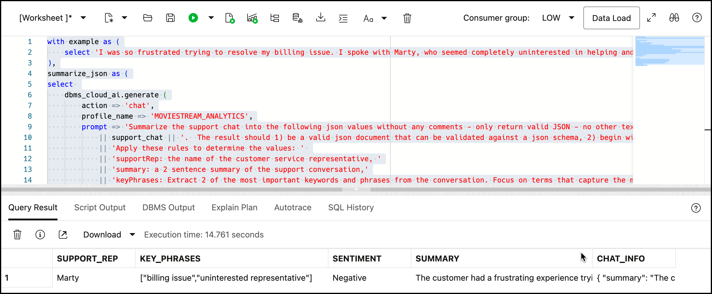

# Create targeted offers with Spatial and Select AI

## Introduction
In previous labs, we identified customers that are big spenders and active users and we also found customers that have posted negative comments about their MovieStream experience. Let's try to win back the hearts of high-value, unhappy customers by providing them a special free movie and pizza offer - using local pizza franchises that MovieStream has partnered with. We'll use Select AI to generate the compelling offer.

### Objectives

- Identify high value, frustrated customers 
- Find customers that are near one of our participating pizza franchises
- Create the offer using Select AI


1. Find people who have written negative things
2. Make a targeted offer
    - Free movies based on what they recently watched
    - Free pizza at a local shop

### Prerequisites
1. You must have complete **Lab 5: Load data and gain insights from user comments**

## Task 1: Identify important customers
In one of our previous labs, we identified high value customers. For convenience, let's save that list to a new table:

1. If you are not already in the Database Tools, navigate to it using the steps from [Lab 2, Task 1](/adb/movie-stream-story-lite/workshops/tenancy/index.html?lab=query-with-sql#Task1:LogintotheSQLWorksheet). Make sure you are logged in as the **MOVIESTREAM** user.

2. In the SQL Worksheet, create a table that contains high-value customers that have posted negative comments. High-value customers are those that are in the top 20% for spend or usage: 

    ```
    <copy>
    DROP TABLE if exists at_risk_high_value_customers;

    CREATE TABLE at_risk_high_value_customers AS
    WITH rm as (
        SELECT
            s.cust_id,
            c.first_name,
            c.last_name, 
            c.loc_lat,
            c.loc_long,
            NTILE (5) OVER (ORDER BY SUM(s.sales)) AS rfm_monetary, 
            NTILE (5) OVER (ORDER BY count(1)) AS rfm_frequency
        FROM streams s, customer c
        WHERE s.cust_id = c.cust_id
        GROUP BY s.cust_id, c.first_name, c.last_name, c.loc_lat, c.loc_long
    )
    SELECT
        cust_id,
        first_name,
        last_name,
        loc_lat,
        loc_long
    FROM rm
    WHERE 
        (rfm_monetary = 5 OR rfm_frequency = 5)
        AND cust_id in (SELECT cust_id FROM customer_feedback WHERE sentiment = 'Negative');   
    </copy>
    ```
    

2. View the results. Query a random set of records from the new table:

    ```
    <copy>
    SELECT *
    FROM at_risk_high_value_customers
    ORDER BY dbms_random.value()
    FETCH FIRST 10 ROWS ONLY;
    </copy>
    ```
    

Let's now find customers that will be good targets for a pizza promotion using spatial analytics.

## Task 2: Using spatial queries to find the right pizza shop
Oracle Autonomous Database provides an extensive SQL API for spatial analysis. This includes spatial relationships, measurements, aggregations, transformations, and more. In this lab you focus on one of those spatial analysis operations, "nearest neighbor" analysis. Nearest neighbor analysis refers to identifying which item(s) are nearest to a location.

1. Let's find the **nearest neighbor with distance**. A numeric placeholder value is added as a final parameter to sdo\_nn, and the same placeholder value is used as the parameter to sdo\_nn\_distance( ) in the select list. Run the following query to identify 5 pizza locations nearest to customer 1254455 along with its distance (rounded to 1 decimal place).

    ```
    <copy>
    SELECT
        a.first_name, 
        b.chain, 
        b.address, 
        b.city, 
        b.state,
        round( sdo_nn_distance(1), 1 ) distance_km
    FROM at_risk_high_value_customers a, pizza_location  b
    WHERE a.cust_id = 1254455
    AND sdo_nn(
         latlon_to_geometry(b.lat, b.lon),
         latlon_to_geometry(a.loc_lat, a.loc_long),
         'sdo_num_res=5 unit=KM',
         1 ) = 'TRUE'
    ORDER BY distance_km ASC;         
    </copy>
    ```
    

    `Papa Larry's Pizza` seems like the obvious candidate for `Tabitha`.

2. The previous query identified pizza locations nearest to a single customer location (that is, customer 1254455). You can also use the sdo_nn( ) operator to identify the nearest pizza location for a set of customer locations. This is a **nearest neighbor join**, where pizza and customer locations are joined based on the nearest neighbor relationship. Run the following query to identify the nearest pizza location for a set of customers:
    ```
    <copy>
    SELECT 
        a.cust_id, 
        b.chain, 
        b.address, 
        b.city, 
        b.state,
        round( sdo_nn_distance(1), 1 ) distance_km
    FROM at_risk_high_value_customers a, pizza_location  b
    WHERE sdo_nn(
            latlon_to_geometry(b.lat, b.lon),
            latlon_to_geometry(a.loc_lat, a.loc_long),
            'sdo_num_res=1 unit=KM',
            1 ) = 'TRUE'
    ORDER BY distance_km asc;
    </copy>    
    ```
    

    The list of customers here are all good candidates for the promotion based on their proximity to a participating pizza location. You could sort the distance descending to find customers that would likey need to take a plane to find to get a slice!

## Task 3: Using the Select AI SQL function
Select AI provides a SQL function  `dbms_cloud_ai.generate` that allows you to easily apply AI to your organization's private data. You simply package a query result and pass it to the LLM with a prompt describing how to operate on that data. There are many use cases - including our ultimate task - creating a promotional email to our at risk customers containing a special offer. But first, let's look at a couple of other use cases:

1. Sometimes, you get data that are not in the format that you need. For example, you have a single line address that you really need broken out into fields. That way, you can summarize by city, state, etc. There is a simple design pattern to accomplish this with the Select AI `dbms_cloud_ai.generate` function:
    - Use the `chat` feature - which passes the prompt to the model "as-is"
    - Use JSON as a translation layer between model output and your structured result
    - Engineer a prompt that performs the required task

    In our example, we will transform: `38 Newbury St, Office #3, Boston, MA 02116` into multiple columns. The prompt instructs the model to parse the text and extract the required fields as JSON attributes. Then, it simply turns those JSON attributes into relational columns:

    ```
    <copy>
    with example as (
        select ('38 Newbury St, Office #3, Boston, MA 02116') as address
        from dual
    ),
    json_string as (
    select 
        dbms_cloud_ai.generate (
            action => 'chat',
            profile_name => 'MOVIESTREAM_ANALYTICS',
            prompt => 'Parse the given address without any comments. Only return valid JSON - no other text.' 
                || 'The result should be 1) a json object for that address and 2) be simple text, not markdown. '
                || 'Here are the required JSON object fields: {addressNumber, streetName, unitNumber, city, state, zip}. '
                || 'Apply to the following address: ' || address
        ) as address_json
    from example
    )
    select 
        json_value(address_json, '$.addressNumber') as address_number,
        json_value(address_json, '$.streetName') as street,
        json_value(address_json, '$.unitNumber') as unit,
        json_value(address_json, '$.city') as city,
        json_value(address_json, '$.state') as state,
        json_value(address_json, '$.zip') as zip
    from json_string j;
    </copy>
    ```
    

2. Another great use case is summarizing a conversation. Consider the following support conversation below. Select AI will extract the support rep, key phrases, sentiment and summary:

    ```
    <copy>
    with example as (
        select 'I was so frustrated trying to resolve my billing issue. I spoke with Marty, who seemed completely uninterested in helping and kept transferring me to different departments. I feel like I wasted an hour of my time and still don''t have a solution.' as support_chat
    ),
    summarize_json as (
    select 
        dbms_cloud_ai.generate (
            action => 'chat',
            profile_name => 'MOVIESTREAM_ANALYTICS',
            prompt => 'Summarize the support chat into the following json values without any comments - only return valid JSON - no other text: {summary, keyPhrases, sentiment, supportRep}. content: '
                || support_chat || '.  The result should 1) be a valid json document that can be validated against a json schema, 2) begin with { and end with }, 3) be simple text, not markdown. ' 
                || 'Apply these rules to determine the values: ' 
                || 'supportRep: the name of the customer service representative, '
                || 'summary: a 2 sentence summary of the support conversation,'
                || 'keyPhrases: Extract 2 of the most important keywords and phrases from the conversation. Focus on terms that capture the main topics, key ideas, and significant points discussed,'
                || 'sentiment:  return one value - Positive or Negative'
        ) as chat_info
    from example
    )
    select 
        json_value(chat_info, '$.supportRep') as support_rep,
        json_query(chat_info, '$.keyPhrases') as key_phrases,
        json_value(chat_info, '$.sentiment') as sentiment,
        json_value(chat_info, '$.summary') as summary,
        chat_info
    from summarize_json;
    </copy>
    ```
    

## Task 4: Create the targeted offer using Select AI and Spatial
Now that we have been introduced to spatial queries and Select AI SQL functions, let's create our targeted offer to at-risk customers. The offer will:
* Identify the best pizza location for the customer based on location
* Recommend 3 movies based on what the customer previously watched. These 3 movies will be drawn from movies that MovieStream would like to promote.

Review the query and see how it breaks down the problem into logical parts:
* Find the movies MovieStream is promoting
* Find the most recent movies watched by Constance
* Find local pizza franchises for Constance
* Collect all of this info into a JSON document
* Send that information to the LLM to generate a promotion

1. Run this query in SQL Worksheet to generate the promotion for Constance (cust_id 1404819). Constance is a high value customer that has had frustrations with the service:
    
    ```
    <copy>
    WITH promoted_movie_list AS
    (
        -- movies MovieStream wants to promote. Create a JSON array
        SELECT
            JSON_ARRAYAGG(
                JSON_OBJECT('title' VALUE title, 'year' VALUE year)
            ) AS promoted_movies
        FROM movie
        WHERE studio like '%Amblin Entertainment%'
    ),
    customer_latest_movies AS (
        -- latest 3 movies the customer watched. This will be turned into a JSON array next
        SELECT        
            m.title,
            m.year
        FROM streams s, movie m
        WHERE m.movie_id = s.movie_id
            and s.cust_id = 1404819  --< Constance customer id
        ORDER BY day_id desc
        FETCH first 3 ROWS ONLY
    ),
    customer_latest_movies_doc AS (
        -- turn the latest 3 movies into a JSON document
        SELECT
            JSON_ARRAYAGG(
                JSON_OBJECT('title' VALUE title, 'year' VALUE year)
            ) as customer_latest_movies
        FROM customer_latest_movies
    ),
    closest_pizza_location AS (
        -- the closest pizza location to this customer
        SELECT 
            a.first_name,  
            b.chain, 
            b.address, 
            b.city, 
            b.state,
            round( sdo_nn_distance(1), 1 ) distance_km
        FROM at_risk_high_value_customers a, pizza_location  b
        WHERE a.cust_id = 1404819
        AND sdo_nn(
            latlon_to_geometry(b.lat, b.lon),
            latlon_to_geometry(a.loc_lat, a.loc_long),
            'sdo_num_res=1 unit=KM',
            1 ) = 'TRUE'
    ),
    dataset AS (
        -- combine all of the above into a json document
        SELECT 
            JSON_OBJECT(
                'customer-name' VALUE c.first_name,
                'pizza-shop' VALUE c.chain,
                'address' VALUE c.address,
                'city' VALUE c.city, 
                'state' VALUE c.state,
                'customer-latest-movies' VALUE clm.customer_latest_movies,
                'promoted-movies' VALUE p.promoted_movies
                
                RETURNING CLOB PRETTY
            ) AS doc
        FROM closest_pizza_location c, promoted_movie_list p, customer_latest_movies_doc clm
    )    
    SELECT
        -- generate the promotion!
        DBMS_CLOUD_AI.GENERATE (
            prompt => 'Create a promotional email with a catchy subject line and convincing email text. Follow the task rules. ' ||
                    '1. Recommend 3 movies from the promoted movie list that are most similar to movies in the recently watched movie list. ' ||
                    '   Do not say that we are promoting these movies. For each move, say why you will love them.' || 
                    '2. Use lots of fun emojis in the response. ' ||
                    '3. Highlight that they are receiving a promotion for free pizza at the provided pizza shop. Tell them the name of the shop and its address' ||
                    '4. Finish the email thanking them for being a customer and sign it "From The MovieStream Team" \n' 
                    || doc,
            profile_name => 'MOVIESTREAM_ANALYTICS',
            action => 'chat'
        ) AS email_promotion
    FROM dataset;
    </copy>
    ```
    


## Acknowledgements
* **Authors:** 
* Marty Gubar, Product Management
* **Last Updated By/Date:** Marty Gubar, April 2025

Data about movies in this workshop were sourced from **Wikipedia**.

Copyright (c) 2025 Oracle Corporation.