# Use Oracle Machine Learning AutoML UI to predict customer churn

## Introduction

#### Video preview

[](youtube:iK2T6iKaYqQ)


Analyzing past performance lets you know customers that have already been lost. Lets get in front of this problem and predict those that are at risk using in database analytics.

In this lab, you will use the Oracle Machine Learning (OML) Notebooks and the OML4SQL interface provided with Autonomous Database, and the OML AutoML UI and its features to identify customers with a higher likelihood of churning from **Oracle MovieStream** streaming services to a different movie streaming company.

There are two parts to this Lab:
- Quick preview of the data that was prepared by the Data Engineer in conjunction with the Data Scientist
- Use of the Oracle Machine Learning AutoML UI to build a model that can predict churn, and score current customers

Estimated Time: 10 minutes

### About OML

In this lab, we will learn more about the Autonomous Database's built-in [Oracle Machine Learning](https://www.oracle.com/goto/machinelearning) components, including:
- Oracle Machine Learning Notebooks - see [OML Notebooks documentation](https://docs.oracle.com/en/database/oracle/machine-learning/oml-notebooks/index.html).
- Oracle Machine Learning AutoML UI - see [OML AutoML UI documentation](https://docs.oracle.com/en/database/oracle/machine-learning/oml-automl-ui/index.html).
- Oracle Machine Learning for Python - see [OML4Py documentation](https://docs.oracle.com/en/database/oracle/machine-learning/oml4py/index.html).

### Objectives

In this lab, you will:
- Access Oracle Machine Learning Notebooks provided with Oracle Autonomous Database
- Use **OML AutoML UI** to build a high-quality machine model that can help predict future churn by customers
- Use the machine learning model to score the list of customers and predict their likelihood to churn in the future

### Prerequisites

- This lab requires completion of Labs 1–2 in the Contents menu on the left.

## Task 1: Understand customer churn and access OML AutoML UI

To understand customer behavior, we need to look into their Geo-Demographic information, but also their transactional behavior. For transactional data, we need to summarize number of transactions and aggregate values per month for each type of transaction that we would like to explore. This is because the algorithms need to receive as input a single row per customer, with their attributes provided in database table columns.

A Data Engineer and a Data Scientist worked together to process and transform the data that exists in the **CUSTSALES** Oracle Database table. This table contains historical customer transactions for every movie streamed, including payment and discounts, and can help us identify customer preferences and usage of the service. To aggregate the data, with **one customer per row** (which is a data layout required by Machine Learning), they worked with the **Date** information of the transactions to determine the customer behavior over time.

Defining what **customer churn** means can be very complex, but for our example the agreement of the Business team with the Data Scientist was:
- A customer will considered "churned" if they had **no (zero) streams in the last available month of data**, while having streamed movies during 12 months continuously before a **buffer** month (detailed below).
- In contrast to those customers, the customers that will be compared to those (and considered "non-churners") are the customers that have been **streaming movies for 12 months continuously as well as on the last available month of data**.

The following diagram shows the process we will use, including a **buffer** month that represents the time needed to be able to **act** on the knowledge that a customer is about to leave. Predicting the **probability that a customer is going to leave exactly right now** does not help preparing a customer retention campaign, since there is a lot of processing involved in updating customer data at the end of a day before one can do scoring, excluding customers that have a **DO NOT CONTACT** exception. Also, processing offers and other processes in sync with all other divisions of the enterprise will always take time.  

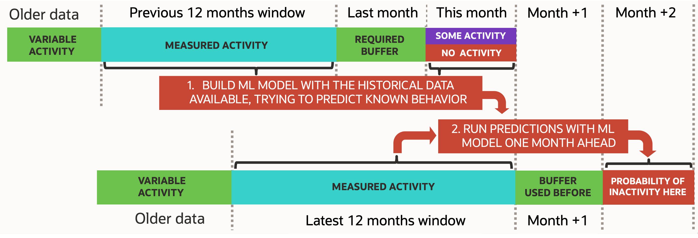

In addition to that, **a customer churning today probably made that decision a while ago**, so our machine learning model needs to be able to detect any change in behavior from at least a month ago. This is the reason for the buffer of 1 month in the process.

1. Access OML AutoML UI as the Oracle Autonomous Database (ADB) user **moviestream**.

    You can access Oracle Machine Learning notebooks from Autonomous Database.

    From the tab on your browser with your Oracle Autonomous Data Warehouse (ADW) instance, click **Service Console.**

    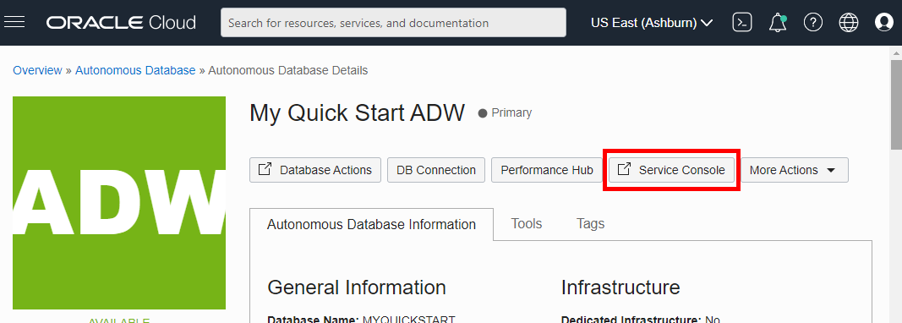

    Once in the Service Console, select **Development** from the menu on the left.

    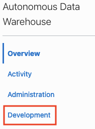

    From the cards that are available in the Development section, click the **Oracle Machine Learning Notebooks** card.

    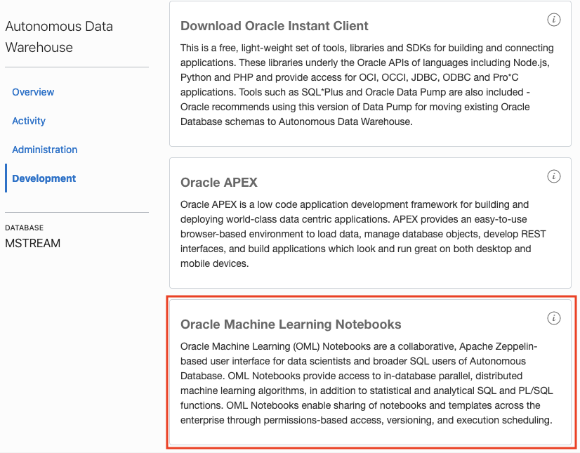

    <if type="livelabs">Sign in with ``MOVIESTREAM`` using the password you created in "Lab 3: Create a Database User", Task 1, Step 5. </if><if type="freetier">Enter your Autonomous Database user credentials and click **Sign in.**

    Please note that your user has to have the proper credentials for Oracle Machine Learning, described under "**Lab 3:** Create a Database user", at "**Task 2:** Update the user's profile to grant additional roles."</if>

    

    Click **AutoML UI** on the Quick Actions menu.

    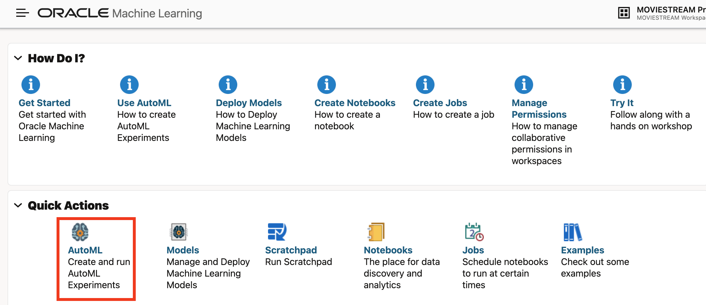

2. Build a machine learning model to predict churn.

   In this step, you will use the Oracle Machine Learning (OML) AutoML UI provided with your Autonomous Database and its features to identify customers with a higher likelihood of churning from **Oracle MovieStream** streaming services to a different movie streaming company.

   We have prepared the final table called `MOVIESTREAM_CHURN`, so now we can use it in our analysis.

   You should see the OML AutoML UI Experiments menu, which should be empty. Let's create a **new experiment** by clicking the **Create** button indicated below.

    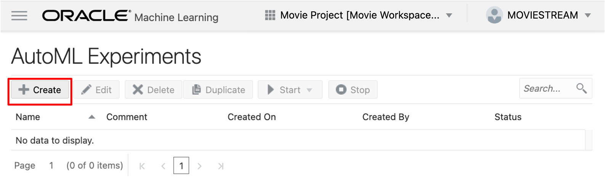

    We need to give the new experiment a **name**, and optionally a description in the **comments** section. Type the name you would like to call it by and a description if you wish.  

    Then, click the **magnifying glass icon** at the right of the **Data Source** field, so that we can find the table called `MOVIESTREAM_CHURN` that we have just created.

    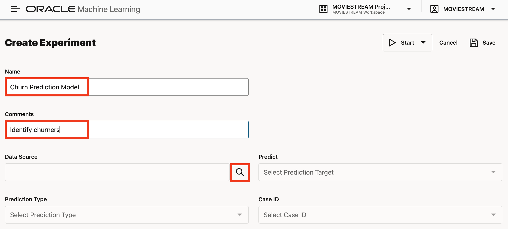

    In the **Select Table** menu that opens, leave the `SCHEMA` selection as it is, and on the right side scroll down to search for the `MOVIESTREAM_CHURN` table. Alternatively, you can start typing `CHURN` in the search box at the bottom of the list, and it should appear. Select the `MOVIESTREAM_CHURN` table and click the **OK** button.

    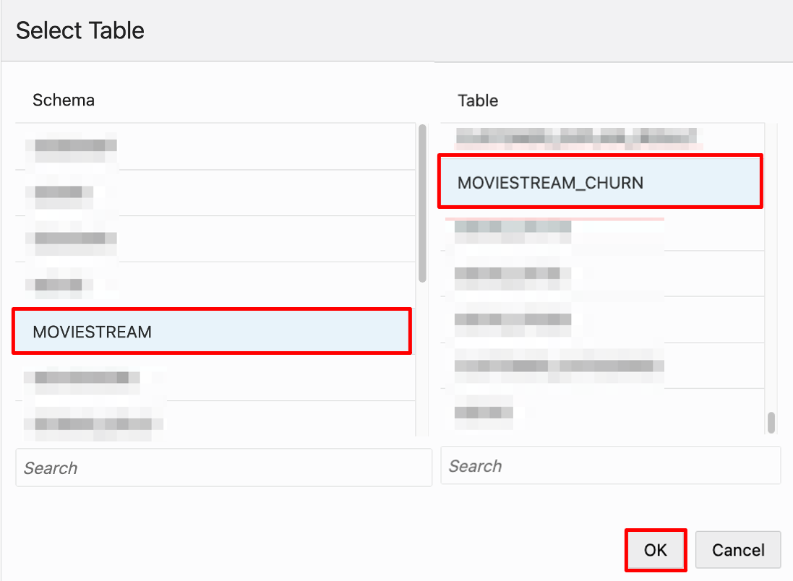

    Back on the **Experiment** page, the **Data Source** name is populated with our selection, and OML AutoML UI will display several statistics for each attribute of the table.

    Scroll down in the **Experiment** page until you see the **Features** section. A list of the attributes available in the table is displayed. Please note that there is a **scroll bar** for the list itself at the right, next to the **Std Dev** statistic.

    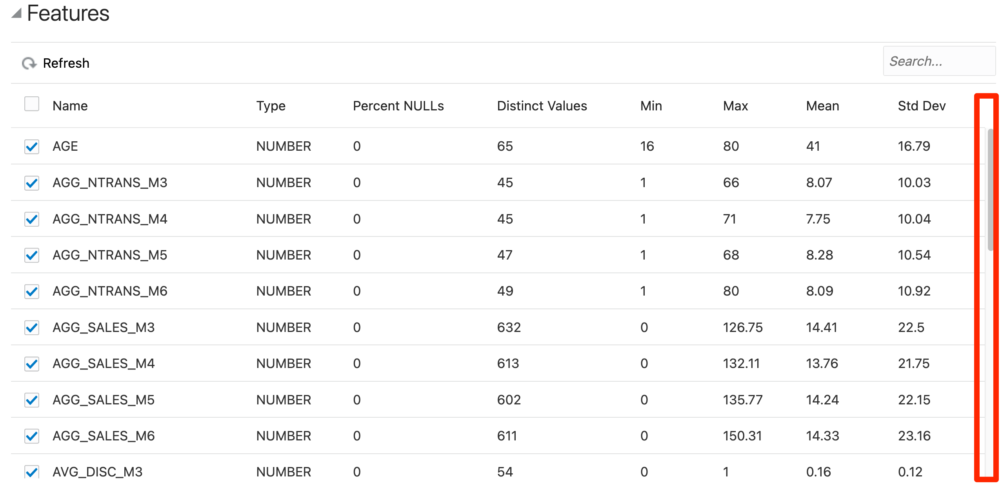

3. Define the Prediction Target, Case ID and Experiment Settings.

    Back to the top of the **Experiments** page, at the right of the screen you will find two pull-down menus. We need to use those to define what we want to predict, in the **Predict** field. Click the down-arrow and search for the target attribute named `IS_CHURNER`. Alternatively you can start typing in the `Search` box that appears.

    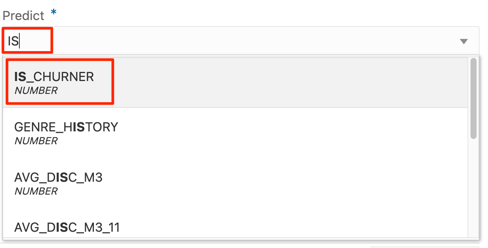

    Repeat the process with the **Case ID** pull-down menu selection, identifying the column `CUST_ID` as the unique identifier of our customer. The final result should look like the image below.

    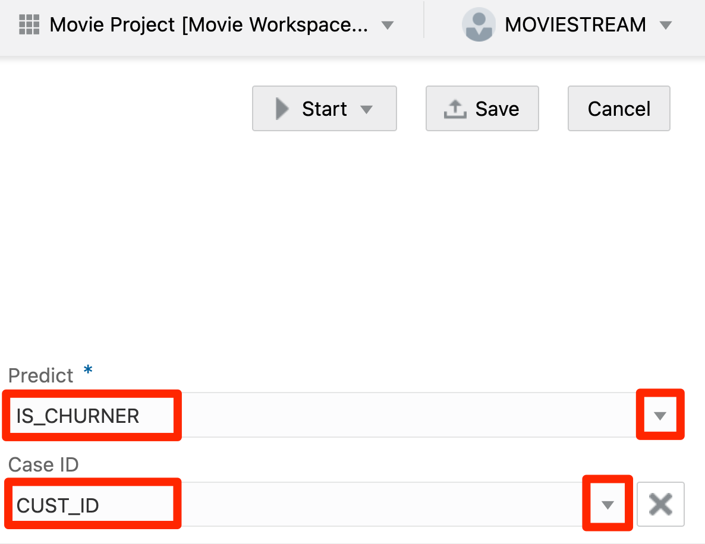

    On the left hand side, just under the **Data Source**, you should have noted that now the **Prediction Type** pull-down option is showing **Classification**. This is because OML AutoML UI detects that our recently selected **Predict** column, our `TARGET` attribute, has only two distinct values and as such this is a binary classification problem. The other option is **Regression**, which is not appropriate for our problem, so we just leave it as is.

    Below that we find the **Additional Settings** section. Let's expand that by clicking on the little triangle next to its name. In here you see that the default values for **Maximum Top Models** is **5**, but we will reduce that to **2** to make it a bit faster for this workshop. Also, we will increase the **Database Service Level** to "HIGH". Read more about Service Levels with OML AutoML UI in [this Blog Post](https://blogs.oracle.com/machinelearning/oml-automl-ui-4-things-you-can-do-that-affect-performance).

    We are going to leave the **Algorithms** selections as is, which means that OML AutoML UI will try each of these algorithms to find the best one for us.

    Here's what our selections look like.

    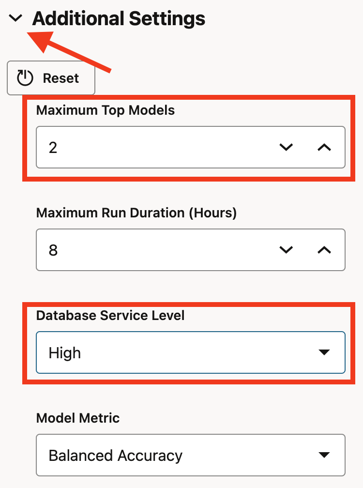

    We are now ready to start the Experiment.

## Task 2: Run the Experiment and explore the results.

1. Start the Experiment.

   At the very top right of the screen, you will find the **Start** button. We will click it, and from the sub-menu that appears, we will select **Faster Results**. With that selection, OML AutoML UI will search for models on a reduced hyperparameter search space, to speed up the process.

    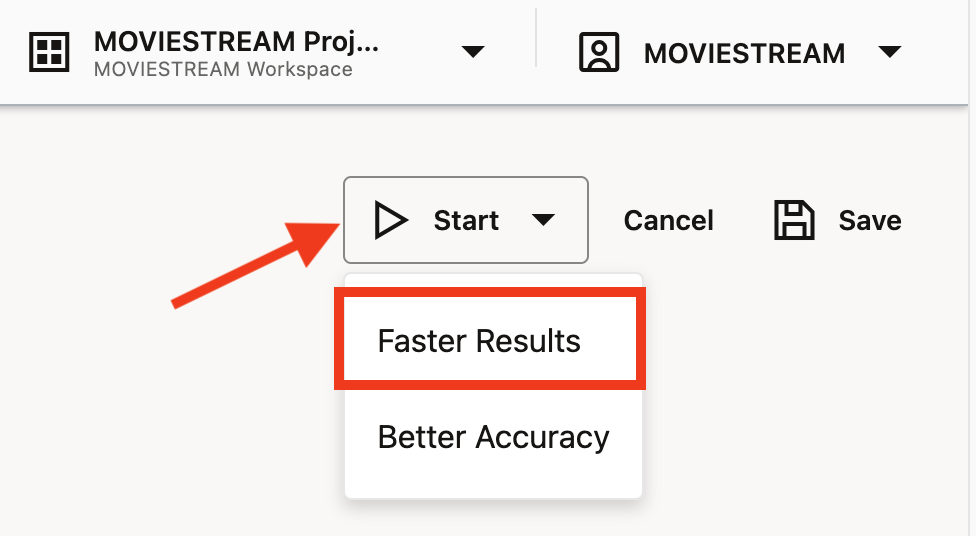

    As a reference point, we expect this **Experiment** to run to completion on a **Classification** task using **Balanced Accuracy** as the metric, and using **Maximum Top Models of 2** in about **2 or 3 minutes**.

    **IMPORTANT:** Please note that if you choose different settings for your own Experiment, a larger number of models, or even run it at **Best Accuracy** instead of **Faster Results**, a longer running time might be required, and a different "best" algorithm might be chosen. In that case, your results might differ slightly from the screens below, but will still be valid and correct to your settings.

    While the **Experiment** is running, you will note that a floating **Progress** indicator opens, showing the specific step of the process the **Experiment** is currently running, and an approximate time that it has been running.

    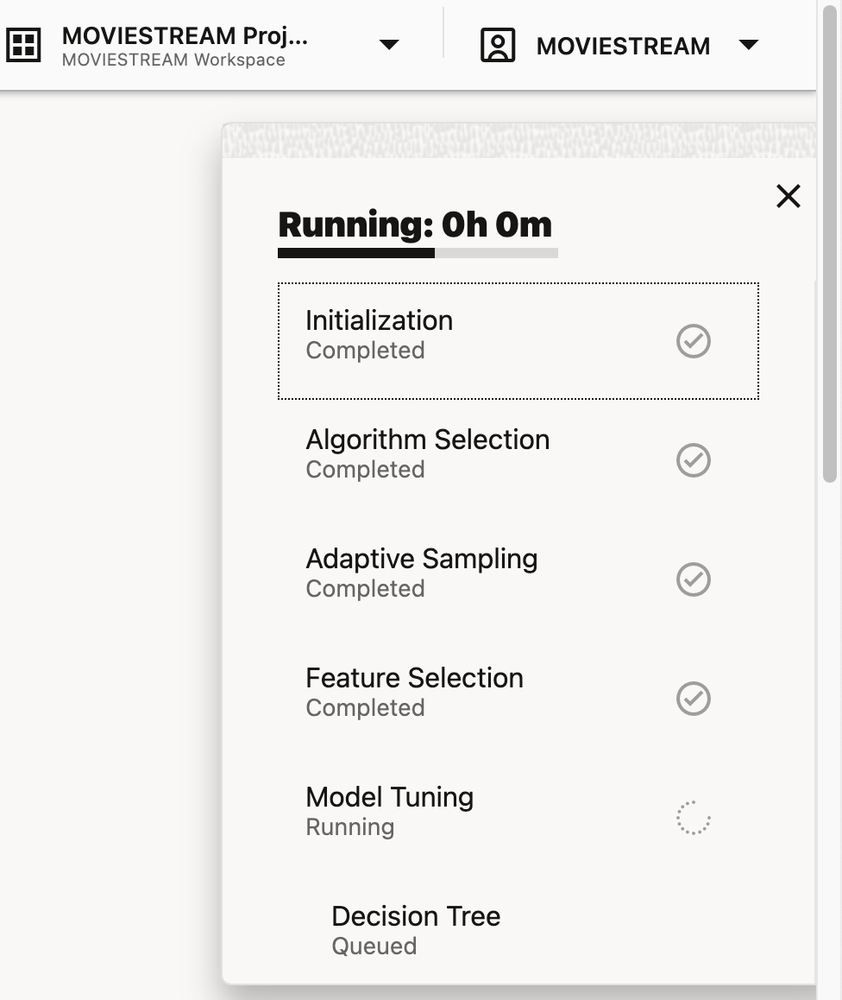

2. Review the asynchronous process.
   This process is completely **asynchronous**, so you can go back to the **Experiments** menu at any time by clicking on the blue button on the top left.

    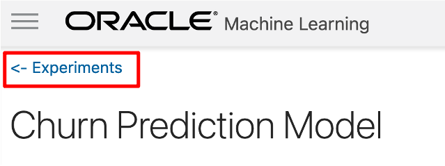

    You can see then that the **Experiments** listing shows our experiment as **running**.

    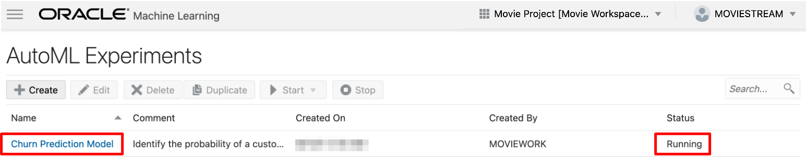

    Clicking on the **Experiment Name** (Churn Prediction Model in our case) takes us back to the running screen.

    The performance of OML AutoML UI depends a lot of the type of environment your Autonomous Database is running on. As explained in [this blog post](https://blogs.oracle.com/machinelearning/oml-automl-ui-4-things-you-can-do-that-affect-performance), several components may affect the performance, among the most important ones is the number of CPUs that can be allocated to your Autonomous Database instance, and whether you can enable auto scaling on Autonomous Database.  

3. Check the results.
   Once the process completes, you will note that the **running icon** on the top right changes to indicate it is **Completed**. The **Balanced Accuracy** chart will show the increased accuracy over time as the models were tested, and the **Leader Board** will present the different algorithms that were chosen, and their respective **Model Names**.

    In the following screen we can see that the top 2 algorithms chosen were a **Decision Tree** and a **Random Forest**. By default they receive randomly generated unique **Model Names**.

    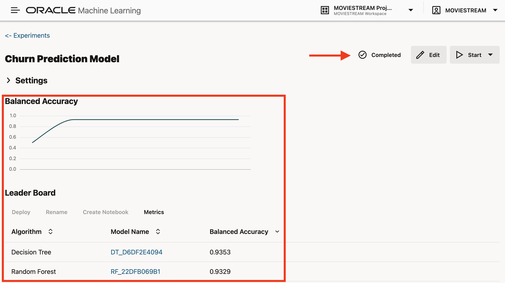

    After an **Experiment** run is completed, the **Features** grid displays an additional column **Importance**. This feature importance indicates the overall level of sensitivity of prediction to a particular feature. Hover your cursor over the graph to view the value of importance. The value is always depicted in the range 0 to 1, with values closer to 1 being more important.

    > **Note:** this importance value is **not** related to any particular model, but it shows an overall value to give us an idea of potentially which attributes would be important.

    Scroll down to see the **Features** section. You will also note a **Search** box at the top right of this section, which is important given that there are 170+ attributes.

    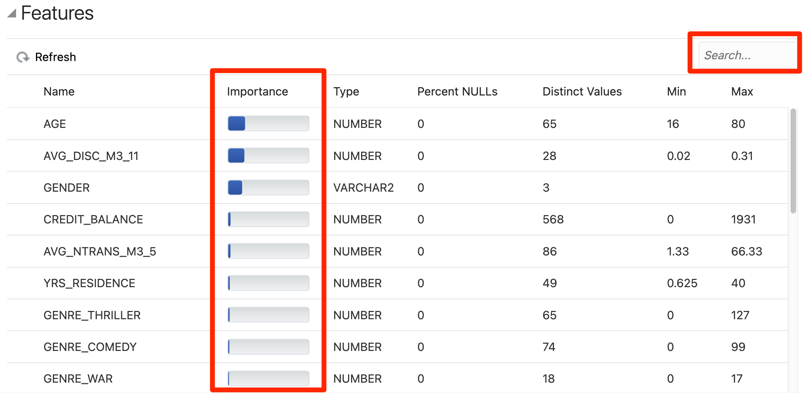

    In this **Experiment**, the attributes with the highest **overall importance** are:
    ```
    AGE, AVG_DISC_M3_11 (average discounts for the 9 months before the current quarter), GENDER, CREDIT_BALANCE, AVG_NTRANS_M3_5 (average number of transactions in the previous quarter), YRS_RESIDENCE, GENRE_THRILLER, GENRE_COMEDY, and GENRE_WAR
    ```
4. Understand model performance.
    Scrolling up to the **Leader Board** section, we can click the **Decision Tree** unique model name to open the diagnostics. Click on the Decision Tree **Model Name** link in blue.

    > **NOTE**: The exact random model name is unique to your model, so it will not appear as *DT_312651AA64* like the one below.

    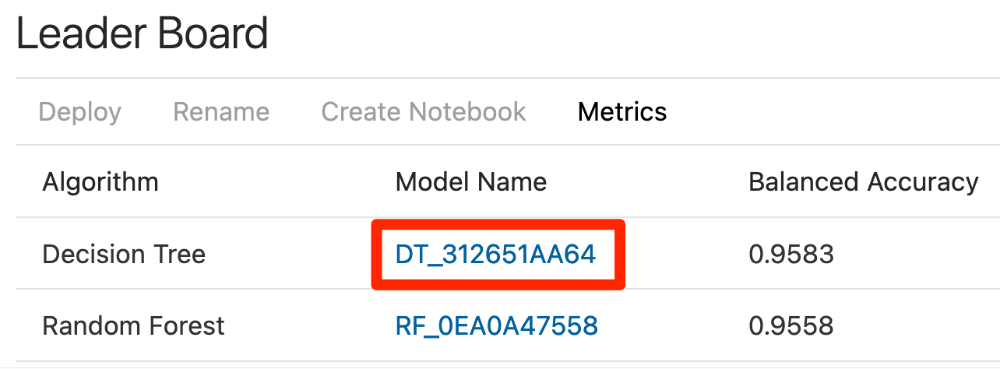

    The first screen that shows up is the **Prediction Impacts**. This time the attributes are listed in order of impact that this specific model uses in its formulation to predict churn.

    It includes the following geo-demographic attributes like AGE, GENDER, EDUCATION, YRS\_RESIDENCE and MARITAL\_STATUS.

    From the customer product behavior point of view, it includes AVG\_DISC\_M3\_11 (the average discounts for the 9 months before the current quarter) and the counts for total number of movies of several different types of genres (GENRE\_xxx).

    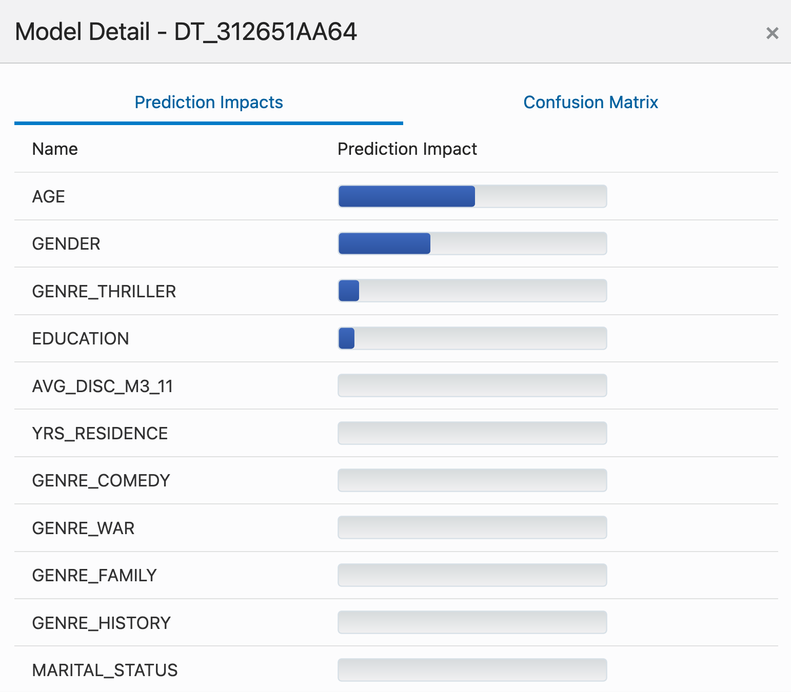

    After reviewing the impacts, click the **Confusion Matrix** tab to visualize the result of the assessment of the model on a **Test Set** of data chosen by AutoML for this test.

    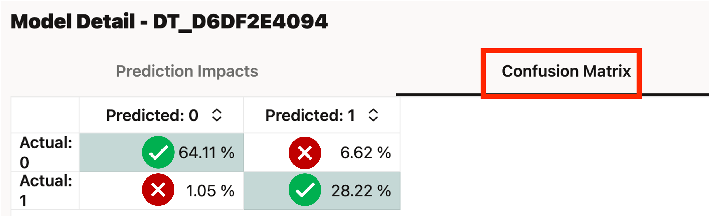

    In the **Confusion Matrix** we can see that, in this particular **Test Set**, the model was able to correctly identify __95.42%__ of the future customer behaviors (the green diagonals, 61.76% + 33.66%).  

    The model incorrectly thought that __3.59%__ of the customers were going to churn (Predicted: 1), but they actually did not (Actual: 0).  This is actually not that bad for marketing purposes, since we would be sending offers to these customers when they might be staying with us anyway.

    The model also thought that __less than 1%__ of the customers (0.98%) would not churn (Predict: 0) but they actually did (Actual: 1).  This type of error is more dangerous in churn management, since your model is not capable of identifying these customers as churners when they indeed would have been, and should be monitored over time.

5. Rename the model.

   In preparation for scoring via SQL, we will need to rename the model.

    We will **Rename** the model, which will allows us to run the scoring via SQL later. With the model row selected (indicated by a blue color), click the **Rename** button.

    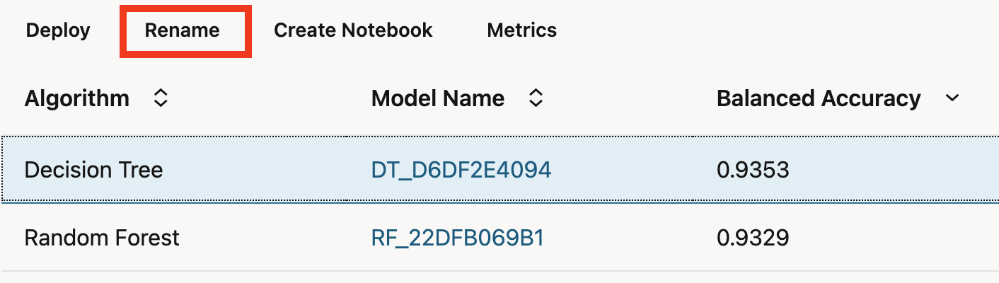  

    Give your model a new name.  We suggest **`CHURN_PRED`**.

    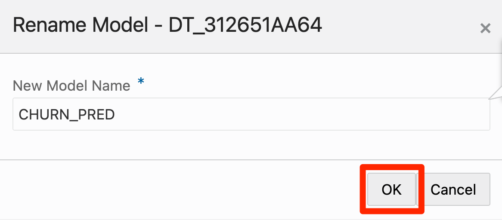  

    It should show up in the **Leader Board** with the new name in a few seconds.

    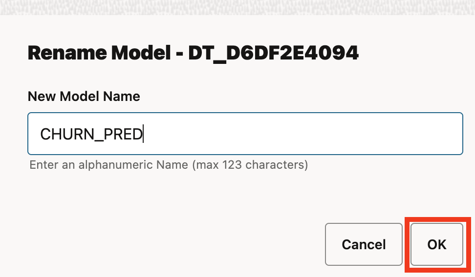

    Now we are ready for scoring customers using SQL by using that model name.

## Task 3: Deploy the model and score a table

1. [**CLICK HERE** to download the "Scoring customers with Churn Model" notebook in JSON format](./files/scoring_customers_with_churn_model.json?download=1) which contains the sequence of SQL commands for scoring customers, and download it to a folder on your local computer.

    Go to the main notebooks listing by clicking on the "three lines" button on the upper left of the screen, and then select **Notebooks**.

    

    Click the **Import** button and navigate to the folder where you just downloaded the notebook **Scoring\_customers\_with\_Churn\_Model.json** file.

    Click **Open** to load the notebook into your environment, like shown below.

    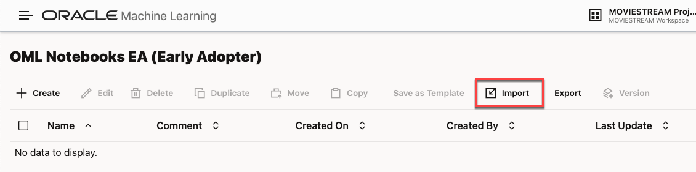

    In case of success, you should receive a notification at the top right of the screen that the import process was successful, and you should be able to see a new notebook called **Scoring customers with Churn Model** in the list of Notebooks.

2. Open and run the notebook.

    We are going to open the Notebook for editing. For that we need to **click the "Scoring customers with Churn Model" name**.

    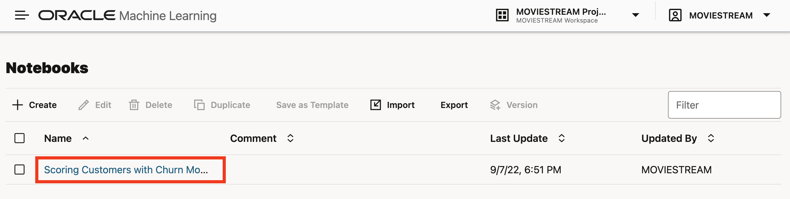

    You will see that the notebook server starts and loads the notebook. You should see the beginning of the notebook, as shown below.

    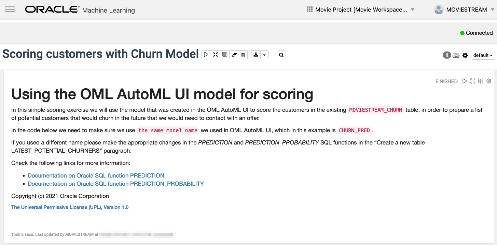

    We have to make sure we select the correct **Interpreters**, which specifies whether to run the notebook using the LOW, MEDIUM or HIGH Autonomous Database consumer group.

    Click the gear icon on the top right, which will open the panel with the Interpreters, and on that panel make sure to select at least one of the interpreters that indicate **%sql (default), %script, %python**. You can move the interpreters to change their order and bring the one you prefer to the top. Ideally move the **MEDIUM** interpreter (the one with "_medium" in the name) to the top, or only select it by clicking on it (it becomes blue) and leave the others unselected (they stay white).

    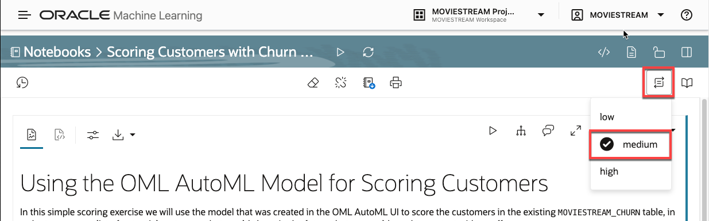

    Once you are satisfied, **click Save** to save your options, and stay in the notebook screen.

    We will follow the notes and instructions in the notebook, but before we do, and to make sure the entire environment is ready, we will run the entire notebook by clicking at the top of the screen, on the icon that looks like a **play button** next to the notebook name, like indicated in the image below.

    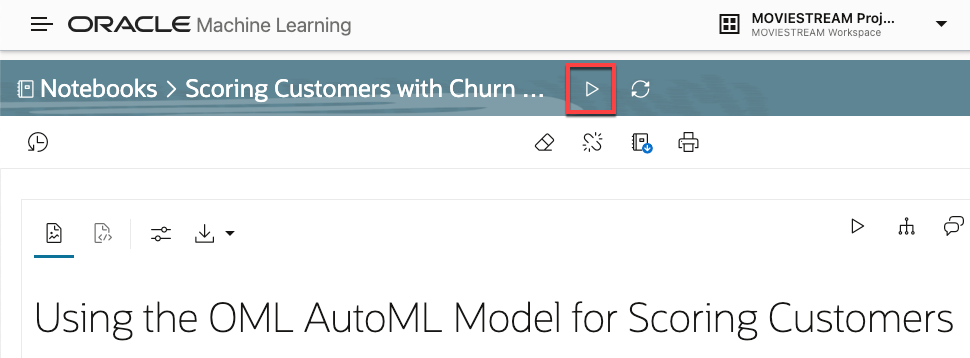

    In the menu that pops open, confirm that you do want to run the entire Notebook by clicking the **OK** button.

    The entire run is expected to take around 15 seconds, depending on the resources available.

3. Create the table with churn probabilities.

    If we scroll down, we see basically two main steps. The first paragraph deletes a table named `LATEST_POTENTIAL_CHURNERS` if it exists, and the second paragraph uses SQL to create a new table based on the `PREDICTION` and `PREDICTION_PROBABILITY` capabilities of Oracle SQL enabled by OML.

    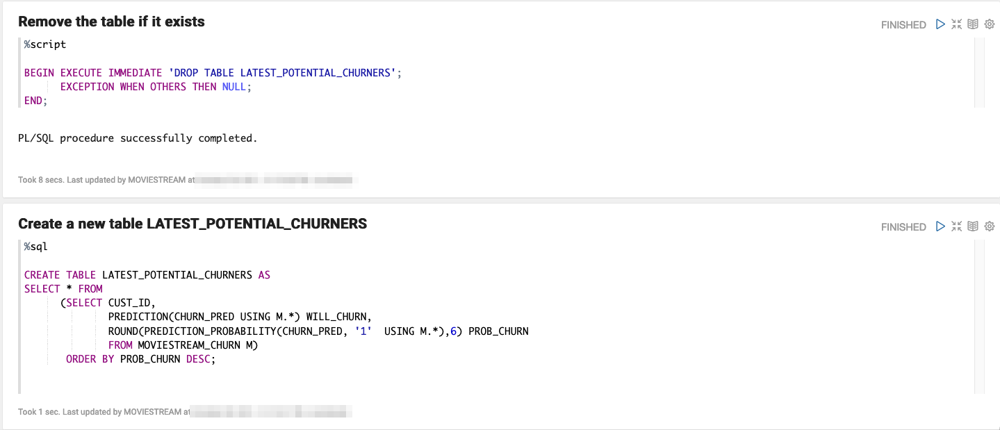

    Please note that the following `SELECT` statement can be run by any Application connecting to this Autonomous Database instance through `JDBC`, and the scoring will be returned.

    Also remember that you need to change the name of the model being used from `CHURN_PRED` to something else if you decided to use a different name when you were doing the **Rename** of the model in **Step 4** of **Task 3**.

    ```
    <copy>
    SELECT * FROM
      (SELECT CUST_ID,
              PREDICTION(CHURN_PRED USING M.*) WILL_CHURN,
              ROUND(PREDICTION_PROBABILITY(CHURN_PRED, '1'  USING M.*),6) PROB_CHURN
              FROM MOVIESTREAM_CHURN M)
    ORDER BY PROB_CHURN DESC;
    ```

  At the end, the following result is expected from the table of scores just created.  We are visualizing only a small 1% sample of the table, just so we can see different predicitons and probabilities.

    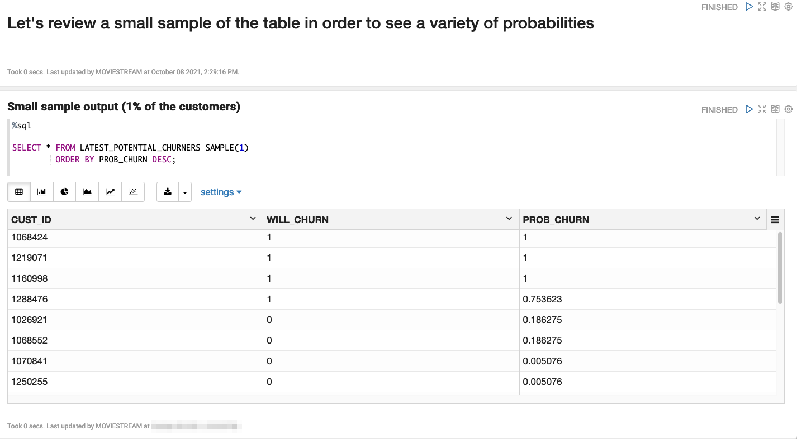

  You can scroll down the list of customers to see how the probability to churn changes.  Note that when the probability is below 0.5, the decision of the model is that the customer would not churn (**WILL_CHURN=0**).

**CONGRATULATIONS!!!**

You now have deployed a new table called `LATEST_POTENTIAL_CHURNERS` containing each customer's likelihood to churn and the decision (will the customer churn or not?) suggested by the Machine Learning model.

Now other professionals can take advantage of both the deployment you have just made in order to contact the customers at risk with an offer, as well as use your SQL Scoring code to put the model into production and run the scoring in batch every time there is a new refresh of the data, be it hourly, daily, weekly, or monthly.

Please *proceed to the next lab*.

## Task 4: Bonus content - model metrics and auto-generated OML4Py notebook

Step 1. While on the Leaderboard section, view other metrics of model quality.

 Go to the **Leader Board** section of the OML AutoML UI results.

 We will check out the **Metrics** menu item, by **clicking on it**.

 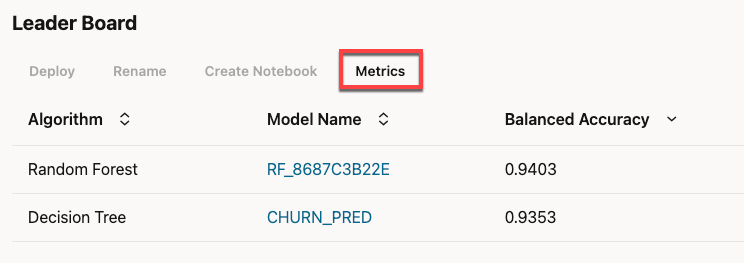

 A menu will pop open showing several metrics that can be selected. Choose a few ones and just close the menu in the top right **X** when ready.

 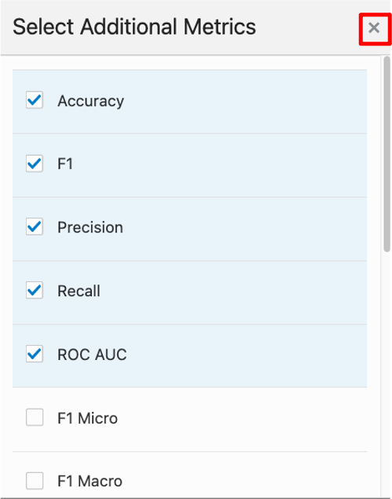

 The new metrics will be displayed for each model and would enable you to compare and sort the list of models by each type of metric as desired (by clicking on the column name).

 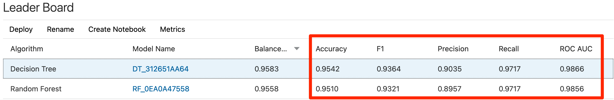

Step 2. Create an OML4Py auto-generated notebook with the model selected in the Leaderboard.

  We can click the **Create Notebook** button, which generates a Python-based notebook using the Oracle Machine Learning for Python interface.

  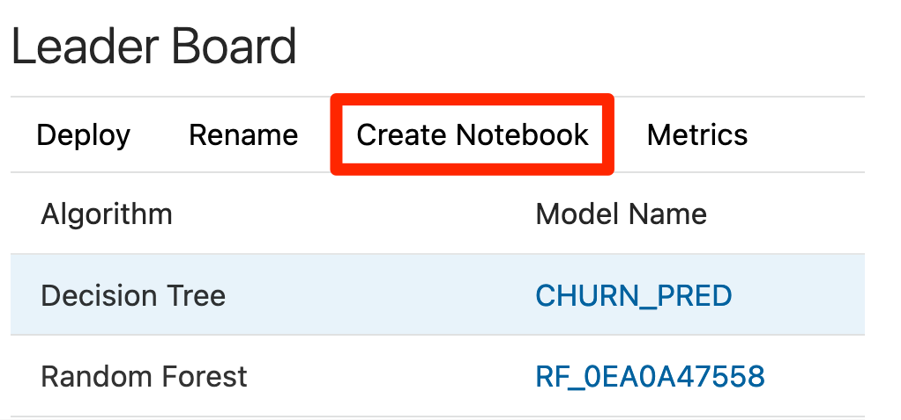   

  This notebook will contain the hyperparameters selected by the AutoML process and allows you to create the model explicitly using OML4Py.

  While still making sure the best model is selected (row highlighted in a blue hue), click the **Create Notebook** button to open a dialog window where you specify the name you want for this notebook. This step is also optional for this **Workshop**.

  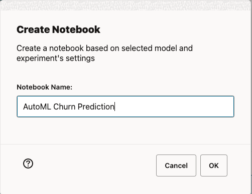   

  If you were to open the Notebook from the **OML Notebooks** menu, you would see that the entire code for building the exact model you have chosen is there,  written in Python using OML4Py capabilities, so that a Data Scientist can study and modify the model at their will, as well as do batch scoring.

## Learn more

* [Oracle Machine Learning product information](https://oracle.com/goto/machinelearning)
* [Subscribe to the Weekly AskTOM Oracle Machine Learning Office Hours](https://asktom.oracle.com/pls/apex/asktom.search?office=6801#sessionss)
* [Oracle Machine Learning AutoML UI Demo](https://www.youtube.com/watch?v=yJGsfU9cmt0)
* [Oracle Machine Learning for Python Demo](https://youtu.be/P861m__PEMQ)
* [Oracle Machine Learning Notebooks Demo](https://youtu.be/EgxKYQ8paCw)

## Acknowledgements
* **Author** - Marcos Arancibia, Oracle Machine Learning Product Management
* **Contributors** -  Mark Hornick, Marty Gubar, Kevin Lazarz, Nilay Panchal, Jayant Sharma, Jie Liu, Sherry LaMonica, Richard Green
* **Last Updated By/Date** - Marcos Arancibia, October 2021
