# Use Oracle Machine Learning to predict customer churn

## Introduction

#### Video preview

<!--[](youtube:iK2T6iKaYqQ)-->

Analyzing past performance lets you know customers who have already been lost. Let's get in front of this problem and predict those that are at risk using in database analytics.

In this lab, you will use Oracle Machine Learning (OML) in Autonomous Database to identify customers with a higher likelihood of churning from **Oracle MovieStream** streaming services. You will first use OML AutoML to create a customer churn model. Then, you will use OML Notebooks to score customers using both OML4SQL and OML4Py.

Estimated Time: 10 minutes

Watch the video below for a quick walk-through of the lab.
[Use OML to predict customer churn](videohub:1_vdehd0fz)

### About OML

In this lab, we will learn more about the Autonomous Database's built-in [Oracle Machine Learning](https://www.oracle.com/goto/machinelearning) components, including:
- Oracle Machine Learning Notebooks - see [OML Notebooks documentation](https://docs.oracle.com/en/database/oracle/machine-learning/oml-notebooks/index.html).
- Oracle Machine Learning AutoML UI - see [OML AutoML UI documentation](https://docs.oracle.com/en/database/oracle/machine-learning/oml-automl-ui/index.html).
- Oracle Machine Learning for Python - see [OML4Py documentation](https://docs.oracle.com/en/database/oracle/machine-learning/oml4py/index.html).

### Objectives

In this lab, you will:
- Access **Oracle Machine Learning Notebooks** provided with Oracle Autonomous Database
- Use **OML AutoML** to build a high-quality machine model that can help predict future churn by customers
- Use the machine learning model to score the list of customers and predict their likelihood to churn in the future

### Prerequisites

- This lab requires completion of Lab 1 in the Contents menu on the left.

## Defining customer churn for MovieStream
To understand customer behavior, we need to look at both geo-demographic information and transactional patterns. For transactional data, we need to summarize customers' transactions by month for each type of transaction that we would like to explore. This type of summarization is required because machine learning algorithms need a single input row per customer, with each attribute reflected in a table column.

A Data Engineer and a Data Scientist worked together to process and transform the data that exists in the **STREAMS** Oracle Database table. This table contains historical customer transactions for every movie streamed, including payment and discounts, and can help us identify customer preferences and usage of the service. To aggregate the data, with *one customer per row* (which is a data layout required by Machine Learning), they worked with the *date* information of the transactions to determine the customer behavior over time.

Defining what *customer churn* means can be very complex. For our example, the agreement between the business team and the data scientist was:
- A customer has "churned" if they had 1) *zero movie streams in the last available month of data* and 2) streamed movies every month during 12 months before a *buffer* month (detailed below).
- In contrast to churners, "non-churners" are customers who have *streamed movies for 12 consecutive months including the last available month of data*.

The following diagram shows the process we will use, including a *buffer* month that represents the time needed to be able to *act* on the knowledge that a customer is about to leave. Predicting the *probability that a customer is going to leave exactly right now* does not help preparing a customer retention campaign, since there is a lot of processing involved in updating customer data at the end of a day before one can do scoring, excluding customers that have a *DO NOT CONTACT* exception. Also, processing offers and other processes in sync with all other divisions of the enterprise will always take time.  


In addition, *a customer churning today probably made that decision a while ago*. This means that our machine learning model needs to be able to detect any change in behavior from at least a month ago. This is the reason for the buffer of 1 month in the process.

## Task 1: Navigate to OML AutoML
Access OML from Database Tools:

1. If you are not already in the Database Tools, navigate to it using the steps from [Lab 2, Task 1](/adb/movie-stream-story-lite/workshops/tenancy/index.html?lab=query-with-sql#Task1:LogintotheSQLWorksheet). Make sure you are logged in as the **MOVIESTREAM** user.

2. Click the hamburger menu on the top left and then click **Machine Learning**:

   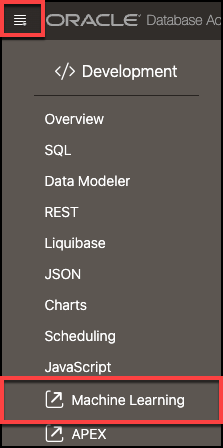 

4. Log in in as MOVIESTREAM.

    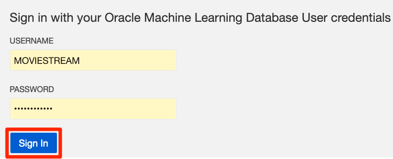

5. You are now in the OML landing page. This page takes you to tutorials, model creation, notebooks and more. We'll now create a new machine learning model using **AutoML**:  

    Click **AutoML** on the Quick Actions menu:

    

6. Create a new AutoML Experiment

   An AutoML Experiment will generate a machine learning model. Let's create a new experiment by clicking the **Create** button as indicated below.

    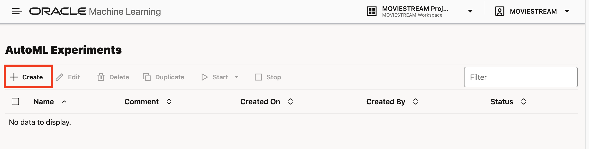

7. Name the experiment.

    Give the new experiment a **name** and an optional description.

8. Select the experiment's data source.

    Previously, we prepared a `MOVIESTREAM_CHURN` table containing numerous attributes that should be helpful in predicting churn. Click the **magnifying glass icon** at the right of the **Data Source**:

    

    In the **Select Table** menu, leave the `SCHEMA` selection as `MOVIESTREAM`, and on the right side scroll down to search for the `MOVIESTREAM_CHURN` table. Alternatively, type `CHURN` in the search box at the bottom of the list to filter the table list. Select the `MOVIESTREAM_CHURN` table and click the **OK** button.

    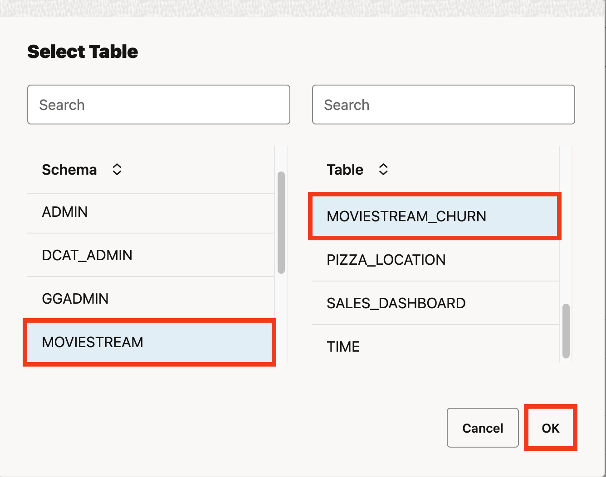

    Back on the **Experiment** page, the **Data Source** name is populated with our selection, and OML AutoML will display several statistics for each attribute of the table.

    Scroll down in the **Experiment** page until you see the **Features** section. A list of the attributes available in the table is displayed. Please note that there is a **scroll bar** for the list itself at the right, next to the **Std Dev** statistic.

    

9. Define the Prediction Target, Case ID and Experiment Settings.

    Scroll to the top-right part of the **Experiments** page to identify the field that we want to predict. Click the drop-down in the **Predict** field. Scroll to and select the target attribute named `IS_CHURNER`. You can also start typing the target attribute in the `Search` box to quickly filter the values.

    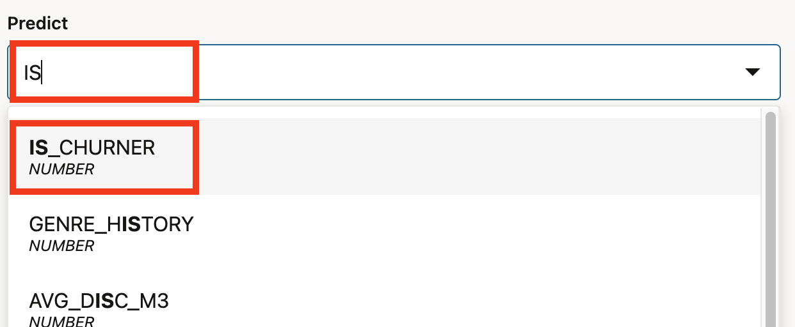

    Repeat the process with the **Case ID** pull-down menu selection, choosing column `CUST_ID` as the unique customer identifier. The final result should look like the image below:

    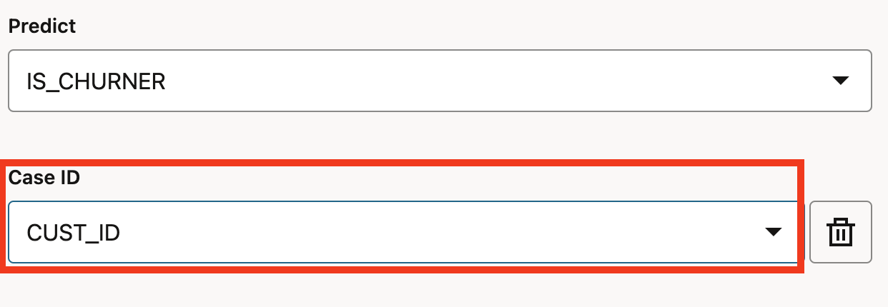

    On the left side, just under **Data Source**, you'll find that **Classification** is the selected **Prediction Type**. This is selected because AutoML detected that our **Predict** column, or `TARGET` attribute, has only two distinct values and therefore is a binary classification problem. The other prediction type, **Regression**, is not appropriate for our problem.

10. Use Additional Settings to customize processing.

    Expand the **Additional Settings** section by clicking the triangle next to its name. The default values for **Maximum Top Models** is **5**, but we will reduce that to **2** in order to make processing a bit faster for this workshop. Also, increase the **Database Service Level** to **HIGH**. Read more about Service Levels with OML AutoML UI in [this Blog Post](https://blogs.oracle.com/machinelearning/oml-automl-ui-4-things-you-can-do-that-affect-performance).

    We are going to leave the **Algorithms** selections as is, which means that OML AutoML will try each of these algorithms to find the best one for our situation.

    Make sure your selections look like the following:

    

    We are now ready to start the Experiment.

## Task 2: Run the Experiment and explore the results.

1. Start the Experiment.

   Click the **Start** button at the top of the screen, then select **Faster Results**. This selection speeds processing as OML AutoML UI will search for models on a reduced hyperparameter search space.

    

    As a reference point, we expect this **Experiment** to run to completion on a **Classification** task using **Balanced Accuracy** as the metric, and using **Maximum Top Models of 2** in about **2 or 3 minutes**.

    **IMPORTANT:** Please note that if you choose different settings for your own Experiment, a larger number of models, or even run it at **Best Accuracy** instead of **Faster Results**, a longer running time might be required, and a different "best" algorithm might be chosen. In that case, your results might differ slightly from the screens below, but will still be valid and correct based on your settings.

    You will see a floating **Progress** indicator while the **Experiment** is running. The progress indicator shows the status of each of the Experiment's steps and an approximate time that it has been running.

    

    The performance of OML AutoML UI is impacted by your Autonomous Database configuration. As explained in [this blog post](https://blogs.oracle.com/machinelearning/oml-automl-ui-4-things-you-can-do-that-affect-performance), several components may affect the performance, including the base number of Autonomous Database CPUs and whether or not auto scaling has been enabled.

2. Check the results.
   Once the process completes, you will note that the **running icon** on the top right changes to indicate it is **Completed**. The **Balanced Accuracy** chart will show the increased accuracy over time as the models were tested, and the **Leader Board** will present the different algorithms that were chosen, and their respective **Model Names**.

    In the following screen we can see that the top 2 algorithms chosen were a **Decision Tree** and a **Random Forest**. By default they receive randomly generated unique **Model Names**.

    

    After an **Experiment** run is completed, the **Features** grid displays an additional column **Importance**. This feature importance indicates the overall level of sensitivity of prediction to a particular feature. Hover your cursor over the graph to view the value of importance. The value is always depicted in the range 0 to 1, with values closer to 1 being more important.

    > **Note:** this importance value is **not** related to any particular model, but it shows an overall value to give us an idea of potentially which attributes would be important.

    Scroll down to see the **Features** section. You will also note a **Search** box at the top right of this section, which is important given that there are 170+ attributes.

    

    In this **Experiment**, the attributes with the highest **overall importance** are:  AGE, AVG\_DISC\_M3\_11 (average discounts for the 9 months before the current quarter), GENDER, CREDIT\_BALANCE, AVG\_NTRANS\_M3\_5 (average number of transactions in the previous quarter), YRS\_RESIDENCE, GENRE\_THRILLER, GENRE\_COMEDY, and GENRE\_WAR
    
4. Understand model performance.
    Scrolling up to the **Leader Board** section, we can click the **Random Forest** unique model name to open the diagnostics. Click on the Random Forest **Model Name** link in blue.

    > **NOTE**: The exact random model name is unique to your model, so it will not appear as *RF\_312651AA64* like the one below.

    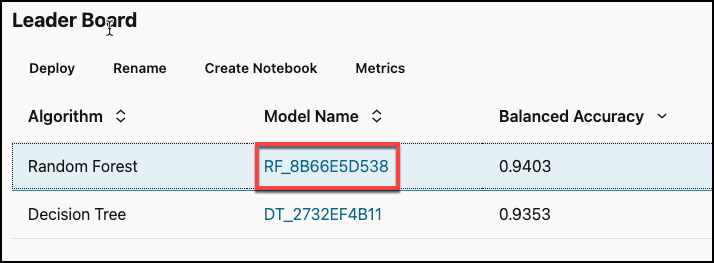

    The first screen that shows up is the **Prediction Impacts**. This time the attributes are listed in order of impact that this specific model uses in its formulation to predict churn.

    It includes the following geo-demographic attributes like AGE, GENDER, GENRE\_THRILLER and EDUCATION.

    From the customer product behavior point of view, it includes AVG\_DISC\_M3\_11 (the average discounts for the 9 months before the current quarter) and the counts for total number of movies of several different types of genres (GENRE\_xxx).

    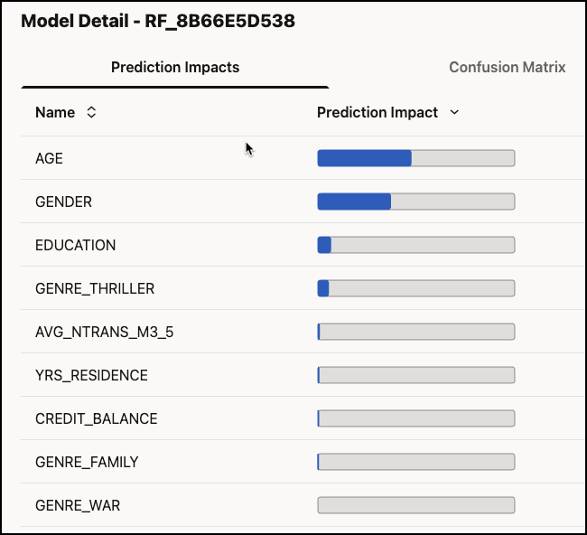

    After reviewing the impacts, click the **Confusion Matrix** tab to visualize the result of the assessment of the model on a **Test Set** of data chosen by AutoML for this test.

    

    In the **Confusion Matrix** we can see that, in this particular **Test Set**, the model was able to correctly identify __92.33%__ of the future customer behaviors (the green diagonals, 64.11% + 28.22%).  

    The model incorrectly thought that __6.62%__ of the customers were going to churn (Predicted: 1), but they actually did not (Actual: 0).  This is actually not that bad for marketing purposes, since we would be sending offers to these customers when they might be staying with us anyway.

    The model also thought that __approximately 1%__ of the customers (1.05%) would not churn (Predict: 0) but they actually did (Actual: 1).  This type of error is more dangerous in churn management, since your model is not capable of identifying these customers as churners when they indeed would have been, and should be monitored over time.

5. Rename the model.

   In preparation for scoring via SQL, we will need to rename the model.

    We will **Rename** the model, which will allows us to run the scoring via SQL later. With the model row selected (indicated by a blue color), click the **Rename** button.

      

    Give your model a new name.  We suggest **`CHURN_PRED`**.

      

    It should show up in the **Leader Board** with the new name in a few seconds.

    

    Now we are ready for scoring customers using SQL by using that model name.

## Task 3: Deploy the model and score a table

1. [**CLICK HERE** to download the "Scoring customers with Churn Model" notebook](./files/scoring_customers_with_churn_model.dsnb?download=1) which contains the sequence of SQL commands for scoring customers, and download it to a folder on your local computer.

    Go to the main notebooks listing by clicking on the "three lines" OML Navigation button on the upper left of the screen, and then select **Notebooks**.

    

2. Click the **Import** button and navigate to the folder where you just downloaded the notebook **Scoring\_customers\_with\_Churn\_Model.dsnb** file.

    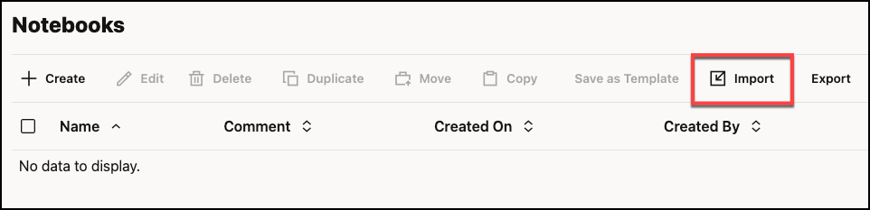

    Click **Open** to load the notebook into your environment.

    After successfully importing the notebook, you will see a new notebook called **Scoring customers with Churn Model** in the list of Notebooks.

3. Open and run the notebook.

    Open the notebook by clicking **Scoring customers with Churn Model**.

    

    You will see that the notebook server starts and loads the notebook. Click **Allow Run** to enable the paragraph actions. You should then see the beginning of the notebook, as shown below.

    

    Click the Update Notebook Type to change the Autonomous Database consumer group to **MEDIUM**. This allows for parallel execution in the database.

    

    We will follow the notes and instructions in the notebook, but before we do, and to make sure the entire environment is ready, we will run the entire notebook by clicking at the top of the screen, on the icon that looks like a **play button** next to the notebook name, like indicated in the image below.

    

    In the menu that pops open, confirm that you do want to run the entire Notebook by clicking the **Confirm** button.

    The entire run is expected to take around 15 seconds, depending on the resources available.

4. Create the table with churn probabilities.

    If we scroll down, we see basically two main steps. The first paragraph deletes a table named `LATEST_POTENTIAL_CHURNERS` if it exists, and the second paragraph uses SQL to create a new table based on the `PREDICTION` and `PREDICTION_PROBABILITY` capabilities of Oracle SQL enabled by OML.

    

    Please note that the following `SELECT` statement can be run by any Application connecting to this Autonomous Database instance through `JDBC`, and the scoring will be returned.

    Also remember that you need to change the name of the model being used from `CHURN_PRED` to something else if you decided to use a different name when you were doing the **Rename** of the model in **Step 4** of **Task 3**.

    ```
    <copy>
    SELECT * FROM
      (SELECT CUST_ID,
              PREDICTION(CHURN_PRED USING M.*) WILL_CHURN,
              ROUND(PREDICTION_PROBABILITY(CHURN_PRED, '1'  USING M.*),6) PROB_CHURN
              FROM MOVIESTREAM_CHURN M)
    ORDER BY PROB_CHURN DESC;
    ```

  At the end, the following result is expected from the table of scores just created.  We are visualizing only a small 1% sample of the table, just so we can see different predictions and probabilities.

    

  You can scroll down the list of customers to see how the probability to churn changes.  Note that when the probability is below 0.5, the decision of the model is that the customer would not churn (**IS_CHURNER=0**).

5. Review churners based on customer value

    Let's consider customer value when looking at churners. Customer value takes into account not just a customer's probability to churn, but also how active the customer has been with the MovieStream service.

    

    In addition, the report includes how close the nearest pizza location is to our customer. This distance uses the spatial nearest neighbor analytic function. Combining customer value and proximity to a participating pizza shop will help guide how we should use our marketing dollars for our upcoming promotion!

**CONGRATULATIONS!!!**

You now have deployed a new table called `LATEST_POTENTIAL_CHURNERS` containing each customer's likelihood to churn and the decision (will the customer churn or not?) suggested by the Machine Learning model.

Now other professionals can take advantage of both the deployment you have just made in order to contact the customers at risk with an offer, as well as use your SQL Scoring code to put the model into production and run the scoring in batch every time there is a new refresh of the data, be it hourly, daily, weekly, or monthly.

Please *proceed to the next lab, or try the bonus Task 4*.

## Task 4: Bonus content - model metrics and auto-generated OML4Py notebook

1. Please see Task 1 Step 5, and return to the OML landing page. Click the name of the experiment that is there. While on the Leaderboard section, view other metrics of model quality.

    Go to the **Leader Board** section of the OML AutoML UI results.

    We will check out the **Metrics** menu item, by **clicking on it**.

    

    A menu will pop open showing several metrics that can be selected. Choose a few ones and just close the menu in the top right **X** when ready.

    

    The new metrics will be displayed for each model and would enable you to compare and sort the list of models by each type of metric as desired (by clicking on the column name).

    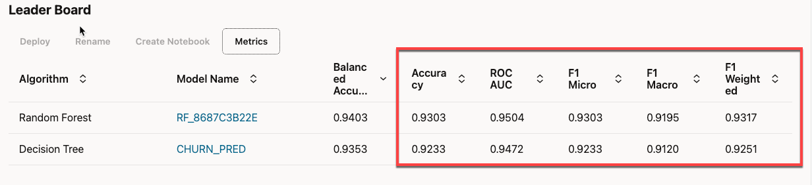

2. Create an OML4Py auto-generated notebook with the model selected in the Leaderboard.

    We can click the **Create Notebook** button, which generates a Python-based notebook using the Oracle Machine Learning for Python interface.

    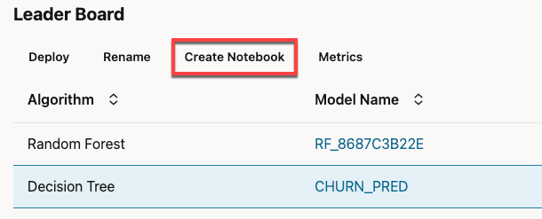   

    This notebook will contain the hyperparameters selected by the AutoML process and allows you to create the model explicitly using OML4Py.

    While still making sure the best model is selected (row highlighted in a blue hue), click the **Create Notebook** button to open a dialog window where you specify the name you want for this notebook. This step is also optional for this **Workshop**.

       

    If you were to open the Notebook from the **OML Notebooks** menu, you would see that the entire code for building the exact model you have chosen is there,  written in Python using OML4Py capabilities, so that a Data Scientist can study and modify the model at their will, as well as do batch scoring.

## Learn more

* [Oracle Machine Learning product information](https://oracle.com/goto/machinelearning)
* [Subscribe to the Weekly AskTOM Oracle Machine Learning Office Hours](https://asktom.oracle.com/pls/apex/asktom.search?office=6801#sessionss)
* [Oracle Machine Learning for Python Demo](https://youtu.be/P861m__PEMQ)
* [Oracle Machine Learning Notebooks Demo](https://youtu.be/EgxKYQ8paCw)

## Acknowledgements
* **Author** - Marcos Arancibia, Oracle Machine Learning Product Management
* **Contributors** -  Mark Hornick, Marty Gubar, Kevin Lazarz, Nilay Panchal, Jayant Sharma, Jie Liu, Sherry LaMonica, Richard Green
* **Last Updated By/Date** - Marty Gubar, May 2025
