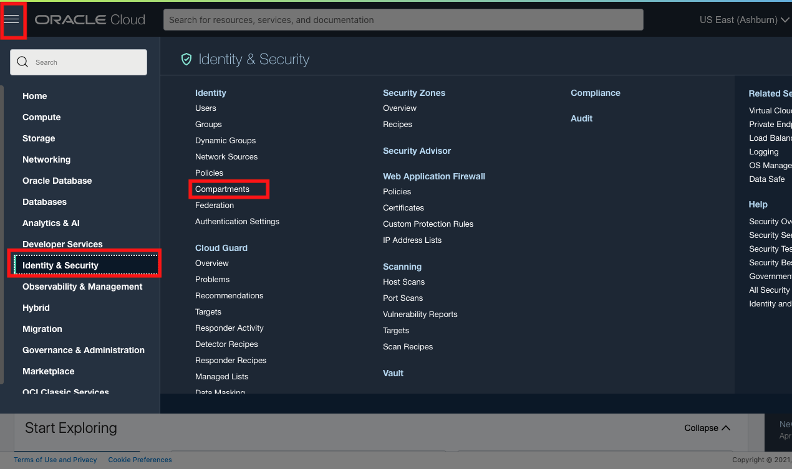
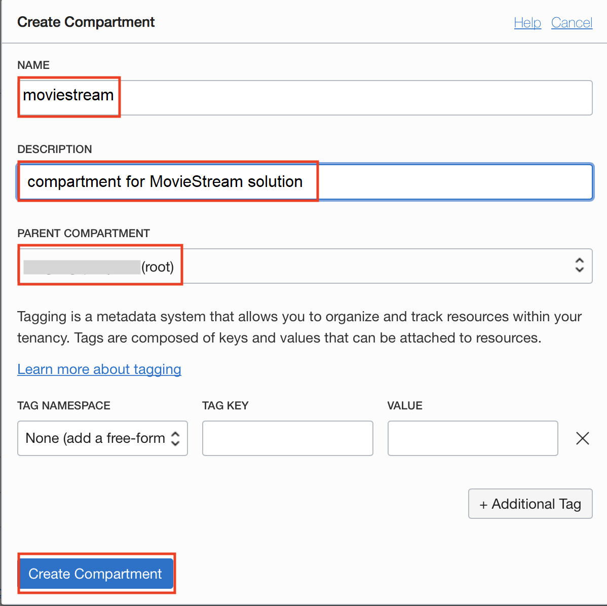
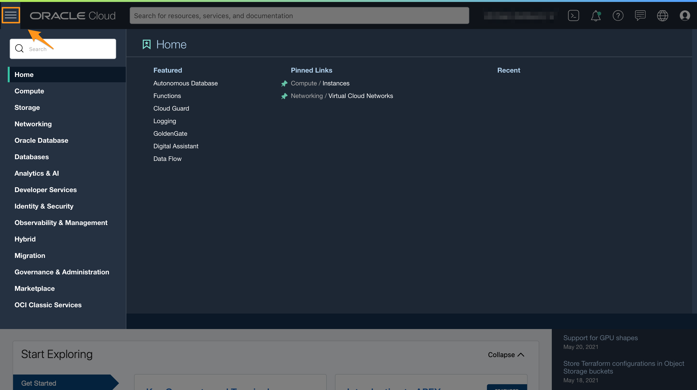
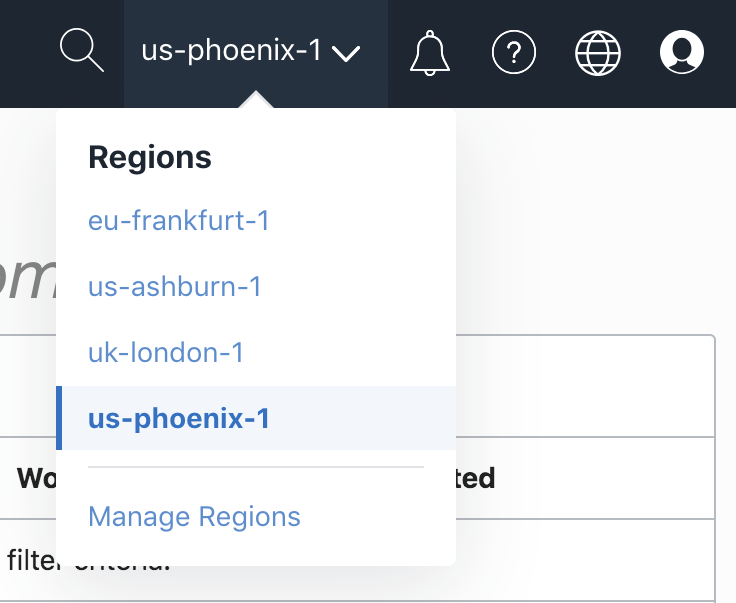
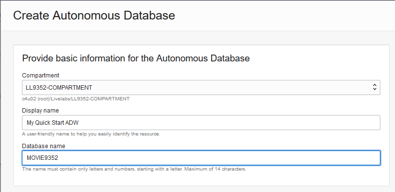
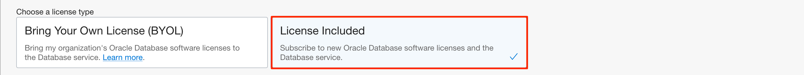

# Provision an Autonomous Database

## Introduction

#### Video Preview

In just a few minutes, Autonomous Database lets you deploy a complete data warehousing platform that can scale to your requirements. And, you can use its Database Tools to easily populate that warehouse from the data lake.

This lab walks you through the steps to get started using the Oracle Autonomous Database (Autonomous Data Warehouse [ADW] and Autonomous Transaction Processing [ATP]) on Oracle Cloud Interface. In this lab, you provision a new ADW instance.

Estimated Time: 5 minutes

### Objectives

In this lab, you will:

-   Create an Oracle Cloud Infrastructure compartment
-   Provision a new Autonomous Database

### Prerequisites

-   This lab requires completion of the Get Started section in the Contents menu on the left.

<if type="freetier">
## Task 1: Create a compartment

A compartment is a collection of cloud assets, like compute instances, load balancers, databases, and so on. By default, a root compartment was created for you when you created your tenancy (that is, when you registered for the trial account). It is possible to create everything in the root compartment, but Oracle recommends that you create sub-compartments to help manage your resources more efficiently.

1. Click the three-line menu, which is on the top left of the console. Scroll down till the bottom of the menu, click **Identity & Security -> Compartments**. Click the blue **Create Compartment** button to create a sub-compartment.

    

    

2. Give the compartment a name and description. Be sure your root compartment appears as the parent compartment. Press the blue **Create Compartment** button.

    

    The compartment is created, in which you will create an Autonomous Database instance in the next steps.

## Task 2: Choose Autonomous Data Warehouse from the Services Menu
</if>
<if type="livelabs">
## Task 1: Choose Autonomous Data Warehouse from the Services Menu
</if>

1. Log in to the Oracle Cloud Interface.
2. Once you log in, you arrive at the cloud services dashboard where you can see all the services available to you. Click the navigation menu in the upper left to show top level navigation choices.

     > **Note:** You can also directly access your Autonomous Data Warehouse service in the __Quick Actions__ section of the dashboard.

    

3. Click **Autonomous Data Warehouse**.

    

4. Make sure your workload type is __Data Warehouse__ or __All__ to see your Autonomous Data Warehouse instances. <if type="freetier">Use the __List Scope__ drop-down menu to select the compartment you just created.</if><if type="livelabs">In the __List Scope__, enter the first part of the LiveLabs compartment assigned to you, then select the compartment from the list.</if>

<if type="freetier">
    

   > **Note:** Avoid the use of the `ManagedCompartmentforPaaS` compartment as this is an Oracle default used for Oracle Platform Services.

</if>
<if type="livelabs">
    
</if>

5. This console shows that no databases yet exist. If there were a long list of databases, you could filter the list by the **State** of the databases (Available, Stopped, Terminated, for example). You can also sort by __Workload Type__. Here, the __Data Warehouse__ workload type is selected.

<if type="freetier">
    
</if>
<if type="livelabs">
    
</if>

<if type="freetier">
6. If you are using a Free Trial or Always Free account, and you want to use Always Free Resources, you need to be in a region where Always Free Resources are available. You can see your current default **region** in the top, right hand corner of the page.

    
</if>

<if type="freetier">
## Task 3: Create the Autonomous Database instance
</if>
<if type="livelabs">
## Task 2: Create the Autonomous Database instance
</if>

1. Click **Create Autonomous Database** to start the instance creation process.

    

2.  This brings up the __Create Autonomous Database__ screen where you will specify the configuration of the instance.

<if type="freetier">
    
</if>
<if type="livelabs">
    
</if>

3. Give basic information for the autonomous database:

<if type="freetier">
    - __Choose a compartment__ - Select the compartment you just created.
    - __Display Name__ - Enter a memorable name for the database for display purposes. For this lab, use __MyQuickStart__.
    - __Database Name__ - Use letters and numbers only, starting with a letter. Maximum length is 14 characters. (Underscores not initially supported.) For this lab, use __MYQUICKSTART__.

    
</if>
<if type="livelabs">
    - __Choose a compartment__ - Use the default compartment created for you.
    - __Display Name__ - Enter a memorable name for the database for display purposes. For this lab, use **MyQuickStart**.
    - __Database Name__ - Use letters and numbers only, starting with a letter. Maximum length is 14 characters. (Underscores not initially supported.) For this lab, use __MOVIE+your user id__, for example, __MOVIE9352__.

    
</if>

4. Choose a workload type. Select the workload type for your database from the choices:

    - __Data Warehouse__ - For this lab, choose __Data Warehouse__ as the workload type.
    - __Transaction Processing__ - Or, you could have chosen Transaction Processing as the workload type.

    

5. Choose a deployment type. Select the deployment type for your database from the choices:

    - __Shared Infrastructure__ - For this lab, choose __Shared Infrastructure__ as the deployment type.
    - __Dedicated Infrastructure__ - Or, you could have chosen Dedicated Infrastructure as the deployment type.

    

6. Configure the database:

    - __Always Free__ - If your Cloud Account is an Always Free account, you can select this option to create an always free autonomous database. An always free database comes with 1 CPU and 20 GB of storage. For this lab, we recommend you leave Always Free unchecked.
    - __Choose database version__ - Select 19c as the database version.
    - __OCPU count__ - Number of CPUs for your service. For this lab, specify __1 CPU__. If you choose an Always Free database, it comes with 1 CPU.
    - __Storage (TB)__ - Select your storage capacity in terabytes. For this lab, specify __1 TB__ of storage. Or, if you choose an Always Free database, it comes with 20 GB of storage.
    - __Auto Scaling__ - For this lab, keep auto scaling enabled, to enable the system to automatically use up to three times more CPU and IO resources to meet workload demand.
    - __New Database Preview__ - If a checkbox is available to preview a new database version, do NOT select it.

    > **Note:** You cannot scale up/down an Always Free autonomous database.

    

7. Create administrator credentials:

    - __Password and Confirm Password__ - Specify the password for ADMIN user of the service instance. The password must meet the following requirements:
    - The password must be between 12 and 30 characters long and must include at least one uppercase letter, one lowercase letter, and one numeric character.
    - The password cannot contain the username.
    - The password cannot contain the double quote (") character.
    - The password must be different from the last 4 passwords used.
    - The password must not be the same password that you set less than 24 hours ago.
    - Re-enter the password to confirm it. Make a note of this password.

    

8. Choose network access:
    - For this lab, accept the default, "Secure access from everywhere."
    - If you want to allow traffic only from the IP addresses and VCNs you specify - where access to the database from all public IPs or VCNs is blocked, select "Secure access from allowed IPs and VCNs only" in the Choose network access area.
    - If you want to restrict access to a private endpoint within an OCI VCN, select "Private endpoint access only" in the Choose network access area.
    - If the "Require mutual TLS (mTLS) authentication" option is selected, mTLS will be required to authenticate connections to your Autonomous Database. TLS connections allow you to connect to your Autonomous Database without a wallet, if you use a JDBC thin driver with JDK8 or above. See the [documentation for network options](https://docs.oracle.com/en/cloud/paas/autonomous-database/adbsa/support-tls-mtls-authentication.html#GUID-3F3F1FA4-DD7D-4211-A1D3-A74ED35C0AF5) for options to allow TLS, or to require only mutual TLS (mTLS) authentication.

    

9. Choose a license type. <if type="freetier">For this lab, choose __License Included__.</if><if type="livelabs">For this lab, choose __Bring Your Own License (BYOL)__.</if> The two license types are:
    - __Bring Your Own License (BYOL)__ - Select this type when your organization has existing database licenses.
    - __License Included__ - Select this type when you want to subscribe to new database software licenses and the database cloud service.

<if type="freetier">
    
</if>
<if type="livelabs">
    
</if>

10. For this lab, do not provide a contact email address. The "Contact Email" field allows you to list contacts to receive operational notices and announcements as well as unplanned maintenance notifications.

    

11. Click __Create Autonomous Database__.

12.  Your instance will begin provisioning. In a few minutes, the state will turn from Provisioning to Available. At this point, your Autonomous Data Warehouse database is ready to use! Have a look at your instance's details here including its name, database version, OCPU count, and storage size.

    

Please *proceed to the next lab*.

## Learn more

See the [documentation](https://docs.oracle.com/en/cloud/paas/autonomous-data-warehouse-cloud/user/autonomous-workflow.html#GUID-5780368D-6D40-475C-8DEB-DBA14BA675C3) on the typical workflow for using Autonomous Data Warehouse.

## Acknowledgements

- **Author** - Nilay Panchal, Oracle Autonomous Database Product Management
- **Adapted for Cloud by** - Richard Green, Principal Developer, Database User Assistance
- **Last Updated By/Date** - Richard Green, January 2022
