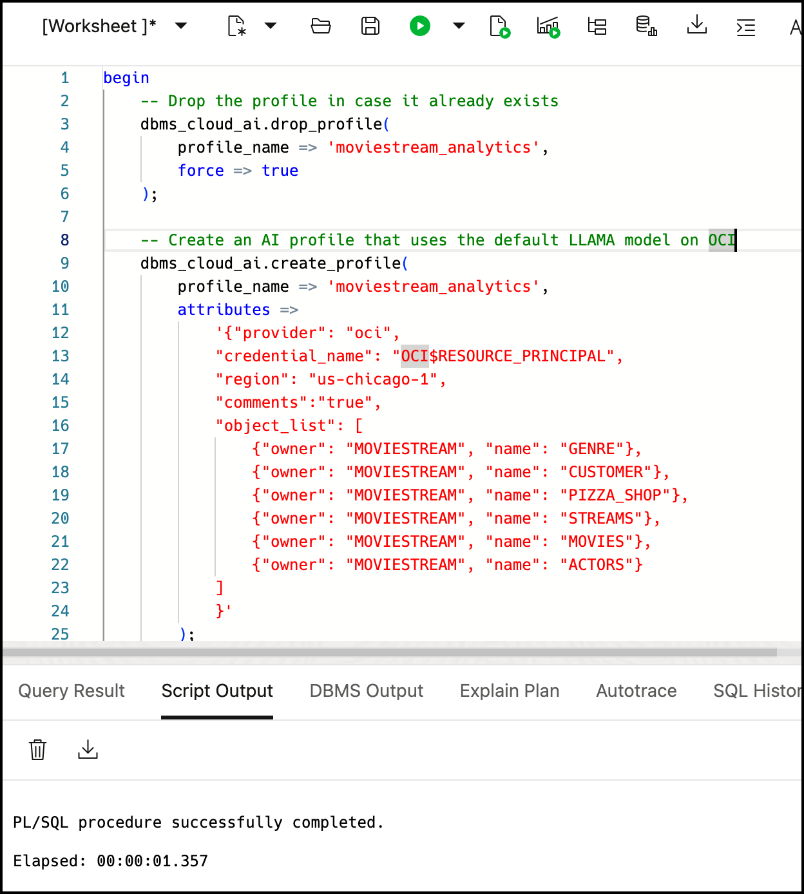
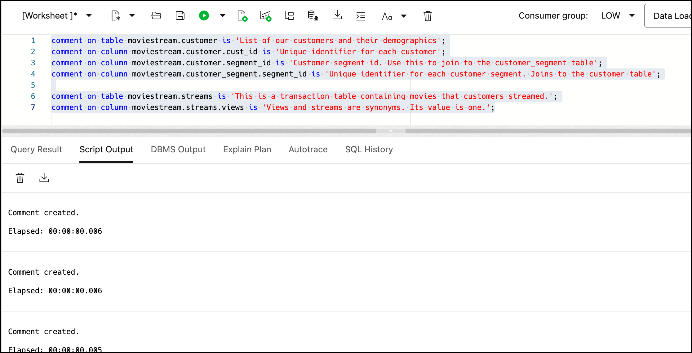
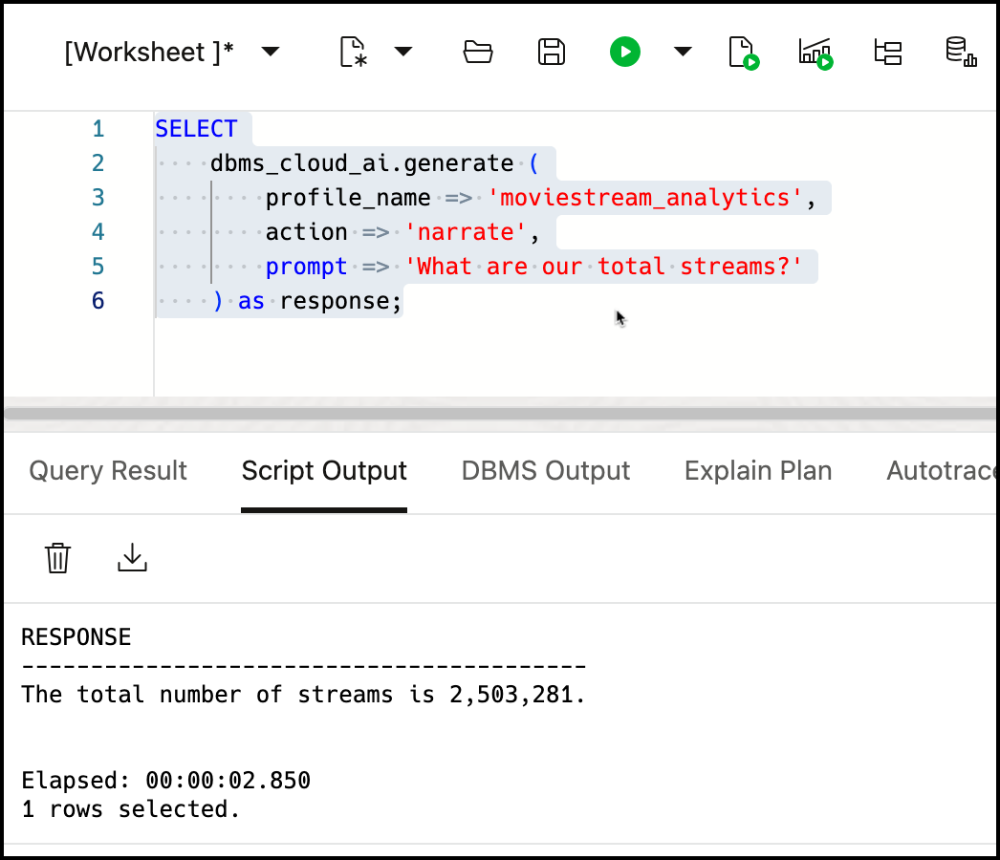
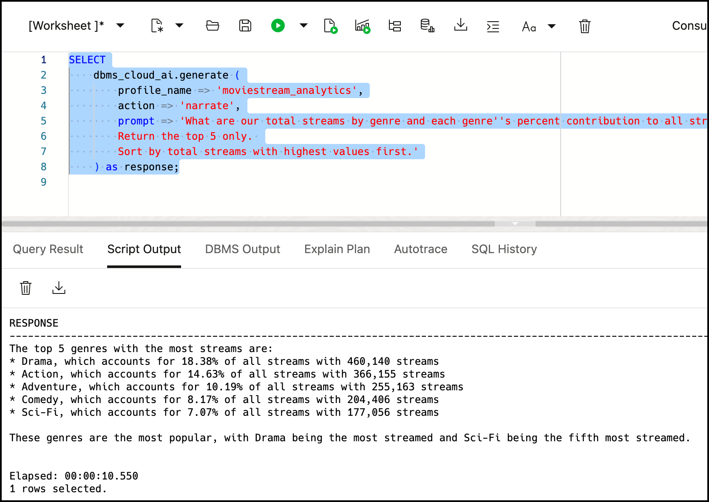
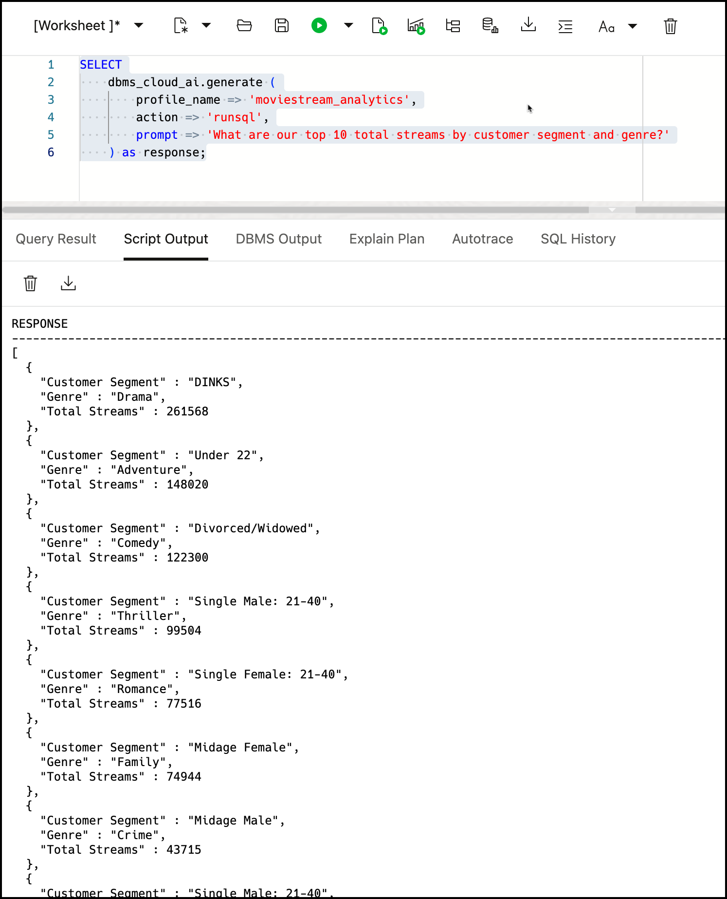
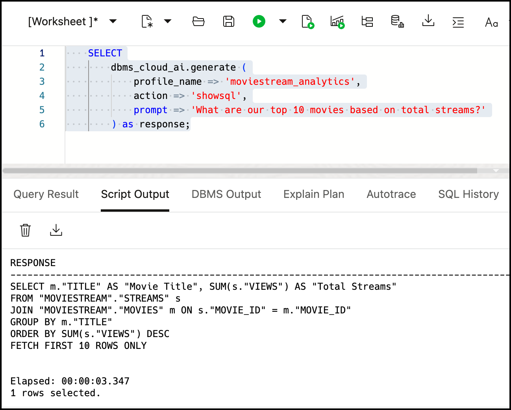

# Query your data with Select AI

## Introduction
In the previous lab, we queried Oracle MovieStream data using SQL. Let's now query that same data using natural language.

This lab will introduce you to using Select AI SQL functions to query data using natural language. You will start by connecting your Autonomous Database to OCI Generative AI and then you will start asking questions!

**NOTE:** This workshop requires access to a Large Language Model (LLM). Select AI can use Large Language Models (LLMs) from numerous providers, including OCI GenAI, OpenAI, Azure, Google Gemini, Hugging Face and more. However, this workshop requires access to OCI GenAI. Ensure that your tenancy is subscribed to one of the following regions (at the time the workshop was last updated): **US Midwest (Chicago)** (default), **Germany Central (Frankfurt)**, **UK South (London)**, **Brazil East (Sao Paulo)**, or **Japan Central (Osaka)** regions in order to run this workshop. See the [OCI documentation](https://docs.oracle.com/en-us/iaas/Content/Identity/Tasks/managingregions.htm) for more details. For the current list of regions with **Generative AI**, see [Regions with Generative AI](https://docs.oracle.com/en-us/iaas/Content/generative-ai/overview.htm).

Check out LiveLab [Chat with your data in Autonomous Database](https://apexapps.oracle.com/pls/apex/r/dbpm/livelabs/view-workshop?wid=3831) to learn more about using Autonomous Database with other AI providers.

### Objectives

- Connect to OCI Generative AI
- Get responses to natural language queries using Select AI

### Prerequisites
- This lab requires completion of Lab 1 in the Contents menu on the left.

## Task 1: Create a Select AI profile
Start by creating a Select AI profile. A Select AI profile encapsulates connection information for an AI provider. This includes: 

1. A security credential (e.g. the resource principal for OCI GenAI or a credential that captures a secret for a 3rd party AI provider). This workshop uses a **resource principal** that was created during database deployment.
2. The name of the provider
3. The name of the LLM (optional)
4. A list of target tables that will be used for natural language queries (required when using NL2SQL)

You can create as many profiles as you need, which is useful when accessing multiple subject areas or comparing the quality or performance of the results of different models.

For a complete list of the Select AI profile attributes, see the [DBMS\_CLOUD\_AI\_Package] (https://docs.oracle.com/en/cloud/paas/autonomous-database/serverless/adbsb/dbms-cloud-ai-package.html#GUID-D51B04DE-233B-48A2-BBFA-3AAB18D8C35C) in the Using Oracle Autonomous Database Serverless documentation. 


### **Connect to OCI Generative AI using the default model**

1. If you are not already in the SQL Worksheet, navigate to it using the steps from [Lab 2, Task 1](/adb/movie-stream-story-lite/workshops/tenancy/index.html?lab=query-with-sql#Task1:LogintotheSQLWorksheet). Make sure you are logged in as the **MOVIESTREAM** user.

2. Create your Select AI profile using the `dbms_cloud_ai.create_profile` procedure. Copy/paste the following code into the worksheet and click :

    ```sql
    <copy>
    begin    
        -- Drop the profile in case it already exists
        dbms_cloud_ai.drop_profile(
            profile_name => 'moviestream_analytics',
            force => true
        );    

        -- Create an AI profile that uses the default LLAMA model on OCI
        dbms_cloud_ai.create_profile(
            profile_name => 'moviestream_analytics',
            description => 'Contains data about movies, customers, streaming activity, pizza partners and other quantitative data',
            attributes =>
                '{"provider": "oci",
                "credential_name": "OCI$RESOURCE_PRINCIPAL",
                "region": "us-chicago-1",
                "comments":"true",
                "object_list": [
                    {"owner": "MOVIESTREAM", "name": "GENRE"},
                    {"owner": "MOVIESTREAM", "name": "CUSTOMER"},
                    {"owner": "MOVIESTREAM", "name": "PIZZA_SHOP"},
                    {"owner": "MOVIESTREAM", "name": "STREAMS"},
                    {"owner": "MOVIESTREAM", "name": "MOVIES"},
                    {"owner": "MOVIESTREAM", "name": "ACTORS"}
                ]
                }'
            );
            
    end;
    /
    </copy>
    ```

    


    >**Note:** The **region** attribute indicates the location of the Generative AI cluster that you want to use. 
    The default region is **`us-chicago-1`**. If you are using another region such as Frankfurt, **`eu-frankfurt-1`**, replace the **`us-chicago-1`** region's attribute value in the above code with **`eu-frankfurt-1`**. For the current list of regions with OCI Generative AI, see [Regions with Generative AI](https://docs.oracle.com/en-us/iaas/Content/generative-ai/overview.htm).

    You are now ready to start querying your data using natural language.

## Task 2: Improve NL2SQL accuracy using table comments
Oftentimes, table or column names are esoteric and difficult to understand. Oracle Database allows you to add metadata to objects that describe the table/column meaning and remove that ambiguity. These comments are not only helpful to you; they also help the LLM translate natural language to SQL more accurately. 

1. In the SQL Worksheet, add the following comments to the MOVIESTREAM tables and views. Copy/paste the code and then run it as a script:

    ```
    <copy>
    comment on table moviestream.customer is 'List of our customers and their demographics';
    comment on column moviestream.customer.cust_id is 'Unique identifier for each customer';
    comment on column moviestream.customer.segment_id is 'Customer segment id. Use this to join to the customer_segment table';
    comment on column moviestream.customer_segment.segment_id is 'Unique identifier for each customer segment. Joins to the customer table';

    comment on table moviestream.streams is 'This is a transaction table containing movies that customers streamed.';
    comment on column moviestream.streams.views is 'Views and streams are synonyms. Its value is one.';
    </copy>
    ```

    

## Task 3: Ask questions using natural language
Use the `dbms_cloud_ai.generate` function to ask your questions in the SQL Worksheet. For each question, you will specify the profile name (e.g. `moviestream_analytics`), the action (e.g narrate, runsql, showsql) and the question:

1. What are our total streams? Copy/paste the text below and click **`**Run script**
    ```
    <copy>
    SELECT
        dbms_cloud_ai.generate (
            profile_name => 'moviestream_analytics',
            action => 'narrate',
            prompt => 'What are our total streams?'
        ) as response;
    <copy>
    ```
    
    

2. Ask a much tougher question. What are the total streams by genre and each genre's contribution to all streams?
    ```
    <copy>
    SELECT
        dbms_cloud_ai.generate (
            profile_name => 'moviestream_analytics',
            action => 'narrate',
            prompt => 'What are our total streams by genre and each genre''s percent contribution to all streams? 
            Return the top 5 only. 
            Sort by total streams with highest values first.'
        ) as response;
        <copy>
    ```

    

3. This time, let's return the result as a JSON document. You can change the output format using `runsql` in the **action** parameter. This is useful when calling the function from applications. Enter the following prompt: What are our total streams by customer segment and genre? Only keep the top 10 and include a rank value in the result.
    ```
    <copy>
    SELECT
        dbms_cloud_ai.generate (
            profile_name => 'moviestream_analytics',
            action => 'runsql',
            prompt => 'What are our top 10 total streams by customer segment and genre?'
        ) as response;
        <copy>
    ```
    
    

4. What is the SQL for a generates a query? Use `showsql` to see the SQL:
    ```
    <copy>
    SELECT
        dbms_cloud_ai.generate (
            profile_name => 'moviestream_analytics',
            action => 'showsql',
            prompt => 'What are our top 10 movies based on total streams?'
        ) as response;
        <copy>
    ```

    


## **Acknowledgements**

- **Authors** - Marty Gubar, Oracle Autonomous Database Product Management
- **Last Updated By/Date** - April 2025

