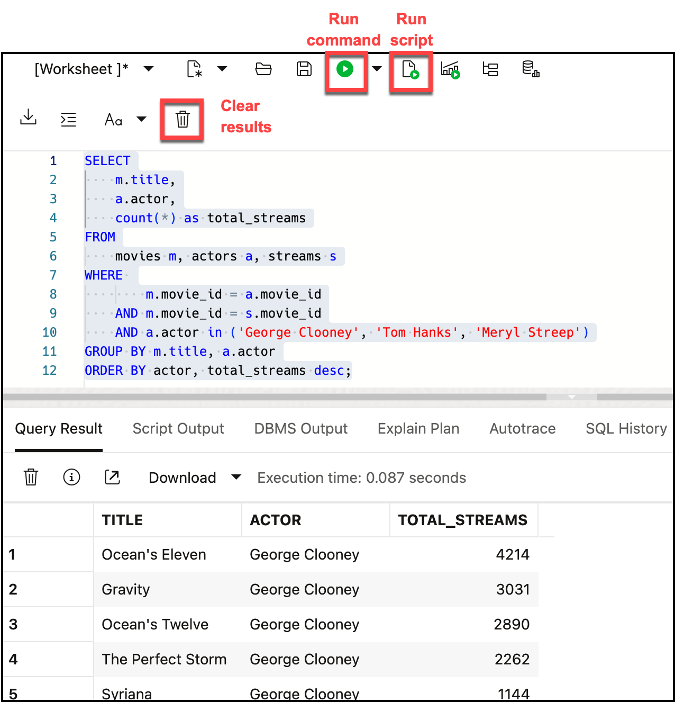

# Query your data with SQL

## Introduction
Let's now take a look at the data that Oracle MovieStream captures about its service. You'll find tables and views that contain:
* Movies that the company streams
* Customers on the service
* Streams - who is watching what movies and when
* Partner data 
* and more

This lab will introduce you to the built-in SQL Worksheet that can be used to query your data. We'll use that tool to introduce you to the Oracle MovieStream data

### Objectives

- Understand how to use SQL Worksheet
- Use SQL to explore moviestreaming activity - including queries against JSON data types
- Find important customers with binning

### Prerequisites
- This lab requires completion of Lab 1 in the Contents menu on the left.

## Task 1: Log into the SQL Worksheet
[](include:adb-connect-with-sql-worksheet-body.md)


## Task 2: Explore movie streaming activity 
1. Let's explore some of the data that is in our database so you can get a sense of the information that's there. Start by looking at total streams of George Clooney, Tom Hanks and Meryl Streep movies. This requires joining multiple sources - the `STREAMS` and `ACTORS` table plus the `MOVIES` view. This `MOVIES` view is actually a relational projection of data stored in the `movieCollection` JSON collection:

    ```
    <copy>
    SELECT
        m.title,
        a.actor,
        count(*) as total_streams
    FROM
        movies m, actors a, streams s
    WHERE 
            m.movie_id = a.movie_id
        AND m.movie_id = s.movie_id
        AND a.actor in ('George Clooney', 'Tom Hanks', 'Meryl Streep')
    GROUP BY m.title, a.actor
    ORDER BY actor, total_streams desc;</copy>
    ```

    Copy the above into the SQL workseet. You can use the shortcuts [Control-Enter] or [Command-Enter] to run the command and view the Query Result (tabular format). Clear your worksheet by clicking the trash:
    
    

2. Some of these movies are award winners. The `MOVIES` view has an `AWARDS` column that is a JSON array containing the list of awards. Oracle SQL includes a number of JSON functions that can simplify access to your JSON data. The **JSON_TABLE** function can be used to automatically translate JSON data into a row-column format so you can query the JSON data in exactly the same way as our movie sales data.

    Let's modify the above query to find movies that were awarded best picture, actress or actor:

    ```
    <copy>
    SELECT
        m.title,
        a.actor,
        count(*) as total_streams
    FROM
        movies m, actors a, streams s,
        JSON_TABLE(awards, '$[*]' columns (award path '$')) jt
    WHERE 
            m.movie_id = a.movie_id
        AND m.movie_id = s.movie_id
        AND a.actor in ('George Clooney', 'Tom Hanks', 'Meryl Streep')
        AND jt.award in ('Academy Award for Best Picture', 'Academy Award for Best Actor','Academy Award for Best Actress')
    GROUP BY m.title, a.actor
    ORDER BY actor, total_streams desc;</copy>
    ```

    

## Task 3: Segmenting customers using binning 

1. Let's pivot and look at customers. This final example will enrich our existing understanding of customer behavior by utilizing an RFM analysis. RFM is a very commonly used method for analyzing customer value. It is commonly used in general customer marketing, direct marketing, and retail sectors.

    In the following steps, the scripts will build a SQL query that will identify:

    - Recency: when was the last time the customer accessed the site?

    - Frequency: what is the level of activity for that customer on the site?

    - Monetary: how much money has the customer spent?

    Customers will be categorized into 5 buckets measured (using the NTILE function) in increasing importance. For example, an RFM combined score of 551 indicates that the customer is in the highest tier of customers in terms of recent visits (R=5) and activity on the site (F=5), however the customer is in the lowest tier in terms of spend (M=1). Perhaps this is a customer that performs research on the site, but then decides to buy movies elsewhere!

1.  Binning customers' sales by value

    Use the following query to segment customers into 5 distinct bins based on the value of their purchases:

    ```
    <copy>SELECT
        m.cust_id,
        c.first_name||' '||c.last_name as cust_name,
        c.country,
        c.age,
        c.income_level,
        NTILE (5) OVER (ORDER BY SUM(m.sales)) AS rfm_monetary
    FROM streams m
    INNER JOIN customer c ON c.cust_id = m.cust_id
    GROUP BY m.cust_id,
        c.first_name||' '||c.last_name,
        c.country,
        c.age,
        c.income_level
    ORDER BY m.cust_id,
    c.first_name||' '||c.last_name,
    c.country,
    c.age,
    c.income_level
    FETCH FIRST 10 ROWS ONLY;</copy>
    ```
    Below is a snapshot of the result (and your result may differ):

    


    The last column in the report shows the "Bin" value. A value of 1 in this column indicates that a customer is a low spending customer and a value of 5 indicates that a customer is a high spending customer. For more information about using the `NTILE` function, see [the SQL documentation](https://docs.oracle.com/en/database/oracle/oracle-database/19/sqlrf/NTILE.html#GUID-FAD7A986-AEBD-4A03-B0D2-F7F2148BA5E9).

2.  Binning customer sales by recency and frequency

    The next step is to determine how frequently customers are watching movies on our platform. To do this, we simply calculate the number of movies watched by each customer and then bin that calculation across 5 buckets.

    ```
    <copy>
    SELECT
        cust_id,
        NTILE (5) OVER (ORDER BY max(day_ID)) AS rfm_recency,
        NTILE (5) OVER (ORDER BY count(1)) AS rfm_frequency
    FROM streams
    GROUP BY cust_id
    ORDER BY dbms_random.value
    FETCH FIRST 10 ROWS ONLY;</copy>
    ```
    This should return a result similar to the following (again, your results may differ as the query is fetching a random 10 rows):

    

    Now we can categorize customers based on when they last watched a movie (rfm\_recency) and how frequently they viewed movies (rfm\_frequency).

3.  Create an RFM query

    Now we use the **`WITH`** clause to combine these two queries to create an RFM query:

    ```
    <copy>WITH rfm AS (
    SELECT
        m.cust_id,
        NTILE (5) OVER (ORDER BY max(day_id)) AS rfm_recency,
        NTILE (5) OVER (ORDER BY count(1)) AS rfm_frequency,
        NTILE (5) OVER (ORDER BY SUM(m.sales)) AS rfm_monetary
    FROM streams m
    GROUP BY m.cust_id
    )
    SELECT
        r.cust_id,
        c.first_name||' '||c.last_name AS cust_name,
        r.rfm_recency,
        r.rfm_frequency,
        r.rfm_monetary,
        c.country,
        c.age,
        c.income_level
    FROM rfm r
    INNER JOIN customer c ON c.cust_id = r.cust_id
    WHERE r.rfm_monetary >= 5
    AND r.rfm_recency = 1
    ORDER BY r.rfm_monetary desc, r.rfm_recency desc;</copy>
    ```
    The result only shows customers who have history had significant spend (equal to 5) but have not visited the site recently (equal to 1).  MovieStream does not want to lose these important customers!

    

## **Acknowledgements**

- **Authors** - Marty Gubar, Oracle Autonomous Database Product Management
- **Last Updated By/Date** - April 2025

