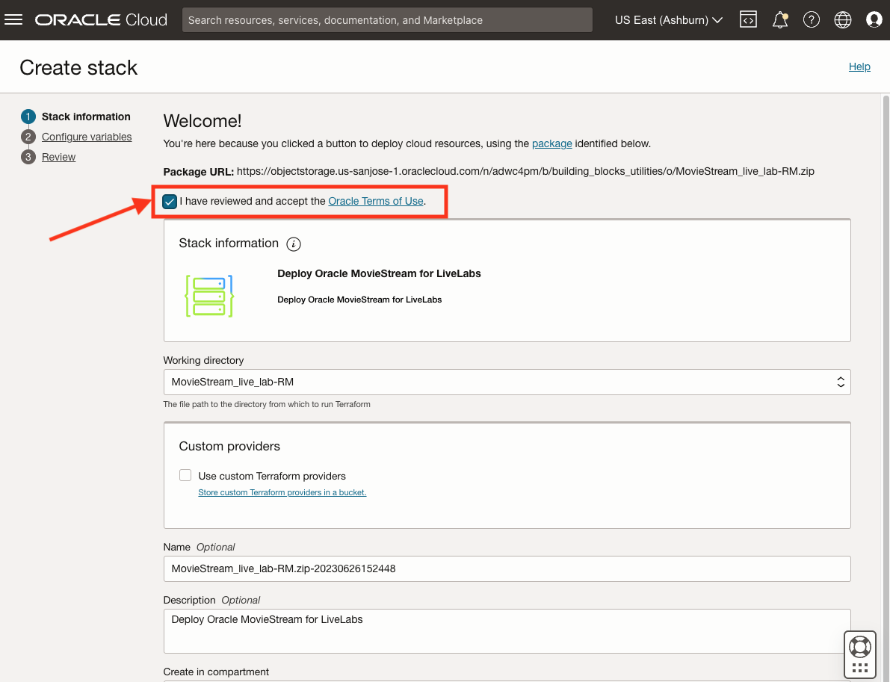
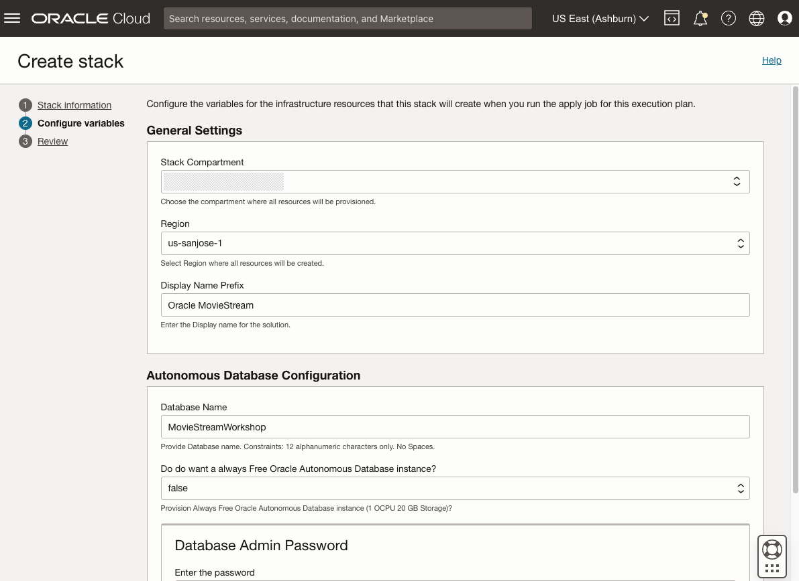
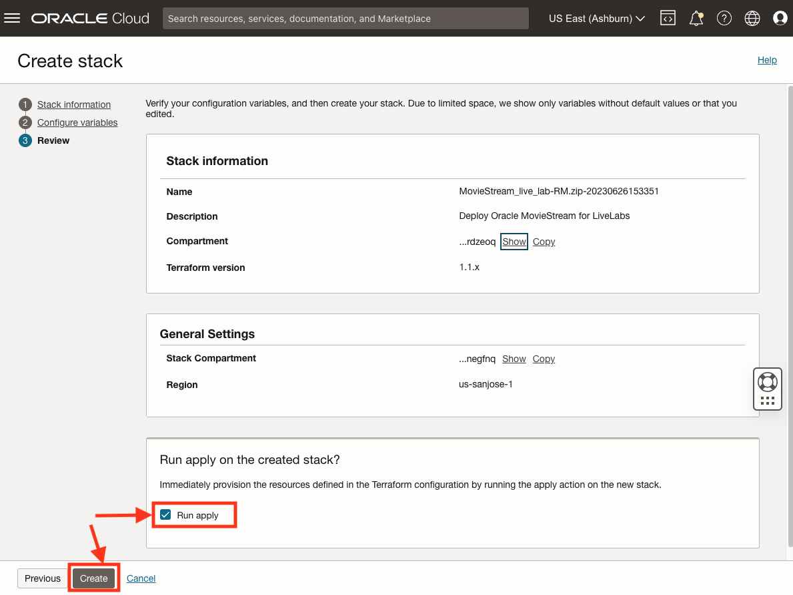
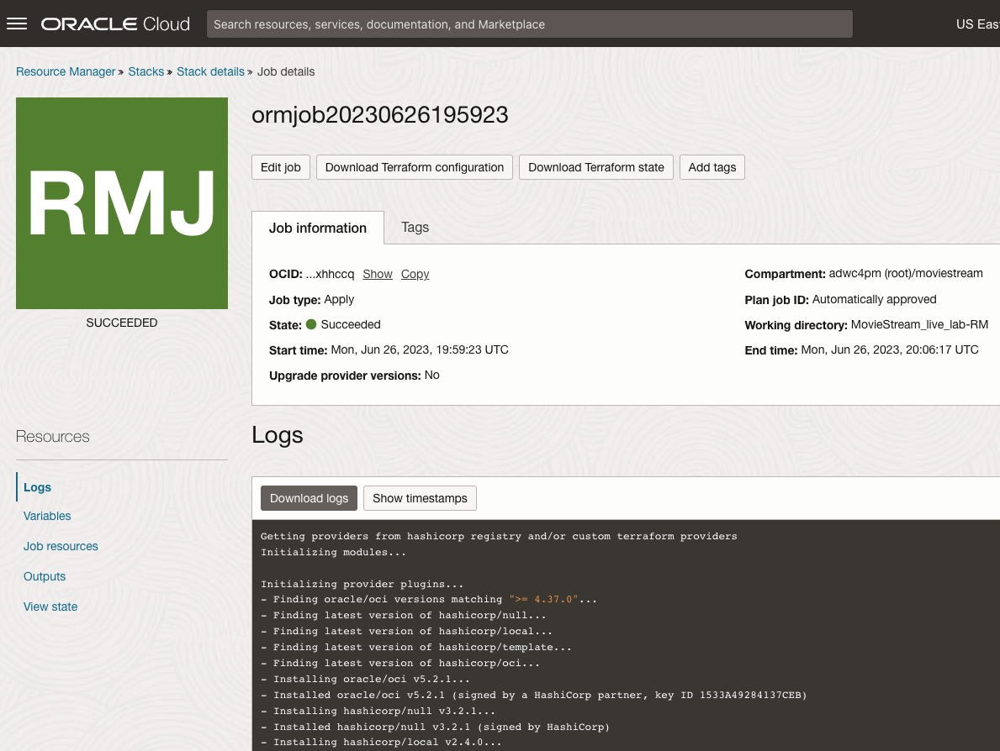
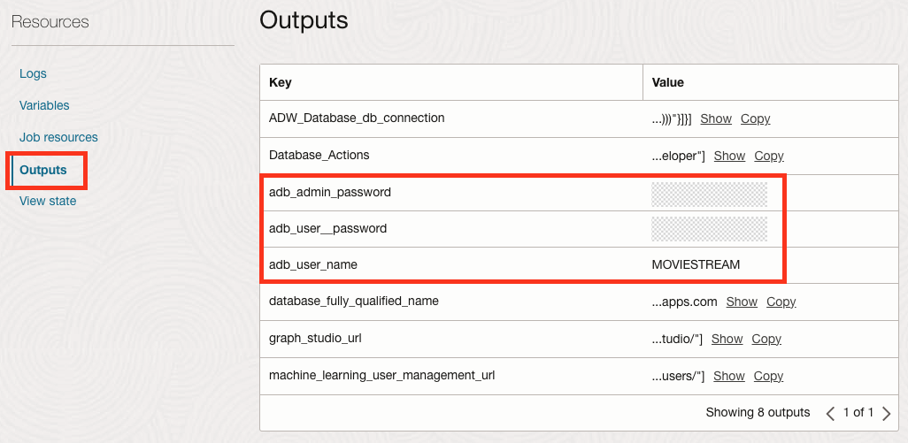

# Setup Environment
## Introduction

This workshop will focus on the analytics behind MovieStream. There are few steps required prior to doing these analytics, including:
* Provisioning your Autonomous Database
* Creating a user
* Creating tables and views
* Loading data from object storage

These setup steps have been automated using a predefined OCI Cloud Stack Template that contains all the resources you need. You'll use OCI Resource Manager to deploy this template and make your environment available in just a few minutes. You can use Resource Manager for your own projects - [check out the documentation](https://docs.oracle.com/en-us/iaas/Content/ResourceManager/Concepts/resourcemanager.htm) for more details.

Estimated Time: 5 minutes.

### Objectives

Learn how to
* Run the stack to perform all the prerequisites required to analyze data. 

## Task 1: Create OCI compartment

## Task 2: Provision ADB and load data using an OCI Cloud Stack

The following steps will set up everything you need to run the analytics for the workshop. Labs 2 and 3 show you how you can perform the tasks manually.

1. Create and run the stack by clicking on the following: [Create and install stack](https://cloud.oracle.com/resourcemanager/stacks/create?region=home&zipUrl=https://github.com/oracle-devrel/terraform-oci-oracle-cloud-foundation/releases/download/v1.0.0/Deploy-Autonomous-Database-and-the-MovieStream-data-sets-for-Oracle-LiveLabs-RM.zip&zipUrlVariables={&quot;tag&quot;:&quot;end-to-end&quot;,&quot;run\_post\_load_procedures&quot;:&quot;true&quot;,&quot;db\_name&quot;:&quot;myquickstart&quot;})

2. You will be directed to the page below: 

  

    Check **I have reviewed and accept the Oracle Terms of Use** box and choose your **compartment**. Leave the default values for the rest of the fields. 
    
    Click **Next**.

3. Select the target **compartment** and **region** for your Autonomous Database. 

    

    Click **Next**. 

  **Note:** If clicking **Next** does not take you to the next page, check the **Region** field. It may have been reset.

4. It's time to create and apply your stack. Ensure **Run apply** is checked and then click **Create**.

    

5. You will be taken to a Job Details page with an initial status shown in orange. The icon will become green once the job has successfully completed. This will take 5 to 10 minutes.

    

6. Go to the Job Details **Resources -> Outputs** section. Make note of the user and password details. You will need this informationu later:
    * adb\_admin\_password
    * adb\_user\_name
    * adb\_user\_password

    

## Acknowledgements
  * **Author** - Marty Gubar, Product Management
  * **Contributors** -  Marty Gubar, Product Management
* **Last Updated By/Date** - Marty Gubar, Product Management, June 2023