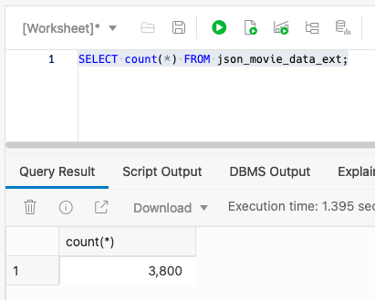
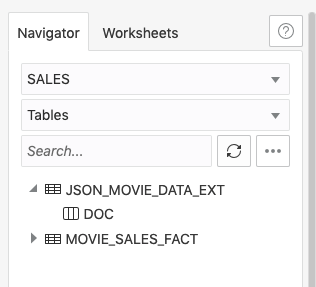
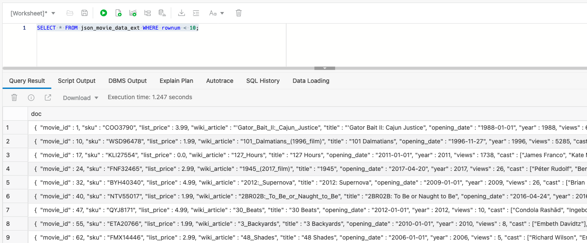
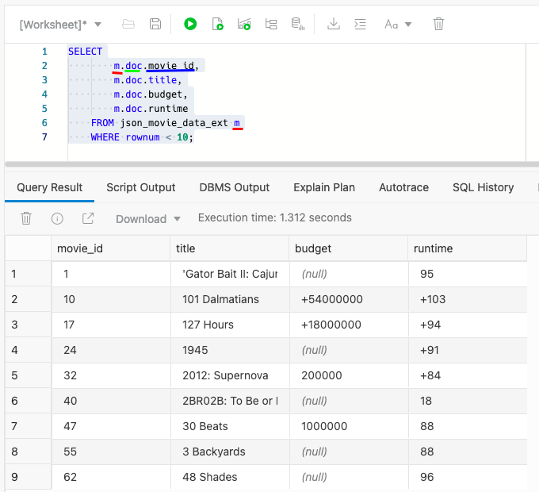
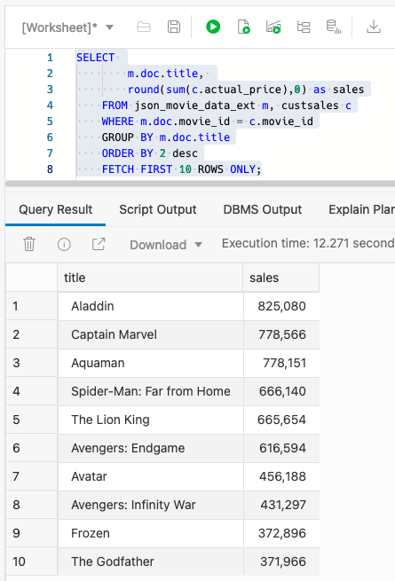
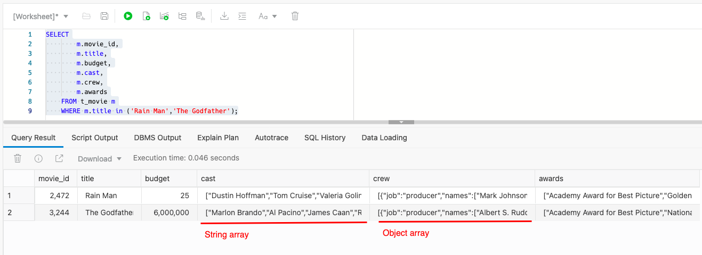
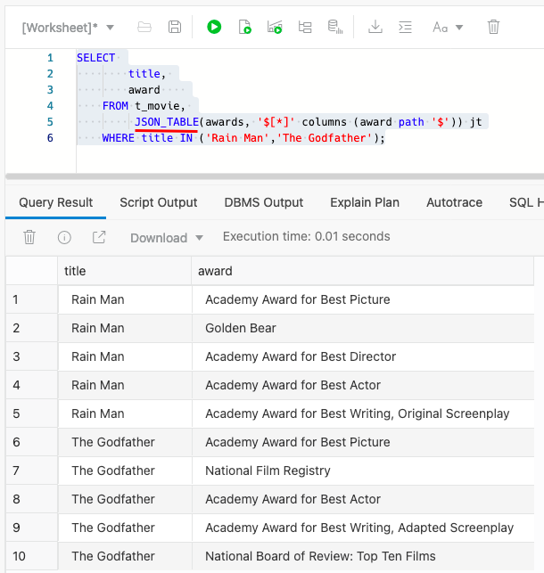
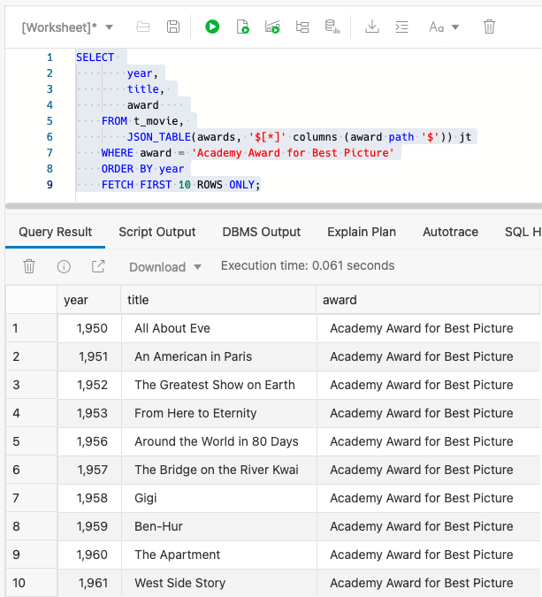
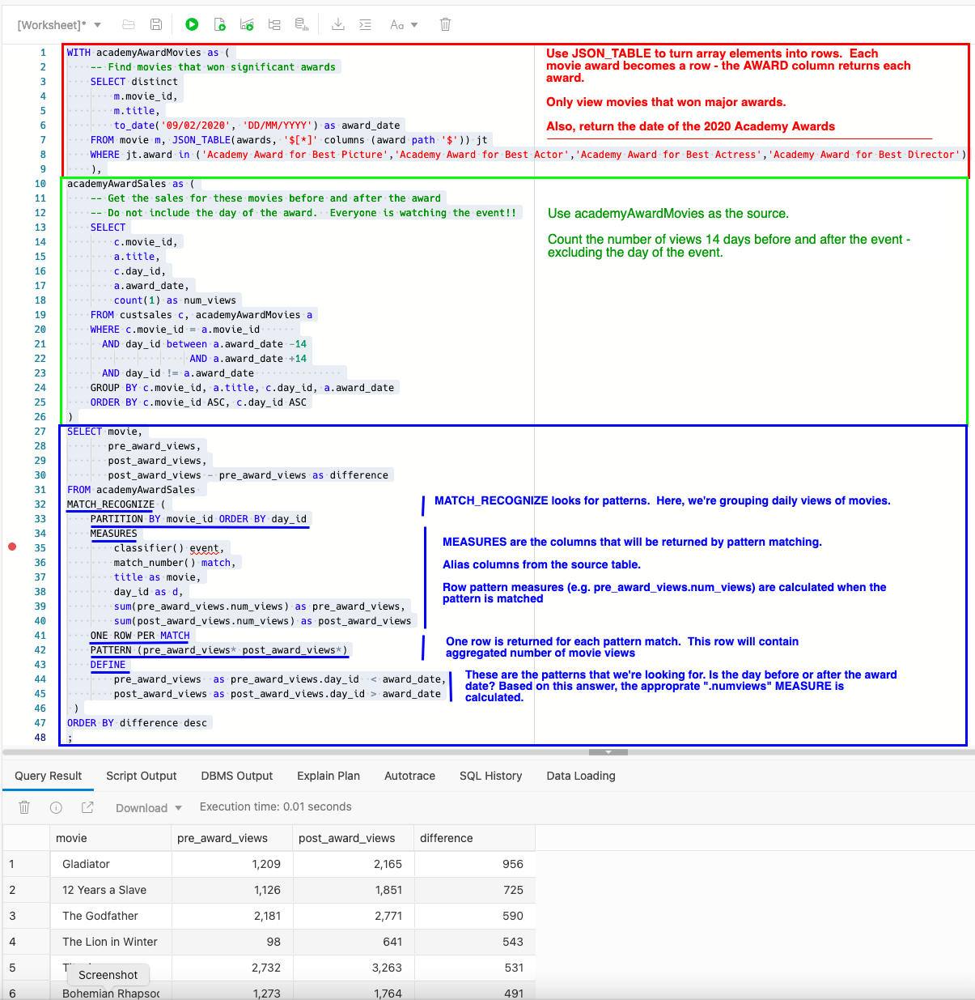

# Work with JSON movie data

## Introduction

#### Video Preview

[](youtube:5o40waKb2_4)

JSON provides an extremely flexible and powerful data model.  No wonder that it is such a popular storage format for developers. Oracle SQL allows you to analyze JSON data - including complex data types like arrays - in combination with structured tabular data.

Up to this point in our workshop, all the data we have been using has been **structured**. Structured data comes with a pre-determined definition. In our movie sales data, each record in our sales data files has a reference ID, a timestamp, a customer ID, associated customer demographic information, movie purchases, payment information, and more. Each field in our data set has a clearly defined purpose, which makes it very quick and easy to query. In most real-world situations, you will need to deal with other types of data such as **semi-structured**.

Estimated time: 10 minutes

### Objectives

- Learn how our Autonomous Data Warehouse makes it very easy to query unstructured data sets such as JSON data

- Understand how Oracle's JSON helper functions can convert JSON data into a normal table of rows and columns making it easier to join with our movie sales data

- Learn How SQL's analytic functions can be used in queries that also contain JSON data

### Prerequisites

- This lab requires completion of these previous labs: **Provision an ADB Instance**, **Create a Database User**, **Use Data Tools to Create a User and Load Data**.

### What is semi-structured data

Semi-structured data does not have predefined fields that have a clearly defined purpose. Typically most semi-structured data looks similar to a text-based document but most types of semi-structured data lack a precise structural definition and come in all shapes and sizes. This can make it very challenging to work with this type of data.

There are many different types of semi-structured and unstructured data, so most cloud vendors offer separate database services to manage each type of data: document store databases, graph store databases, spatial store databases, XML databases, NoSQL databases, and more. These separate database engines create data silos by locking data inside each type of database, making it almost impossible to do joined-up analysis across all your data. (If you want to learn more about the differences between structured, semi-structured and unstructured data then read the following blog post on [blogs.oracle.com](http://blogs.oracle.com) by Michael Chen: [Structured vs. Unstructured Data](https://blogs.oracle.com/bigdata/structured-vs-unstructured-data)).

Oracle takes a very different approach to managing these different types of data.

### A converged database model for managing all your data

The Autonomous Data Warehouse is based on a converged database model that has native support for all modern data types and the latest development paradigms built into one product. It supports spatial data for location awareness, JSON and XML for document store type content streams for IoT device integration, in-memory technologies for real-time analytics, and of course, traditional relational data. By providing support for all of these data types, the converged Autonomous Data Warehouse can run all sorts of workloads from analysis of event streams to discovery of relationships across domains to blockchain processing to time series analysis and machine learning.

In this section of the workshop, you are going to work with some semi-structured data which is in a common format called **JSON**.

### What is JSON

This format is probably the most commonly used way to manage data sets that are typically semi-structured in terms of the way they are organized. This format is an open standard file format which is typically used to simplify the way information can be moved around the web. It resembles human-readable text where data points consist of attribute–value pairs and/or arrays. It is a very common data format and it has a wide range of applications.

JSON is a language-independent data format. It was derived from JavaScript, but many modern programming languages include code to generate and parse JSON-format data. For more information see here: [https://en.wikipedia.org/wiki/JSON](https://en.wikipedia.org/wiki/JSON).

Oracle's SQL language contains specific keywords that help you process JSON data. In this lab, you will learn how to process and query JSON data formats.

### Overview of the business problem

The marketing team would like to gain a better understanding of how different types of events - like the Academy Awards - impacts the business. Our movie data set has a series of columns that contain different types of details about movies. Each movie has a **crew** associated with it and that crew is comprised of **jobs**, such as "producer," "director," "writer," along with the names of the individuals. Each movie also has a list of award nominations and wins. An example of how this information is organized is shown below:


This is in a format known as JSON and you can see that it is organized very differently from some other data that you have loaded into your new data warehouse. There is a single entry for "producer" but the corresponding key "names" actually has multiple values. This is referred to as an **array** - specifically a JSON array. Fortunately, the Autonomous Data Warehouse allows you to query this type of data (JSON arrays) using normal SQL as you will see below.

Let's better understand the sales performance of our movies. We'll start by simply looking at our movie profiles and sales of those movies. Then, we'll examine how different events - in particular the Academy Awards - impacts sales of high profile movies.

## Task 1: Review JSON movie data

In the previous labs of this workshop, we loaded the data we want to use into our data warehouse. Autonomous Data Warehouse also allows you to leave your data in the Object Store and query it directly without having to load it first. This uses a feature called an External Table. There is a whole chapter on this topic in the documentation, [see here](https://docs.oracle.com/en/cloud/paas/autonomous-database/adbsa/query-external.html#GUID-ABF95242-3E04-42FF-9361-52707D14E833), which explains all the different types of file formats (including JSON) that are supported.

Although queries on external data will not be as fast as queries on database tables, you can use this approach to quickly start running queries on your external source files and external data. In the public object storage buckets, there is a file called **movies.json** which contains information about each movie, as outlined above.  An external table called **JSON\_MOVIE\_DATA\_EXT** has been created over this json file.

1. Let's see how many rows are in this table:

    ```
    <copy>SELECT count(*) FROM json_movie_data_ext;</copy>
    ```
    This query returns the following result:

    

2. Go to the SQL Worksheet Navigator panel and click the arrow to the left of the name, **JSON\_MOVIE\_DATA\_EXT**, to show the list of columns in our table.  Notice that there is a single column called **DOC** that contains the JSON data:

    

    This external table behaves just like an ordinary table. Let's run a simple query to show the rows in the table:

    ```
    <copy>SELECT * FROM json_movie_data_ext WHERE rownum < 10;</copy>
    ```

    Result:
    
    

    As you can see, the data is shown in its native JSON format; that is, there are no columns in the table for each identifier (movie_id, sku, list price, and more). So how can we query this table if there is only one column?

## Task 2: Simple queries over JSON data


1. As a first step, let's show you how to query  JSON data using SQL. Use the dot notation within our SQL query to convert the content above into a more normal looking table containing columns and rows. This approach is known as Simple Dot Notation and it looks very similar to the way we have constructed previous queries. Here is our first query which you can run in your SQL Worksheet:

    ```
    <copy>SELECT
        m.doc.movie_id,
        m.doc.title,
        m.doc.budget,
        m.doc.runtime
    FROM json_movie_data_ext m
    WHERE rownum < 10;</copy>
    ```
    It should return a result set that looks similar to this:

    
    
    > **Note:** Each column has three components:

    - the name of the source table - **json\_movie\_data\_ext** which is referenced using the letter **m**

    - the column containing our json data - **doc**

    - the name of the json attribute - **movie_id**, **title**, **budget** and **runtime**

2. Now that movie queries return data in column format, you can join that data with data stored in other Oracle Database tables.  Let's find the top 10 movies (JSON) based on customer sales (tabular).  This requires joining the **MOVIE\_ID** column from the **CUSTSALES** table with the json document's **movie\_id** attribute.

    ```
    <copy>SELECT 
        m.doc.title, 
        round(sum(c.actual_price),0) as sales
    FROM json_movie_data_ext m, custsales c
    WHERE m.doc.movie_id = c.movie_id
    GROUP BY m.doc.title
    ORDER BY 2 desc
    FETCH FIRST 10 ROWS ONLY;</copy>
    ```

    This produces the following - and not surprising - result:

    

3. As part of our previous data loading lab, we loaded this external data into a table called **MOVIE**. This table created simple columns for the scalar fields - like title. But, some attributes in our JSON data set contain multiple entries. For example, cast has a list of names and nominations a list of nominated awards. Take a look at the cast, crew and awards for a couple of popular movies:

    ```
    <copy>SELECT
        m.movie_id,
        m.title,
        m.budget,
        m.cast,
        m.crew,
        m.awards
    FROM movie m
    WHERE m.title in ('Rain Man','The Godfather');</copy>
    ```

    It will return:

    

This is good - but the arrays are still part of a single record.  What if you want to ask questions that need to look at the values within the arrays?  

## Task 3: More sophisticated JSON queries

The Academy Awards is an exciting time for the movie industry. It would be interesting to understand movie sales during that time. What happens to movie sales before and after the event? Specifically, what happens to sales for those movies that have won the Academy Award? This can be a challenging question. A movie has an **awards** column - but it is an array.  How do you find sales for a movie that's won the best picture?

Your Autonomous Data Warehouse includes a number of helper packages that can simplify access to your JSON data. The **JSON_TABLE** function can be used to automatically translate JSON data into a row-column format so you can query the JSON data in exactly the same way as our movie sales data.

1. Let's use the JSON_TABLE function to create a row for each movie -> award combination. Run the following command in your SQL Worksheet:

    ```
    <copy>SELECT 
        title, 
        award    
    FROM movie, 
         JSON_TABLE(awards, '$[*]' columns (award path '$')) jt
    WHERE title IN ('Rain Man','The Godfather');</copy>
    ```
    You can now see the movie and its award in tabular format:

    

2. Now that we have rows for each value of the array, it is straightforward to find all Academy Award winners for Best Picture:

    ```
    <copy>SELECT 
        year,
        title, 
        award    
    FROM movie, 
        JSON_TABLE(awards, '$[*]' columns (award path '$')) jt
    WHERE award = 'Academy Award for Best Picture'
    ORDER BY year
    FETCH FIRST 10 ROWS ONLY;</copy>
    ```

    Below are the oldest award winners that MovieStream offers:

    

3. What were sales before and after the Academy Awards?  Let's see the results for past winners of the major awards.

    ```
    <copy>WITH academyAwardMovies as (
    -- Find movies that won significant awards
    SELECT distinct
        m.movie_id,
        m.title,
        to_date('09/02/2020', 'DD/MM/YYYY') as award_date
    FROM movie m, JSON_TABLE(awards, '$[*]' columns (award path '$')) jt
    WHERE jt.award in ('Academy Award for Best Picture','Academy Award for Best Actor','Academy Award for Best Actress','Academy Award for Best Director')
    ),
    academyAwardSales as (
        -- Get the sales for these movies before and after the award
        -- Do not include the day of the award.  Everyone is watching the event!!
        SELECT
            c.movie_id,
            a.title,
            c.day_id,
            a.award_date,
            count(1) as num_views
        FROM custsales c, academyAwardMovies a
        WHERE c.movie_id = a.movie_id      
        AND day_id between a.award_date -14
                        AND a.award_date +14
        AND day_id != a.award_date               
        GROUP BY c.movie_id, a.title, c.day_id, a.award_date
        ORDER BY c.movie_id ASC, c.day_id ASC
    )
    SELECT movie,
        pre_award_views,
        post_award_views,
        post_award_views - pre_award_views as difference
    FROM academyAwardSales 
    MATCH_RECOGNIZE (
        PARTITION BY movie_id ORDER BY day_id
        MEASURES
            classifier() as event,
            match_number() as match,
            title as movie,
            day_id as d,
            sum(pre_award_views.num_views) as pre_award_views,
            sum(post_award_views.num_views) as post_award_views
        ONE ROW PER MATCH
        PATTERN (pre_award_views* post_award_views*)
        DEFINE
            pre_award_views  as pre_award_views.day_id  < award_date,
            post_award_views as post_award_views.day_id > award_date
    )
    ORDER BY difference desc
    ;</copy>
    ```
    We saved our most sophisticated query for last!  

    

    This is a sophistcated query that draws on our previous concepts and introduces the MATCH\_RECOGNIZE clause. MATCH\_RECOGNIZE (a.k.a. SQL pattern matching) is a powerful capability that allows you to examine many different types of patterns - like rising and falling of stock prices. Our pattern will be simple - did the customer watch the movie before or after the Academy Awards?
    
    Here is a summary of the query specification:
    * Subquery `academyAwardMovies` returns movies that have won significant awards
    * Subquery `academyAwardSales` uses these movies and counts the number of views 14 days before and after the event. 
    * **MATCH_RECOGNIZE** is used to find the patterns. In this case, the patterns are simple: did the event - or row - take place before or after the award date?
        * **MEASURES** contain the columns that are returned by the query. 
        * **MEASURES** can alias the source table's columns 
        * **MEASURES** refer to and perform calculations over the objects from the patterns **DEFINE** clause.

    Looks like the Academy Awards is very good for business!

## Recap

In this lab, we covered the following topics:

- How our Autonomous Data Warehouse makes it very easy to query unstructured data sets such as JSON data

- Using JSON helper functions to convert the JSON data into a normal table of rows and columns so that it can be easily joined with our movie sales data

- How SQL's analytic functions can be used in queries that also contain JSON data

Please *proceed to the next lab*

## **Acknowledgements**

- **Author** - Keith Laker, Oracle Autonomous Database Product Management
- **Adapted for Cloud by** - Richard Green, Principal Developer, Database User Assistance
- **Last Updated By/Date** - Keith Laker, Marty Gubar April 2024
