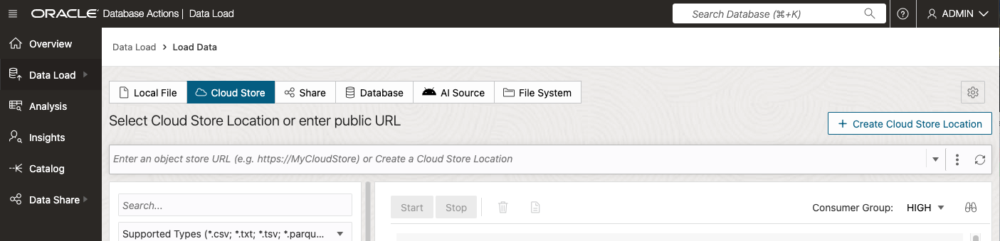
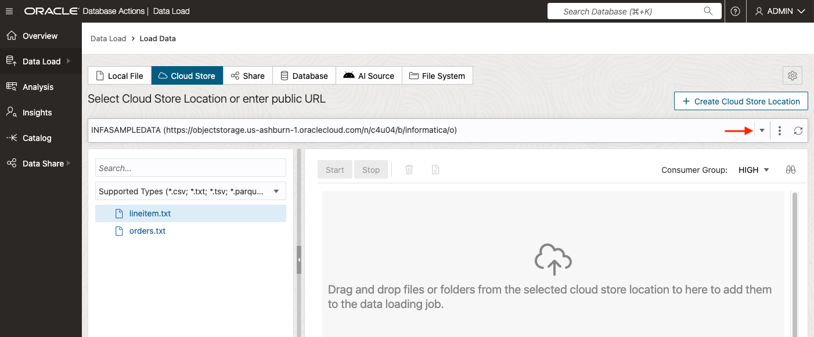
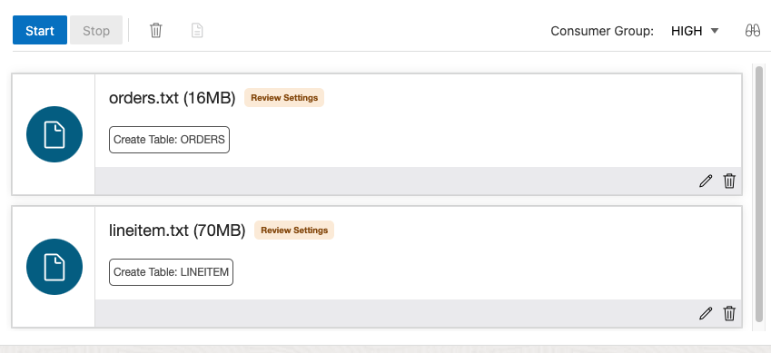

# Load data from object storage using Database Actions and scripting

## Introduction

This lab takes you through the steps needed to load and link sample data on [Oracle Cloud Infrastructure Object Storage](https://www.oracle.com/cloud/storage/object-storage.html) into an Oracle Autonomous Database instance in preparation for creating the sample integration mappings.

You can load data into your Autonomous Database (either Oracle Autonomous Data Warehouse or Oracle Autonomous Transaction Processing) using the built-in tools as in this lab, or you can use other Oracle and third-party data integration tools. With the built-in tools, you can load data:

+ from files in your local device,
+ from tables in remote databases, or
+ from files stored in cloud-based object storage (Oracle Cloud Infrastructure Object Storage, Amazon S3, Microsoft Azure Blob Storage, Google Cloud Storage).

You can also leave data in place in cloud object storage, and link to it from your Autonomous Database.

> **Note:** While this lab uses Oracle Autonomous Data Warehouse, the steps are identical for loading data into an Oracle Autonomous Transaction Processing database.

Estimated Time: 10 minutes

### About product

In this lab, we will learn more about the autonomous database's built-in Data Load tool - see the [documentation](https://docs.oracle.com/en/cloud/paas/autonomous-database/adbsa/data-load.html#GUID-E810061A-42B3-485F-92B8-3B872D790D85) for more information.

### Objectives

+ Learn how to define object storage credentials for your autonomous database
+ Learn how to load data from object storage using Data Tools

### Prerequisites

+ This lab requires you to have access to an autonomous database instance; either Oracle Autonomous Data Warehouse (ADW) or Oracle Autonomous Transaction Processing (ATP).

## Task 1: Configure the Object Storage connections

In this step, you will set up access to the a bucket on Oracle Cloud Infrastructure Object Storage that contain data that we want to load - order file and line item file.

1. In your database's details page, click the **Database Actions** button.

     

2. Database Actions should automatically open up with you logged in as Admin user.

3. On the Database Actions Launchpad page, under **Data Studio**, click **DATA LOAD**

    

4. In the **Menu** section, click **Cloud Store** to set up the connection from your autonomous database to object storage.

    

5. To add access to the files, click **+Create Cloud Store Loacation** in the top right of your screen.

-   In the **Name** field, enter 'INFASampleData'

> **Note:** Take care not to use spaces in the name.

-   Select **Public Bucket** as this is a public bucket
-   Select **Bucket URI** 
-   Copy and paste the following URI into the URI + Bucket field:
    ```
    <copy>
    https://objectstorage.us-ashburn-1.oraclecloud.com/n/c4u04/b/informatica/o
    </copy>
    ```
-   Then click **Create**.

7. The page now invites us to load data from this area. 


## Task 2: Load data from files in Object Storage using Data Tools

In this step we will perform some simple data loading tasks, to load in CSV files from object storage into tables in our autonomous database.

1. To load or link data from our newly configured cloud storage, stay in the Data Load Cloud Store page.

    

    

3. Click on the down arrow and select INFASAMPLEDATA location, then drag the **orders.txt** file over to the right hand pane.

4. Next, drag the **lineitem.txt** folder over to the right hand pane. Again, click **OK** to load all files into a single table.


5. Click the pencil icon for the **LINEITEM** task to view the settings for this load task.

    

    

    

6. Here we can see the list of columns and data types that will be created from the txt file. They all look correct, so click **Close** to close the settings viewer.

7. Click the pencil icon for the **ORDERS** task to view its settings. 

8. Here we can see the list of columns and data types that will be created from the txt file. They all look correct, so click **Close** to close the settings viewer.

9. Now click the Play button to run the data load job.

    

    The job should take about 20 seconds to run.

10. Check that both data load cards have green tick marks in them, indicating that the data load tasks have completed successfully.

    

This completes the Data Load lab. We now have two tables loaded into the Autonomous Database from the Object Storage. We will be working with these tables in later labs.

## Acknowledgements

* **Author** - Larry Fumagalli, Outbound Product Management
* **Contributors** -  Marty Gubar, Autonomous Database Product Management
* **Last Updated By/Date** - Larry Fumagalli, Outbound Product Management, May 2024
