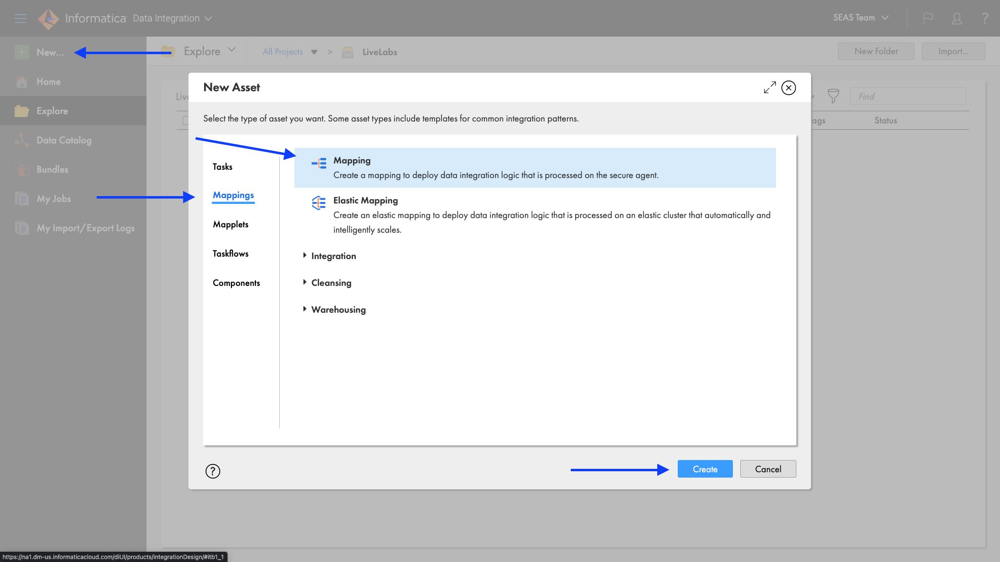
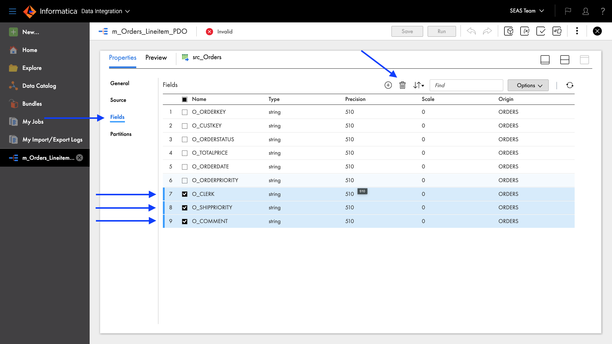
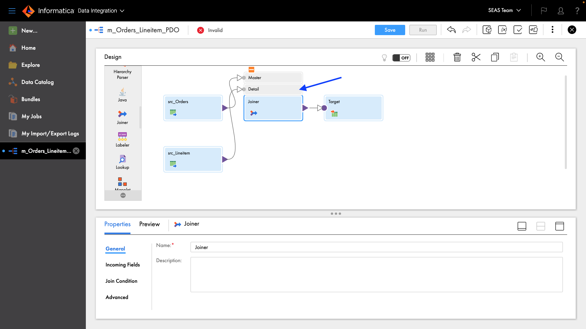
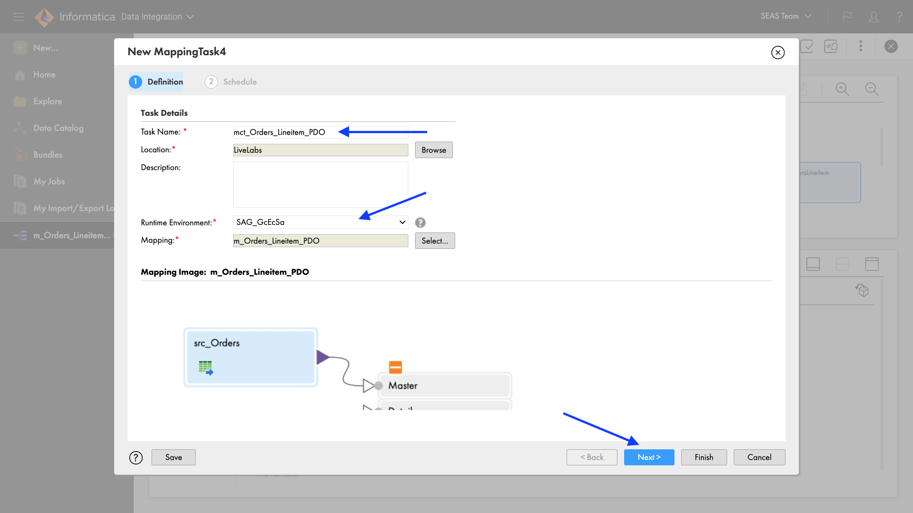

# Run Scripts

## Introduction

In this lab, you will navigate to Informatica IDMC UI, create a mapping and execute it.

Estimated Lab Time: 20 minutes

### Objectives

In this lab, you will:

* Navigate to Informatica UI
* Create a mapping with Pushdown Optimization/ELT

### Prerequisites

This lab assumes you have:

* Provisioned and Oracle ADB instance
* Have loaded data into the ADW
* Have Access to Informatica Intelligent Data Management Cloud (IDMC)
* Configured the Informatica secure agent
* Configured Wallet in the secure agent

### Tasks in this LiveLabs
* Task 1: Create a connection to Oracle Autonomous Database
* Task 2: Create a Project folder
* Task 3: Create a mapping to transform orders and lineitem tables
* Task 4: Configure Pushdown Optimization (PDO) or ELT and execute mapping

## Task 1: Create a connection to Oracle Autonomous Database

An Oracle Autonomous Database connection is required to read and write data from/to the database.  Follow the steps below to create an Oracle Autonomous Database connection.

1.	Login to IDMC URL: https://dm-us.informaticacloud.com/identity-service/home

	

2.	Select **Administrator** service in the service selector page.

	

3.	Click **Connections** on the left panel then click **New Connection**.

	

4.  Fill in the following:

	* Enter a name in the Connection Name field.
	* Select **Oracle** from the Type dropdown field.
	* Select the secure agent that you installed.
	* Enter your ADB username.
	* Enter your ADB password.
	* Enter the host string (from tnsnames.ora in instantclient subdirectory).
	* Enter the port number (from tnsnames.ora in instantclient subdirectory).
	* Enter the service name (from tnsnames.ora in instantclient subdirectory).
	* Select **UTF-8** from the Code Page dropdown field.
	* Select **SSL Auto** from the Encryption Method dropdown field.
	* Select **TLSv1.2** from the Crypto Protocol Version dropfown field.
	* Enter the wallet path and filename in the Trust Store field.
	* Enter the wallet password in the Trust Store Password field.
	* Enter the wallet path and filename in the Key Store field.
	* Enter the wallet password in the Key Store Password field.
	* Enter the wallet password in the Key Password field.


5. Click **Test Connection** button.  "The test for this connection was successful" message will display if the above configuration is correct.

   

## Task 2: Create a Project folder

Project folder can be created to store assets for specific project.  In a project folder, you can create additional folders.  Let's create a project for this LiveLabs.

1. Click the service selector at the top left, then select **Data Integration** service.

   


2. Click **Explore** on the left panel.

3. Click **New Project** to create a new project.

4. Enter **LiveLabs** in the Name field.

5. Click **Save**.

   

6. Click **LiveLabs** project.

   


## Task 3: Create a mapping to transform orders and lineitem tables
IDMC Data Integration allows you to load source data from databases, applications, and data files in the cloud or on-premises into Oracle Autonomous DB.  Data Integration supports many transformations that can be used to transform and enrich source data.  In addition, pushdown optimization (PDO) can be utilized for some transformations and functions to take advantage of Autonomous DB compute resource for data processing.

In this lab, you will create a mapping to read two tables (Orders and Lineitem) from Autonomous DB, join the tables, perform an aggregation to create a count and total, and write the results into a new table in Autonomous DB.  Then in the mapping task, you will turn on pushdown optimization to enable the processing to occur in Autonomous DB.

### Create a new mapping

1. Click **New...**

2. Click **Mappings**

3. Select **Mapping** for asset type

4. Click **Create** <BR>

   

5. Under properties, enter **m\_Orders\_Lineitem\_PDO** in Name field.

6. Ensure that Location is **LiveLabs**. If not, click **Browse** and select it.

   

7. Click **Save**

### Configure Orders source
Let's configure the Orders data source from ADB.

1.	Click the **Source** transform in the mapping canvas to assign its properties.

2.	In the General tab, enter **src\_Orders** in the Name field.<BR>

	

3.	In the Source tab, select the connection created in Task 1 in the Connection dropdown field.

4.	Click **Select** to select a source table.

	

6.	From the source objects list, select **ORDERS** table.

7.	Click **OK**. <BR>

	

8.	Click **Preview Data** to view the first 10 records.

	

9.	Records should be separated by fields.

	

10.	Click **Done**.

11. Adjust the canvas and properties size by clicking the separator 3 dots icon or the maximize icon so all the fields can be seen.

	

12.	In the Fields tab, select fields **7**, **8**, and **9**.  Then click **trash icon** to remove those fields.  

13.	Click **Yes** when prompted.

	

14. Click **Save**.

15.	Select **o\_totalprice** field.  Click **Options** dropdown, select **Edit Metadata** to change type to decimal.

	

16.	Click nvarchar Native Type field and change it to **decimal**.

17.	Change the Native Precision to **38**.

18.	Change the Native Scale to **2**.<br>

	

19.	Click **Save** to save work in progress.

### Configure Lineitem source
Add Lineitem table as another data source.

1. From the transformation palette, drag **Source** transform and drop it in the mapping canvas.

   

2. In the General tab, enter **src\_Lineitem** in the Name field.

3. In the Source tab, select the connection created in Task 1 in the Connection dropdown field.

4. Click **Select** to select a source table.

5. From the source objects list, select **LINEITEM** table.

6. Click **OK**. <BR>

7. In the Fields tab, remove all fields except **l\_orderkey**, **l\_extendedprice**, **l\_discount**, **l\_tax**.

8. Click **Yes**. <BR>

   

9. Now, edit the metadata and change the data type for **l\_extendedprice**, **l\_discount**, **l\_tax** to decimal.

   

10.	Click **Save** to save work in progress.

### Join the two data sources

1.	From the transformation palette, drag the **Joiner** transform and drop it over the line between the src_Orders source and target transforms.  The Joiner should now be linked to the Orders and target.  If not, manually link them.

2.	Click align icon to align transformations in the mapping canvas.

	

3.	Click the plus icon above the Joiner to expand.  

4.	Link **src\_Lineitem** to the Detail of Joiner transform.

	

5.	Let’s assign the Joiner properties.

6.	In the General tab, enter **jnr\_orders\_lineitem** in the Name field.

7.	In the Join Condition tab, click the plus icon to add a new condition.

8.	Select **o\_orderkey** for Master and **l\_orderkey** for Detail.

	

9.	In the Advanced tab, check the **Sorted Input** checkbox.

	

10.	Click **Save** to save work in progress.

### Calculate number of items per order and order total

1.	From the transformation palette, select **Aggregator** transformation, drag and drop between the jnr\_orders\_lineitem and Target in mapping canvas window.

2.	Click align icon to align transformations in the mapping canvas.

	

3.	Let’s assign the properties.

4.	In the General tab, enter **agg\_item\_count\_and\_order\_total** in the Name field.

5.	In the Group By tab, click the plus icon to add new fields.

6.	Add the following fields:
	* **o\_orderkey**
	* **o\_custkey**
	* **o\_orderstatus**
	* **o\_totalprice**
	* **o\_orderdate**
	* **o\_orderpriority**

7.	When completed, the Group By tab properties should look like this:

	

8.	In the Aggregate tab, click the plus icon to add a new field.

9.	Enter **itemcount** in the Name field.

10.	Select **integer** in the Type dropdown field.

11.	Enter **10** in the Precision field.

12.	Enter **0** in the Scale field.

13.	Click **OK**.

	

14.	Click **Configure** to configure the expression.

15.	Enter **count(l_orderkey)** in the Expression field.  This function will result in the total number of items in an order.

16.	Click **Validate**.

17.	Click **OK**.

	

18.	Click the plus icon to add another new field.

19.	Enter **total\_calc** in the Name field.

20.	Select **decimal** in the Type dropdown field.

21.	Enter **38** in the Precision field.

22.	Enter **2** in the Scale field.

23.	Click **OK**.

24.	Click **Configure** to configure the expression.

25.	Enter the following in the Expression field.  This function will add the total of all items in an order.

```sql
<copy>
sum(l_extendedprice * (1- l_discount) * (1+l_tax))
</copy>
```

26.	Click **Validate**.

27.	Click **OK**.

28.	When completed, your Aggregate tab properties should look like this:

	

29.	Click **Save** to save work in progress.

### Rename fields 
Add an expression to rename the fields so that they look better and are in the order we want in the Oracle Autonomous Database table.  This is an optional transformation.

1.	From the transformation palette, drag **Expression** transform and drop it over the line between the agg\_item\_count\_and\_order\_total and target transforms.  The expression should now be linked to the aggregator and Target transforms.  If not, manually link them.

2.	Click align icon to align transformations in the mapping canvas.

	

3.	In the General tab, enter **exp\_rename\_fields** in the Name field.

4.	In the Expression tab, click the plus icon to add the following fields:

	| **Field Name** | **Type** | **Precision**	| **Scale**	| **Expression** |
	| --- | --- | --- | --- | --- |
	| orderkey | string	| 255 | 0 | o_orderkey |
	| custkey	| string | 255 | 0 | o_custkey | 
	| orderdate	| string | 255 | 0 | o_orderdate | 
	| orderpriority	| string	| 255	| 0	| o_orderpriority| 
	| orderstatus| 	string| 	255| 	0| 	o_orderstatus| 
	| totalprice| 	decimal| 	38| 	2| 	o_totalprice|	

5.	When completed, your Expression tab properties should look like this:

	

6.	Click **Save** to save work in progress.

### Configure Target

1.	Click **Target** to set a target properties.

2.	In the General tab, enter **tgt\_OrdersLineitem** in the Name field.

3.	In the Incoming Fields tab, click plus icon to add a field rule.

4.	Click Include operator and change it to **Exclude**.

5.	Click **Configure**.

	

6.	Select all fields except the following:
	* custkey
	* itemcount
	* orderdate
	* orderkey
	* orderpriority
	* orderstatus
	* total_calc
	* totalprice

7.	When completed, the Incoming Fields tab should look like this:

	

8.	In the Target tab, select the connection created in Task 1 in the Connection dropdown field.

9.  Click **Select** to select target table.

	

10.	Select **Create New at Runtime** for Target Object.

11.	Enter **ORDERSLINEITEM** in Object Name field.

12. Click **OK**.

	

13.	Click **Save** to save and validate the mapping.  A **Valid** message shows up next to the mapping name.

	

## Task 4: Configure Pushdown Optimization (PDO) or ELT and execute mapping

Let’s configure Pushdown Optimization (PDO) in the Mapping Task and execute it.

### Create a Mapping Task and Execute it

1.	Click 3 dots icon to create a **Mapping task** from the mapping

2.	Select **New Mapping Task…**

	

3.	In the New mapping task window, enter **mct\_Orders\_Lineitem\_PDO** in the Name field.

4.	Select **LiveLabs** for Location if not already selected.

5.	Select the secure agent you have configured in the prerequisite for Runtime Environment.

6.	Click **Next**. <BR>

	 

7.	Scroll down to the Pushdown Optimization section.

8.	Select **Full** from the Pushdown Optimization dropdown list.

9. Check **Create Temporary View** and **Create Temporary Sequence**.

10.	Click **Finish**. <BR>

	

11.	Click **Run** to execute the mapping task.

	

### View job execution

1. Click **My Jobs** to monitor the job execution.

   

2. Click **Refresh** icon when the “Updates available” message appears.

3. When the job is completed, make sure Status is **Success**.

   

4. Drill down to the completed job by clicking the instance name.  Then click Download Session Log to view the log.  

   

5. In the log you will see a message indicating that Pushdown Optimization is successfully enabled. 

   

6. You will also see an INSERT SQL statement that Informatica generated for execution in Oracle Autonomous Database.

You have successfully completed this LiveLabs.

## Learn More

* [Informatica IDMC Data Integration](https://docs.informatica.com/integration-cloud/cloud-data-integration/current-version.html)

## Acknowledgements
* **Author** - Eddy Widjaja, Solutions Director, Informatica
* **Contributors** -  Larry Fumagalli, Outbound Product Management
* **Last Updated By/Date** - Larry Fumagalli, March 2023
