# Configure Secure Agent to Connect with ADW

## Introduction

This lab walks you through the steps to download an Informatica Secure Agent from the OCI Market Place, configure the secure agent to connect with an ADW instance and run a sample mapping.

Estimated Lab Time: 25 Minutes

### About Informatica Secure Agent
The Informatica Cloud Secure Agent is a lightweight program that runs all tasks and enables secure communication across the firewall between your organization and Informatica Intelligent Data Management Cloud (IDMC) Services. When the Secure Agent runs a task, it connects to the Informatica Cloud hosting facility to access task information. It connects directly and securely to sources and targets, transfers data between them, orchestrates the flow of tasks, runs processes, and performs any additional task requirement. 

### Objectives

In this lab, you will:
* Install and Configure an Informatica Secure Agent
* Create an Oracle Autonomous Database (ADB) instance
* Create a connection between the Secure Agent and ADB
* Build and execute and Informatica Data Integration Mapping

### Prerequisites

This lab assumes you have:
* An Oracle Cloud account
* An Informatica IDMC account
* Created an Oracle Autonomous Database instance
* Created a Virtual Cloud Network in OCI 


## Task 1: Install Informatica Secure Agent

In this step, you will install an Informatica Secure Agent from the OCI Marketplace

1. In you Oracle Cloud Home page, click the **Marketplace** option.

   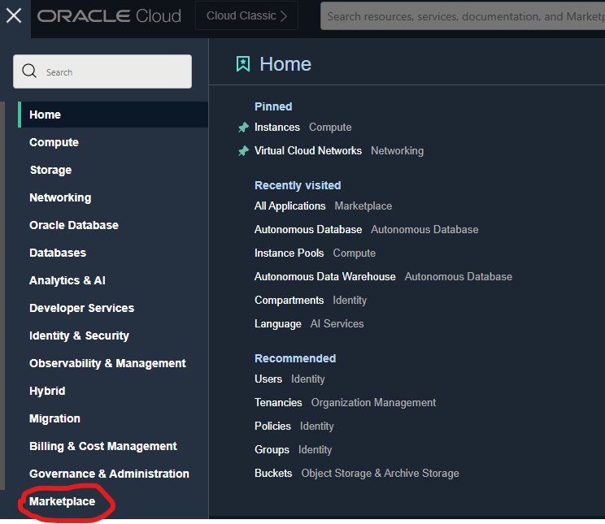

2. On the Marketplace page, click the All Applications option.

3. In the search box type **Informatica**.

4. Click on the **Informatica Intelligent Data Management Cloud** tile

   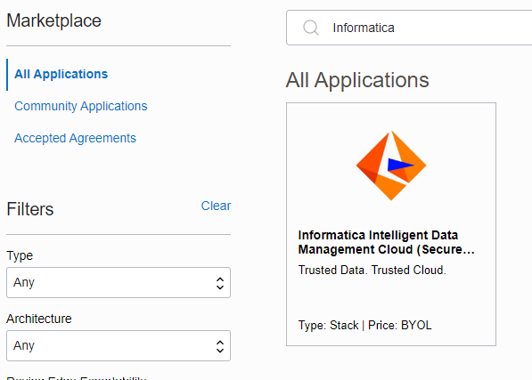

5. Choose the version of choice and **Enter Compartment**  where the VM image is to be created, click **Terms and Conditions ** and then click on **Launch Stack**.

   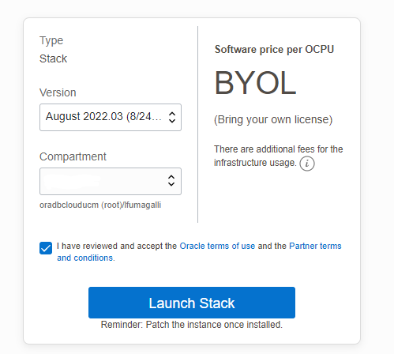

6. In order for the VM to get properly created a stack is used.  For the live lab use the defaults, the compartment should match the one you entered on the previous screen. Once the information is validated click **Next**.

7. On this page you will be entering the variables used in creating the stack.  On your screen the compartment will be filled with the value you entered in the previous step.  If this is the first time creating you can leave the default values.  You will need to hit the drop down in the **Availability Domain** and choose one from the available option.  After choosing your preferred Availability Domain scroll down to enter additional variables.

   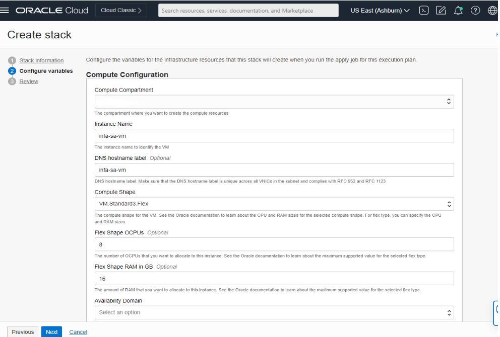

8. One of the prerequisites was to create a Virtual Cloud Network (VCN).  Enter the **Network Compartment** where you created the VCN and choose **Use Existing VCN and Subnet** as your Network Strategy.  For the rest of the required **VCN and Subnet** variables use the drop down to choose from the components of the **VCN** you created.  For this Live Lab the recommendation is to use the Public Subnet for simplicity purposes, if required by your organization a private subnet can be used.  If a **Private Subnet** is used you will need to make sure a Nat Gateway has been enabled and an egress policy for Port 443 created.

   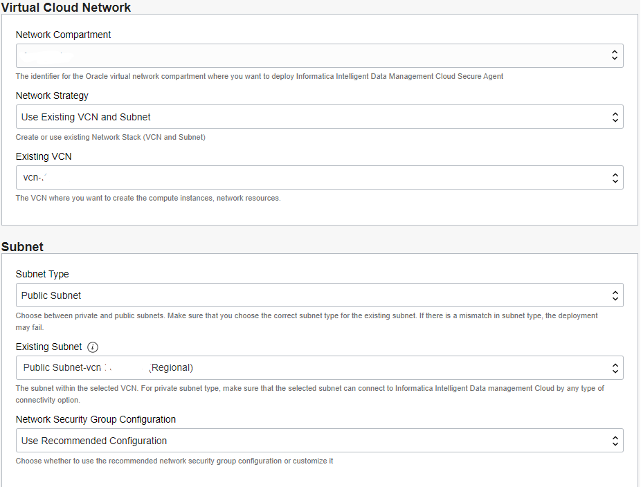

9. The following variable will be gathered from the IDMC credential and the IDMC user interface.  The **IDMC User Name** was given to you when you created your Informatica IDMC instance.  The next image shows you an example of where to get your token form the IDMC user interface.  Once all of your variables are entered click **Next**.

   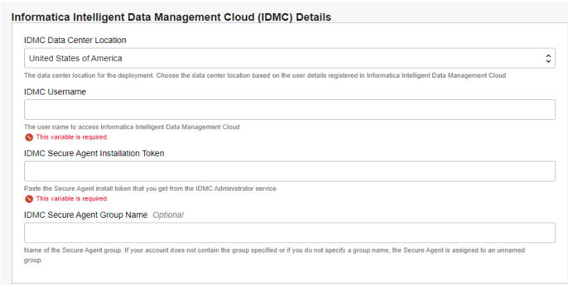

10. To acquire token log into IDMC and choose the **Administrator** tile.  Then choose the **Runtime Environments** option.  In Runtime Environment screen click on the option to **Generate Install Token**.  Copy the token and past in IDMC Secure Agent Installation Variable when building your image in OCI.  The token is valid for 24 hours so you can generate and keep it ready for when you start your install.

    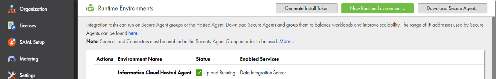

11. Review your variables and make sure everything looks complete.  Then click **Create**.

    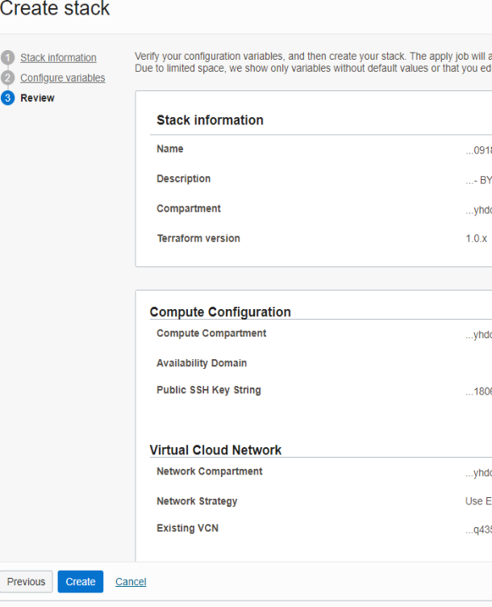

12. After you click create you will be taken to the **Resource Manager** screen where you can monitor the progress of the Secure Agent Compute Instance build.

    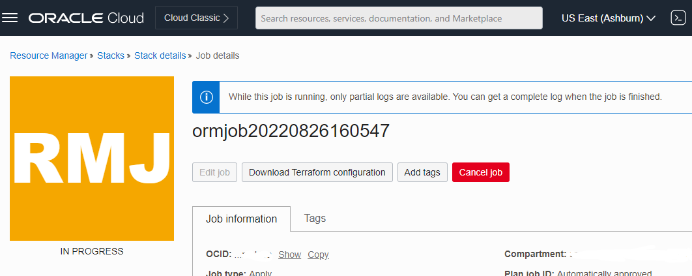

13. When the process completes successfully you will see an image similar to below.  If an error is encountered review the available logs correct the issue and rerun.

    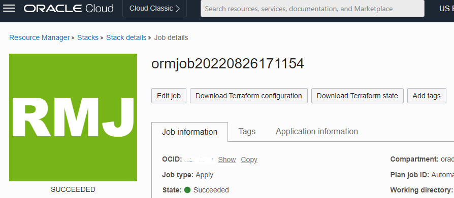

14. If successful you should be able to view the new instance in the Compute Instances screen in the OCI Console.  If your **Secure Agent** registered correctly it should be visible in the **Runtime Environments** section of the IDMC Console.  If your secure agent did not register, please proceed to the third task (Due to POD locations this is a possible occurrence) .   If your secure agent did register correctly please proceed to the next task which is configuring a Wallet file. 


## Task 2: Configuring an Oracle ADB Wallet file on the Secure Agent

In this task we will perform steps to configure an ADB wallet file on the Secure Agent VM.

1. Log into your Oracle ADB Console UI and download the Wallet file.  Please note the password you used when you downloaded the file as this will be used in a future Lab when you are setting up your connections.  The Wallet file can be found under the DB Connection selection.

   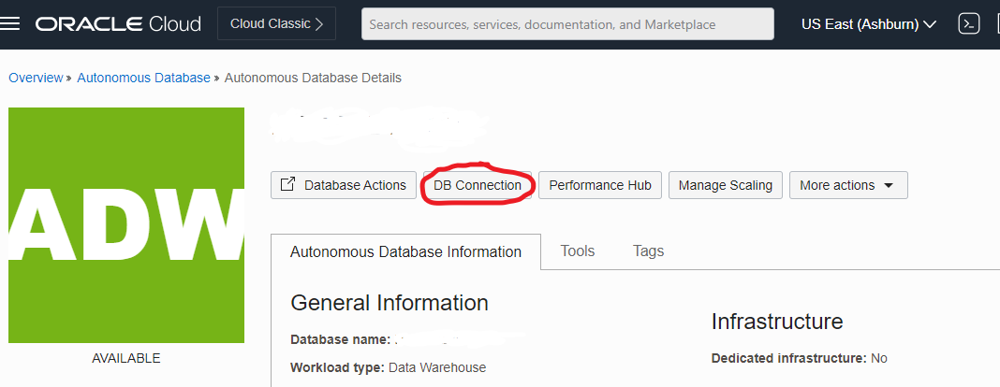

2. Log on to the Compute Instance you created to house the Secure Agent.  If you don't know how to access your Compute Instance please click on the **Accessing a Compute Instance** link in the **Learn More** section of this module.

3. Once you log on to the Compute Instance make a directory where **WalletName** is the name of the Wallet File you downloaded without the .Filetype.

    ```
    <copy>
    mkdir /home/opc/oracle/WalletName
    </copy>
    ```

4. Use your favorite tool to copy the downloaded Wallet File to the directory you just created on the Secure Agent Instance.


5. unzip the file

    ```
    <copy>
    unzip WalletName.zip
    </copy>
    ```

6. Edit the sqlnet.ora file using your favorite Linux editor and update the directory path to match the path of the directory where your Wallet file exists.  Below is an example using nano.

   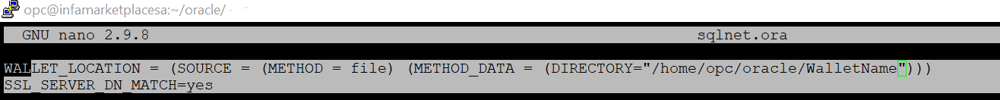

7. Save the file.

8. Note the directory path where the Wallet file is stored as you will need when creating a connection to ADB in IDMC.


This completes lab you may now proceed to the the next lab.

## Task 3: When Secure Agent does not register with Informatica IDMC

In this step we will perform steps to set up the Oracle ADB Wallet file.

1. Log on to the Compute Instance you created to house the Secure Agent.  If you don't know how to access your Compute Instance please click on the **Accessing a Compute Instance** link in the **Learn More** section of this module.

2. Once you log on to the Compute Instance change your directory to the following:

    ```
    <copy>
    cd /opt/infaagent/apps/agentcore/conf
    </copy>
    ```

3. Display the outputs of the infaagent.ini file.

    ```
    <copy>
    cat infaagent.ini
    </copy>
    ```


5. If the **InfaAgent.MasterUrl** does not match the URL you use to logon to IDMC you will need to change the **InfaAgent.MasterUrl**.  For example you may see something similar when you view the results of the infaagent.ini 

   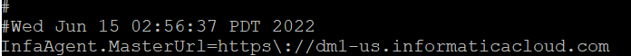

6. The URL you use to logon to IDMC may be https://dm-us.informaticacloud.com/identity-service/home

7. If this is the case you will need to update the **infaagent.ini** file to reflect the correct URL using your favorite Linux editor.

8. Once the infaagent.ini file is updated you will need to stop the agent. to do this you will need to change your directory to:

    ```
    <copy>
    cd /opt/infaagent/apps/agentcore/
    </copy>
    ```

9. Then stop the agent

    ```
    <copy>
    ./infaagent shutdown
    </copy>
    ```

   Wait about 5 minutes for the agent to completely shutdown

10. The next step is to restart the agent

    ```
    <copy>
    ./infaagent startup
    </copy>
    ```

11. In the final step you will need to manually register the Secure Agent using the following command and format.

    ```
    <copy>
    ./consoleAgentManager.sh configureToken IDMC-User-Name Generated-Install-Token
    </copy>
    ```

    For more information on manually registering your token please refer to the **Registering a Secure Agent** link below.

12. You can now go back to the IDMC **Runtime Environments** user interface to ensure your Secure Agent has registered correctly.

This Lab is now complete you can now go to the next lab.

## Learn More

* [Creating an ADB Instance](https://oracle-livelabs.github.io/adb/shared/adb-quickstart-workshop/freetier/?lab=adb-provision-conditional)
* [Creating a VCN in OCI](https://github.com/enabling-cloud/oci-learning/blob/master/manual/CreatingVCN.md)
* [Registering a Secure Agent](https://knowledge.informatica.com/s/article/573195?language=en_US)
* [Secure Agent Documentation](https://knowledge.informatica.com/s/article/573195?language=en_US)
* [Accessing a Compute Instance](https://docs.oracle.com/en-us/iaas/Content/Compute/Tasks/accessinginstance.htm)
* [Oracle ADB Wallet File](https://docs.oracle.com/en/cloud/paas/autonomous-data-warehouse-cloud/cswgs/autonomous-connect-download-credentials.html#GUID-B06202D2-0597-41AA-9481-3B174F75D4B1)

## Acknowledgements

* **Author** - Larry Fumagalli,  Outbound Product Management
* **Last Updated By/Date** - Larry Fumagalli, Outbound Product Management, March 2023
