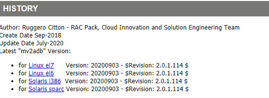
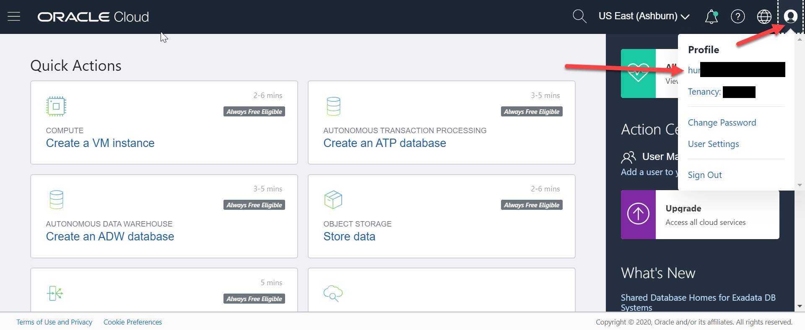
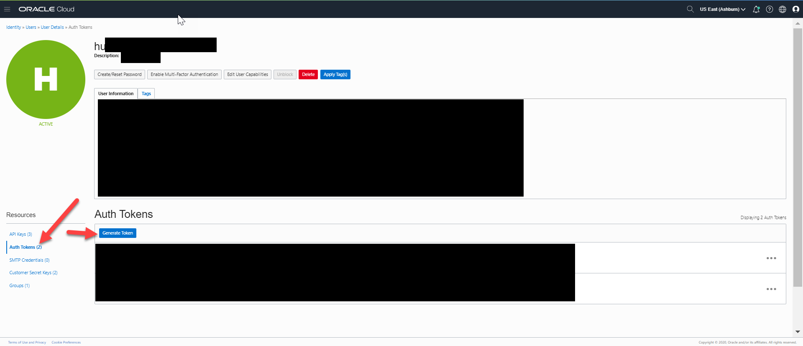
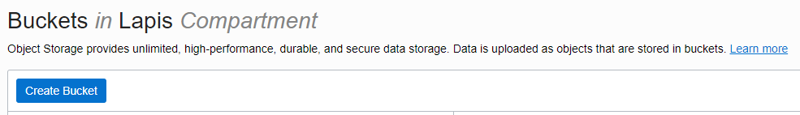
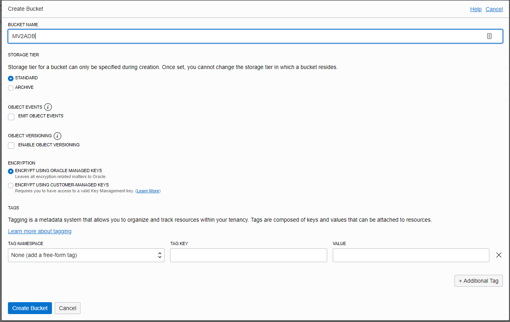

# MV2ADB Pre-requisites and Installation 

## Introduction

This lab walks you through the steps to download and install MV2ADB and also completing the pre-requisites to run one-click MV2ADB migration for ADB-S

Estimated Time: 10 minutes

### Objectives

In this lab, you will:
* Download and install MV2ADB on PeopleSoft on-premise system
* Generate an OCI Auth Token
* Creating an OCI Bucket

### Prerequisites
* My Oracle Support (MOS) credentials. Please make sure that you can successfully login to [Oracle Support](https://support.oracle.com). 
* OCI CLI to be installed on the on-premise PeopleSoft database system,refer to link [here](https://docs.oracle.com/en-us/iaas/Content/API/SDKDocs/cliinstall.htm) for installing and configuration

* Root user access on the on-premise PeopleSoft system


## Task 1: Download and install MV2ADB  on PeopleSoft on-premise system

1. On the PeopleSoft  machine, download the MV2ADB rpm file [here](https://support.oracle.com/epmos/faces/DocContentDisplay?_afrLoop=291097898074822&id=2463574.1&_afrWindowMode=0&_adf.ctrl-state=v0102jx12_4). Platform specific rpm can be downloaded under the History Tab.

    

2. Login as root and place the MV2ADB rpm file on /tmp path and install the rpm

      ```
     <copy>[root@pscs92dmo-lnxdb-2 tmp]# rpm -i mv2adb-2.0.1-114.el7.x86_64.rpm
     warning: mv2adb-2.0.1-114.el7.x86_64.rpm: Header V4 RSA/SHA1 Signature, key ID 939112d6: NOKEY
     mv2adb-2.0.1.114 binary has been installed on /opt/mv2adb successfully! </copy>
      ```


## Task 2: Generate an OCI Auth Token

1. Click on your **Profile** in the top right, and then click your **Username**.

  

2. Click on **Auth Token**, and click **Generate**.

  
  *Note: Copy your Auth Token to a notepad, as you cannot see it once you close the window.*

  

## Task 3: Creating an OCI Bucket on Object Storage

1.  Click on the **Menu** in top left and select **Storage** > **Buckets**.

  

2. Verify you are in the correct **Compartment** and click **Create Bucket**.

  

3. Enter a **Name** for your bucket, then hit **Create Bucket** again.

  
  *Take note of your region, bucket name, and tenancy name for later.*

You may now **proceed to the next lab.**

## Acknowledgements
* **Authors** - Deepak Kumar M, PeopleSoft Architect
* **Contributors** - Deepak Kumar M, PeopleSoft Architect
* **Last Updated By/Date** - Deepak Kumar M, PeopleSoft Architect, Aug 2021