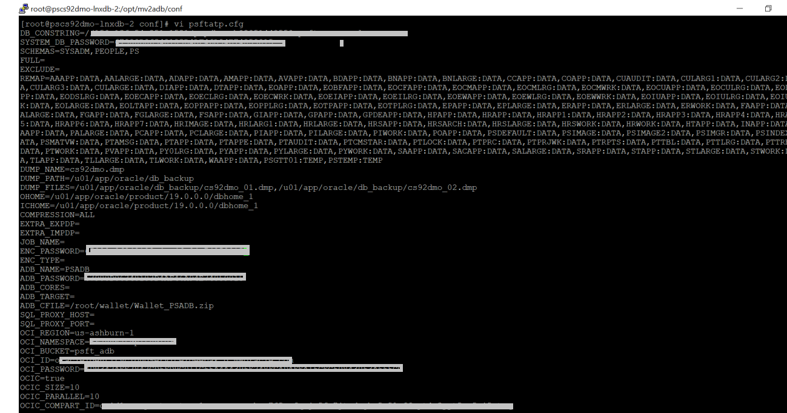
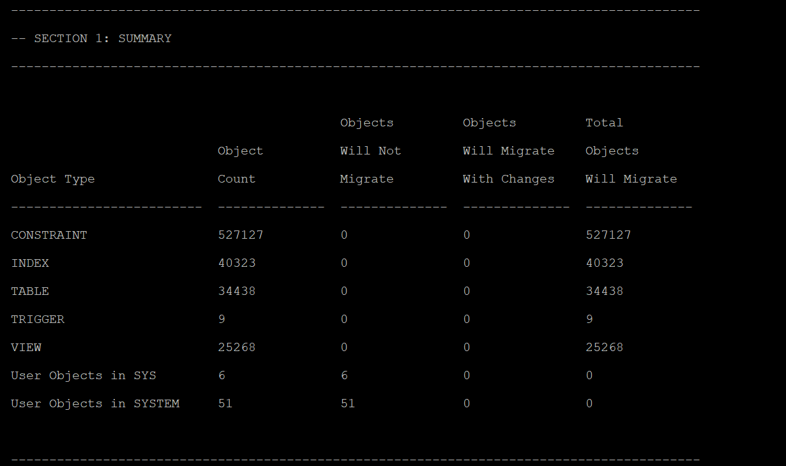

#  MV2ADB Configuration and ADB Schema Advisor Installation

## Introduction
This lab walks you through the steps of configuring MV2ADB for database migration and also installing ADB Schema Advisor before performing the migration to Oracle ADB-S.

Estimated Time: 10 minutes

### Objectives

In this lab, you will:
* Configuring MV2ADB for one click PeopleSoft database migration to ADB-S
* Installing and running ADB Schema Advisor


### Prerequisites
* My Oracle Support (MOS) credentials. Please make sure that you can successfully login to [Oracle Support](https://support.oracle.com).

* Root user access on the on-premise PeopleSoft system

## Task 1: Configuring MV2ADB for one click PeopleSoft database migration to ADB-S

1. Encrypt the following passwords using the “mv2adb encpass” command, and save the values to a safe location (Eg: Notepad). Run the command for each password you would like to encrypt.

    * PeopleSoft on-premise database SYS password.

    * ADMIN password of the Target ADB-S database.

    * Auth Token.

        ```
        <copy>cd /opt/mv2adb
        [root@pscs92dmo-lnxdb-2 mv2adb]# ./mv2adb.bin encpass
        Please enter the password :
        Please re-enter the password :
        67980D06348183D4AF46A94E74859015
        [root@pscs92dmo-lnxdb-2 mv2adb]# </copy>
        ```
     * Create a directory on source database for the dump files to be placed during the mv2adb operation.

        ```
      <copy>oracle@pscs92dmo-lnxdb-2 oracle]$ pwd
      /u01/app/oracle
      [oracle@pscs92dmo-lnxdb-2 oracle]$ mkdir db_backup
      [oracle@pscs92dmo-lnxdb-2 oracle]$ ls -ltr db_backup/
      total 0 </copy>
        ```
     * Edit the configuration file under /opt/mv2adb/conf/ or add a new one with syntax “name.cfg”.A configuration file with name psftatp.cfg has been created and the file is edited with only the required fields for the one click MV2ADB run. Sample configuration file is posted  below for reference.The tablespaces filtered out earlier in **Lab 5 : Getting Tablespace information from On-premise PeopleSoft database** are remapped in the MV2ADB configuration file

     
     

## Task 2: Installing and running ADB Schema Advisor

The Advisor discovers the schema objects and performs deep analysis to highlight if any differences exist when the object gets created on Oracle Autonomous Data Warehouse or Oracle Autonomous Transaction Processing database.

1. Download ADB schema advisor from this link [here](https://support.oracle.com/epmos/faces/DocumentDisplay?id=2462677.1) and run the sql script using below command, a new schema created for this advisor on the source DB system.
   
     ```
     <copy>sqlplus SYS AS SYSDBA @install_adb_advisor.sql <Advisor Schema> <Password> </copy>

     ```
2. Run ADB Advisor using the below command
    
     ```
     <copy>[root@pscs92dmo-lnxdb-2 opt]# cd /opt/mv2adb
     [root@pscs92dmo-lnxdb-2 mv2adb]# ls -ltr
     total 20844
     -rwxr-xr-x 1 root root 21338808 Sep 3 2020 mv2adb.bin
     drwxr-xr-x 2 root root 4096 Apr 22 07:45 conf
     [root@pscs92dmo-lnxdb-2 mv2adb]# ./mv2adb.bin advisor -conf conf/psftatp.cfg </copy>
     ```

3. Analyze the output and count of objects from the ADB Advisor job. After a successful run, output of the job will be available under ‘/opt/mv2adb/out/log’ folder

    


You may now **proceed to the next lab.**

## Acknowledgements
* **Authors** - Deepak Kumar M, PeopleSoft Architect
* **Contributors** - Deepak Kumar M, PeopleSoft Architect
* **Last Updated By/Date** - Deepak Kumar M, PeopleSoft Architect, Aug 2021