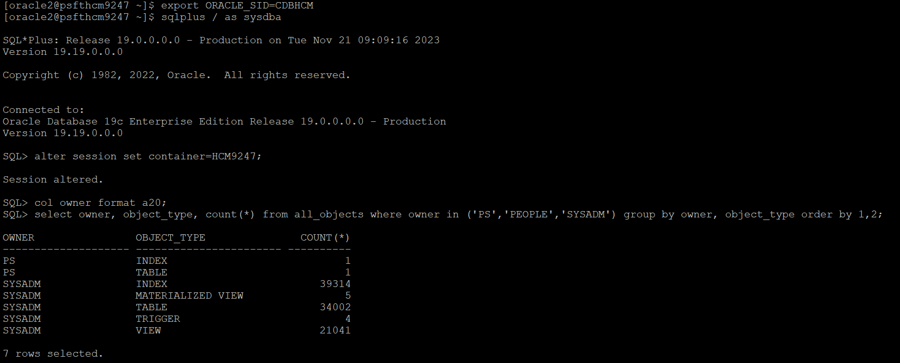
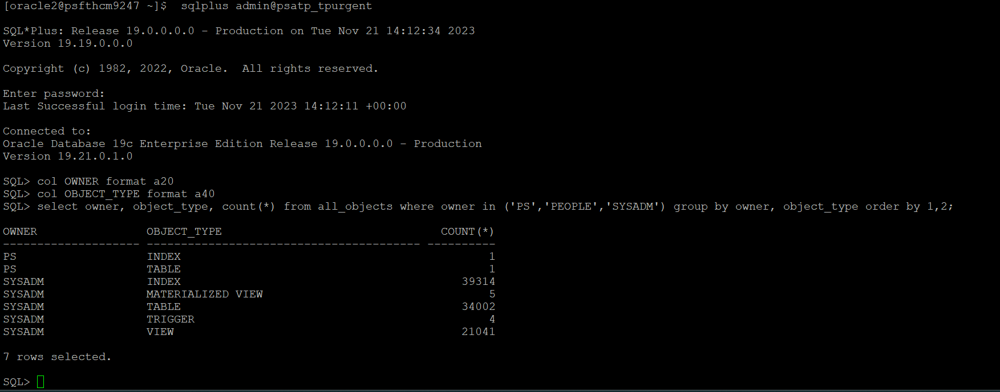

# Validating PeopleSoft Schema Objects on ADB-S

## Introduction

This lab walks you through the steps to validate PeopleSoft schema objects on ADB-S

Estimated Time: 5 minutes


### Objectives

In this lab, you will:

* Validate PeopleSoft schema objects after ZDM job successful completion

### Prerequisites


* Oracle user login access and SQL access on the on-premises PeopleSoft database system
* SQL Access using ADMIN user on the PeopleSoft ADB-S database.


## Task 1: Source On-Premises PeopleSoft schema objects count


1. Login as Oracle2 user and connect to the sqlplus prompt by entering the below SQL command

    ```
    <copy>[oracle2@psfthcm9247 ~]$ export ORACLE_SID=CDBHCM
    [oracle2@psfthcm9247 ~]$ sqlplus / as sysdba
    SQL*Plus: Release 19.0.0.0.0 - Production on Tue Nov 21 09:09:16 2023
    Version 19.19.0.0.0

    Copyright (c) 1982, 2022, Oracle.  All rights reserved.

    Connected to:
    Oracle Database 19c Enterprise Edition Release 19.0.0.0.0 - Production
    Version 19.19.0.0.0

    SQL> alter session set container=HCM9247;

    Session altered.


    SQL> col owner format a20;
    SQL> select owner, object_type, count(*) from all_objects where owner in ('PS','PEOPLE','SYSADM') group by owner, object_type order by 1,2; </copy>

    ```

    Output of the above command from on-premises PeopleSoft database is below

    


## Task 2: Target PeopleSoft schema objects count on ADB-S

1. Login as oracle2 user to the source PeopleSoft database system and connect to the ADB-S database and execute the below SQL commands to verify the count of PeopleSoft schema objects

    ```
    <copy>[oracle2@psfthcm9247 ~]$ sqlplus admin@psatp_tpurgent

    SQL*Plus: Release 19.0.0.0.0 - Production on Tue Nov 21 09:13:53 2023
    Version 19.19.0.0.0
    Copyright (c) 1982, 2022, Oracle. All rights reserved.
    Enter password:
    Last Successful login time: Tue Nov 21 2023 09:11:06 +00:00

    Connected to:
    Oracle Database 19c Enterprise Edition Release 19.0.0.0.0 - Production
    Version 19.21.0.1.0


        
    SQL> col owner format a20;
    SQL> select owner, object_type, count(*) from all_objects where owner in ('PS','PEOPLE','SYSADM') group by owner, object_type order by 1,2; </copy>

    ```
    Output of the above command from an ADB-S PeopleSoft database is below

    


You may now **proceed to the next lab.**


## Acknowledgements
* **Authors** - Deepak Kumar M, Principal Cloud Architect
* **Contributors** - Deepak Kumar M, Principal Cloud Architect
* **Last Updated By/Date** - Deepak Kumar M, Principal Cloud Architect, December 2023

