# PeopleSoft Middle Tier Setup & Configuration and Test PeopleSoft login in OCI

## Introduction

This lab walks you through the process of setting up a Middle Tier environment for PeopleSoft on OCI compute system and later login and test the application.

Estimated Time: 3 hours

### Objectives

In this lab, you will:
* Create an OCI compute system for the PeopleSoft Middle Tier setup
* Transfer files from on-premise PeopleSoft system to the OCI compute system
* Install Oracle client 19c on the OCI compute system
* Test connectivity from OCI compute system to ADB-S
* Configure PeopleSoft Application domains
* Configure PeopleSoft Integration Broker and Report Node
* Login and Test the PeopleSoft system on OCI

### Prerequisites
* PeopleSoft Administration Skills to configure and setup PeopleSoft Middle Tier servers
* PeopleSoft Domain creation and administration link [here](https://docs.oracle.com/cd/F44947_01/pt858pbr3/eng/pt/tsvt/task_UsingthePSADMINCommand-LineInterface-c07e70.html#u860b7ad8-927c-4b9d-af50-ec0d59cb2ff3)
* PeopleSoft Integration setup link [here](https://docs.oracle.com/cd/F44947_01/pt858pbr3/eng/pt/tiba/task_DefiningIntegrationGatewaysandLoadingConnectors-947f5e.html?pli=ul_d76e34_tiba)
* PeopleSoft Report Node setup link [here](https://docs.oracle.com/cd/E92519_02/pt856pbr3/eng/pt/tprs/task_DefiningReportNodes-dc07e7.html?pli=ul_d56e97_tprs)
* Basic Unix skills to scp/transfer files between two linux systems
* A user with 'manage' access to Networking and Compute, compartment  access in OCI
* OCI Compute system created on OCI and a block volume attached to it.
* ADB wallet to be downloaded to the OCI compute system for PeopleSoft
* Root access on the newly created OCI compute system
* The following should be installed:
    * A different web browser (i.e. Chrome) to connect to OCI web console. 
    * If you have a windows machine, please download:
        * Git Bash [https://git-scm.com/download/win](https://git-scm.com/download/win)
        * Putty [https://www.chiark.greenend.org.uk/~sgtatham/putty/latest.html](https://www.chiark.greenend.org.uk/~sgtatham/putty/latest.html). In the Package Files section, click on an installer depending on 32/64 bits.


## Task 1: Create an OCI compute system for the PeopleSoft Middle Tier setup

* There are a number of ways to setup the Middle-Tier system for PeopleSoft, using PUM DPK images downloaded and installed on the target system or doing a Tar of the source Mid-Tier and moving off to target system.

*  Here we would be doing a tar of the source PeopleSoft application binary files and moving to a new OCI compute system.

* As an example, provision a new compute system on OCI for the Middle-Tier and attach a block volume.
    
    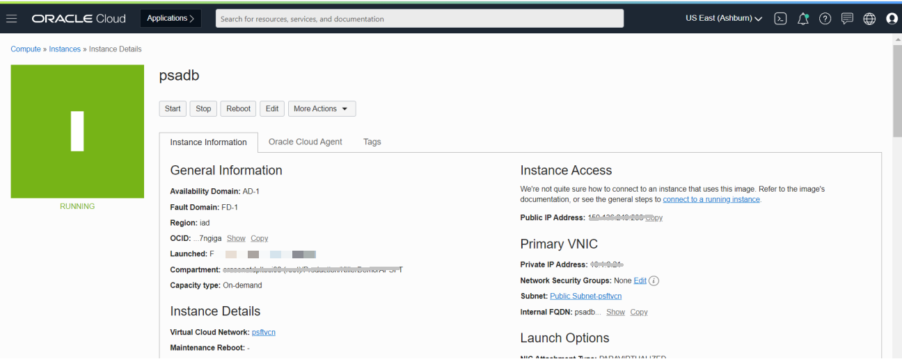

## Task 2: Transfer files from on-premise PeopleSoft system to the OCI compute system

1. Login as opc and sudo as root to the OCI compute system and create users,groups and directory for PeopleSoft similar to the on-premise PeopleSoft system
    
    Create users, groups, directories
    ```
    <copy>[opc@psadb home]$ sudo su -
    [root@psadb etc]# groupadd -g 30004 oinstall
    [root@psadb etc]# groupadd -g 30002 psft
    [root@psadb etc]# groupadd -g 30003 appinst
    [root@psadb etc]# groupadd -g 30005 dba
    [root@psadb etc]# useradd -u 20002 -g oinstall -G oinstall,psft psadm1
    [root@psadb etc]# useradd -u 20003 -g oinstall -G oinstall,psft psadm2
    [root@psadb etc]# useradd -u 20004 -g appinstall -G appinst,psft psadm3
    [root@psadb etc]# useradd -u 20005 -g oinstall -G oinstall,dba oracle2
    [opc@psadb home]$ ls -ltr
    total 20
    drwxr-xr-x. 2 esadm1 oinstall 4096 Apr 7 16:05 esadm1
    drwxr-xr-x. 5 psadm1 oinstall 4096 Apr 14 11:59 psadm1
    drwxr-xr-x. 5 psadm3 appinst 4096 Apr 14 11:59 psadm3
    drwxr-xr-x. 3 oracle2 oinstall 4096 Apr 14 11:59 oracle2
    drwxr-xr-x. 8 psadm2 oinstall 4096 Apr 14 12:11 psadm2
    </copy>

    ```  
    Files Tar and transfer from on-premise PeopleSoft system to OCI compute system
    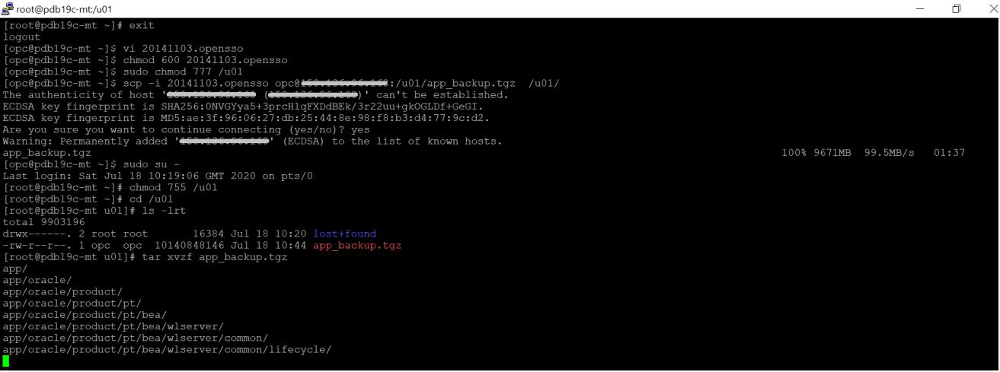

2. Update the $HOME for PeopleSoft users to be in compatible to source.

    ```
    <copy>[root@psadb pt]# ls -ltr
    total 24
    drwxr-xr-x. 8 psadm1 oinstall 4096 Sep 16 2020 jdk
    drwxr-xr-x. 11 psadm3 appinst 4096 Apr 8 05:51 ps_app_home
    drwxr-xr-x. 29 psadm1 oinstall 4096 Apr 9 16:27 ps_home
    drwxr-xr-x. 5 oracle2 oinstall 4096 Apr 9 16:29 oracle-client
    drwxr-xr-x. 2 root root 4096 Apr 9 16:35 tools_client
    drwxrwxr-x. 10 psadm1 oinstall 4096 Apr 14 12:01 bea
    [root@psadb pt]#
    </copy>
    ```


## Task 3: Install Oracle client 19c on the OCI compute system


1. Run as the root user to install all 3 packages in the given order:
     
      Basic Package (ZIP)
     
      SQL Plus Package (ZIP)

      Tools Package (ZIP)
     ```
     <copy>[root@psadb ~]#  yum install oracle-instantclient19.10-basic-19.10.0.0.0-1.x86_64.rpm –y
     [root@psadb ~]#  yum install oracle-instantclient19.10-sqlplus-19.10.0.0.0-1.x86_64.rpm -y
     [root@psadb ~]#  yum install oracle-instantclient19.10-tools-19.10.0.0.0-1.x86_64.rpm –y
     </copy>
     ```
2. Update the environment variables on the OCI compute system

  Update the TNS\_ADMIN and ORACLE_HOME environment variables for PeopleSoft and Oracle Database users such as oracle2, psadm1, psadm2 and psadm3 for this environment. This is needed to indicate the right version of Oracle Client to establish the connectivity from ADB-S:
 
 **For TNS Path**

  export TNS\_ADMIN=/u01/app/oracle/product/db
 
 **For ORACLE_HOME for Oracle Client**

  export ORACLE\_HOME=/usr/lib/oracle/19.10/client64

## Task 4: Test connectivity from OCI compute system to ADB-S

1. Download the ADB wallet to the OCI PeopleSoft  Middle-Tier compute system and configure the TNS entries to reflect the change and test the connectivity.

    ```
    <copy>[oracle2@psadb ~]$ tnsping psatp_tpurgent
    TNS Ping Utility for Linux: Version 19.0.0.0.0 - Production on 21-NOV-2023 09:34:15
    Copyright (c) 1997, 2023, Oracle. All rights reserved.
    Used parameter files:
    /u01/app/oracle/product/db/sqlnet.ora
    Used TNSNAMES adapter to resolve the alias
    Attempting to contact (description= (retry_count=20)(retry_delay=3)(address=(protocol=tcps)(port=XXX)(host=XXXXXXX))(connect_data=(service_name=XXXXX))(security=(ssl_server_cert_dn_match=yes)))
    OK (30 msec)

    </copy>
    ```
2. Connecting and testing with ADMIN user and PeopleSoft schema SYSADM user

    ```
    <copy>[oracle2@psadb ~]$ [oracle2@psfthcm9247 ~]$ sqlplus admin@psatp_tpurgent
    SQL*Plus: Release 19.0.0.0.0 - Production on Tue Nov 21 09:13:53 2023
    Version 19.19.0.0.0
    Copyright (c) 1982, 2022, Oracle.  All rights reserved.
    Enter password:
    Last Successful login time: Tue Nov 21 2023 09:11:06 +00:00
    Connected to:
    Oracle Database 19c Enterprise Edition Release 19.0.0.0.0 - Production
    Version 19.21.0.1.0
    SQL> exit


    [oracle2@psadb ~]$ sqlplus SYSADM@PSADB
    SQL*Plus: Release 12.1.0.2.0 Production on Fri Apr 23 06:55:53 2021
    Copyright (c) 1982, 2014, Oracle. All rights reserved.
    Enter password:
    ERROR:
    ORA-28002: the password will expire within 30 days
    Last Successful login time: Fri Apr 23 2021 06:53:49 +00:00
    Connected to:
    Oracle Database 19c Enterprise Edition Release 19.0.0.0.0 - Production
    SQL>
    </copy>
    ```

## Task 5: Configure PeopleSoft Application domains

1. Configure PeopleSoft Application Server:
  
  Use PSADMIN to configure the Application Server Domain, APPDOM1, and start that.
  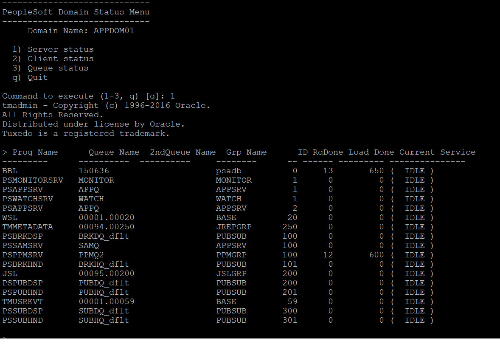

2. Configure Process Scheduler:

  Use PSADMIN to configure the Process Scheduler domain, PRCS01.
  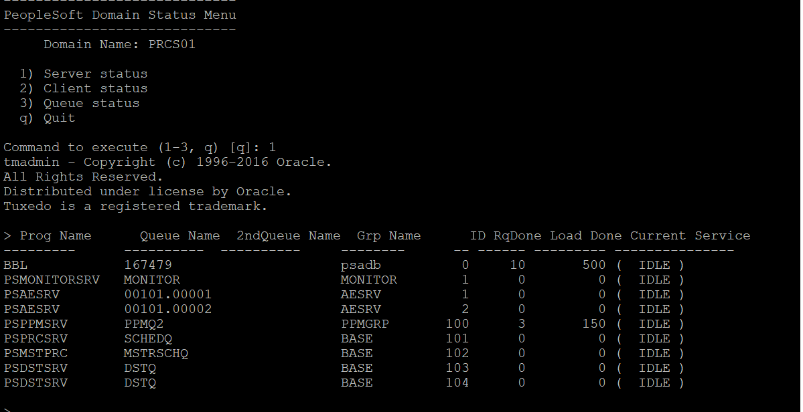

3. Configure Web Server:
  
  Use PSADMIN to configure a new Web Server Domain, WEBSERVER01, and start that.
  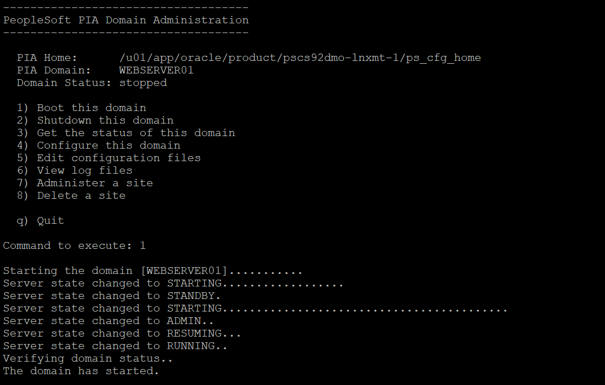


## Task 6: Configure PeopleSoft Integration Broker and Report Node

1. Configure Report Node:
 
  Login to the PeopleSoft PIA portal and configure the Report Node link [here](https://docs.oracle.com/cd/E92519_02/pt856pbr3/eng/pt/tprs/task_DefiningReportNodes-dc07e7.html?pli=ul_d56e97_tprs)

  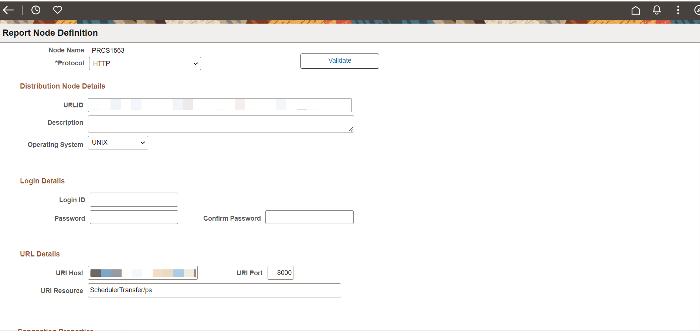

2. Configure Integration Broker 
  
  Login to the PeopleSoft PIA portal and configure the Integration Broker [here](https://docs.oracle.com/cd/F44947_01/pt858pbr3/eng/pt/tiba/task_DefiningIntegrationGatewaysandLoadingConnectors-947f5e.html?pli=ul_d76e34_tiba)

  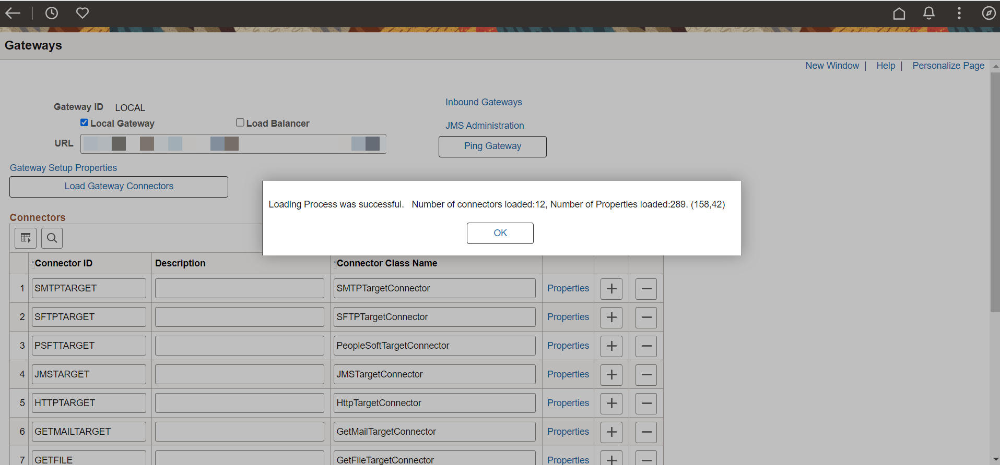

  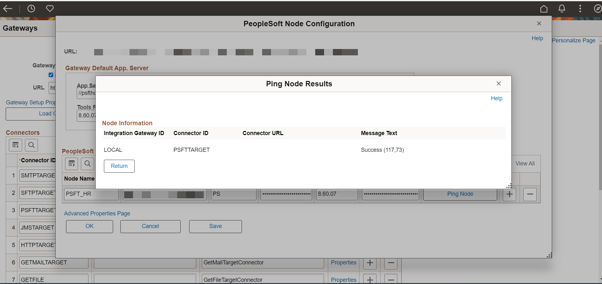

## Task 7: Login and Test the PeopleSoft system on OCI

1. To login to the newly created PeopleSoft system use the system name or IP address and append with port number 8000
  
  For example you would type: 111.111.111.11:8000 into you browser search bar
  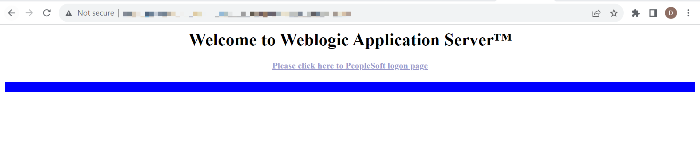

2. Click on the * Please click here to PeopleSoft logon page* and provide the credentials of your  PeopleSoft system to login
  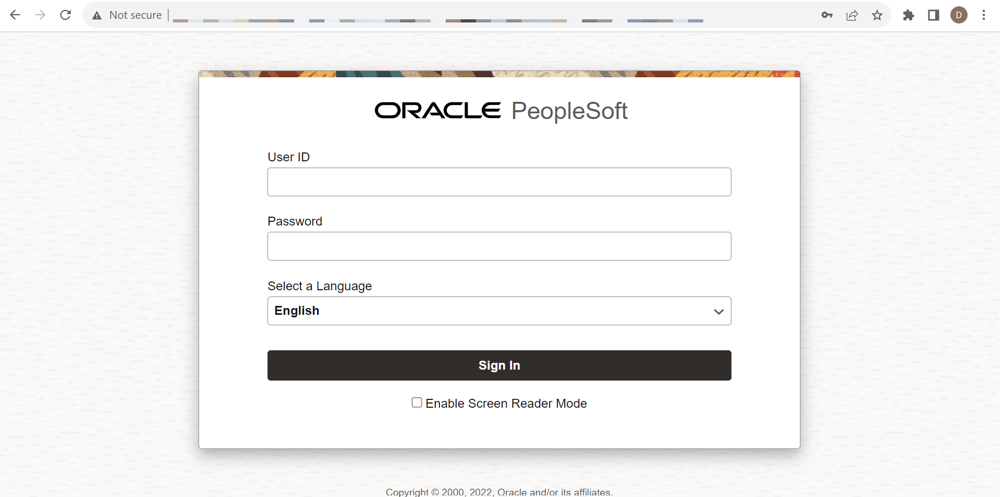

3. Navigate over to the console page and verify if everything is working fine
  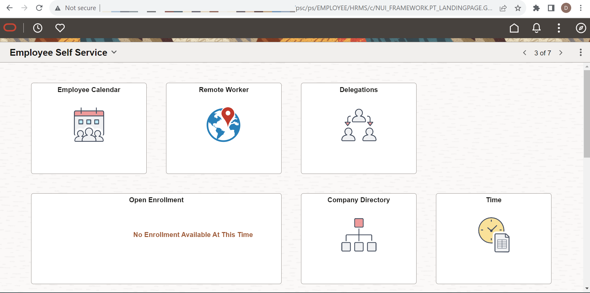


## Acknowledgements
* **Authors** - Deepak Kumar M, Principal Cloud Architect
* **Contributors** - Deepak Kumar M, Principal Cloud Architect
* **Last Updated By/Date** - Deepak Kumar M, Principal Cloud Architect, November 2023


