# Create a new Oracle Autonomous Database

## Introduction
This lab walks you through the steps to provision an Oracle Autonomous Database Serverless on your Oracle Cloud Infrastructure Tenancy

Estimated Time: 5 minutes

### Objectives

In this lab, you will:
* Learn how to provision a new Autonomous Database Serverless.

### Prerequisites

To complete this lab, you need to have the following:
* Logged into your Oracle Cloud Account

## Task 1: Choosing ATP from the Services Menu
1. Login to the Oracle Cloud.
  
2. Once you are logged in, you are taken to the cloud services dashboard where you can see all the services available to you. Click the navigation menu in the upper left to show top level navigation choices.
  Note: You can also directly access your Autonomous Data Warehouse or Autonomous Transaction Processing service in the Quick Actions section of the dashboard.

  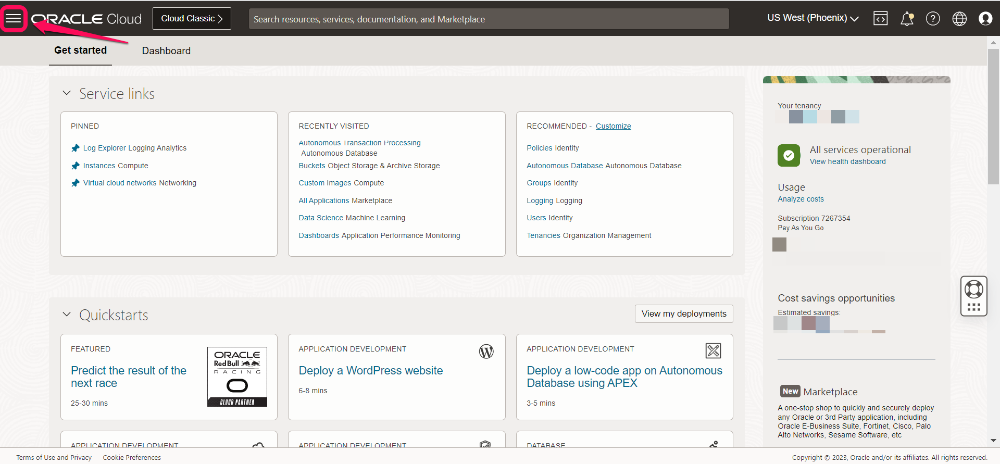
  
3. The following steps apply similarly to either Autonomous Data Warehouse or Autonomous Transaction Processing. This lab shows provisioning of an Autonomous Data Warehouse database, so click Autonomous Transaction Processing.

  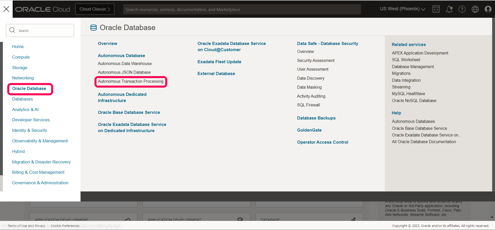

4. The console shows the list of databases created under Autonomous database

 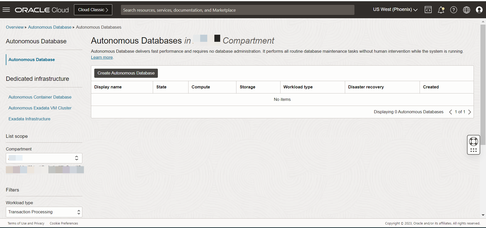

## Task 2: Creating the ADB instance
1. Click Create Autonomous Database to start the instance creation process

  
  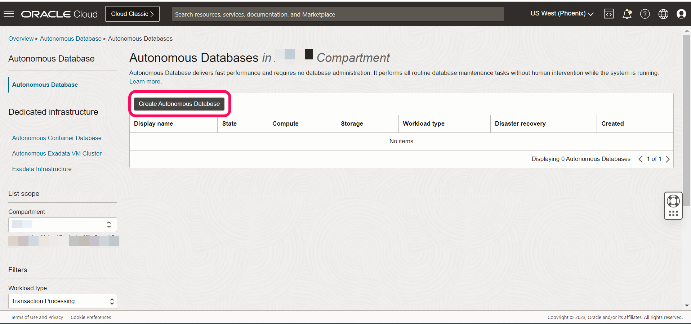

2.	This brings up the Create Autonomous Database screen where you will specify the configuration of the instance. Use credentials specified in the screen for easy reference.

  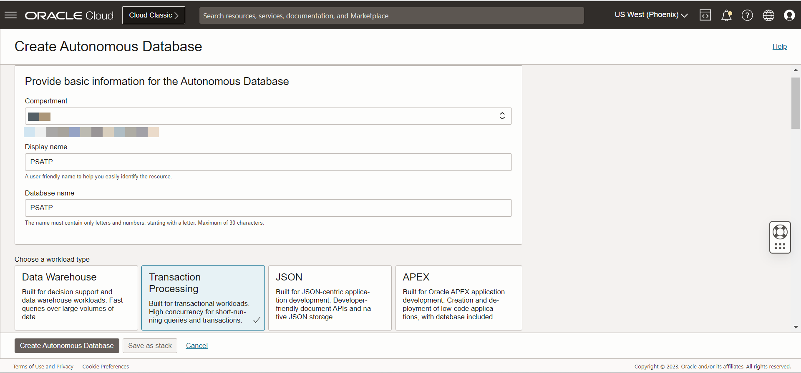
  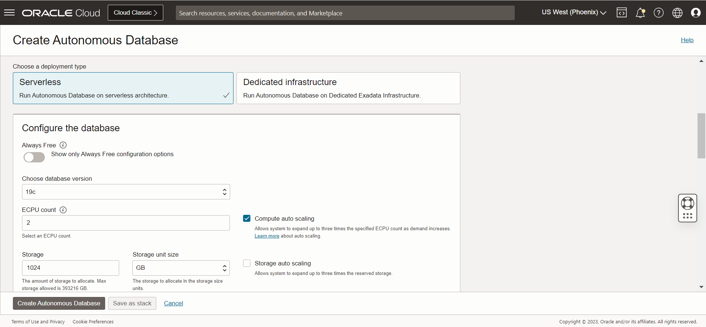
  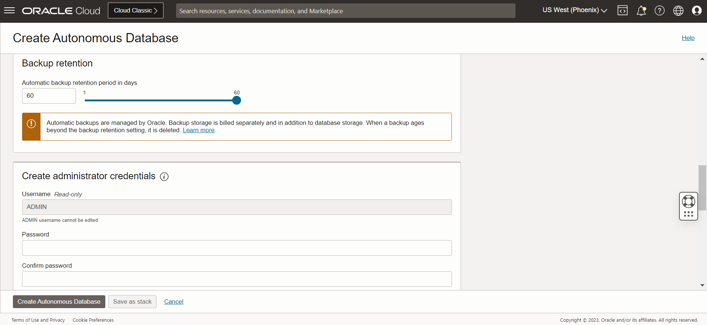

3.	Provide basic information for the autonomous database:
       
       **Choose a compartment** - Leave the default compartment.

       **Display Name** - Enter a memorable name for the database for display purposes. For this lab, use **PSATP**.

       **Database Name** - Use letters and numbers only, starting with a letter. Maximum length is 14 characters. (Underscores not initially supported.) For this lab, use **PSATP**

       **Transaction Processing** - For this lab, choose Transaction Processing as the workload type.

       **Serverless** - For this lab, choose Serverless as the deployment type.

       **Choose database version** - Select a database version from the available versions.

       **ECPU count** - Number of CPUs for your service. For this lab, specify 2 ECPU. If you choose an Always Free database, it comes with 1 CPU.

       **Storage (TB)** - Select your storage capacity in terabytes. For this lab, specify 1 TB of storage. Or, if you choose an Always Free database, it comes with 20 GB of storage.

       **Auto Scaling** - For this lab, autoscaling is enabled by default, to allow the system to automatically use up to three times more CPU and IO resources to meet workload demand.
       
       **Backup** - This is set as 60 days by default.

4. Create administrator credentials:

       * **Password and Confirm Password** - Specify the password for ADMIN user of the service instance. The password must meet the following requirements:

       * The password must be between 12 and 30 characters long and must include at least one uppercase letter, one lowercase letter, and one numeric character.
       * The password cannot contain the username.
       * The password cannot contain the double quote (") character.
       * The password must be different from the last 4 passwords used.
       * The password must not be the same password that is set less than 24 hours ago.
       * Re-enter the password to confirm it. Make a note of this password.
       
        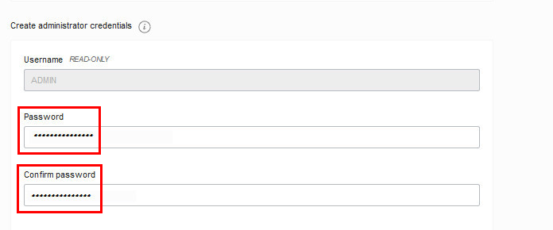

5.	Choose network access:
       * For this lab, accept the default, "Secure access from everywhere".
       * If you want a private endpoint, to allow traffic only from the VCN you specify - where access    to the database from all public IPs or VCNs is blocked, then select "Virtual cloud network" in the Choose network access area.
       * You can control and restrict access to your Autonomous Database by setting network access control lists (ACLs). You can select from 4 IP notation types: IP Address, CIDR Block, Virtual Cloud Network, Virtual Cloud Network OCID).

        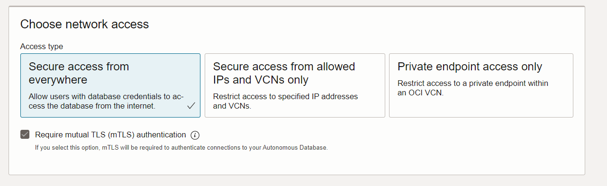

6.	 Choose a license type. For this lab, choose License Included. The two license types are:

       * **Bring Your Own License (BYOL)** - Select this type when your organization has existing database licenses.
       * **License Included** - Select this type when you want to subscribe to new database software licenses and the database cloud service.
         
         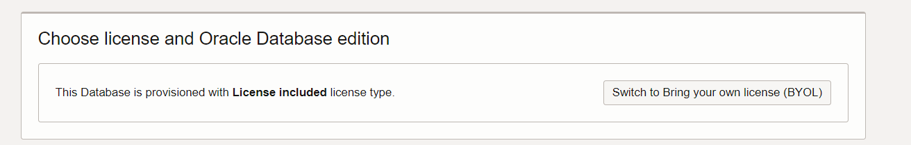

7. Click Create Autonomous Database
    
    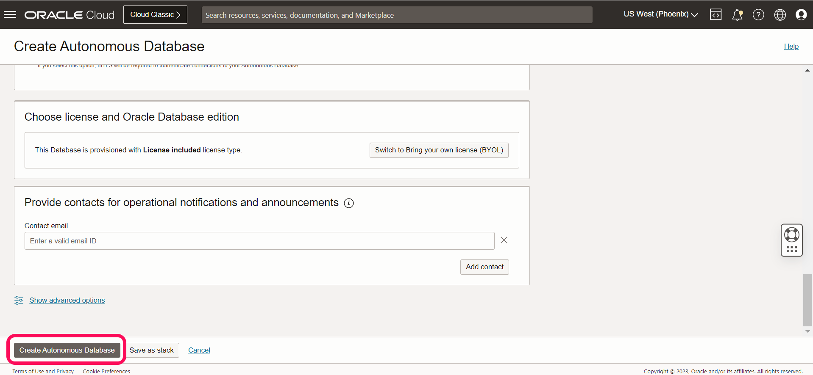

8. Your instance will begin provisioning. In a few minutes, the state will turn from Provisioning to Available. At this point, your Autonomous Transaction Processing database is ready to use! Have a look at your instance's details here including its name, database version, OCPU count, and storage size.
 
    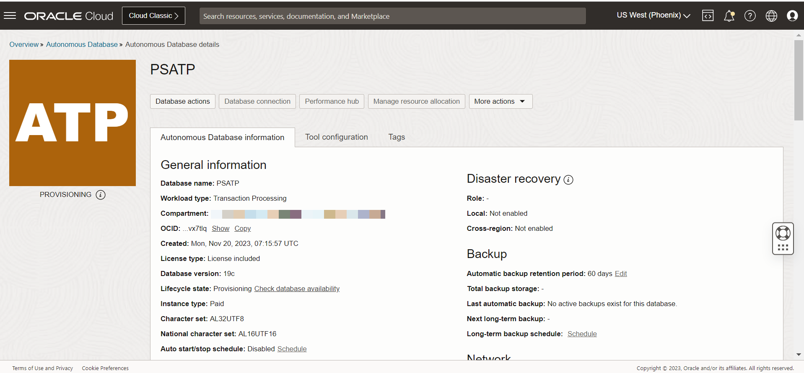

9. The ADB-S database is created and available
    
    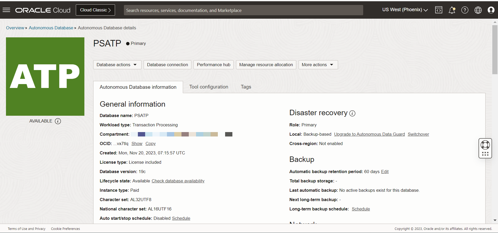

You may now **proceed to the next lab.**

## Acknowledgements
* **Authors** - Deepak Kumar M, Principal Cloud Architect
* **Contributors** - Deepak Kumar M, Principal Cloud Architect
* **Last Updated By/Date** - Deepak Kumar M, Principal Cloud Architect, December 2023
