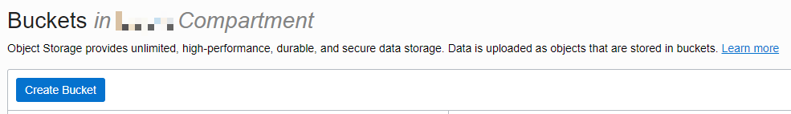

# ZDM Pre-requisites and Installation 

## Introduction

This lab walks you through the steps to download and install ZDM, also completing the pre-requisites to run ZDM migration for ADB-S

Estimated Time: 30 minutes

### Objectives

In this lab, you will:

* Download and install ZDM on PeopleSoft on-premises system
* Creating API keys
* Creating an OCI Bucket

### Prerequisites
* My Oracle Support (MOS) credentials. Please make sure that you can successfully login to [Oracle Support](https://support.oracle.com). 

* OCI CLI to be installed on the on-premises PeopleSoft database system,refer to link [here](https://docs.oracle.com/en-us/iaas/Content/API/SDKDocs/cliinstall.htm) for installing and configuration

* Root user access on the on-premises PeopleSoft system


## Task 1: Download and install ZDM  on PeopleSoft on-premises system

1. On the on-premises PeopleSoft  machine, download the ZDM binaries from [here](https://www.oracle.com/database/technologies/rac/zdm-downloads.html). It will lead to edelivery to download the ZDM software, select Linux as the platform after you login.

    

2. Login as root and place the ZDM zip files on /tmp path.


## Task 2: Configuring the source PeopleSoft host for ZDM installation

1. Creating directories, user and groups before starting the ZDM installation


      ```
<copy>[root@psfthcm9247 ~]# groupadd zdm
[root@psfthcm9247 ~]# useradd zdmuser -g zdm
[root@psfthcm9247 ~]# mkdir -p /home/zdmuser/zdminstall
[root@psfthcm9247 ~]# mkdir /home/zdmuser/zdmhome
[root@psfthcm9247 ~]# mkdir /home/zdmuser/zdmbase
[root@psfthcm9247 ~]# chown -R zdmuser:zdm /home/zdmuser/
</copy>

      ```

2. Install the YUM packages required for ZDM configuration

      ```
<copy>Install YUM packages for ZDM
yum -y install glibc-devel 
yum -y install expect 
yum -y install unzip 
yum -y install libaio 
yum -y install ncurses-compat-libs
yum -y install python36-oci-cli
</copy>
      ```


## Task 3: Installing the ZDM software

1. Login as root and copy the ZDM binary zip file from /tmp to /home/zdmuser/zdminstall

      ```
<copy>[root@psfthcm9247 opc]# cp V1037236-01.zip  /home/zdmuser/zdminstall/
[root@psfthcm9247 opc]# cd /home/zdmuser/zdminstall/
[root@psfthcm9247 zdminstall]# unzip V1037236-01.zip
Archive:  V1037236-01.zip
   creating: zdm21.4.1/
  inflating: zdm21.4.1/README
  inflating: zdm21.4.1/schema_operations.sh
  inflating: zdm21.4.1/CredentialsDriver.class
 extracting: zdm21.4.1/zdm_home.zip
   creating: zdm21.4.1/rhp/
 extracting: zdm21.4.1/rhp/zdm.build
  inflating: zdm21.4.1/zdminstall.sh
[root@psfthcm9247 zdminstall]# chown -R zdmuser:zdm /home/zdmuser/zdminstall/
</copy>
      ```


2. Login as ZDM user and setup the ZDM bash profile

      ```

     <copy>echo "ORACLE_HOME=/home/zdmuser/zdmhome; export ORACLE_HOME" >> ~/.bashrc
     echo "ORACLE_BASE=/home/zdmuser/zdmbase; export ORACLE_BASE" >> ~/.bashrc
     echo "ZDM_BASE=\$ORACLE_BASE; export ZDM_BASE" >> ~/.bashrc
     echo "ZDM_HOME=/home/zdmuser/zdmhome; export ZDM_HOME" >> ~/.bashrc
     echo "ZDM_INSTALL_LOC=/home/zdmuser/zdminstall; export ZDM_INSTALL_LOC" >> ~/.bashrc
     </copy>
      ```

3. Installing ZDM software

      ``` 
     <copy>[zdmuser@psfthcm9247 ~]$ cd /home/zdmuser/zdminstall/zdm21.4.1/
     [zdmuser@psfthcm9247 zdm21.4.1]$ ./zdminstall.sh setup oraclehome=$ZDM_HOME oraclebase=$ZDM_BASE ziploc=./zdm_home.zip -zdm
     ZDM kit home: /home/zdmuser/zdminstall/zdm21.4.1
     /home/zdmuser/zdminstall/zdm21.4.1
      ---------------------------------------
     Validating zip file...
     ---------------------------------------
       25  07-31-2023 14:24   rhp/zdm.build
     ---------------------------------------
     Unzipping shiphome to home...
     ---------------------------------------
     Unzipping shiphome...
     Shiphome unzipped successfully..
     ---------------------------------------
     Performing GridHome Software Only Installation 
     ---------------------------------------
     Installation log location: /home/zdmuser/zdmbase/crsdata/psfthcm9247/rhp/logs/runInstaller_1700478021.out
     making dir /home/zdmuser/zdmbase/crsdata/psfthcm9247/rhp/conf
     ---------------------------------------
     Generating Preference file
     ---------------------------------------
     /home/zdmuser/zdmbase/crsdata/psfthcm9247/rhp/conf/rhp.pref
     Using port 8899 for MySQL
     ---------------------------------------
     Generating Root Certificate
     ---------------------------------------
     Cluster root certificate generated successfully.
     ---------------------------------------
     Generating CA CERTS file
     ---------------------------------------
     spawn /home/zdmuser/zdmhome/bin/crskeytoolctl -copycacerts -filestore /home/zdmuser/zdmbase/crsdata/psfthcm9247/security
     Enter JRE cacerts truststore password:
     JRE cacerts copied to file [/home/zdmuser/zdmbase/crsdata/psfthcm9247/security/cacerts].
     ---------------------------------------
     Generating nogi.enabled file
     ---------------------------------------
     nogi.enabled file generated sucessfully
     ---------------------------------------
     Generating standalone_config.properties file
     ---------------------------------------
     Setting base folder permissions
     --------------------------------------- 
     Copying service script to bin folder in Oracle Home
     label_date is: 221207.25
      ---------------------------------------
     Storing to wallet
     ---------------------------------------
     cacerts  crskeytoolctl.log  cwallet.sso  cwallet.sso.lck
     ---------------------------------------
     Generating random password
     ---------------------------------------
     -rw-------. 1 zdmuser zdm 4349 Nov 20 11:00 /home/zdmuser/zdmbase/crsdata/psfthcm9247/security/cwallet.sso
     -rw-------. 1 zdmuser zdm 4349 Nov 20 11:00 /home/zdmuser/zdmbase/crsdata/psfthcm9247/security/cwallet.sso
     ---------------------------------------
     Setting up MySQL...
     ---------------------------------------
     spawn /home/zdmuser/zdmhome/mysql/server/bin/mysqladmin --defaults-file=/home/zdmuser/zdmbase/crsdata/psfthcm9247/rhp/conf/my.cnf -u root -p ping
     ---------------------------------------
     Storing to wallet
     ---------------------------------------
     cacerts  crskeytoolctl.log  cwallet.sso  cwallet.sso.lck
     ---------------------------------------
     Generating random password
     ---------------------------------------
     -rw-------. 1 zdmuser zdm 4461 Nov 20 11:00 /home/zdmuser/zdmbase/crsdata/psfthcm9247/security/cwallet.sso
     -rw-------. 1 zdmuser zdm 4461 Nov 20 11:00 /home/zdmuser/zdmbase/crsdata/psfthcm9247/security/cwallet.sso
     spawn /home/zdmuser/zdmhome/mysql/server/bin/mysql --socket=/home/zdmuser/zdmbase/crsdata/psfthcm9247/rhp/mysql/metadata/mysql.sock -u root
     ---------------------------------------
     Creating MySQL DB and user...
     ---------------------------------------
     spawn /home/zdmuser/zdmhome/mysql/server/bin/mysql --socket=/home/zdmuser/zdmbase/crsdata/psfthcm9247/rhp/mysql/metadata/mysql.sock -u root -p -e CREATE DATABASE IF NOT EXISTS GHSUSER21;
     spawn /home/zdmuser/zdmhome/mysql/server/bin/mysql --socket=/home/zdmuser/zdmbase/crsdata/psfthcm9247/rhp/mysql/metadata/mysql.sock -u root -p
     spawn /home/zdmuser/zdmhome/mysql/server/bin/mysql --socket=/home/zdmuser/zdmbase/crsdata/psfthcm9247/rhp/mysql/metadata/mysql.sock -u root -p -e GRANT ALTER, CREATE, CREATE TEMPORARY TABLES, CREATE VIEW, DELETE, DROP, INDEX, INSERT, LOCK TABLES, REFERENCES, SELECT, SHOW VIEW, UPDATE ON GHSUSER21.* TO 'GHSUSER21'@'localhost';
     current node is active node
     spawn /home/zdmuser/zdmhome/mysql/server/bin/mysqladmin --defaults-file=/home/zdmuser/zdmbase/crsdata/ psfthcm9247/rhp/conf/my.cnf -u root -p shutdown
     ---------------------------------------
     Adding Certs to ZDM
     ---------------------------------------
     ZDM service setup finished successfully...


     </copy>
      ```

5. Starting the ZDM utility

      ```
     <copy>$ZDM_HOME/bin/zdmservice start </copy>

      ```


## Task 4: API Public Key and configuration file setup

1. Login as zdmuser and create API keys

      ```
      <copy>[zdmuser@psfthcm9247 ~]$ mkdir zdmhome/.oci
      [zdmuser@psfthcm9247 ~]$ cd zdmhome/.oci
      [zdmuser@psfthcm9247 .oci]$ openssl genrsa -out /home/zdmuser/zdmhome/.oci/oci_api_key.pem 2048
      Generating RSA private key, 2048 bit long modulus (2 primes)
      .........................+++++
      ............+++++
      e is 65537 (0x010001)
      [zdmuser@psfthcm9247 .oci]$ openssl rsa -pubout -in /home/zdmuser/zdmhome/.oci/oci_api_key.pem -out /home/zdmuser/zdmhome/.oci/oci_api_key_public.pem
      writing RSA key 
      [zdmuser@psfthcm9247 .oci]$ cat oci_api_key_public.pem
      -----BEGIN PUBLIC KEY-----
      xxxxxxxxxxxxxxxxxxxxxxxx
      -----END PUBLIC KEY-----
      [zdmuser@psfthcm9247 .oci]$
      </copy>
      ```

2. Copy the contents of the above generated API public key  **oci_api_key_public.pem**. Go to the OCI Dashboard 

1. Click on your **Profile** in the top right, and then click your **Username**.

  

2. Click on **API Keys** from the left, and click **Add API keys** and paste the **oci_api_key_public.pem** copied from previous task.

  
  

  

## Task 5: Creating an OCI Bucket on Object Storage

1.  Click on the **Menu** in top left and select **Storage** > **Buckets**.

  

2. Verify you are in the correct **Compartment** and click **Create Bucket**.

  

3. Enter a **Name** for your bucket, then hit **Create Bucket** again.

  
  *Take note of your region, bucket name, and tenancy name for later.*

You may now **proceed to the next lab.**


## Acknowledgements
* **Authors** - Deepak Kumar M, Principal Cloud Architect
* **Contributors** - Deepak Kumar M, Principal Cloud Architect
* **Last Updated By/Date** - Deepak Kumar M, Principal Cloud Architect, December 2023

