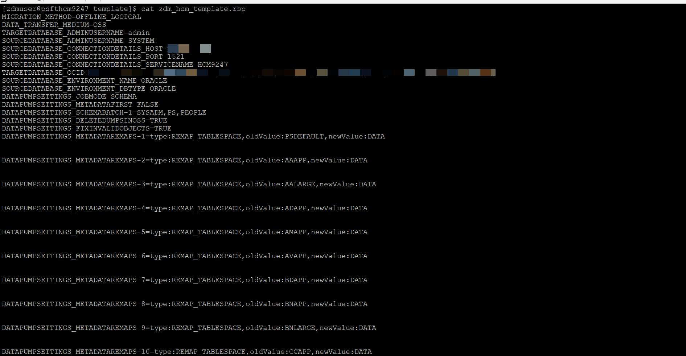
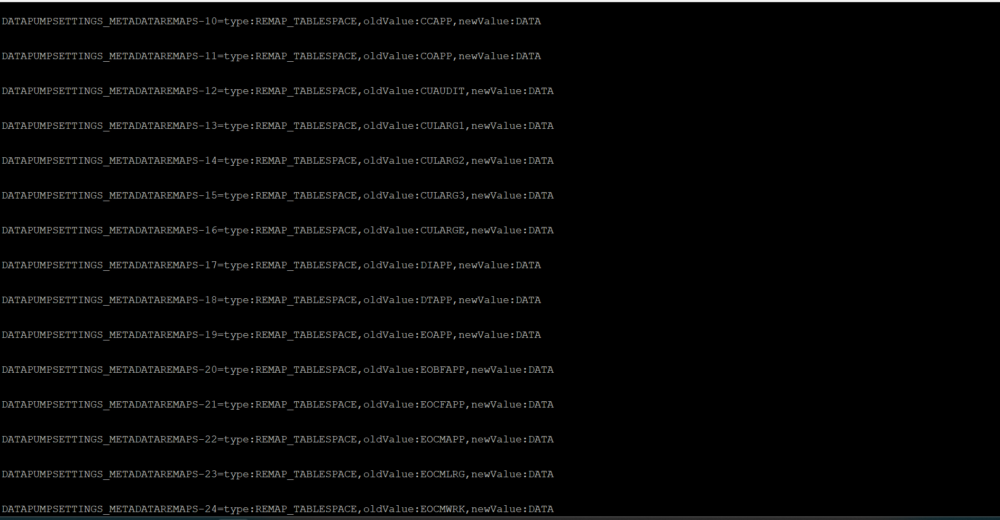
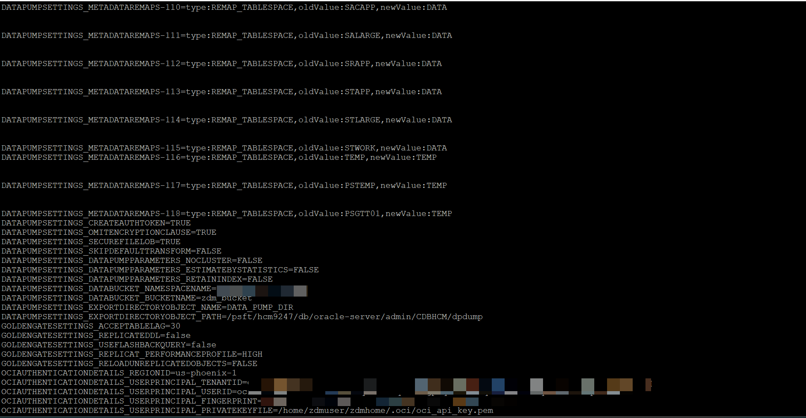
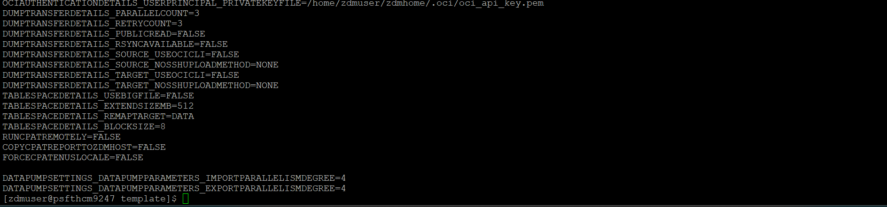
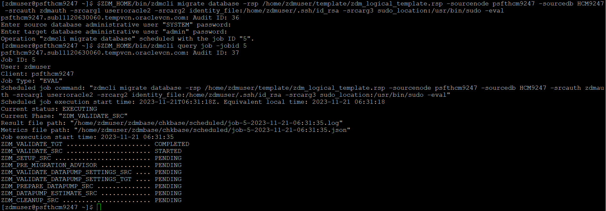
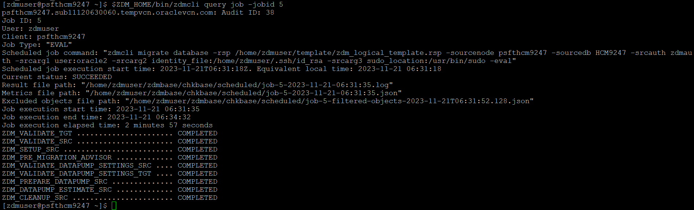

#  Prepare the ZDM Response File and execute Evaluation Job

## Introduction
This lab walks you through the process of creating a ZDM response file and also running the ZDM evaluation mode to make sure the overall ZDM migration job works as expected.

Estimated Time: 10 minutes

### Objectives

In this lab, you will:
* ZDM Prepare the response File
* Running the ZDM Evaluation Job


### Prerequisites


* zdm user access on the on-premises PeopleSoft system


## Task 1: ZDM Prepare the response File

1. Login as ZDM user and start by copying the stand template file or re-use to create a new file from the existing template

     ```
     <copy>[zdmuser@psfthcm9247 ~]$ mkdir ~/template
     [zdmuser@psfthcm9247 ~]$ cp zdmhome/rhp/zdm/template/zdm_logical_template.rsp ~/template/
     </copy>
     ```
    

2. The ZDM response file configured with all the required parameters looks like this

    
    
    
    


## Task 2: Run the ZDM migration Evaluation Mode

1. The ZDM evaluation mode performs a dry run of the migration process. It allows customers to ensure that the migration will run swiftly and will encounter no issues

     ```
     <copy>[zdmuser@psfthcm9247 ~]$ $ZDM_HOME/bin/zdmcli migrate database -rsp /home/zdmuser/template/zdm_logical_template.rsp -sourcenode psfthcm9247 -sourcedb HCM9247 -srcauth zdmauth -srcarg1 user:oracle2 -srcarg2 identity_file:/home/zdmuser/.ssh/id_rsa -srcarg3 sudo_location:/usr/bin/sudo -eval
     </copy>
     ```
    
    Command to check the status of the evaluation mode job, where a unique jobid is generated for each run of the ZDM migration job

     ```
     <copy>[zdmuser@psfthcm9247 ~]$ $ZDM_HOME/bin/zdmcli query job -jobid
     </copy>
     ```


    

    The ZDM evaluation job completed successfully, this ensures all the configurations are setup and connectivity is working fine as expected. 
    


You may now **proceed to the next lab.**

## Acknowledgements
* **Authors** - Deepak Kumar M, Principal Cloud Architect
* **Contributors** - Deepak Kumar M, Principal Cloud Architect
* **Last Updated By/Date** - Deepak Kumar M, Principal Cloud Architect, December 2023

