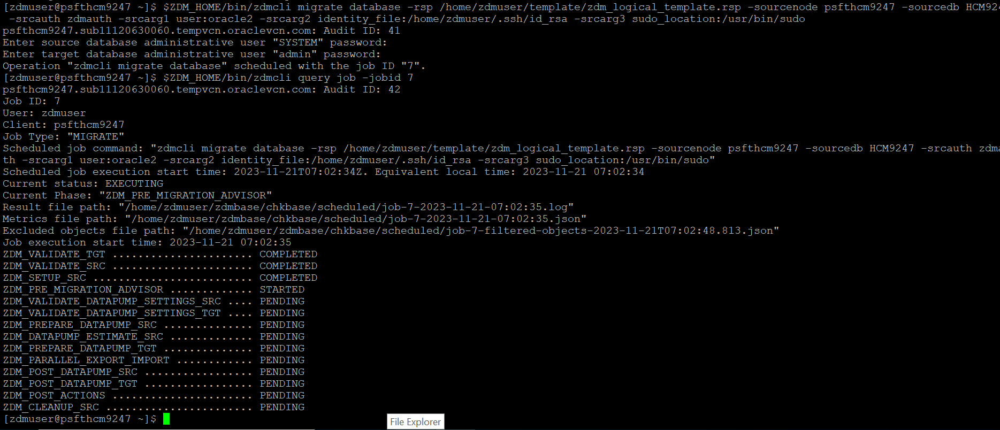
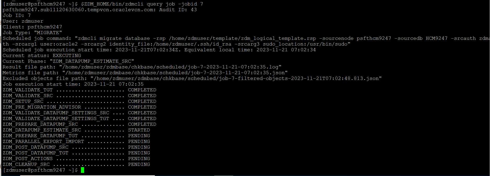
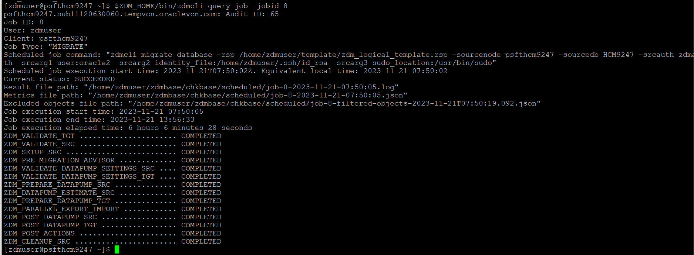

# ZDM Database migration for PeopleSoft

## Introduction


This lab walks you through the steps to perform ZDM migration for  PeopleSoft on-premises database system to  Oracle Autonomous Database serverless.


Estimated Time: 6 hours

### Objectives
In this lab, you will:


* Use ZDM to migrate on-premises PeopleSoft database to ADB-S

### Prerequisites

* zdm user access on the on-premises PeopleSoft system


## Task: ZDM Database Final migration mode for PeopleSoft


1.  Once we have validated the ZDM database migration in evaluation mode and made sure everything works as expected, it is time to migrate the database in the actual ZDM migration mode. We do this by running the same script and remove the -eval option from the end of the script.
  
    ```
    <copy>[zdmuser@psfthcm9247 ~]$ $ZDM_HOME/bin/zdmcli migrate database -rsp /home/zdmuser/template/zdm_logical_template.rsp -sourcenode psfthcm9247 -sourcedb HCM9247 -srcauth zdmauth -srcarg1 user:oracle2 -srcarg2 identity_file:/home/zdmuser/.ssh/id_rsa -srcarg3 sudo_location:/usr/bin/sudo  </copy>
    ```

    Command to check the status of the evaluation mode job, where a unique jobid is generated for each run of the ZDM migration job

     ```
     <copy>[zdmuser@psfthcm9247 ~]$ $ZDM_HOME/bin/zdmcli query job -jobid
     </copy>
     ```


    Below are screenshots from the ZDM migration job:

    ZDM migration job in progress
    
    

    


    ZDM migration job successful completion
    


You may now **proceed to the next lab.**


## Acknowledgements
* **Authors** - Deepak Kumar M, Principal Cloud Architect
* **Contributors** - Deepak Kumar M, Principal Cloud Architect
* **Last Updated By/Date** - Deepak Kumar M, Principal Cloud Architect, December 2023


