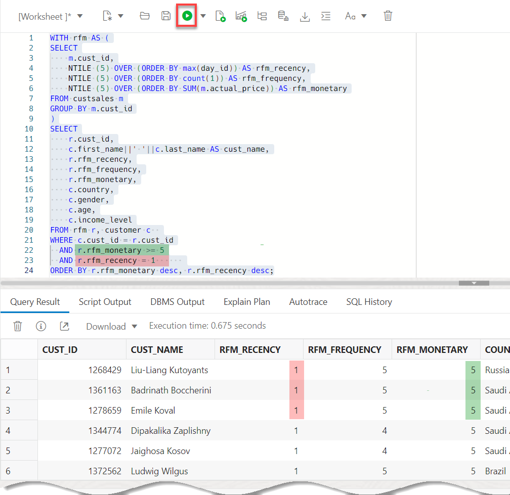

# Analyze the Movie Sales Data

## Introduction
In this lab, you use Oracle analytic SQL to gain a better understanding of the customers.

Estimated Time: 5 minutes

### Objectives

- Understand how to use the SQL Worksheet
- Group customers by recency, frequency and monetary metrics

### Prerequisites

- This lab requires the completion of **Lab 1** and **Lab 2** in the **Contents** menu on the left.

## Task 1: Navigate to the SQL Worksheet

1. From the Data Load tool, navigate to the SQL Worksheet. Click the **Selector** menu. In the **Development** section, click **SQL**.

    

    The SQL Worksheet is displayed. The first time you access the SQL Worksheet, informational boxes might be displayed. Click the **X** icons to close those boxes. You can also click the **Collapse** icon to increase the worksheet area.

    

2. Learn more about the SQL Worksheet features using the tooltips when you hover over an icon. You will run queries by entering your commands in the worksheet. Click the **Run Statement** icon to run the command and view the output in the **Query Result** tab in tabular format. Click the **Run Script** icon to run a script and display the output in the **Script Output** tab in text format. You can clear your worksheet by clicking the trash icon.

    

You are now ready to start analyzing MovieStream's performance using SQL.

## Task 2: Explore the Sales Data

1. Let's use a very simple query to look at sales by customer education level. Copy the following code and paste it in your SQL Worksheet, and then click the **Run Statement** icon in the toolbar. 

    >**Note:** The first time you try to paste anything from the clipboard into your SQL Worksheet, an informational box is displayed. Click **Allow**.

    


    ```
    <copy>select
      education,
      round(sum(actual_price),0) as sales
    from custsales cs, customer c
    where cs.cust_id = c.cust_id
    group by education
    order by sales desc
    fetch first 5 rows only
    </copy>
    ```

    This returns a result similar to the following:

    

    As you can see, most sales are to customers with a high school education, and the fewest sales are to customers with a masters degree. It is interesting that MovieStream has more sales to customers with a doctorate degree than customers with a masters degree!

## Task 3: Finding our Most Important Customers

### Overview

Let's pivot and look at customer behavior by utilizing an **RFM** analysis. RFM is a very commonly used method for analyzing customer value. It is often used in general customer marketing, direct marketing, and retail sectors.

In the following steps, the scripts will build a SQL query to identify:

- **Recency:** when was the last time the customer accessed the site?

- **Frequency:** what is the level of activity for that customer on the site?

- **Monetary Value:** how much money has the customer spent?

Customers will be categorized into 5 buckets measured (using the **`NTILE`** function) in increasing importance. For example, an **RFM** combined score of **551** indicates that the customer is in the highest tier of customers in terms of recent visits (**R=5**) and activity on the site (**F=5**); however the customer is in the lowest tier in terms of spend (**M=1**). Perhaps this is a customer that performs research on the site, but then decides to buy movies elsewhere!

1. Let's bin customers based on their behavior. Copy the following query and paste it in your SQL Worksheet, and then click the **Run Statement** icon in the toolbar. Use the query to segment customer behavior into **5 distinct bins** based on the **recency**, **frequency**, and **monetary** metrics. 

    >**Note:** To clear the SQL query from the worksheet area, click the **Clear** icon in the toolbar. To clear the output from the Query Result area, click the **Clear Output** icon in the toolbar.

    ```
    <copy>SELECT
        cust_id,
        NTILE (5) OVER (ORDER BY max(day_ID)) AS rfm_recency,
        NTILE (5) OVER (ORDER BY count(1)) AS rfm_frequency,
        NTILE (5) OVER (ORDER BY SUM(actual_price)) AS rfm_monetary
    FROM custsales
    GROUP BY cust_id
    ORDER BY cust_id
    FETCH FIRST 10 ROWS ONLY;</copy>
    ```

    Below is a snapshot of the result (your result may differ).

    

    The rfm\_* columns in the report shows the "bin" values based on the 5 quintiles described above.

    For more information about using the `NTILE` function, see the [SQL Language Reference](https://docs.oracle.com/en/database/oracle/oracle-database/19/sqlrf/NTILE.html#GUID-FAD7A986-AEBD-4A03-B0D2-F7F2148BA5E9) documentation.

2. Add customer information to the  RFM query. Now we use the **`WITH`** clause to create an RFM query and then join that to attributes coming from the **CUSTOMER** table. In addition, the query will focus on important customers (based on spend) that are at risk. Copy the following query and paste it in your SQL Worksheet, and then click the **Run Statement** icon in the toolbar.

    ```
    <copy>WITH rfm AS (
    SELECT
        m.cust_id,
        NTILE (5) OVER (ORDER BY max(day_id)) AS rfm_recency,
        NTILE (5) OVER (ORDER BY count(1)) AS rfm_frequency,
        NTILE (5) OVER (ORDER BY SUM(m.actual_price)) AS rfm_monetary
    FROM custsales m
    GROUP BY m.cust_id
    )
    SELECT
        r.cust_id,
        c.first_name||' '||c.last_name AS cust_name,
        r.rfm_recency,
        r.rfm_frequency,
        r.rfm_monetary,
        c.country,
        c.gender,
        c.age,
        c.income_level
    FROM rfm r, customer c  
    WHERE c.cust_id = r.cust_id
      AND r.rfm_monetary >= 5
      AND r.rfm_recency = 1      
    ORDER BY r.rfm_monetary desc, r.rfm_recency desc;</copy>
    ```
   
    The result only shows customers who historically had significant spend (equal to 5) but have not visited the site recently (equal to 1). MovieStream does not want to lose these important customers!

    

## Recap
We accomplished a lot in just 15 minutes!

* Deployed an Autonomous Database instance that is optimized for data warehousing workloads
* Used Autonomous Database tools to load data from object storage sources
* Used advanced SQL to uncover issues and possibilities

## Learn more

* [Oracle Autonomous Data Warehouse documentation](https://docs.oracle.com/en/cloud/paas/autonomous-data-warehouse-cloud/index.html)

## **Acknowledgements**

- **Authors:**
    * Lauran K. Serhal, Consulting User Assistance Developer
    * Marty Gubar (Retired), Oracle Autonomous Database Product Management
- **Last Updated By/Date:** Lauran K. Serhal, October 2025
