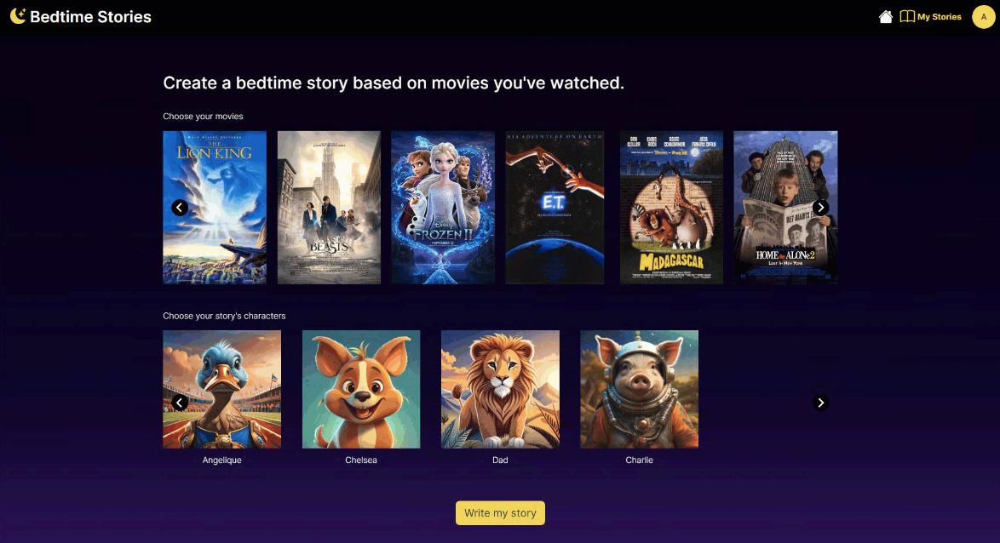
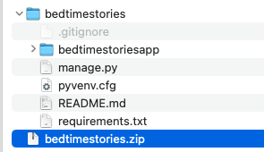
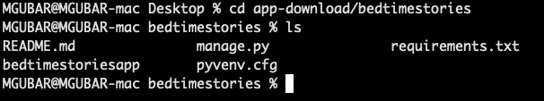
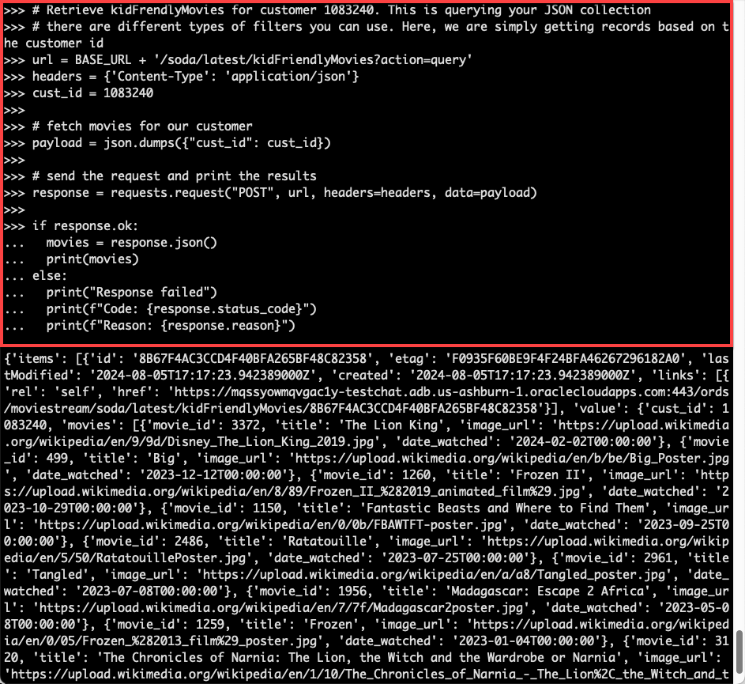
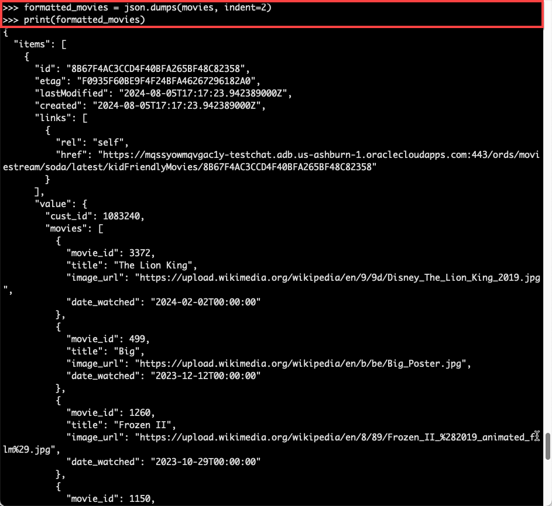
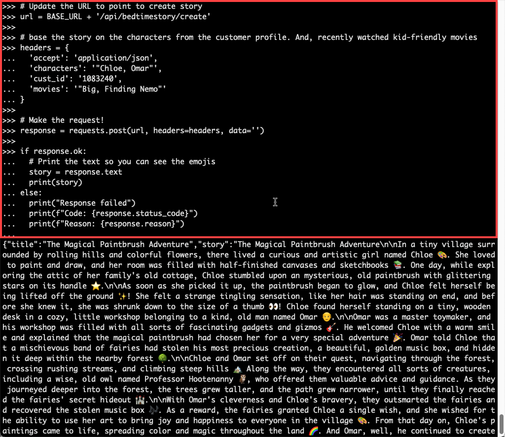
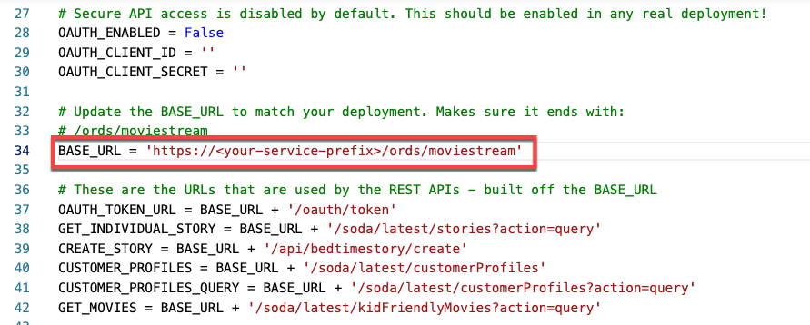
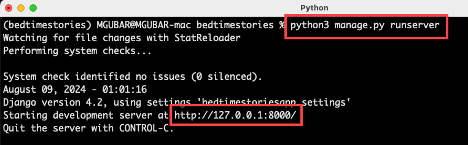
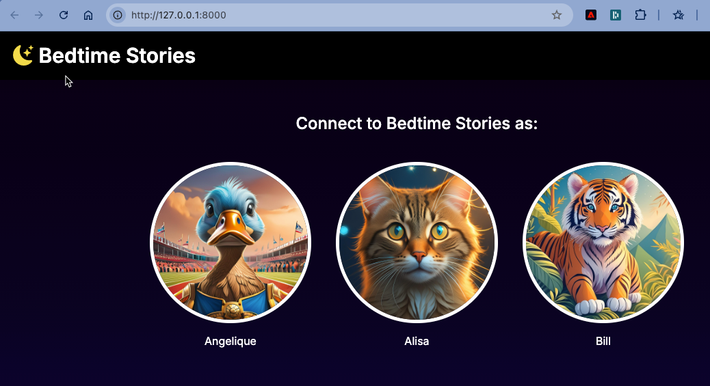

# Deliver a Django app that uses the RESTful AI services

## Introduction

Your RESTful AI services are now available to applications across your organizataion. Your bedtime stories app will use those services in an app that is implemented with Django, a Python web framework for app development. 

Here is a preview of what to expect:



Estimated Time: 20 minutes.

### Objectives

In this lab, you will:
* Setup your Django project
* Run a Python script that uses your Autonomous Database REST APIs to retrieve kid-friendly movies
* Update the Django bedtime stories app to use your Autonomous Database AI services

### Prerequisites
- This lab requires the completion of all the preceding labs.

## Task 1: Download the bedtime stories application
You will run the bedtime stories django app on your computer. It requires:
* Bedtime stories source code
* Latest Python 3 release
* Extra Python packages to run the app

1. Download the zip file containing the bedtime stories app to a folder on your computer
  <a href="../bedtime-stories-app/bedtimestories.zip" class="tryit-button">Download Bedtime stories code</a>
2. Unzip the **`bedtimestories.zip`** file. You will see a new folder called **`bedtimestories`** containing files and subfolders 

  

## Task 2: Install Python and required packages

1. Install Python 3 on your computer (version 3.9 or higher). You can download Python from [python.org](https://www.python.org/downloads/). Follow the installation instructions provided on that site.

2. Launch a command prompt and navigate to the **`bedtimestories`** folder. This is the folder that was created when you extracted the zip file.
    ```
    cd your-download-directory/bedtimestories
    ```
    For example:
    

The remaining setup steps depend on your operating system. You will use a Python virtual environment to prevent conflicts with other Python deployments on your computer:

**Windows**

In your command prompt:

* Create a virtual environment
    ```
    <copy>    
    python -m venv bedtimestories
    </copy>    
    ```

* Activate your virtual environment
    ```
    <copy>    
    bedtimestories\Scripts\activate
    </copy>    
    ```

* Install requirements.txt
    ```
    <copy>     
    pip install -r requirements.txt
    </copy>
    ```

* Propagate changes you make to your models
    ```
    <copy>     
    python manage.py makemigrations
    python manage.py migrate
    </copy> 
    ```

**MacOS and Linux**

* Create a virtual environment
    ```
    <copy>
    python3 -m venv bedtimestories
    </copy>
    ```

*  Activate your virtual environment
    ```
    <copy>    
    source bedtimestories/bin/activate
    </copy>    
    ```

*  Install requirements.txt
    ```    
    <copy>
    pip install -r requirements.txt
    </copy>
    ```

*  Propagate changes you make to your models
    ```  
    <copy>    
    python3 manage.py makemigrations
    python3 manage.py migrate
    </copy>    
    ```

## Task 3: Access your JSON collections and AI APIs using Python and REST
Now that you're client is set up, let's use it to access our collections and create a new bedtime story! Run the following steps in your command prompt:

1. Start your Python interpreter:

    **Windows**
    ```    
    <copy>
    python
    </copy>
    ```

  **MacOS/Linux**
      ```    
      <copy>
      python3
      </copy>
      ```

2. You will need the first part of the SQL Worksheet URL again in order to make REST calls. If you didn't save it in the previous lab, navigate back to SQL Worksheet and copy the first part of the URL:

  

3. Run the following Python snippet. Replace the **`BASE_URL`** value to match your URL. Make sure it ends with **`/ords/moviestream`**. After replacing the URL, copy and paste the snippet into the interpreter and hit enter:  
    ```python
    <copy>
    import requests
    import json

    ## Update the BASE_URL to match your ADB instance
    BASE_URL = 'https://<your-service-prefix>/ords/moviestream'
    </copy>
    ```

4. Set other constants and then send the request to Autonomous Database. Copy and paste the following snippet into your Python window and click enter:

    ```python
    <copy>
    # Retrieve kidFrendlyMovies for customer 1083240. This is querying your JSON collection
    # there are different types of filters you can use. Here, we are simply getting records based on the customer id
    url = BASE_URL + '/soda/latest/kidFriendlyMovies?action=query'
    headers = {'Content-Type': 'application/json'}
    cust_id = 1083240

    # fetch movies for our customer
    payload = json.dumps({"cust_id": cust_id})

    # send the request and print the results    
    response = requests.request("POST", url, headers=headers, data=payload)

    if response.ok:
      movies = response.json()
      print(movies)
    else:
      print("Response failed")
      print(f"Code: {response.status_code}")      
      print(f"Reason: {response.reason}")   
    </copy>
    ```
    


5. The output is difficult to read. Let's format it. Copy and paste the following snippet into your Python window and click enter:

    ```python
    <copy>
    formatted_movies = json.dumps(movies, indent=2)
    print(formatted_movies)
    </copy>
    ```

    

6. Create a bedtime story using the AI API. Copy and paste the following snippet into your Python window and click enter. There will be a delay when the story is being generated:
  
    ```python
    <copy>
    # Update the URL to point to create story
    url = BASE_URL + '/api/bedtimestory/create' 

    # base the story on the characters from the customer profile. And, recently watched kid-friendly movies
    headers = {
      'accept': 'application/json',
      'characters': '"Chloe, Omar"',
      'cust_id': '1083240',
      'movies': '"Big, Finding Nemo"'
    }

    # Make the request! This will take a minute... 
    response = requests.post(url, headers=headers, data='')

    if response.ok:
      # Print the text so you can see the emojis
      story = response.text
      print(story)
    else:
      print("Response failed")
      print(f"Code: {response.status_code}")      
      print(f"Reason: {response.reason}")   
    </copy>
    ```

    

    Enjoy the story!

7. Quit Python - but keep the command prompt open.

    ```python
    <copy>
    quit()
    </copy>
    ```
    
## Task 4: Update and run the Django app
Now that you understand how to use Python to access Autonomous Database REST endpoints, let's see the capabilities in action in the Bedtime Stories app. Just like you did in the previous task, you'll update the **`BASE_URL`** to point to your ADB instance. Then, run the app and connect to it in your browser!

1. Open the **`bedtimestories/bedtimestoriesapp/settings.py`** in a text editor. This file contains all the constants used by the app to connect to the endpoints. Update the **`BASE_URL`** field to match your Autonomous Database setting:

  

  Notice there are other settings - like **`OAUTH_ENABLED`**. The app is setup to authenticate connections when your endpoints are secure. Other fields, like the **`OAUTH_CLIENT_ID`** and **`OAUTH_CLIENT_SECRET`**, would also need to be updated with secure connections.

2. Run the application. Go to your comand prompt and make sure you are in the **`bedtimestories`** folder. That directory contains the **`manage.py`** file that you will use to launch the app.

  Start the server:

  **Windows**

    ```    
    <copy>
    python manage.py runserver
    </copy>
    ```

  **MacOS/Linux**
  
    ```    
    <copy>
    python3 manage.py runserver
    </copy>
    ```    

  

3. Notice the URL for the development server that you just launched. Connect to that URL in your web browser.

  

4. Create your own bedtime story!

  


## Learn More
* [DBMS\_NETWORK\_ACL\_ADMIN PL/SQL Package](https://docs.oracle.com/en/database/oracle/oracle-database/19/arpls/DBMS_NETWORK_ACL_ADMIN.html#GUID-254AE700-B355-4EBC-84B2-8EE32011E692)
* [DBMS\_CLOUD\_AI Package](https://docs.oracle.com/en-us/iaas/autonomous-database-serverless/doc/dbms-cloud-ai-package.html)
* [Using Oracle Autonomous Database Serverless](https://docs.oracle.com/en/cloud/paas/autonomous-database/adbsa/index.html)
* [Overview of Generative AI Service](https://docs.oracle.com/en-us/iaas/Content/generative-ai/overview.htm)

## Acknowledgements
  
* **Author:** Marty Gubar, Product Management 
* **Awesome App Developer:** Ashritha Malli, Master Principal Cloud Architect
* **Last Updated By/Date:** Marty Gubar, August 2024

Data about movies in this workshop were sourced from **Wikipedia**.

Copyright (c) 2024 Oracle Corporation.

Permission is granted to copy, distribute and/or modify this document
under the terms of the GNU Free Documentation License, Version 1.3
or any later version published by the Free Software Foundation;
with no Invariant Sections, no Front-Cover Texts, and no Back-Cover Texts.
A copy of the license is included in the section entitled [GNU Free Documentation License](files/gnu-free-documentation-license.txt)
