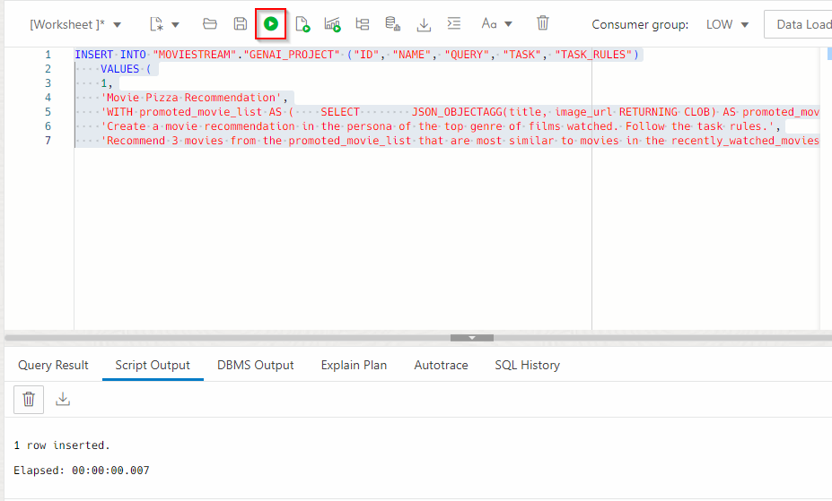
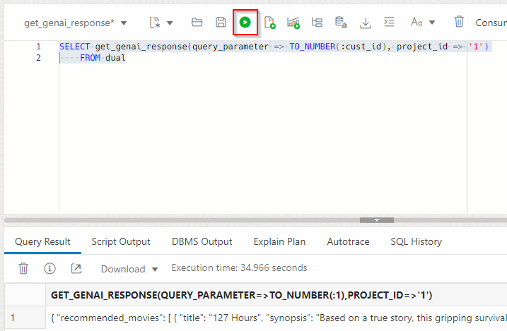

# Use Business Logic to Enhance Generative AI

## Introduction

Large language models are incredibly powerful tools for analyzing data using natural language. The problem with LLMs is that they don't know about your organization's private data. Autonomous Database and Select AI makes it simple to overcome this challenge and use an LLM's creative power and understanding of language to rapidly innovate.

This lab will introduce you to using your organization's data with LLMs. You will learn how to define LLM prompts that combine natural language tasks with private data. Those prompts will clearly delineate from the data sets and tasks to encourage better results:


For this workshop, the business logic is captured in a GENAI\_PROJECT table that provides a simple organizational structure. Each record in that table includes:
1. the task - a description of the purpose of the project
2. the task rules - a natural language description of the LLM tasks (e.g. summarize a support chat)
3. the query - the database query whose results the tasks will operate on

A JSON document is used to organize the genAI prompt (task rules and query results) and that document is passed to the LLM for processing. 


- Example use case for **`DBMS_CLOUD_AI.GENERATE`**: A compelling EMAIL promotion.


> **Note:** The prompt (in the example above) is using both the tasks and data (from a profile created named "ociai") to generate a email using Generative AI and data from the database. 

Estimated Time: 15 minutes.

### Objectives

In this lab, you will:

* Create the business logic 
* Test the business logic 

### Prerequisites

- This lab requires completion of the first two labs in the **Contents** menu on the left.

## Task 1: How to use AI models with data in Autonomous Database
In our first example, we'll summarize a conversation that a customer had with the support team. And, we'll determine the customer's sentiment at the end of the chat. 

1. Still logged in as MOVIESTREAM user, view the support chat conversation by runnng the following query. Run the query as a script to make it easy to see the complete results:

    ```
    <copy>
    SELECT support_chat 
    FROM v_customer_support
    WHERE support_chat_id = 1;
    </copy>
    ```
    

    You can see a humorous exchange between the customer and the support chat.

2. Create a prompt for the LLM with the tasks that you want it to perform: 

    > Summarize the support chat in 3 sentences. Include the customer sentiment.

    A JSON document is a really good way to structure the prompt; the LLM can easily interpret the task and data set to operate on. The following SQL query combines the task with the data set. Run this query in SQL Worksheet:

    ```
    <copy>
    SELECT 
        JSON_OBJECT (
            'task' VALUE 'summarize the support chat in 3 sentences. also return the customer sentiment',
        support_chat ) AS prompt
    FROM v_customer_support WHERE support_chat_id = 1;
    </copy>
    ```
    Here is a snapshot in SQL Worksheet:
    

    Below is a better formatted version of the document. Importantly, you can see how the task is cleanly separated from the data:
    ```json
    {
        "task": "summarize the support chat in 3 sentences. also return the customer sentiment",
        "support_chat": 
        "Customer: Hi, I've been staring at my computer screen for hours, and it's giving me the silent treatment. I think it's mad at me.
        Support Rep: Oh no, we can't have that! Let's try to make peace with your computer. What seems to be the issue? 
        Customer: Well, it's just sitting there, not doing anything. I've tried talking to it nicely, but no response. 
        Support Rep: Hmmm, have you tried sweet-talking it in binary? Sometimes computers are just shy in human language. 
        Customer: Binary? Like 0101010101? Are you serious? 
        Support Rep: Absolutely! Give it a shot. Tell it you appreciate its 01010101110 processing power, and you might see some sparks flying. 
        ....
        Customer: Nope, I think my computer and I are on good terms now. Thanks again for the laughs and the tech wizardry! \nSupport Rep: Happy to help. If you ever need more binary poetry or tech support, you know where to find me. Have a great day!"
    }
    ```

3. Now that we have a well defined prompt, pass that to the model using the `DBMS_CLOUD_AI.GENERATE` function. Run the following query in the SQL Worksheet:
      
    ```
    <copy>
    WITH prompt_document AS (
        SELECT JSON_OBJECT(
            'task' VALUE 'summarize the support chat in 3 sentences. also return the customer sentiment',
            support_chat) AS prompt_details
        FROM v_customer_support WHERE support_chat_id = 1
    )
    SELECT 
        DBMS_CLOUD_AI.GENERATE(
            PROMPT => prompt_details,
            PROFILE_NAME => 'OCIAI_COHERE',
            ACTION       => 'chat'                     
        ) AS response
    FROM prompt_document;       
    </copy>
    ```
    

   You can see that the problem was solved and that the customer is happy at the end of the chat. We've just applied the power of LLMs to your organization's private data.

## Task 2: Organize and execute GenAI projects
This workshop uses a `GENAI_PROJECT` table to organize prompts and queries that are applied different use cases. 

1. Let's take a look at the current projects:

    ```
    <copy>
    SELECT * FROM GENAI_PROJECT ORDER BY 1;           
    </copy>
    ```

    Notice below the **Summarize support chat** project. That is the same use case we ran in the previous task. The prompt's query, task and task rules are all captured in that record:

    

    However, instead of hardcoding the `support_chat_id`, the query is parameterized so you can easily summarize and get the sentiment of an support chat:
    ```
    SELECT * 
    FROM v_customer_support
    WHERE support_chat_id = :chat_id
    ```

2. A couple of helper functions were installed when the workshop was deployed that let you get the AI prompt and generate a response from the LLM. The functions use the contents of the `GENAI_PROJECT` to get results. These functions are simply samples, you can update them to meet your needs. 

    Let's see how those helper functions work by finding out what Jennine Mouly (cust_id=1) should do at her destination (project=3). The LLM will use information about Jennine that's stored in Autonomous Database to produce targeted results.
    
    
    
    Run this query in SQL worksheet to learn about Jennine:
    ```
    <copy>
    SELECT 
        cust_id,
        customer_id,
        last_name,
        first_name,
        location,
        age,
        education,
        gender,
        has_kids,
        income_level,
        job_type,
        marital_status,
        num_cars,
        dog_owner 
    FROM v_target_customers
    WHERE customer_id = 1;
    </copy>
    ```
3. The function `GENAI.GET_PROMPT` will return the prompt that will be sent to the LLM. Run the function call below in SQL Worksheet to see what will be sent to the model:
    ```
    <copy>
    SELECT genai.get_prompt(
        query_parameter => '1',  -- customer id = 1
        project_id => 3          -- things to do at a destination
    ) AS prompt
    FROM dual;
    </copy>
    ```
    Again, the LLM's tasks and data set are clearly defined:

    

4. Let's use the second function - `GENAI.GET_RESPONSE` - find out what Jennine and her husband should do in Paris! We'll use the **Meta Llama 2 Chat** model. Run the following in the SQL Worksheet:
    ```
    <copy>
    SELECT genai.get_response(
        query_parameter => '1',  -- customer id = 1
        project_id => 3,         -- things to do at a destination
        profile_name => 'OCIAI_LLAMA'
    ) AS response
    FROM dual;
    </copy>
    ```
    

    Enjoy yourself Jennine!


## Task 3: Create the Business Logic 

1. Still logged in as MOVIESTREAM user, insert the following business rule into the **GENAI_PROJECT** table by copying, pasting, and running the following using the SQL worksheet. 

    ```
    <copy>
    INSERT INTO "MOVIESTREAM"."GENAI_PROJECT" ("ID", "NAME", "QUERY", "TASK", "TASK_RULES")
        VALUES (4,	'Movie Pizza Recommendation',	'WITH promoted_movie_list AS (
        SELECT
            JSON_OBJECTAGG(title, image_url RETURNING CLOB) AS promoted_movie_list
        FROM
            movies
    )
    SELECT
        M.image_url,
        P.promoted_movie_list
    FROM
        MOVIESTREAM.STREAMS S
    JOIN
        promoted_movie_list P ON 1 = 1 
    JOIN
        MOVIESTREAM.MOVIES M ON S.MOVIE_ID = M.MOVIE_ID
    WHERE
        S.CUST_ID = :cust_id
    ORDER BY
        S.DAY_ID DESC
    FETCH FIRST 1 ROWS ONLY',
        'Create a movie recommendation. Follow the task rules.',	'Recommend 3 movies from the promoted_movie_list that are most similar to movies in the recently_watched_movies list. Include a short synopsis of each movie. Convince the reader that they will love the recommended movies. Also include a recommend pizza that would pair well with each movie. include the image_url as well. Make it object oriented for easy parsing.')

    COMMIT;
    </copy>
    ```



1. Right-click **GENAI_PROJECT** and click **Open** on the left side of the SQL Worksheet.
2. Click **Data** to view the new business logic statement you have submitted is correct. Additionally, 3 rows have been automatically created by the automation script. We will learn more about these in the next lab.

## Task 2: Test the Business Logic 

1. In the SQL worksheet, run the following command to test the business logic function that we just created. The automation script has created a package **genai.get_response()** where we can submit tasks along with data.

    ```
    <copy>
    SELECT genai.get_response(query_parameter => '1000001', project_id => '4')
    FROM dual;
    </copy>
    ```  

>**Note:** The default profile used is **`genai`**, which is automatically created by the terraform. We will use the new profiles for this function in the next lab.



2. Change the Object viewer from Tables to **Packages**, right-click the **GENAI** and view the **Body** script to understand how this function uses 3 parameters, which we will highlight in the following lab. The following functions are stored in this package:
* **get_prompt_sql()**
* **get_response()** - covered in this lab
* **get_prompt()** - helpful for debugging business logic
* **ask_question()**


    
You may now proceed to the next lab.

## Learn More
* [DBMS\_NETWORK\_ACL\_ADMIN PL/SQL Package](https://docs.oracle.com/en/database/oracle/oracle-database/19/arpls/DBMS_NETWORK_ACL_ADMIN.html#GUID-254AE700-B355-4EBC-84B2-8EE32011E692)
* [DBMS\_CLOUD\_AI Package](https://docs.oracle.com/en-us/iaas/autonomous-database-serverless/doc/dbms-cloud-ai-package.html)
* [Using Oracle Autonomous Database Serverless](https://docs.oracle.com/en/cloud/paas/autonomous-database/adbsa/index.html)
* [Overview of Generative AI Service](https://docs.oracle.com/en-us/iaas/Content/generative-ai/overview.htm)

## Acknowledgements

  * **Author:** Marty Gubar, Product Management 
  * **Contributors:** 
    * Stephen Stuart, Cloud Engineer 
    * Nicholas Cusato, Cloud Engineer 
    * Olivia Maxwell, Cloud Engineer 
    * Taylor Rees, Cloud Engineer 
    * Joanna Espinosa, Cloud Engineer 
    * Lauran K. Serhal, Consulting User Assistance Developer
* **Last Updated By/Date:** Nicholas Cusato, February 2024

Data about movies in this workshop were sourced from **Wikipedia**.

Copyright (C)  Oracle Corporation.

Permission is granted to copy, distribute and/or modify this document
under the terms of the GNU Free Documentation License, Version 1.3
or any later version published by the Free Software Foundation;
with no Invariant Sections, no Front-Cover Texts, and no Back-Cover Texts.
A copy of the license is included in the section entitled [GNU Free Documentation License](files/gnu-free-documentation-license.txt)
