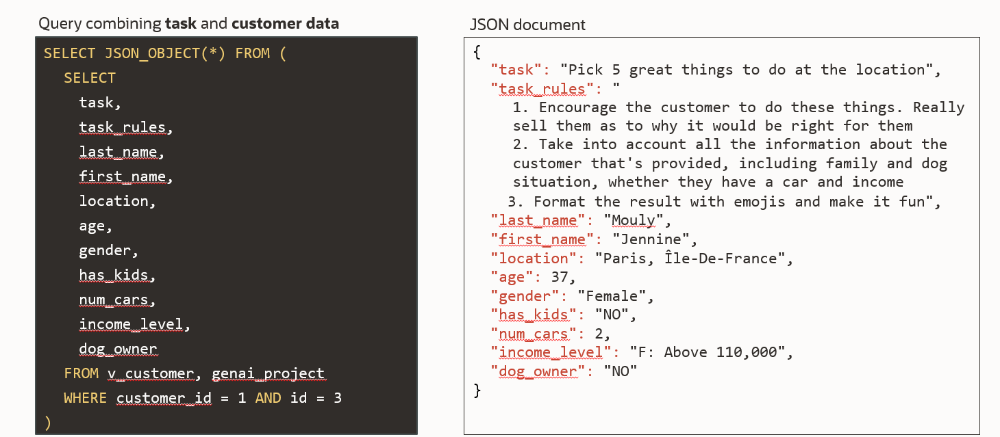
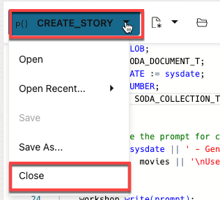
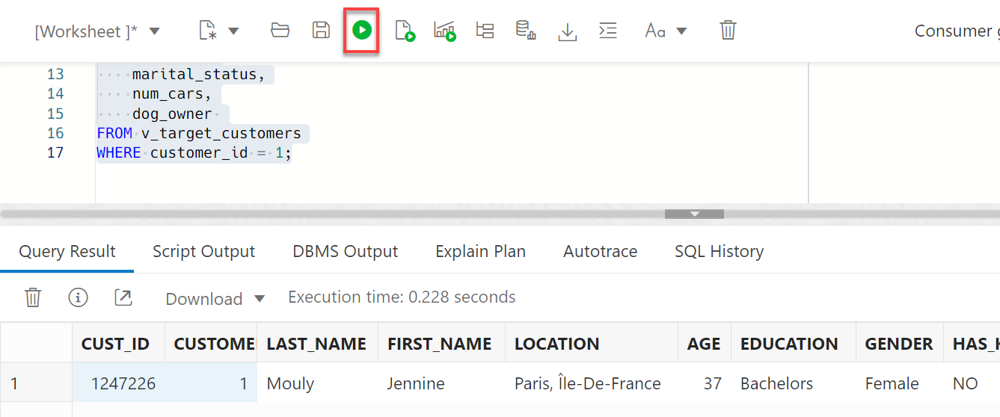
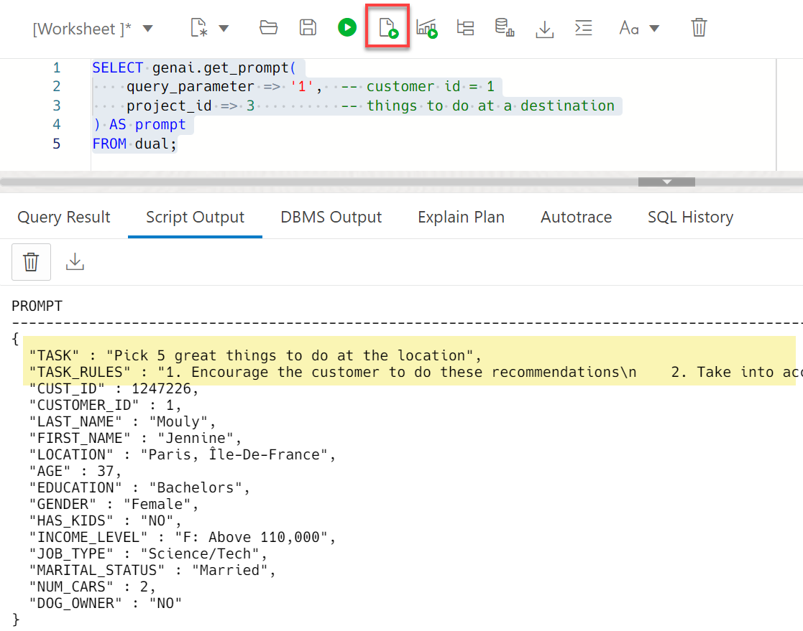
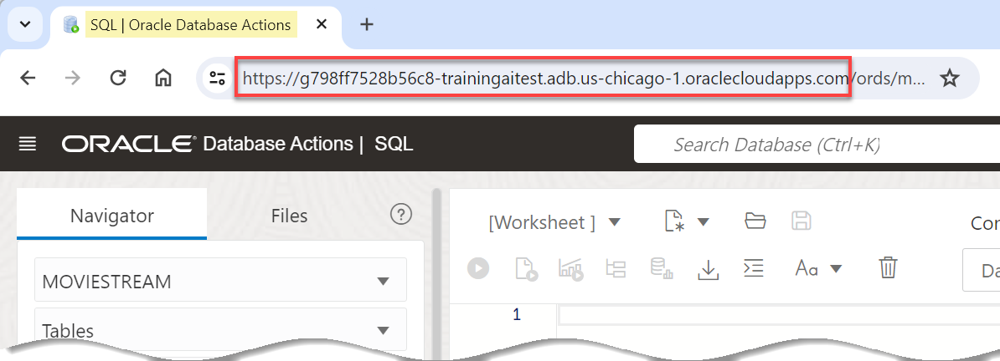
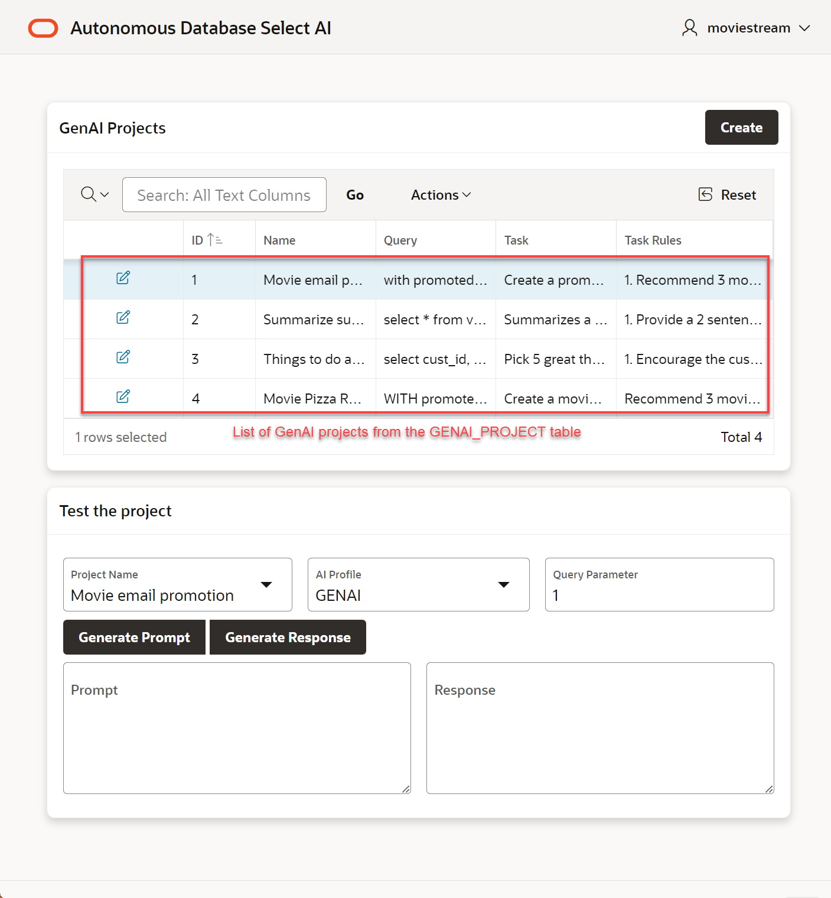
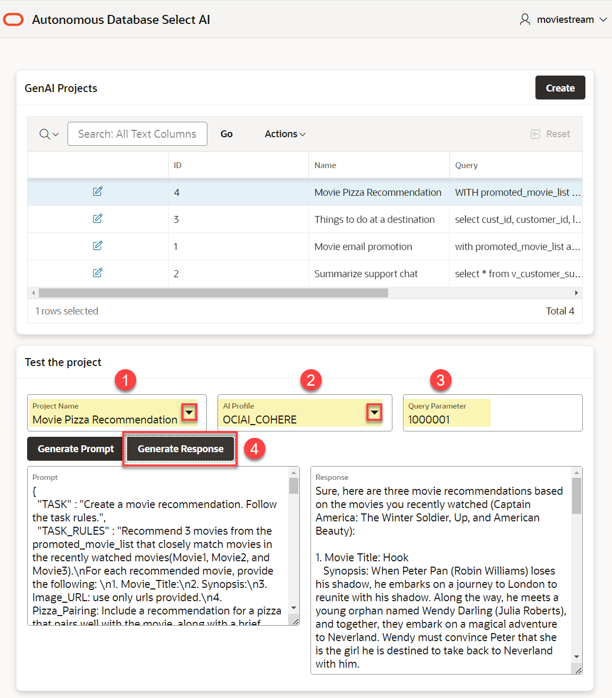

# Use GenAI to analyze your data in Autonomous Database

## Introduction

Large language models are incredibly powerful tools for analyzing data using natural language. The problem with LLMs is that they don't know about your organization's private data. Autonomous Database and Select AI makes it simple to overcome this challenge and use an LLM's creative power and understanding of language to rapidly innovate.

This lab will introduce you to using your organization's data with LLMs. You will learn how to define LLM prompts that combine natural language tasks with private data. Those prompts will clearly delineate from the data sets and tasks to encourage better results.
<!--


For this workshop, the business logic is captured in a GENAI\_PROJECT table that provides a simple organizational structure. Each record in that table includes:
1. The task - a description of the purpose of the project
2. The task rules - a natural language description of the LLM tasks (e.g. summarize a support chat)
3. The query - the database query whose results the tasks will operate on

A JSON document is used to organize the GenAI prompt (task rules and query results) and that document is passed to the LLM for processing.



- Example use case for **`DBMS_CLOUD_AI.GENERATE`**: A compelling EMAIL promotion.


> **Note:** The prompt (in the example above) is using both the tasks and data (from a profile created named "ociai") to generate a email using Generative AI and data from the database. 
-->
Estimated Time: 15 minutes.

### Objectives

In this lab, you will:

* Create the business logic 
* Test the business logic 

### Prerequisites

- This lab requires completion of all of the preceding labs in the **Contents** menu on the left.

## Task 1: How to use AI models with data in Autonomous Database
In our first example, we'll summarize a conversation that a customer had with the support team. And, we'll determine the customer's sentiment at the end of the chat. 

1. Still logged into SQL Worksheet as **MOVIESTREAM** user, view a support chat conversation. Run the query as a script to make it easy to see the complete results. Copy and paste the following code into your SQL Worksheet, and then click the **Run Script** icon.

    ```
    <copy>
    SELECT support_chat 
    FROM v_customer_support
    WHERE support_chat_id = 1;
    </copy>
    ```
    

    You can see a humorous exchange between the customer and the support chat.

2. Create a prompt for the LLM with the tasks that you want it to perform.

    > Summarize the support chat in 3 sentences. also return the customer sentiment

    A JSON document is a really good way to structure the prompt; the LLM can easily interpret the task and data set to operate on. The following SQL query combines the task with the data set. Copy and paste the following code into your SQL Worksheet, and then click the **Run Script** icon.


    ```
    <copy>
    SELECT 
        JSON_OBJECT (
            'task' VALUE 'summarize the support chat in 3 sentences. also return the customer sentiment',
        support_chat ) AS prompt
    FROM v_customer_support 
    WHERE support_chat_id = 1;
    </copy>
    ```
    Here is a snapshot of the result in SQL Worksheet:
    

    Below is a better formatted version of the document. Importantly, you can see how the task is cleanly separated from the data:
    ```json
    {
        "task": "summarize the support chat in 3 sentences. also return the customer sentiment",
        "support_chat": 
        "Customer: Hi, I've been staring at my computer screen for hours, and it's giving me the silent treatment. I think it's mad at me.
        Support Rep: Oh no, we can't have that! Let's try to make peace with your computer. What seems to be the issue? 
        Customer: Well, it's just sitting there, not doing anything. I've tried talking to it nicely, but no response. 
        Support Rep: Hmmm, have you tried sweet-talking it in binary? Sometimes computers are just shy in human language. 
        Customer: Binary? Like 0101010101? Are you serious? 
        Support Rep: Absolutely! Give it a shot. Tell it you appreciate its 01010101110 processing power, and you might see some sparks flying. 
        ....
        Customer: Nope, I think my computer and I are on good terms now. Thanks again for the laughs and the tech wizardry! \nSupport Rep: Happy to help. If you ever need more binary poetry or tech support, you know where to find me. Have a great day!"
    }
    ```

3. Now that we have a well defined prompt, pass it to the model using the **`DBMS_CLOUD_AI.GENERATE`** function. Copy and paste the following code into your SQL Worksheet, and then click the **Run Script** icon.
      
    ```
    <copy>
    WITH prompt_document AS (
        SELECT JSON_OBJECT(
            'task' VALUE 'summarize the support chat in 3 sentences. also return the customer sentiment',
            support_chat) AS prompt_details
        FROM v_customer_support WHERE support_chat_id = 1
    )
    SELECT 
        DBMS_CLOUD_AI.GENERATE(
            PROMPT => prompt_details,
            PROFILE_NAME => 'GENAI',
            ACTION       => 'chat'                     
        ) AS response
    FROM prompt_document;       
    </copy>
    ```
    

   You can see that the problem was solved and that the customer is happy at the end of the chat. We've just applied the power of LLMs to your organization's private data.

   Prompt engineering is a process. You will iterate on the language used to summarize support chat until you get the the type of response you need.

## Task 2: Create a Bedtime Story
MovieStream is going to provide a new service that parents will love. The service lets you create a bedtime story based on movies that you've watched in the past - and people on your account profile can be selected as characters in your story.

1. Let's take a look at the procedure `create_story`. It generates a new bedtime story based on a few parameters about the customer. In the SQL Navigator, go to **Procedures**. Right-click **CREATE_STORY** and select **Open**:
    
    
    Replace the code in your worksheet without saving your content. Click **No** in the **Save Changes** prompt. 

2. The procedure is simple. It takes a few parameters:
    * `cust_id`: the customer id that will be creating the new story
    * `characters`: the list of people on your account that will be characters in your new story
    * `movies`: the list of movies that the will be the basis for the new movie
    * `profile_name`: the AI profile to use to generate the movie (optional)

    And it returns:
    * `title`: the generated story title
    * `story`: the generated story

3. Similar to our previous examples, the procedure uses the parameters to customize the prompt sent to the LLM. And then, the prompt is sent to the LLM and a new story is generated:

    ```sql
    -- Generate the prompt for creating the story using the characters and movies
    prompt := sysdate || ' - Generate a new 2 page story targeted for a child. Make this story unique. Put the complete story title on the first line and do not use emojis in the title. Then start the story on the next line. Use lots of emojis. The story should be similar in concept and tone to the following list of movies:\n' ||
                movies || '\nUse the following character names in the generated story:\n' || characters;
    
    ....
    -- Generate the story using the content
    story := DBMS_CLOUD_AI.GENERATE (
        prompt => prompt,
        profile_name => profile_name,
        action => 'chat'
    );
    ```

    Close the procedure by clicking **CREATE_STORY** and then selecting **Close**
    

4. There are a couple of JSON collections that capture customer profile information and recent, kid-friendly movies watched by the customer. These will be the sources for your application that creates the bedtime story.
    * Create a new SQL worksheet by clicking **New** -> **Worksheet** 
        
    * View information about Bill Flowers in the `customerProfiles` collection. Copy and paste the following query into the workseet and then click **Run Script**:
        ```sql
        <copy>
        SELECT JSON_SERIALIZE(json_document PRETTY) as json_doc
        FROM "customerProfiles"
        WHERE JSON_VALUE(json_document, '$.last_name') = 'Flowers';
        </copy>
        ```
        Bill, Mom, Chloe and Omar are potential characters in the next movie!
          
    * View the kid-friendly movies that the family has seen; this is captured in the `kidFriendlyMovies` collection. Copy and paste the following query into the workseet and then click **Run Script**:
        ```sql
        <copy>
        SELECT JSON_SERIALIZE(json_document PRETTY) as json_doc
        FROM "kidFriendlyMovies"
        WHERE JSON_VALUE(json_document, '$.cust_id') = 1083240;
        </copy>
        ```
        
5. Create a bedtime story! Test out the procedure based on Bill Flower's customer profile and recently watched movies. Copy and paste the following query into the workseet and then click **Run Script**:
    ```sql
    <copy>
    DECLARE
        l_title        VARCHAR2(200);
        l_story        CLOB;
    BEGIN
        create_story(cust_id => 1083240, 
                    characters => '["Mom","Omar"]', 
                    movies => '["The Lion King", "Frozen II"]', 
                    title => l_title, 
                    story => l_story);
    END;
    /
    </copy>
    ```
    The `CREATE_STORY` procedure outputs results. You can see the new bedtime story below:
    
<!--
REM ## Task 3: Organize and execute GenAI projects (optional)
You will likely use GenAI for many different projects where you need to apply analytics to data in Autonomous Database. This workshop uses a `GENAI_PROJECT` table to organize prompts and queries that are applied to different use cases. 

1. Let's take a look at the current projects. Copy and paste the following query into your SQL Worksheet, and then click the **Run Statement** icon.

    ```
    <copy>
    SELECT * 
    FROM GENAI_PROJECT 
    ORDER BY 1;           
    </copy>
    ```

    Notice below the **Summarize support chat** project. That is the same use case we ran in the previous task. The prompt's query, task and task rules are all captured in that record:

    

    However, instead of hardcoding the `support_chat_id`, the query is parameterized so you can easily summarize and get the sentiment of any support chat (in this example, there's only one record):
    ```
    SELECT * 
    FROM v_customer_support
    WHERE support_chat_id = :chat_id
    ```

2. A couple of helper functions were installed when the workshop was deployed that derive the AI prompt and generate a response from the LLM. Fundamentally, these functions do the same things you just tried. The one difference is that the functions use the contents of the `GENAI_PROJECT` to get these results. The functions are simply samples, you can update them to meet your needs. 

    | Function | Description | Parameters |
    |----------|----------|----------|
    | **`GENAI.GET_PROMPT`** | Returns the prompt that will be sent to the LLM. | **`query_parameter`** : Each project includes a parameterized query (e.g a customer id or support chat id). Specify that parameter.<br>**`project_id`** : Specify the id for the project. For example, use id=2 for "Summarize a support chat" |
    | **`GENAI.GET_RESPONSE`** | Returns the response from the LLM. | **`query_parameter`** : see above<br>**`project_id`** : see above<br>**`profile_name`** : Specify the AI profile to use for this prompt |

    To see the source code, in the **Navigator** tab on the left pane, select **Packages** from the **Object Viewer** drop-down list. Right-click **GENAI** and then select **Open > Body** from the context menu. 

    
    
3. Let's see how those helper functions work by finding out what Jennine Mouly (cust_id=1) should do at her destination (project=3). The LLM will use information about Jennine that's stored in Autonomous Database to produce targeted results.
    
    
    
    Run this query in SQL worksheet to learn about Jennine. She is `customer_id = 1`. Copy and paste the following query into your SQL Worksheet, and then click the **Run Statement** icon.

    ```
    <copy>
    SELECT 
        cust_id,
        customer_id,
        last_name,
        first_name,
        location,
        age,
        education,
        gender,
        has_kids,
        income_level,
        job_type,
        marital_status,
        num_cars,
        dog_owner 
    FROM v_target_customers
    WHERE customer_id = 1;
    </copy>
    ```
    
    

4. The function `GENAI.GET_PROMPT` will return the prompt that will be sent to the LLM. Run the function call below in SQL Worksheet to see what will be sent to the model.
    ```
    <copy>
    SELECT genai.get_prompt(
        query_parameter => '1',  -- customer id = 1
        project_id => 3          -- things to do at a destination
    ) AS prompt
    FROM dual;
    </copy>
    ```
    Again, the LLM's tasks and data set are clearly defined:

    

5. Let's use the second function - **`GENAI.GET_RESPONSE`** - find out what Jennine and her husband should do in Paris! We'll use the **Meta Llama 2 Chat** model. Run the following in the SQL Worksheet:
    ```
    <copy>
    SELECT genai.get_response(
        query_parameter => '1',  -- customer id = 1
        project_id => 3,         -- things to do at a destination
        profile_name => 'OCIAI_LLAMA'
    ) AS response
    FROM dual;
    </copy>
    ```
    

    Enjoy yourself Jennine!

REM ## Task 4: Simplifying prompt engineering (optional)
As you can see, prompt engineering is going to be an iterative process. You'll want to test different models, tweak the tasks and update the queries. To make this process easier and more productive, a sample APEX app was deployed to your Autonomous Database. The app lets you create, edit and test your GenAI projects. It's a simple front-end to what you did manually in the previous task.

1. You will need the URL for the APEX app deployed to your Autonomous Database. The URL format is as follows:

    >https://**[your-adb]**/ords/r/moviestream/genai-projects

    Replace the **[your-adb]** place holder with the appropriate value for you deployment:
    - Go to your SQL Worksheet and copy the URL prefix from your browser.
        

2. In a new browser window, go to the **GenAI Projects** app using the URL above and log in as the same MOVIESTREAM user.

    

3. After logging in, you will see the list of GenAI projects. These projects came from the `GENAI_PROJECT` table.
    

4. Let's take a look at the **Movie Pizza Recommendation** project. Click the **Edit** icon for that project:
    

5. You can see the details for this project. You can update the task and task rules as you see fit to produce better results. And, you can see the query. For this app, each project's query has a single parameter - in this case `cust_id`. This lets you get details for that customer's profile. For now, let's leave the project as is - our subsequent lab is expecting results from this prompt. Click **Cancel**.
    

6. Test the GenAI project by following these simple steps:
    * Select the project **Movie Pizza Recommendation**.
    * Choose an AI Profile. You can accept the default, or, try different profiles and compare the results.
    * Enter customer ID **1000001** as the parameter.
    * Click **Generate Response**.
    
    

    The response may take a minute to return. You'll see the prompt used to generate the response and the response itself.
-->
## Summary    
Sometimes it's useful to step back and say, "how would I have summarized a support chat or created a targeted offer in the past?". Applying large language models to your data really opens up so many opportunities to deliver value to your organization quickly and easily. 

You may now proceed to the next lab.

## Learn More
* [DBMS\_NETWORK\_ACL\_ADMIN PL/SQL Package](https://docs.oracle.com/en/database/oracle/oracle-database/19/arpls/DBMS_NETWORK_ACL_ADMIN.html#GUID-254AE700-B355-4EBC-84B2-8EE32011E692)
* [DBMS\_CLOUD\_AI Package](https://docs.oracle.com/en-us/iaas/autonomous-database-serverless/doc/dbms-cloud-ai-package.html)
* [Using Oracle Autonomous Database Serverless](https://docs.oracle.com/en/cloud/paas/autonomous-database/adbsa/index.html)
* [Overview of Generative AI Service](https://docs.oracle.com/en-us/iaas/Content/generative-ai/overview.htm)

## Acknowledgements

  * **Author:** Marty Gubar, Product Management 
  * **Contributors:** 
    * Stephen Stuart, Cloud Engineer 
    * Nicholas Cusato, Cloud Engineer
    * Lauran K. Serhal, Consulting User Assistance Developer 
    * Olivia Maxwell, Cloud Engineer 
    * Taylor Rees, Cloud Engineer 
    * Joanna Espinosa, Cloud Engineer 
* **Last Updated By/Date:** Marty Gubar, September 2024

Data about movies in this workshop were sourced from **Wikipedia**.

Copyright (c) 2024 Oracle Corporation.

Permission is granted to copy, distribute and/or modify this document
under the terms of the GNU Free Documentation License, Version 1.3
or any later version published by the Free Software Foundation;
with no Invariant Sections, no Front-Cover Texts, and no Back-Cover Texts.
A copy of the license is included in the section entitled [GNU Free Documentation License](files/gnu-free-documentation-license.txt)
