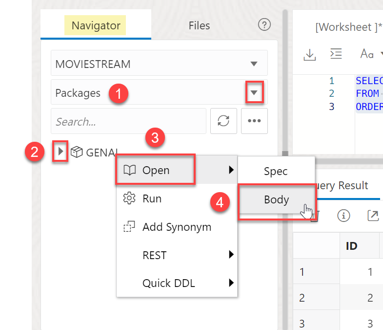

# Use Business Logic to Enhance Generative AI

## Introduction

Large language models are incredibly powerful tools for analyzing data using natural language. The problem with LLMs is that they don't know about your organization's private data. Autonomous Database and Select AI makes it simple to overcome this challenge and use an LLM's creative power and understanding of language to rapidly innovate.

This lab will introduce you to using your organization's data with LLMs. You will learn how to define LLM prompts that combine natural language tasks with private data. Those prompts will provide clearly delineate the data sets and tasks to encourage better results:


The business logic is captured in a GENAI\_PROJECT table that provides a simple organizational structure. Each record in that table includes:
1. the task - a description of the purpose of the project
2. the task rules - a natural language description of the LLM tasks (e.g. summarize a support chat)
3. the query - the database query whose results the tasks will operate on

A JSON document is used to organize the resulting data set (task rules and query results) and that document is passed to the LLM for processing. 


- Example use case for **`DBMS_CLOUD_AI.GENERATE`**: A compelling EMAIL promotion.


> **Note:** The prompt (in the example above) is using both the tasks and data (from a profile created named "ociai") to generate a email using Generative AI and data from the database. 

Estimated Time: 15 minutes.

### Objectives

In this lab, you will:

* Create the business logic 
* Test the business logic 

### Prerequisites

- This lab requires completion of the first two labs in the **Contents** menu on the left.

## Task 1: How to use AI models with data in Autonomous Database
Let's start

select *
from v_customer_support;
with task as
(
    select 'Summarize the support chat in 3 sentences. Also return the customer sentiment' as task_details
    from dual
)
select 
json_object(
    task_details,
    support_chat 
    ) as prompt
from v_customer_support, task;


## Task 1: Create the Business Logic 

1. Still logged in as MOVIESTREAM user, insert the following business rule into the **GENAI_PROJECT** table by copying, pasting, and running the following using the SQL worksheet. 

    ```
    <copy>
    INSERT INTO "MOVIESTREAM"."GENAI_PROJECT" ("ID", "NAME", "QUERY", "TASK", "TASK_RULES")
        VALUES (4,	'Movie Pizza Recommendation',	'WITH promoted_movie_list AS (
        SELECT
            JSON_OBJECTAGG(title, image_url RETURNING CLOB) AS promoted_movie_list
        FROM
            movies
    )
    SELECT
        M.image_url,
        P.promoted_movie_list
    FROM
        MOVIESTREAM.STREAMS S
    JOIN
        promoted_movie_list P ON 1 = 1 
    JOIN
        MOVIESTREAM.MOVIES M ON S.MOVIE_ID = M.MOVIE_ID
    WHERE
        S.CUST_ID = :cust_id
    ORDER BY
        S.DAY_ID DESC
    FETCH FIRST 1 ROWS ONLY',
        'Create a movie recommendation. Follow the task rules.',	'Recommend 3 movies from the promoted_movie_list that are most similar to movies in the recently_watched_movies list. Include a short synopsis of each movie. Convince the reader that they will love the recommended movies. Also include a recommend pizza that would pair well with each movie. include the image_url as well. Make it object oriented for easy parsing.')
    </copy>
    ```


1. Right-click **GENAI_PROJECT** and click **Open** on the left side of the SQL Worksheet.
2. Click **Data** to view the new business logic statement you have submitted is correct. Additionally, 3 rows have been automatically created by the automation script. We will learn more about these in the next lab.

## Task 2: Test the Business Logic 

1. In the SQL worksheet, run the following command to test the business logic function that we just created. The automation script has created a package **genai.get_response()** where we can submit tasks along with data.

    ```
    <copy>
    SELECT genai.get_response(query_parameter => '1000001', project_id => '4')
    FROM dual;
    </copy>
    ```  

>**Note:** The default profile used is **`genai`**, which is automatically created by the terraform. We will use the new profiles for this function in the next lab.


2. Change the Object viewer from Tables to **Packages**, right-click the **GENAI** and view the **Body** script to understand how this function uses 3 parameters, which we will highlight in the following lab. The following functions are stored in this package:
* **get_prompt_sql()**
* **get_response()** - covered in this lab
* **get_prompt()** - helpful for debugging business logic
* **ask_question()**


    
You may now proceed to the next lab.

## Learn More
* [DBMS\_NETWORK\_ACL\_ADMIN PL/SQL Package](https://docs.oracle.com/en/database/oracle/oracle-database/19/arpls/DBMS_NETWORK_ACL_ADMIN.html#GUID-254AE700-B355-4EBC-84B2-8EE32011E692)
* [DBMS\_CLOUD\_AI Package](https://docs.oracle.com/en-us/iaas/autonomous-database-serverless/doc/dbms-cloud-ai-package.html)
* [Using Oracle Autonomous Database Serverless](https://docs.oracle.com/en/cloud/paas/autonomous-database/adbsa/index.html)
* [Overview of Generative AI Service](https://docs.oracle.com/en-us/iaas/Content/generative-ai/overview.htm)

## Acknowledgements

  * **Author:** Marty Gubar, Product Management 
  * **Contributors:** 
    * Stephen Stuart, Cloud Engineer 
    * Nicholas Cusato, Cloud Engineer 
    * Olivia Maxwell, Cloud Engineer 
    * Taylor Rees, Cloud Engineer 
    * Joanna Espinosa, Cloud Engineer 
    * Lauran K. Serhal, Consulting User Assistance Developer
* **Last Updated By/Date:** Nicholas Cusato, February 2024

Data about movies in this workshop were sourced from **Wikipedia**.

Copyright (C)  Oracle Corporation.

Permission is granted to copy, distribute and/or modify this document
under the terms of the GNU Free Documentation License, Version 1.3
or any later version published by the Free Software Foundation;
with no Invariant Sections, no Front-Cover Texts, and no Back-Cover Texts.
A copy of the license is included in the section entitled [GNU Free Documentation License](files/gnu-free-documentation-license.txt)
