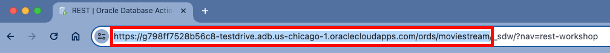
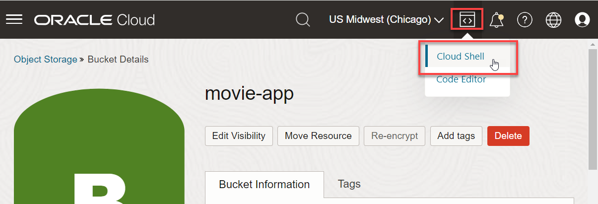
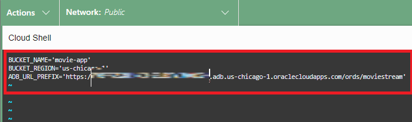
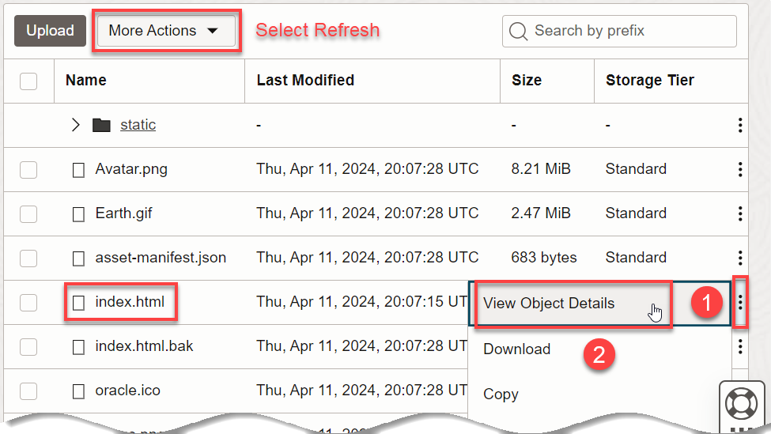
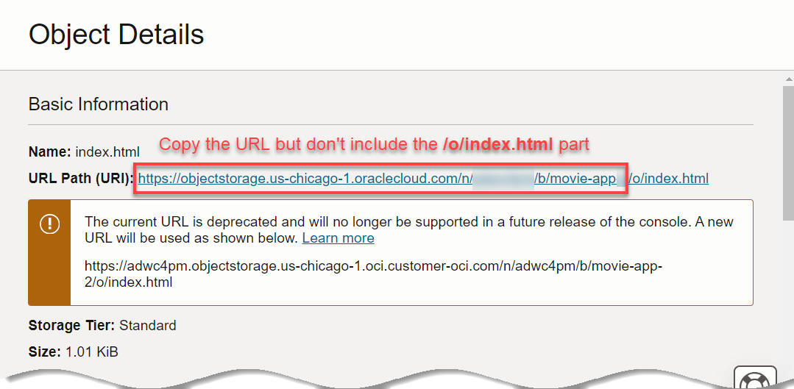
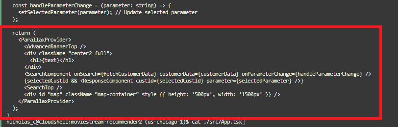
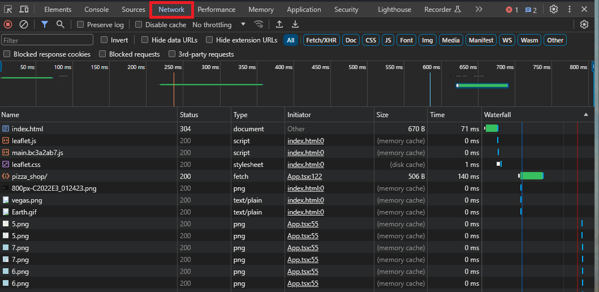
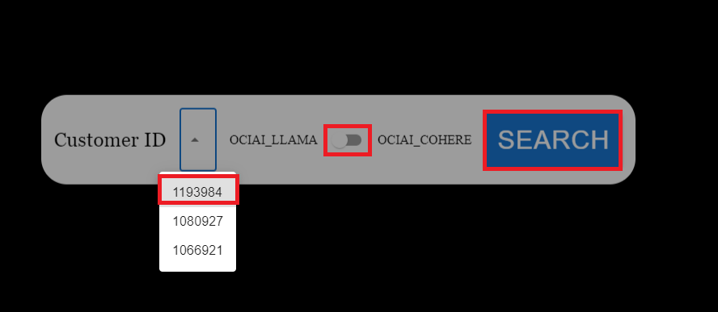
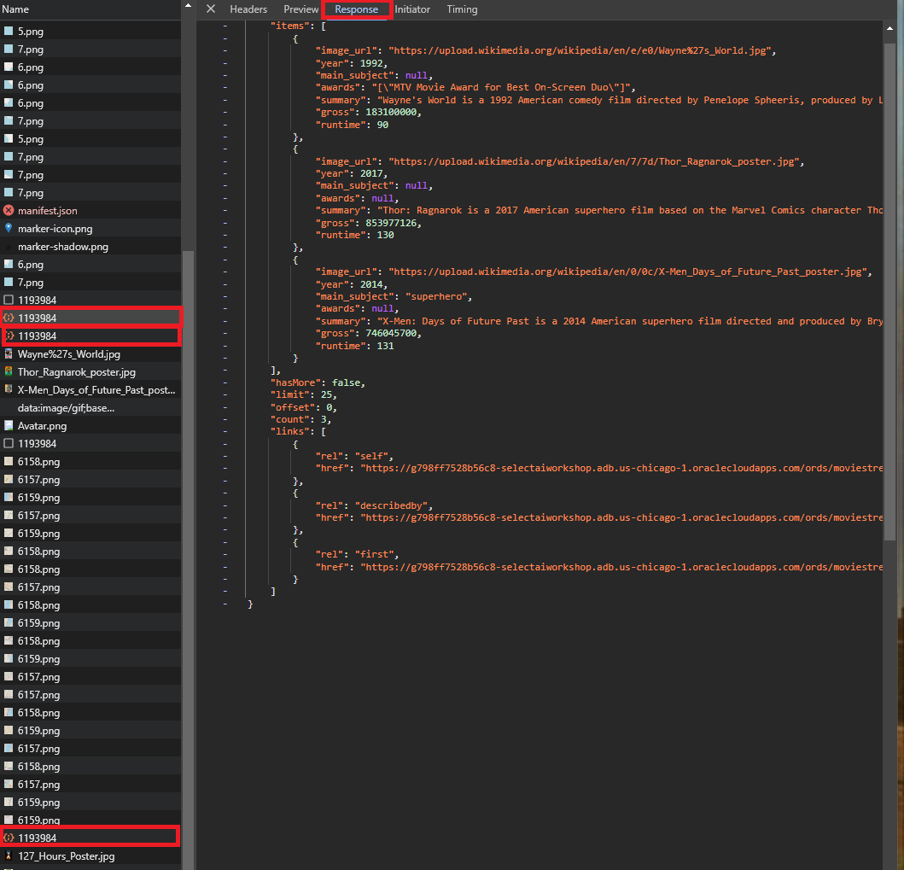
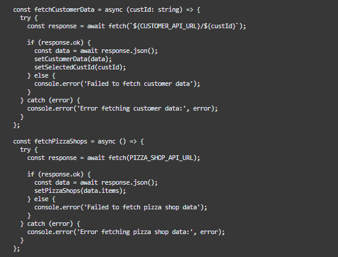

# Deliver a React app that uses the RESTful AI services

## Introduction

Your RESTful AI services are now available to applications across your organizataion. We'll show you an example app that uses open source tools, specifically React (a framework for app development) using Typescript (superset of JavaScript). This approach allows for easy integration of many useful libraries, such as integration of OpenMaps (open source mapping tool). Our MovieStreamAI application lets you search for information about customers and then make recommendations. The list of features includes:
-  Recently watched films list
-  Recommended movies list based on viewing history
-  Recommended pizza pairing using spatial analytics
-  Mapping of nearby pizza locations

Here is a preview of what to expect:


Estimated Time: 20 minutes.

### Objectives

In this lab, you will:
* Create a bucket to host the MovieStreamAI application
* Deploy the app quickly using OCI Object Storage
* Understand how to use your API in the MovieStreamAI App

### Prerequisites
- This lab requires the completion of all the preceding labs.

## Task 1: Copy the root URL for Oracle REST Data Services
The app will need the root URL for your Autnomous Database instance RESTful services. It's easy to get that URL from your browser's URL location bar.
1. Go to any of the database tools - like SQL Worksheet or the REST tool. Make sure you're logged in as the MOVIESTREAM user.
2. Copy the URL up to and including `moviestream`
    

    For example: `https://myadb.adb.us-chicago-1.oraclecloudapps.com/ords/moviestream`

3. Save the URL. You will need it when configuring the React app.

## Task 2: Create bucket to host MovieStreamAI application

1. In your Autonomous Database browser tab, open the **Navigation** menu in the Oracle Cloud console and then click **Storage**. Under **Object Storage & Archive Storage**, click **Buckets**.

2. On the **Buckets** page, select the compartment where you want to create the bucket from the Compartment drop-down list in the **List Scope** section. Make sure you are in the region where you want to create your bucket.

3. Click **Create Bucket**.

4. Name the bucket, **movie-app** and accept the default for all other fields as default. Next, click **Create**.

  

4. Change the bucket's visibility to public. Click on the bucket **movie-app**, then click **Edit Visibility**. Select **Public** and then click **Save Changes**.

  

## Task 3: Deploy the app using Object Storage

1. Open up Cloud Shell within the OCI Console. Make sure you open Cloud Shell in the same region as your object storage bucket.

  

2. Run the following command to download the React application:

    ```
    <copy>
    wget https://objectstorage.us-ashburn-1.oraclecloud.com/p/ba2tl-Lz1tiUOX_3HLkkLuEMHG6vZs54nawkD0OtDrDXL1THcl4gd9XsyBN-od6O/n/c4u04/b/building_blocks_utilities/o/select-ai-react-app/movie-app.zip
    unzip movie-app
    cd movie-app
    </copy>
    ```

3. Update the config file with information about the bucket you just created and the Autonomous Database URL prefix you copied in Task 1. Run the following command to edit the file. 

    ```
    <copy>vi config.txt</copy>
    ```

  

    >**Note:** The information in `config.txt` is used by a bash script to send the objects to the correct object storage bucket. The script `generated_config.sh` generates a config file `./src/config.ts` using that same `config.txt` file. The `config.ts` contains the api variables used by the React app to make REST calls to your Autonomous Database.

4. Enter the **BUCKET\_NAME**, **movie-app** and your **ADB\_URL\_PREFIX** into each of the corresponding fields. Press the **Esc** button and then **:wq!** to save and exit.

5.  Run the following commands to deploy the app.

    ```
    <copy>
    chmod +x node_modules/.bin/react-scripts
    chmod +x generated_config.sh
    ./generated_config.sh
    patch_files=(
      "node_modules/@react-native/metro-babel-transformer/src/index.js"
      "node_modules/bl/test/test.js"
      "node_modules/file-entry-cache/cache.js"
      "node_modules/metro/src/Assets.js.flow"
      "node_modules/metro-cache/src/stableHash.js.flow"
      "node_modules/metro-cache-key/src/index.js.flow"
      "node_modules/metro-file-map/src/lib/rootRelativeCacheKeys.js.flow"
      "node_modules/metro-file-map/src/watchers/WatchmanWatcher.js.flow"
      "node_modules/react-scripts/config/webpack/persistentCache/createEnvironmentHash.js"
      "node_modules/sockjs/lib/utils.js"
      "node_modules/tailwindcss/src/lib/cacheInvalidation.js"
      "node_modules/uuid/dist/esm-node/md5.js"
      "node_modules/uuid/dist/md5.js"
      "node_modules/websocket-driver/lib/websocket/driver/draft76.js"
      "node_modules/workbox-build/build/lib/get-composite-details.js"
      "node_modules/workbox-build/build/lib/get-string-hash.js"
      "node_modules/workbox-build/src/lib/get-composite-details.ts"
      "node_modules/workbox-build/src/lib/get-string-hash.ts"
      "node_modules/workbox-webpack-plugin/build/lib/get-asset-hash.js"
      "node_modules/workbox-webpack-plugin/src/lib/get-asset-hash.ts"
    )
    
    # Apply patch to each file
    for file in "${patch_files[@]}"; do
      if [[ -f "$file" ]]; then
        sed -i "s/createHash('md5')/createHash('sha256')/g" "$file"
        echo "✅ Patched: $file"
      fi
    done
    
    npm run deploy 
    </copy>
    ```

    >**Note:** This script does all the deployment in a few simple commands. First, the src files are pulled from the repository and unzipped. The react-scripts are installed, while permissions are enabled for them. The **npm run deploy** script runs both the build and deploy\_to\_oci.sh script that implements OCI CLI to bulk upload the build directory to the bucket **movie-app**.

## Task 4: Understand how to use the API in the MovieStreamAI App

The web page is hosted in object storage as a light-weight deployment. The script from the previous command **npm run deploy** used a renaming convention to modify the index.html file. This allows the index.html to read the files in the object storage.

1. Navigate back to **movie-app** bucket. You may need to refresh the object storage file listing by clicking **More Actions -> Refresh**. Then, click the ellipsis for the **index.html** object.  Click on object details. 

  

2. Copy the URL for the object up to but don't include the **/o/** and paste into a new tab in the browser.

  

  >**Note:**The web page is made using the **parallax effect**, which moves object in the foreground at different speeds from the background. If you scroll down the page, subtle animations bring the page to life. Each of the components are organized in a directory in the zip file downloaded. Let's open the file in the **OCI Cloud Shell**.

3. View the file **App.tsx** by running the command in the shell.

    ```
    <copy>
    cat ./src/App.tsx
    </copy>
    ```

4. Click the **double arrow** in the shell to expand the window full screen.

  

5. Scroll down to the bottom and notice the return statement that outlines the structure of the app. With the App open, compare the following to better understand the structure.
- First, Parallax wraps the code so each of the components can move according to the desired effect. The **AdvancedBannerTop** component showcases the effect with the webpage title "MovieStreamAI" floating between the background of the stars and the foreground of the Las Vegas images.
- Second, the **{text}** is wrapped in a typewritter effect, which is declared in the script closer to the top.

- Next, the **SearchComponent** fetches the customerData and implements a state change, which displays the RecentlyWatched films cards (click to show the movie details) and Spinner for the ResponseComponent. 
- The **ResponseComponent** uses the {selectedCustID} to pass the variable to the API, which after loading will display a carousel of the recommended movies and details from the **/ai/moviePizzaRecommendation/:cust_id** endpoint. 
- The component **SearchTop** uses a similar Parallax effect as theAdvancedBannerTop component.
- Lastly, the **Map** component pulls the OpenMaps library and displays a map, pulling data from the PizzaShops endpoint.

  

6. Press **F12** on your keyboard to open the **Browser Developer Tools interface** and select **Network** from the header. Refresh the webpage by pressing **ctrl + r** (hotkey) or hitting the refresh button on the browser to load all of data that is being fetched when the App is running. 

  

7. Give the app a test drive by selecting a **Customer ID** from the dropdown list. Toggle the switch to **OCIAI_COHERE** and hit the **Search** button.

  

8. The data that is being fetched from the api can be seen in the Browser Developer Tool interface by selecting the endpoints. Click through each of them to see what data is being pulled from the API.
    - pizza_shop/
    - Customer ID entered in SearchBar (shown 3 times)

  

9.  Navigating back to the Cloud Shell, notice the **fetch** command in the **App.tsx** that is implemented above the return function described earlier. This pulls the endpoint set earlier in the config file. At the top, it is imported from this file using the following:

  ```import { CUSTOMER_API_URL, PIZZA_SHOP_API_URL } from './config';```

  

10.  Similar fetch commands are implemented in the files **SearchComponent.tsx** and **ResponseComponent.tsx**. Use the following commands to investigate how the api is used in a similar method for the api that was created for the Generative AI models: **MOVIE\_STREAM\_IMAGE\_API\_URL** and **MOVIE\_STREAM\_PIZZA\_API\_URL**.

  ```
  <copy>cat ./SearchBar/SearchComponent.tsx</copy>
  ```
  >**Note:** Search for the keyword **fetch**, which means it is fetching the data from the API. This is a good indicator that the variables stored in the config file are nearby in the code.

    >**Note:** Search for the keyword **fetch**, which means it is fetching the data from the API. This is a good indicator that the variables stored in the config file are nearby in the code.

    ```
    <copy>cat ./AI/ResponseComponent.tsx</copy>
    ```

11. The Map component is updated with the information pulled from the customer fetch sequence to set the map coordinates to the coordinates pulled from the AutoREST of the Customer API. Investigate this in the **App.tsx** file for better understanding of the Open-Source Mapping. 

This should give you a general understanding of how the APIs are used in the MovieStreamAI app.

You may now proceed to the next lab.

## Learn More
* [DBMS\_NETWORK\_ACL\_ADMIN PL/SQL Package](https://docs.oracle.com/en/database/oracle/oracle-database/19/arpls/DBMS_NETWORK_ACL_ADMIN.html#GUID-254AE700-B355-4EBC-84B2-8EE32011E692)
* [DBMS\_CLOUD\_AI Package](https://docs.oracle.com/en-us/iaas/autonomous-database-serverless/doc/dbms-cloud-ai-package.html)
* [Using Oracle Autonomous Database Serverless](https://docs.oracle.com/en/cloud/paas/autonomous-database/adbsa/index.html)
* [Overview of Generative AI Service](https://docs.oracle.com/en-us/iaas/Content/generative-ai/overview.htm)

## Acknowledgements

  * **Author:** Marty Gubar, Product Management 
  * **Contributors:** 
    * Stephen Stuart, Cloud Engineer 
    * Nicholas Cusato, Cloud Engineer 
    * Lauran K. Serhal, Consulting User Assistance Developer
    * Olivia Maxwell, Cloud Engineer 
    * Taylor Rees, Cloud Engineer 
    * Joanna Espinosa, Cloud Engineer 
    * Lauran K. Serhal, Consulting User Assistance Developer
* **Last Updated By/Date:** Stephen Stuart and Nicholas Cusato, May 2025

Data about movies in this workshop were sourced from **Wikipedia**.

Copyright (c) 2024 Oracle Corporation.

Permission is granted to copy, distribute and/or modify this document
under the terms of the GNU Free Documentation License, Version 1.3
or any later version published by the Free Software Foundation;
with no Invariant Sections, no Front-Cover Texts, and no Back-Cover Texts.
A copy of the license is included in the section entitled [GNU Free Documentation License](files/gnu-free-documentation-license.txt)
