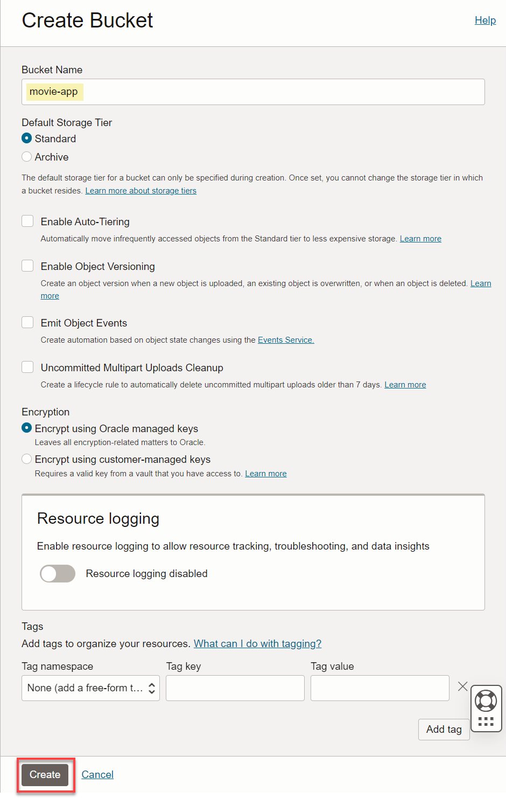

# Allow Users to Connect to Your LLM

## Introduction

You can use different large language models (LLM) with Autonomous Database. In this lab, you will enable the user **`MOVIESTREAM`** to use the LLM that you set up in the previous lab.

Estimated Time: 10 minutes.

### Objectives

In this lab, you will:
* As the `ADMIN` user, enable users to connect to the LLM REST endpoint
* Grant users privileges to use the **Select AI** APIs
* Test app

### Prerequisites
- This lab requires the completion of **Lab 1: Set up Your Workshop Environment** in the **Contents** menu on the left.

## Task 1: Create bucket to host application

1. Naviagte to **Buckets** using the hamburger menu (storage -> buckets)

2. Click **Create Bucket** 

3. Name the bucket, **movie_app** and click **create.** Leave all other fields as default. 



4. Click on the bucket you just made and change visibility to public. 

5. Save changes. 


## Task 2: Create App and deploy to Object Storage bucket

1. Open up Cloud Shell within the OCI Console. 


2. Run the following command:

    ```
    <copy>
    wget enter zip file here 
    unzip movie-app
    cd movie-app
    npm i react-scripts
    npm run deploy 
    </copy>
    ```

## Task 3: Test app 

1. Navigate to bucket and click the ellipses. Click on object details. 

2. Grab the URL and paste into browser. 

3. Observe the movie data is floating around the screen as little dots. You can interact with the dots by clicking and dragging. 

4. Click on Artie to open up the chat bot and ask a question about any of the movies. 

You may now proceed to the next lab.

## Learn More
* [DBMS\_NETWORK\_ACL\_ADMIN PL/SQL Package](https://docs.oracle.com/en/database/oracle/oracle-database/19/arpls/DBMS_NETWORK_ACL_ADMIN.html#GUID-254AE700-B355-4EBC-84B2-8EE32011E692)
* [DBMS\_CLOUD\_AI Package](https://docs.oracle.com/en-us/iaas/autonomous-database-serverless/doc/dbms-cloud-ai-package.html)
* [Using Oracle Autonomous Database Serverless](https://docs.oracle.com/en/cloud/paas/autonomous-database/adbsa/index.html)
* [Overview of Generative AI Service](https://docs.oracle.com/en-us/iaas/Content/generative-ai/overview.htm)

## Acknowledgements
  * **Author:** Marty Gubar, Product Management Lauran K. Serhal, Consulting User Assistance Developer
  * **Contributors:** Stephen Stuart, Nicholas Cusato, Olivia Maxwell, Taylor Rees, Joanna Espinosa, Cloud Engineers 
* **Last Updated By/Date:** Stephen Stuart, February 2024

Data about movies in this workshop were sourced from **Wikipedia**.

Copyright (C)  Oracle Corporation.

Permission is granted to copy, distribute and/or modify this document
under the terms of the GNU Free Documentation License, Version 1.3
or any later version published by the Free Software Foundation;
with no Invariant Sections, no Front-Cover Texts, and no Back-Cover Texts.
A copy of the license is included in the section entitled [GNU Free Documentation License](files/gnu-free-documentation-license.txt)
