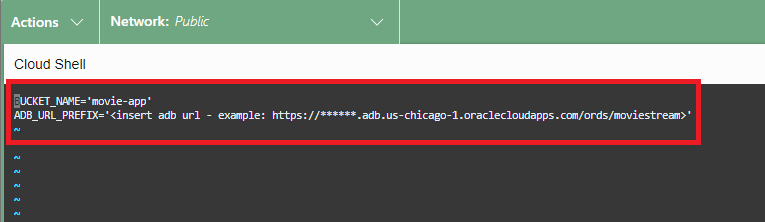

# Deploy the MovieStreamAI App using Object Storage

## Introduction

In order to utilize the APIs created in the previous labs, we have developed an application using Open-Source tools, such as React (Framework for App development) using Typescript (superset of JavaScript). This allows for easy integration of many libraries that available for all sorts of utility, such as integration of OpenMaps (Open-Source mapping tool). The MovieStreamAI Application features the search capability of the Customer Ids to integrate the data stored in the database to several components:
-  Recently Watched Films list
-  Recommended Movies List
-  Recommended Pizza Pairing
-  Mapping of nearby Pizza locations


Here is a preview of what to expect:


Estimated Time: 20 minutes.

### Objectives

In this lab, you will:
* Create a bucket to host the MovieStreamAI application
* Deploy the App Fast using Object Storage
* Understand how to use the API in the MovieStreamAI App

### Prerequisites
- This lab requires the completion of all the preceding labs. 

## Task 1: Create bucket to host application

1. Navigate to **Buckets** using the hamburger menu (storage -> buckets)

2. Click **Create Bucket** 

3. Name the bucket, **movie-app** and click **Create**. Leave all other fields as default. 


4. Click on the bucket you just made and change visibility to **Public**. Click **Save changes**. 


## Task 2: Deploy the App Fast using Object Storage

1. Open up Cloud Shell within the OCI Console. 


2. Run the following command:

    ```
    <copy>
    wget https://adwc4pm.objectstorage.us-chicago-1.oci.customer-oci.com/n/adwc4pm/b/wget-link/o/movie-app.zip
    unzip movie-app
    cd movie-app
    </copy>
    ```
3. Update the config file with the APIs used in the Lab **Allow Users to Connect to Your LLM and Data**. Run the following command to edit the file.

    ```
    <copy>vi ./src/config.ts</copy>
    ```




4. Paste the endpoints into each of the corresponding fields. Press the **Esc** button and then **:wq!** to save and exit.

5.  Run the following commands to Deploy the app.

    ```
    <copy>
    chmod +x node_modules/.bin/react-scripts
    npm run deploy 
    </copy>
    ```

This script does all the deployment in a few simple commands. First, the src files are pulled from the repository and unzipped. The react-scripts are installed, while permissions are enabled for them. The **npm run deploy** script runs both the build and deploy_to_oci.sh script that implements OCI CLI to bulk upload the build directory to the bucket **movie-app**.

## Task 3: Understand how to use the API in the MovieStreamAI App

The web page is hosted in object storage as a light-weight deployment. The script from the previous command **npm run deploy** used a renaming convention to modify the index.html file. This allows the index.html to read the files in the object storage. 

1. Navigate back to **movie-app** bucket and click the ellipsis for the **index.html** object. Click on object details. 


2. Grab the URL and paste into browser. 


3. The web page is made using the parallax effect, which moves object in the foreground at different speeds from the background. If you scroll down the page, subtle animations bring the page to life. Each of the components are organized in a directory in the zip file downloaded. Let's open the file in the **OCI Shell**.

4. View the file **App.tsx** by running the command in the shell.

  ```
  <copy>cat ./src/App.tsx</copy>
  ```

5. Click the **double arrow** in the shell to expand the window.


6. Scroll down to the bottom and notice the return statement that outlines the structure of the app. With the App open, compare the following to better understand the structure.
- First, Parallax is wraps the code so each of the components can move according to the desired effect. The **AdvancedBannerTop** component showcases the effect with the webpage title "MovieStreamAI" floating between the background of the stars and the foreground of the Las Vegas images.
- Secondly, the **{text}** is wrapped in a typewritter effect, which is declared in the script closer to the top.
- Next, the **SearchComponent** fetches the customerData and implements a state change, which displays the RecentlyWatched films cards (click to show the movie details) and Spinner for the ResponseComponent. 
- The **ResponseComponent** uses the {selectedCustID} to pass the variable to the API, which after loading will display a carousel of the recommended movies and details from the **/ai/moviePizzaRecommendation/:cust_id** endpoint. 
- The component **SearchTop** uses a similar Parallax effect as theAdvancedBannerTop component.
- Lastly, the **Map** component pulls the OpenMaps library and displays a map, pulling data from the PizzaShops endpoint.


7. Press **F12** on your keyboard to open the **Browser Developer Tools interface** and select **Network** from the header. Refresh the webpage by pressing **ctrl + r** to load all of data that is being fetched when the App is running. 


8. Give the app a test drive by selecting a **Customer ID** from the dropdown list. Toggle the switch to **OCIAI_COHERE** and hit the **Search** button.


9. The data that is being fetched from the api can be seen in the Browser Developer Tool interface by selecting the endpoints. Click through each of them to see what data is being pulled from the API.
- pizza_shop/
- Customer ID entered in SearchBar (shown 3 times)


10.  Navigating back to the Cloud Shell, notice the **fetch** command in the **App.tsx** that is implemented above the return function described earlier. This pulls the endpoint set earlier in the config file. At the top, it is imported from this file using the following:

  ```import { CUSTOMER_API_URL, PIZZA_SHOP_API_URL } from './config';```


11. Similar fetch commands are implemented in the files **SearchComponent.tsx** and **ResponseComponent.tsx**. Use the following commands to investigate how the api is used in a similar method.

  ```
  <copy>cat ./SearchBar/SearchComponent.tsx</copy>
  ```

  ```
  <copy>cat ./AI/ResponseComponent.tsx</copy>
  ```

12. The Map component is updated with the information pulled from the customer fetch sequence to set the map coordinates to the coordinates pulled from the AutoREST of the Customer API. Investigate this in the App.tsx file for better understanding. This should give you a general understanding of how the APIs are used in the MovieStreamAI app.


You may now proceed to the next lab.

## Learn More
* [DBMS\_NETWORK\_ACL\_ADMIN PL/SQL Package](https://docs.oracle.com/en/database/oracle/oracle-database/19/arpls/DBMS_NETWORK_ACL_ADMIN.html#GUID-254AE700-B355-4EBC-84B2-8EE32011E692)
* [DBMS\_CLOUD\_AI Package](https://docs.oracle.com/en-us/iaas/autonomous-database-serverless/doc/dbms-cloud-ai-package.html)
* [Using Oracle Autonomous Database Serverless](https://docs.oracle.com/en/cloud/paas/autonomous-database/adbsa/index.html)
* [Overview of Generative AI Service](https://docs.oracle.com/en-us/iaas/Content/generative-ai/overview.htm)

## Acknowledgements

  * **Author:** Marty Gubar, Product Management 
  * **Contributors:** 
    * Stephen Stuart, Cloud Engineer 
    * Nicholas Cusato, Cloud Engineer 
    * Olivia Maxwell, Cloud Engineer 
    * Taylor Rees, Cloud Engineer 
    * Joanna Espinosa, Cloud Engineer 
    * Lauran K. Serhal, Consulting User Assistance Developer
* **Last Updated By/Date:** Nicholas Cusato, February 2024

Data about movies in this workshop were sourced from **Wikipedia**.

Copyright (C)  Oracle Corporation.

Permission is granted to copy, distribute and/or modify this document
under the terms of the GNU Free Documentation License, Version 1.3
or any later version published by the Free Software Foundation;
with no Invariant Sections, no Front-Cover Texts, and no Back-Cover Texts.
A copy of the license is included in the section entitled [GNU Free Documentation License](files/gnu-free-documentation-license.txt)
