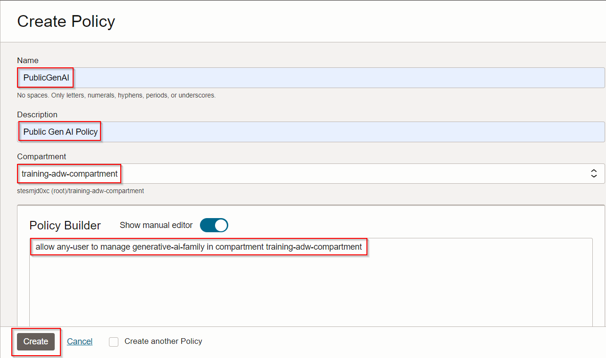
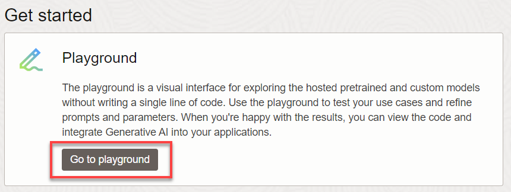
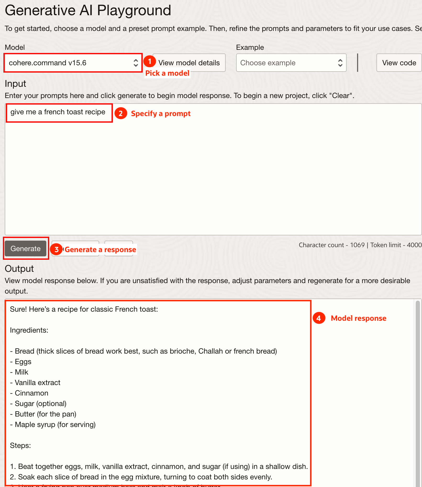

# Explore OCI Generative AI

## Introduction

OCI Generative AI is a fully managed service available via API to seamlessly integrate language models into a wide range of use cases, including writing assistance, summarization, analysis, and chat. You can quickly integrate OCI Generative AI with Autonomous Database to apply AI models to your data.

Estimated Time: 10 minutes.

### Objectives

In this lab, you will:

* Set up a policy that enables access to OCI Generative AI
* Take a quick tour of OCI Generative AI Playground

### Prerequisites

- This lab requires completion of the first two labs in the **Contents** menu on the left.

## Task 1: Create policy to enable access to OCI Generative AI
Create a policy that will allow you to use OCI Generative AI within your previously defined compartment. Make sure to select the compartment where your Autonomous Database is deployed. The policy will be necessary for Autonomous Database to connect to OCI Generative AI.

1. From the **Console,** open the **Navigation** menu and click **Identity & Security.** Under **Identity,** click **Policies.** 

2. Click on **Create policy** and paste the following into the fields:

>**Note:** Select the **Show Manual Editor** to open the field  in order to paste the policy.

* **Name:** **`PublicGenAI`**
* **Description:** **`Public Gen AI Policy`**
* **Compartment:** **`training-adw-compartment`**
* **Policy:** **`allow any-user to manage generative-ai-family in compartment training-adw-compartment`**
    
3. Click **Create**

    
    
>**Note:** This policy allows any Autonomous Database in the specified compartment to access OCI Generative AI. In a production environment, ensure your policy's scope is minimally inclusive.

## Task 2: Explore the Generative AI Playground
Go to the OCI Generative AI Playground and ask some interesting questions.

1. Make sure you are in the US Midwest(Chicago) region:

    

2. From the **Console**, open the **Navigation** menu and click **Analytics & AI**. Under **AI Services**, click **Generative AI.**

3. Go to the Playground and ask some questions!
    
    

   OCI Generative AI supports multiple models. Notice how results change as you try different models and prompts. You will want to test different models and prompts to see which produces the best results for your business.

    

## Summary    
LLMs are amazing, but they don't know about your organization's data. In subsequent labs, you will learn how to use data in Autonomous Database with OCI Generative AI LLMs to summarize support chats and make targeted promotions.

## Learn More
* [Overview of Generative AI Service](https://docs.oracle.com/en-us/iaas/Content/generative-ai/overview.htm)

## Acknowledgements

  * **Author:** Marty Gubar, Product Management 
  * **Contributors:** 
    * Stephen Stuart, Cloud Engineer 
    * Nicholas Cusato, Cloud Engineer 
    * Olivia Maxwell, Cloud Engineer 
    * Taylor Rees, Cloud Engineer 
    * Joanna Espinosa, Cloud Engineer 
    * Lauran K. Serhal, Consulting User Assistance Developer
* **Last Updated By/Date:** Marty Gubar, February 2024

