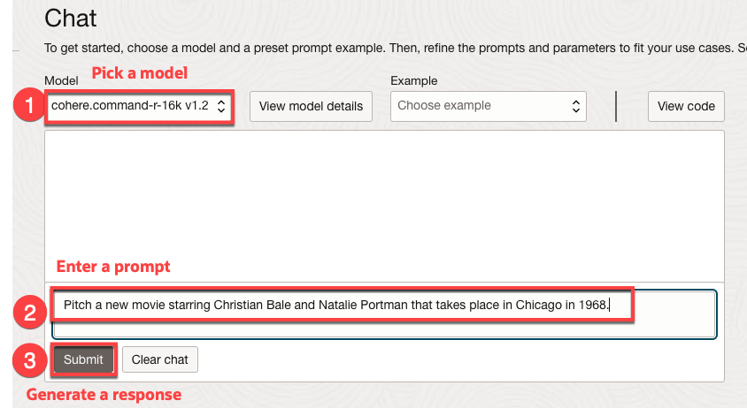

# Explore OCI Generative AI

## Introduction

OCI Generative AI is a fully managed service available via API to seamlessly integrate language models into a wide range of use cases, including writing assistance, summarization, analysis, and chat. You can quickly integrate OCI Generative AI with Autonomous Database to apply AI models to your data.

Estimated Time: 10 minutes.

### Objectives

In this lab, you will:

* Take a quick tour of OCI Generative AI Playground

### Prerequisites

- This lab requires completion of the first two labs in the **Contents** menu on the left.

## Task 1: Explore the Generative AI Playground
Go to the OCI Generative AI Playground and ask some interesting questions.

1. Make sure you are in the US Midwest(Chicago) region:

    

2. From the **Console**, open the **Navigation** menu and click **Analytics & AI**. Under **AI Services**, click **Generative AI.**

3. Click **Go to playground** and ask some questions!
    
    

   OCI Generative AI supports multiple models. Notice how results change as you try different models and prompts. You will want to test different models and prompts to see which produces the best results for your use case.

   Below, we're asking Cohere to generate a movie pitch starring Christian Bale and Natalie Portman that takes place in Chicago in 1968.

    ```
    <copy>
    Pitch a new movie starring Christian Bale and Natalie Portman that takes place in Chicago in 1968.
    </copy>
    ```

    

    


    Cohere generated an interesting movie pitch titled "The Chicago Affair". The pitch Cohere generated for you may be totally different - and that's expected. Feel to try some of your own questions against different models.

## Summary    
LLMs are amazing, but they don't know about your organization's data. In subsequent labs, you will learn how to use data in Autonomous Database with OCI Generative AI LLMs to summarize support chats and make targeted promotions.

## Learn More
* [Overview of Generative AI Service](https://docs.oracle.com/en-us/iaas/Content/generative-ai/overview.htm)

## Acknowledgements

  * **Author:** Marty Gubar, Product Management
  * **Contributors:**
    * Stephen Stuart, Cloud Engineer
    * Nicholas Cusato, Cloud Engineer
    * Olivia Maxwell, Cloud Engineer
    * Taylor Rees, Cloud Engineer
    * Joanna Espinosa, Cloud Engineer
    * Lauran K. Serhal, Consulting User Assistance Developer
* **Last Updated By/Date:** Marty Gubar, August 2024