# Publish AI projects as RESTful services

## Introduction
You can now generate a bedtime story using the `CREATE_STORY` PLSQL procedure. Two JSON collections - `kidFriendlyMovies` and `customerProfiles` - hold the information required to generate your personalized story. The resulting bedtime story is captured in a `stories` collection. This lab will publish that content as RESTful services, allowing them to be consumed by web apps. 

The JSON collections will be published using a simple PLSQL procedure. The `CREATE_STORY` api will be exposed using Autonomous Database's REST designer. The designer lets you create modules that integrate with tools like Swagger or other OpenAPI tools - allowing your endpoints to be centrally managed with your organization's other RESTful APIs.

- RESTful services management 

  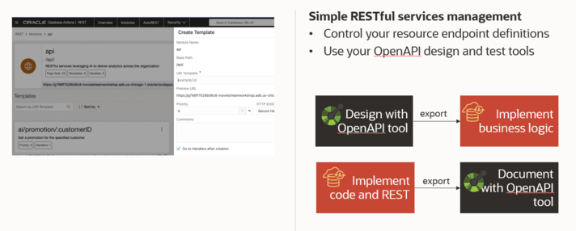

Estimated Time: 20 minutes.

### Objectives

In this lab, you will:
* Expose tables containing JSON collections as REST endpoints
* Access the API using OpenAPI tools
* Design and test RESTful module for your AI project
* Export your project to OpenAPI tools

### Prerequisites
- This lab requires the completion of all of the preceding labs.

## Task 1: Expose JSON collections as RESTful endpoints using PLSQL
**Background:**<br>

The workshop's setup script created three JSON collections that will be accessed by our Python app:
1. kidFriendlyMovies
2. customerProfiles
3. stories

Each of these collections were created using the `dbms_soda.create_collection` function. Here's an example of how the `customerProfiles` collection was created:

```sql
DECLARE 
  l_collection SODA_COLLECTION_T; 
BEGIN 
  l_collection := DBMS_SODA.create_collection('customerProfiles'); 
END;
```
The generated table's DDL is listed below:
```sql
CREATE TABLE "customerProfiles" 
   (	
    "ID" VARCHAR2(255 BYTE) , 
    "CREATED_ON" TIMESTAMP (6),
	  "LAST_MODIFIED" TIMESTAMP,
	  "VERSION" VARCHAR2(255 BYTE),
	  "JSON_DOCUMENT" BLOB
   );
ALTER TABLE "customerProfiles" MODIFY ("ID" NOT NULL ENABLE);
ALTER TABLE "customerProfiles" MODIFY ("CREATED_ON" NOT NULL ENABLE);
ALTER TABLE "customerProfiles" MODIFY ("LAST_MODIFIED" NOT NULL ENABLE);
ALTER TABLE "customerProfiles" MODIFY ("VERSION" NOT NULL ENABLE);
ALTER TABLE "customerProfiles" ADD CHECK ("JSON_DOCUMENT" is json format oson (size limit 32m)) ENABLE;
ALTER TABLE "customerProfiles" ADD PRIMARY KEY ("ID") USING INDEX  ENABLE;
```
The `JSON_DOCUMENT` column contains the actual JSON content. It is stored in a OSON format that is optimized for both efficient storage and fast retrieval.

**Make these collections available over REST**<br>
You will use two procedures to make the collections available over REST. 
1. Sign into the SQL worksheet as the **MOVIESTREAM** user with the password **watchS0meMovies#**.
2. Enable your schema for Oracle REST Data Services(ORDS) access. See the code comments for the meaning of the fields. Copy and paste the following code into your SQL Worksheet, and then click the **Run Script** icon:
    ```sql
    <copy>
    BEGIN
      ORDS.ENABLE_SCHEMA (
          p_enabled             => TRUE,  -- enable the schema for RESTful access
          p_schema              => 'MOVIESTREAM', -- the name of the schema
          p_url_mapping_type    => 'BASE_PATH', -- the schema's REST services will be accessible under a specific URL path segment
          p_url_mapping_pattern => 'moviestream', -- mapping the schema name to the URL segment
          p_auto_rest_auth      => FALSE -- controls whether user authorization is required to access the RESTful services metadata catalog of this schema
          );
    END;
    commit;
    /
    </copy>
    ```
    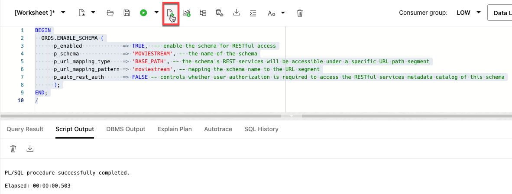

3. Next, make the SODA collections available without requiring authentication. Copy and paste the following code into your SQL Worksheet, and then click the **Run Script** icon:
    ```sql
    <copy>
    BEGIN
      ORDS.DELETE_PRIVILEGE_MAPPING('oracle.soda.privilege.developer', '/soda/*');
      commit;
    END;
    /
    </copy>
    ```  
  >**Note:** We are simplifying the workshop by disabling secure access. This is **NOT** a good practice and should not be done in a production environment. To learn more about securing REST endpoints, go to [Configuring Secure Access to RESTful Services.](https://docs.oracle.com/en/database/oracle/oracle-rest-data-services/18.4/aelig/developing-REST-applications.html#GUID-5B39A5A6-C55D-452D-AE53-F49431A4DE97).

  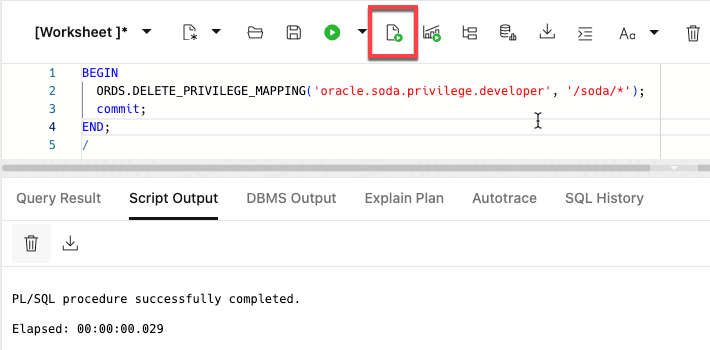

That's it! Your table is now available via REST.

## Task 2: Access a collection using your new REST endpoint
You can test the REST endpoint from a command prompt using the **cURL** command. 

1. Go to the SQL Worksheet and copy the first part of the URL. Save this to a text file - you will need it later!
  

2. Create the fully formed URL to retrieve all of the `customerProfiles`. Add **`/soda/latest/customerProfiles`** to the URL you just copied:
    ```
    https://your-location.oraclecloudapps.com/ords/moviestream/soda/latest/customerProfiles
    ```

    Make sure you replace **`your-location`** to match your URL.


3. Copy and past the URL into a new browser window. You will see all of the customer profiles:
  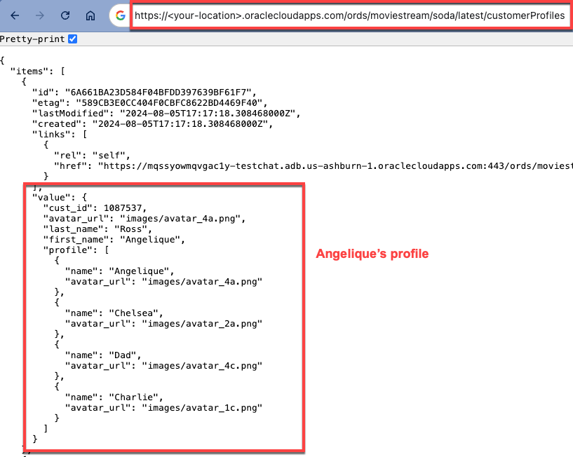
  
## Task 3: Create REST API for creating a bedtime story using a module
You will now create a REST API that will use GenAI to create your personalized bedtime story. You can design your APIs using Autonomous Database's REST design tool. Start by creating an API module. See the [Getting Started with RESTful Services](https://docs.oracle.com/en/database/oracle/oracle-rest-data-services/23.4/orddg/developing-REST-applications.html#GUID-25DBE336-30F6-4265-A422-A27413A1C187) documentation for additional information.

1. Ensure that you are still logged in as **MOVIESTREAM** user. Click the **Selector** (hamburger) in the banner, and then click **REST**.
  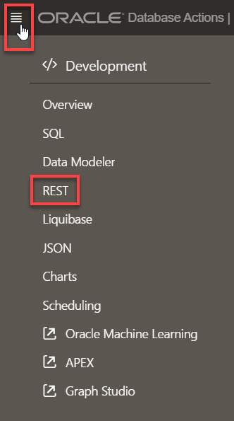

2. View the list of modules. In the REST tool, click the **Modules** tab.
  

  A module named **api** was created by the Terraform script.
  
  

3. Let's create a new module that the **Bedtime Story** app can use. Click **Create Module**.

4. Specify the following for the new module. Make sure all the fields match the image below. Next, click **Create**.

    * **Name:** `apiapp`
    * **Base Path:** `/apiapp/`
    * **Protected By Privilege:** `Not Protected`
  
      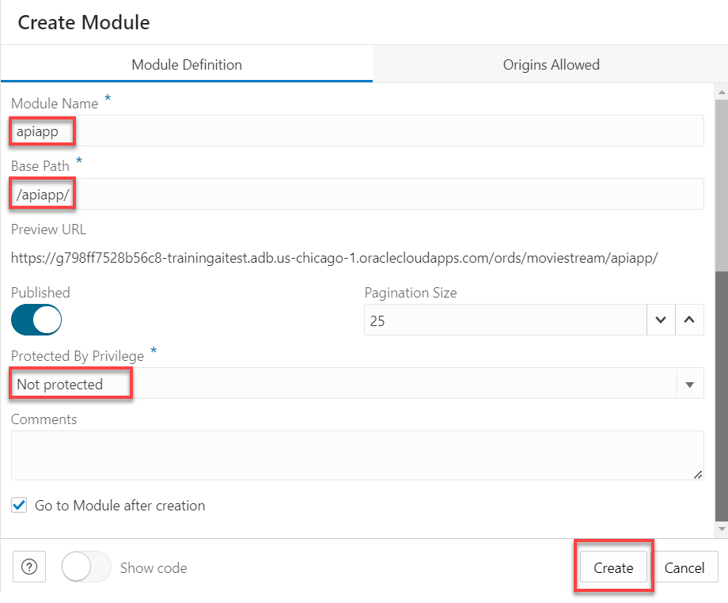
 
5. The newly created **apiapp** module is displayed. From here, we will create a template that will provide our RESTful service. 

6. Create the **bedtimestory** template. Click **Create Template**. The **Create Template** panel is displayed.

  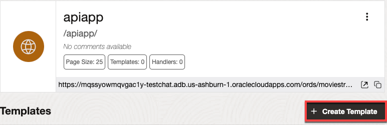

7. In the **URI Template** field, enter **`bedtimestory/create`** as the name for the template. Then click **Create**.

    >**Note:** Use the exact name, **`bedtimestory/create`**. Our Django app is expecting that name.

  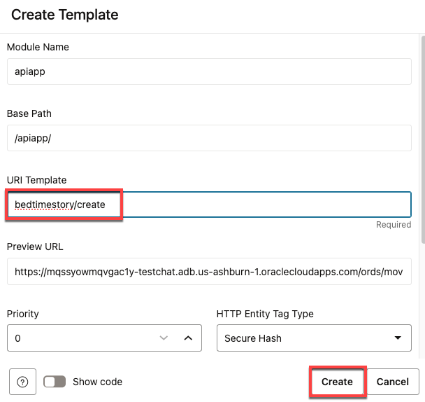

8. Click **Create Handler** to implement the API. The handler will call the **`create_story`** procedure and take the customer id, story characters and movies as parameters. It will output the title and story

  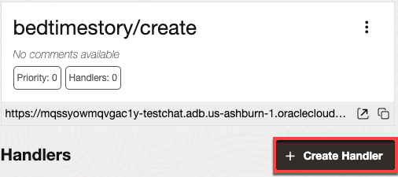

9. Complete the handler form:
    * Select **Method: POST**
    * Select **Source Type: PL/SQL**
    * Copy and paste the following code into **Source** field, and then click **Create**.

      ```
      <copy>
      begin
        create_story (
            cust_id => :cust_id,
            characters => :characters,
            movies => :movies,
            title => :title,
            story => :story
            );
      end;
      </copy>
      ```

      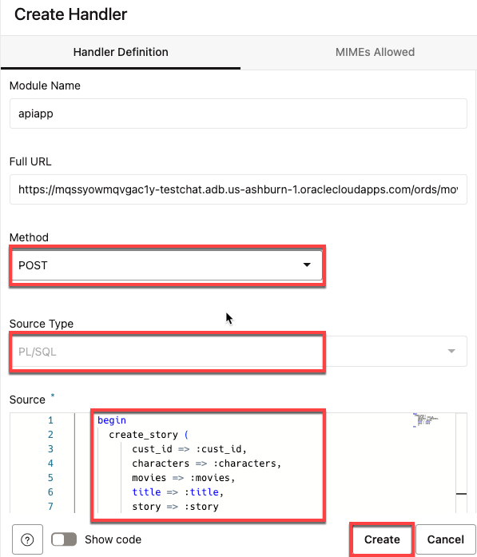

  The code has 5 parameters that you will define in the next step:
    * **cust_id** - the customer creating the story
    * **characters** - the characters that will be featured in the story
    * **movies** - the movies that will be used as a basis for the story
    * **title** - the title output by the procedure
    * **story** - the story output by the procedure

10. Click **Create Parameter**.
  
  

11. Specify the following in the **Create Parameter** panel.

    * **Parameter Name:** `cust_id`
    * **Bind Variable Name:** `cust_id`
    * **Source Type:** `Header`
    * **Parameter Type:** `INT`
    * **Access Method:** `Input`
    * **Comments:** `Story created for this customer id`

    The completed panel should look as follows:

    

12. Click **Create**. The new parameter is displayed.

      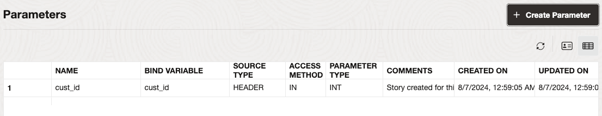

13. Repeat steps 10-12 for the following new parameters:

    * **Parameter Name:** `characters`
    * **Bind Variable Name:** `characters`
    * **Source Type:** `Header`
    * **Parameter Type:** `STRING`
    * **Access Method:** `Input`
    * **Comments:** `This is the list of characters that will appear in the story.    They come from your customer profile and your friends. Pass an array of names:["Sari", "Mom"]`

14. Repeat steps 10-12 for the following new parameters:

    * **Parameter Name:** `movies`
    * **Bind Variable Name:** `movies`
    * **Source Type:** `Header`
    * **Parameter Type:** `STRING`
    * **Access Method:** `Input`
    * **Comments:** `The list of movies that the bedtime story will be based on. This should be passed as an array: ["Big", "Finding Nemo"]`    

15. Repeat steps 10-12 for the following new parameters:

    * **Parameter Name:** `title`
    * **Bind Variable Name:** `title`
    * **Source Type:** `Response`
    * **Parameter Type:** `STRING`
    * **Access Method:** `Output`
    * **Comments:** `The generated title for the story`    

16. Repeat steps 10-12 for the following new parameters:

    * **Parameter Name:** `story`
    * **Bind Variable Name:** `story`
    * **Source Type:** `Response`
    * **Parameter Type:** `STRING`
    * **Access Method:** `Output`
    * **Comments:** `The generated story`    

The completed list of parameters is shown below:

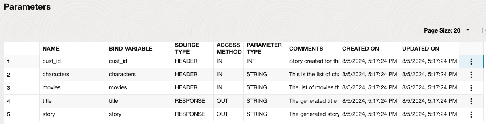

That's it. You'll test this and other APIs in our next lab using the OpenAPI integration.


## Summary
Your APIs are now available! You can test the APIs using the built-in OpenAPI tool or publish the APIs to your favorite OpenAPI tools.

You may now proceed to the next lab.

## Learn More
* [Simple Oracle Document Access (SODA)](https://docs.oracle.com/en/database/oracle/simple-oracle-document-access/)
* [Creating RESTful Web Services](https://docs.oracle.com/en/database/oracle/sql-developer-web/sdwad/creating-restful-services.html#GUID-5E5D3FFD-05FD-42C4-A1C1-A5F237B50D39)
* [Using Oracle Autonomous Database Serverless](https://docs.oracle.com/en/cloud/paas/autonomous-database/adbsa/index.html)

## Acknowledgements

  * **Author:** Marty Gubar, Product Management 
  * **Contributors:** 
    * Stephen Stuart, Cloud Engineer 
    * Nicholas Cusato, Cloud Engineer 
    * Lauran K. Serhal, Consulting User Assistance Developer
    * Olivia Maxwell, Cloud Engineer 
    * Taylor Rees, Cloud Engineer 
    * Joanna Espinosa, Cloud Engineer 
* **Last Updated By/Date:** Marty Gubar, Aug 2024

Data about movies in this workshop were sourced from **Wikipedia**.

Copyright (c) 2024 Oracle Corporation.

Permission is granted to copy, distribute and/or modify this document
under the terms of the GNU Free Documentation License, Version 1.3
or any later version published by the Free Software Foundation;
with no Invariant Sections, no Front-Cover Texts, and no Back-Cover Texts.
A copy of the license is included in the section entitled [GNU Free Documentation License](files/gnu-free-documentation-license.txt)
