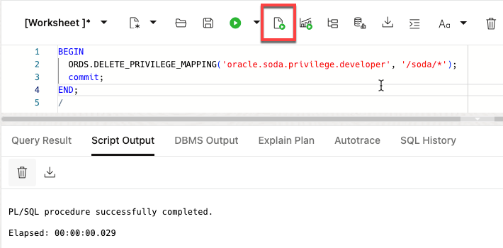

# Publish AI projects as RESTful services

## Introduction
You can now generate a bedtime story using the `CREATE_STORY` PLSQL procedure. Two JSON collections - `kidFriendlyMovies` and `customerProfiles` - hold the information required to generate your personalized story. The resulting bedtime story is captured in a `stories` collection. This lab will publish that content as RESTful services, allowing them to be consumed by web apps. 

The JSON collections will be published using a simple PLSQL procedure. The `CREATE_STORY` api will be exposed using Autonomous Database's REST designer. The designer lets you create modules that integrate with tools like Swagger or other OpenAPI tools - allowing your endpoints to be centrally managed with your organization's other RESTful APIs.

- RESTful services management 

  

Estimated Time: 20 minutes.

### Objectives

In this lab, you will:
* Expose tables containing JSON collections as REST endpoints
* Access the API using OpenAPI tools
* Design and test RESTful module for your AI project
* Export your project to OpenAPI tools

### Prerequisites
- This lab requires the completion of all of the preceding labs.

## Task 1: Expose JSON collections as RESTful endpoints using PLSQL
**Background:**<br>

The workshop's setup script created three JSON collections that will be accessed by our Python app:
1. kidFriendlyMovies
2. customerProfiles
3. stories

Each of these collections were created using the `dbms_soda.create_collection` function. Here's an example of how the `customerProfiles` collection was created:

```sql
DECLARE 
  l_collection SODA_COLLECTION_T; 
BEGIN 
  l_collection := DBMS_SODA.create_collection('customerProfiles'); 
END;
```
The generated table's DDL is listed below:
```sql
CREATE TABLE "customerProfiles" 
   (	
    "ID" VARCHAR2(255 BYTE) , 
    "CREATED_ON" TIMESTAMP (6),
	  "LAST_MODIFIED" TIMESTAMP,
	  "VERSION" VARCHAR2(255 BYTE),
	  "JSON_DOCUMENT" BLOB
   );
ALTER TABLE "customerProfiles" MODIFY ("ID" NOT NULL ENABLE);
ALTER TABLE "customerProfiles" MODIFY ("CREATED_ON" NOT NULL ENABLE);
ALTER TABLE "customerProfiles" MODIFY ("LAST_MODIFIED" NOT NULL ENABLE);
ALTER TABLE "customerProfiles" MODIFY ("VERSION" NOT NULL ENABLE);
ALTER TABLE "customerProfiles" ADD CHECK ("JSON_DOCUMENT" is json format oson (size limit 32m)) ENABLE;
ALTER TABLE "customerProfiles" ADD PRIMARY KEY ("ID") USING INDEX  ENABLE;
```
The `JSON_DOCUMENT` column contains the actual JSON content. It is stored in a OSON format that is optimized for both efficient storage and fast retrieval.

**Make these collections available over REST**<br>
You will use two procedures to make the collections available over REST. 
1. Sign into the SQL worksheet as the **MOVIESTREAM** user with the password **watchS0meMovies#**.
2. Enable your schema for Oracle REST Data Services(ORDS) access. See the code comments for the meaning of the fields. Copy and paste the following code into your SQL Worksheet, and then click the **Run Script** icon:
    ```sql
    <copy>
    BEGIN
      ORDS.ENABLE_SCHEMA (
          p_enabled             => TRUE,  -- enable the schema for RESTful access
          p_schema              => 'MOVIESTREAM', -- the name of the schema
          p_url_mapping_type    => 'BASE_PATH', -- the schema's REST services will be accessible under a specific URL path segment
          p_url_mapping_pattern => 'moviestream', -- mapping the schema name to the URL segment
          p_auto_rest_auth      => FALSE -- controls whether user authorization is required to access the RESTful services metadata catalog of this schema
          );
    END;
    commit;
    /
    </copy>
    ```
    

3. Next, make the SODA collections available without requiring authentication. Copy and paste the following code into your SQL Worksheet, and then click the **Run Script** icon:
    ```sql
    <copy>
    BEGIN
      ORDS.DELETE_PRIVILEGE_MAPPING('oracle.soda.privilege.developer', '/soda/*');
      commit;
    END;
    /
    </copy>
    ```  
  >**Note:** We are simplifying the workshop by disabling secure access. This is **NOT** a good practice and should not be done in a production environment. To learn more about securing REST endpoints, go to [Configuring Secure Access to RESTful Services.](https://docs.oracle.com/en/database/oracle/oracle-rest-data-services/18.4/aelig/developing-REST-applications.html#GUID-5B39A5A6-C55D-452D-AE53-F49431A4DE97).

  

That's it! Your table is now available via REST.

## Task 2: Access a collection using your new REST endpoint
You can test the REST endpoint from a command prompt using the **cURL** command. 

1. Go to the SQL Worksheet and copy the first part of the URL. Save this to a text file - you will need it later!
  

2. Create the fully formed URL to retrieve all of the `customerProfiles`. Add **`/soda/latest/customerProfiles`** to the URL you just copied:
    ```
    https://your-location.oraclecloudapps.com/ords/moviestream/soda/latest/customerProfiles
    ```

    Make sure you replace **`your-location`** to match your URL.


3. Copy and past the URL into a new browser window. You will see all of the customer profiles:
  
  
## Task 3: Create REST API for generating a bedtime story using PLSQL
You can create REST APIs using both PLSQL and the REST designer. We'll create the bedtime story REST endpoint using PLSQL and then review it using the designer. 

The following PLSQL API calls perform the following tasks:
* Creates a module called **apiapp** that represents a group of related services and is part of the URL path
* In that module, defines a REST template called **bedtimestory/create** that will handle requests for creating a bedtime story
* In that template, defines a handler that describes how to process the request. Here, it calls the **create_story** procedure that was reviewed in the previous lab.
* Creates several parameters for the procedure's inputs and output

1. Copy/paste the following PLSQL block in the SQL Worksheet as the MOVIESTREAM user and then click **Run Statement**:
  ```sql
  <copy>
  BEGIN
      
    ORDS.DEFINE_MODULE(
        p_module_name    => 'apiapp',
        p_base_path      => '/apiapp/',
        p_items_per_page => 25,
        p_status         => 'PUBLISHED',
        p_comments       => 'RESTful services leveraging AI to deliver analytics across the organization');

    ORDS.DEFINE_TEMPLATE(
        p_module_name    => 'apiapp',
        p_pattern        => 'bedtimestory/create',
        p_priority       => 0,
        p_etag_type      => 'HASH',
        p_etag_query     => NULL,
        p_comments       => NULL);

    ORDS.DEFINE_HANDLER(
        p_module_name    => 'apiapp',
        p_pattern        => 'bedtimestory/create',
        p_method         => 'POST',
        p_source_type    => 'plsql/block',
        p_items_per_page => 25,
        p_mimes_allowed  => NULL,
        p_comments       => NULL,
        p_source         => 
  'begin
      create_story (
          cust_id => :cust_id,
          characters => :characters,
          movies => :movies,
          title => :title,
          story => :story
          );
      end;');

    ORDS.DEFINE_PARAMETER(
        p_module_name        => 'apiapp',
        p_pattern            => 'bedtimestory/create',
        p_method             => 'POST',
        p_name               => 'cust_id',
        p_bind_variable_name => 'cust_id',
        p_source_type        => 'HEADER',
        p_param_type         => 'INT',
        p_access_method      => 'IN',
        p_comments           => 'Story created for this customer id');

    ORDS.DEFINE_PARAMETER(
        p_module_name        => 'apiapp',
        p_pattern            => 'bedtimestory/create',
        p_method             => 'POST',
        p_name               => 'characters',
        p_bind_variable_name => 'characters',
        p_source_type        => 'HEADER',
        p_param_type         => 'STRING',
        p_access_method      => 'IN',
        p_comments           => 'This is the list of characters that will appear in the story. They come from your customer profile and your friends.
      Pass an array of names:
      ["Sari", "Mom"]');

    ORDS.DEFINE_PARAMETER(
        p_module_name        => 'apiapp',
        p_pattern            => 'bedtimestory/create',
        p_method             => 'POST',
        p_name               => 'movies',
        p_bind_variable_name => 'movies',
        p_source_type        => 'HEADER',
        p_param_type         => 'STRING',
        p_access_method      => 'IN',
        p_comments           => 'The list of movies that the bedtime story will be based on. This should be passed as an array:
      ["Big", "Finding Nemo"]');

    ORDS.DEFINE_PARAMETER(
        p_module_name        => 'apiapp',
        p_pattern            => 'bedtimestory/create',
        p_method             => 'POST',
        p_name               => 'title',
        p_bind_variable_name => 'title',
        p_source_type        => 'RESPONSE',
        p_param_type         => 'STRING',
        p_access_method      => 'OUT',
        p_comments           => 'The generated title for the story');

    ORDS.DEFINE_PARAMETER(
        p_module_name        => 'apiapp',
        p_pattern            => 'bedtimestory/create',
        p_method             => 'POST',
        p_name               => 'story',
        p_bind_variable_name => 'story',
        p_source_type        => 'RESPONSE',
        p_param_type         => 'STRING',
        p_access_method      => 'OUT',
        p_comments           => 'The generated story.');
          
  COMMIT;

  END;
  /
  </copy>
  ```
  

> **Note:** You can also create REST APIs using the REST designer. You can see details about how that's done [in the documentation](https://docs.oracle.com/en/database/oracle/sql-developer-web/sdwad/creating-restful-services.html#GUID-3583910E-C360-4449-9243-CD0AAD3BF211).

That's it. You'll test this and other APIs in our next lab using the REST designer and OpenAPI integration.


## Summary
Your APIs are now available! You can test the APIs using the built-in OpenAPI tool or publish the APIs to your favorite OpenAPI tools.

You may now proceed to the next lab.

## Learn More
* [Simple Oracle Document Access (SODA)](https://docs.oracle.com/en/database/oracle/simple-oracle-document-access/)
* [Creating RESTful Web Services](https://docs.oracle.com/en/database/oracle/sql-developer-web/sdwad/creating-restful-services.html#GUID-5E5D3FFD-05FD-42C4-A1C1-A5F237B50D39)
* [Using Oracle Autonomous Database Serverless](https://docs.oracle.com/en/cloud/paas/autonomous-database/adbsa/index.html)

## Acknowledgements

  * **Author:** Marty Gubar, Product Management 
  * **Contributors:** 
    * Stephen Stuart, Cloud Engineer 
    * Nicholas Cusato, Cloud Engineer 
    * Lauran K. Serhal, Consulting User Assistance Developer
    * Olivia Maxwell, Cloud Engineer 
    * Taylor Rees, Cloud Engineer 
    * Joanna Espinosa, Cloud Engineer 
* **Last Updated By/Date:** Marty Gubar, Aug 2024

Data about movies in this workshop were sourced from **Wikipedia**.

Copyright (c) 2024 Oracle Corporation.

Permission is granted to copy, distribute and/or modify this document
under the terms of the GNU Free Documentation License, Version 1.3
or any later version published by the Free Software Foundation;
with no Invariant Sections, no Front-Cover Texts, and no Back-Cover Texts.
A copy of the license is included in the section entitled [GNU Free Documentation License](files/gnu-free-documentation-license.txt)
