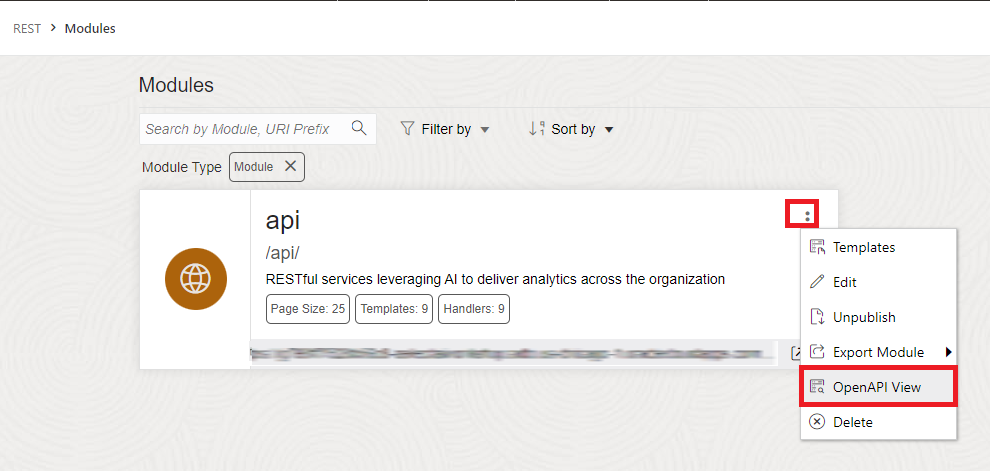
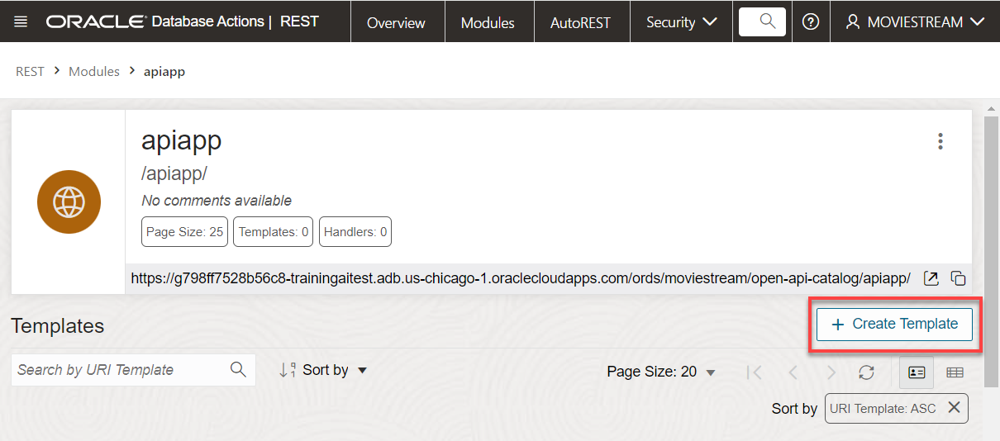
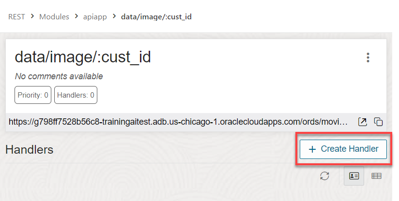
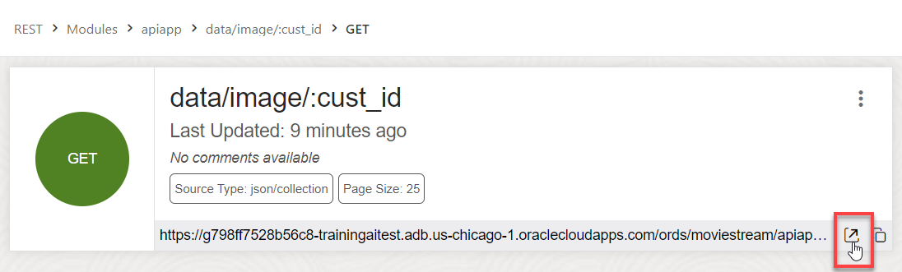

# Allow Users to Connect to Your LLM

## Introduction

You can use different large language models (LLM) with Autonomous Database. In this lab, you will enable the user **`MOVIESTREAM`** to use the LLM that you set up in the previous lab. 

This lab will implement two different types of RESTful services. First, AutoREST can be published quickly and efficiently with only a couple clicks. Secondly, RESTful modules can be created to impelement PL/SQL blocks and SQL queries from an API and managed using the service manager. 

- AutoREST  


- RESTful services management 


Estimated Time: 10 minutes.

### Objectives

In this lab, you will:
* Expose tables as REST endpoint
* Test the REST endpoint
* Access the API using OpenAPI (Swagger) tool
* Create module for API 

### Prerequisites
- This lab requires the completion of all of the preceding labs. 

## Task 1: Expose as a REST Endpoint. 

1. Ensure that you are logged in as **MOVIESTREAM** user. In the Navigator, select **CUSTOMER.** 


2. Right click and select **REST** -> **Enable.**


3. Click **Enable.**


## Task 2: Try the REST Endpoint. 

1. On the **Oracle Database Actions | SQL banner,** click the hamburger menu and select **REST.** Click **AutoREST** at the top of the page.


2. Click the **Open in new tab** icon for the table CUSTOMER to test the API. 


Notice that all of the records are displayed in json format without any filters. This api is unprotected and open to the public for consumption. In a production environment with senstive information, it is a best practice to require authentication to the AutoRest Enabled table, which can be accomplished by selecting the ellipsis, clicking edit, then toggling the switch when editting the REST Enabled Object.


In this example, let's leave it as default. 

## Task 3: (Optional) Access the API using OpenAPI (Swagger) tool. 

1. Navigate back to the REST object exporer by clicking **REST** in the breadcrumbs bar. 


2. In the **Objects** section, click **Modules.**


   
3. Click the ellipsis **icon** for the module **api** and select **OpenAPI View** from the context menu.



4. Scroll down to the GET for **/ai/supportChatSummary/{chatID}** and click the **arrow** to expand the field.  

5. Enter **1** into the **ChatID** field, and then click **Execute.** The number 1 represents a view of a customer ID that was short-handed. Typing any customer ID would produce a similar result.


Notice the response shows a summary of a chat with a customer. The Cohere model also, describes the sentiment related to it.

6. Additionally, the fields **/ai/thingsToDo/{customerID}** and **/ai/promotion/{customerID}** produces a similar effect. Give them a try before proceeding to the next task.

## Task 4: Create Module for API.

Since there is already a module named **api** that was created by the Terraform script, let's create a new module that the **MovieStreamAI** app will use. 

1. Using the breadcrumb menu, select **Modules**.


2. Click **Create Module.** 


3. Name the Module, Base Path, and make sure all the fields match the image and click **Create.**

* **Name:** **`apiapp`**
* **Base Path:** **`/apiapp/`** 
 
5. Click on the newly created module **apiapp**. From here, we will create multiple templates for the api to call. The endpoints will be designated by either data collection (named **/data/**) or ai generated responses (named **/ai/**). First, let's create the data collection api for the **recently watched movies**.

6. Click **Create Template.** 



7. Enter a name for the template such as **:/data/image/:cust_id** and then click **Create**. 


8. Click **Create Handler**.



9.  Paste the following into **Source** and click **Create**.

  ```
  <copy>
  SELECT 
      M.image_url,
      M.year,
      M.main_subject,
      M.awards,
      M.summary,
      M.gross,
      M.runtime
  FROM 
      MOVIESTREAM.STREAMS S
  JOIN 
      MOVIESTREAM.MOVIES M ON S.MOVIE_ID = M.MOVIE_ID
  WHERE 
      S.CUST_ID = :cust_id
  ORDER BY 
      S.DAY_ID DESC
  FETCH FIRST 3 ROWS ONLY
  </copy>
  ```


10.  Click **Create Parameter**.
  


11. Provide a name for the **Parameter** and the **Bind Variable.** Change the **Source Type** from **Header** to **URI.** Change the **Parameter Type** from **String** to **Integer.** Next, click **Create.** 

* **Parameter Name:** **`cust_id`**
* **Bind Variable Name:** **`cust_id`**


## Task 5: Test the module

1. Click **Open in new tab** icon and enter **1000001** for the **cust_id.**




2. Notice the API displays a JSON response containing an URL for images of the 3 most recently watched movies for only 1 customer, along with some additional details about the movie. 

## Task 6: Create module template for natural language query API. 

1. Click **apiapp** in the breadcrumbs. Let's create another template for the AI generated response (**/ai/**).

2. Click **Create Template**. 


3. Enter a name for the URI template such as **ai/moviePizzaRecommendation/:cust_id** and then click **Create.** 


4. Click **Create Handler**.


5. Change the source type to **PL/SQL**, paste the following into **Source**, and click **Create**. Here we have designated 3 parameters: 
* **:summary** - defines the response for easy parsing.
* **:cust_id** - passes the variable from the uri into the pl/sql block.
* **:profile_name** - allows for comparison between the two models in the app by passing the variable from the header.

```
  <copy>
  begin
      :summary := genai.get_response ( 
          query_parameter => :cust_id,
          project_id => 4,
          profile_name => :profile_name);
  end;
  </copy>
  ```


The **`genai.get_response`** is a PL/SQL package function is created by the Terraform script. To view the package, navigate to the SQL Worksheet and then select **Packages** from the **Object Viewer** drop-down list in the **Navigator** pane as follows: 


6. Click **Create Parameter**.


7. Name the Parameter and the Bind Variable, change the source type from header to **URI**, and then click **Create**.

  * **Parameter Name:** **`cust_id`**
  * **Bind Variable Name:** **`cust_id`**

8. Click **Create Parameter** again.

9. Name the Parameter and the Bind Variable. Click **Create**.

  * **Parameter Name:** **`profile_name`**
  * **Bind Variable Name:** **`profile_name`**

10. Click **Create Parameter** one more time.

11. Name the Parameter and the Bind Variable, change the source type from header to **RESPONSE**. Click **Create**.

  * **Parameter Name:** **`response`**
  * **Bind Variable Name:** **`response`**

The completed **/ai/moviePizzaRecommendation/:cust_id** module is shown below:


You may now proceed to the next lab.

## Learn More
* [DBMS\_NETWORK\_ACL\_ADMIN PL/SQL Package](https://docs.oracle.com/en/database/oracle/oracle-database/19/arpls/DBMS_NETWORK_ACL_ADMIN.html#GUID-254AE700-B355-4EBC-84B2-8EE32011E692)
* [DBMS\_CLOUD\_AI Package](https://docs.oracle.com/en-us/iaas/autonomous-database-serverless/doc/dbms-cloud-ai-package.html)
* [Using Oracle Autonomous Database Serverless](https://docs.oracle.com/en/cloud/paas/autonomous-database/adbsa/index.html)
* [Overview of Generative AI Service](https://docs.oracle.com/en-us/iaas/Content/generative-ai/overview.htm)

## Acknowledgements

  * **Author:** Marty Gubar, Product Management 
  * **Contributors:** 
    * Stephen Stuart, Cloud Engineer 
    * Nicholas Cusato, Cloud Engineer 
    * Olivia Maxwell, Cloud Engineer 
    * Taylor Rees, Cloud Engineer 
    * Joanna Espinosa, Cloud Engineer 
    * Lauran K. Serhal, Consulting User Assistance Developer
* **Last Updated By/Date:** Nicholas Cusato, February 2024

Data about movies in this workshop were sourced from **Wikipedia**.

Copyright (C)  Oracle Corporation.

Permission is granted to copy, distribute and/or modify this document
under the terms of the GNU Free Documentation License, Version 1.3
or any later version published by the Free Software Foundation;
with no Invariant Sections, no Front-Cover Texts, and no Back-Cover Texts.
A copy of the license is included in the section entitled [GNU Free Documentation License](files/gnu-free-documentation-license.txt)
