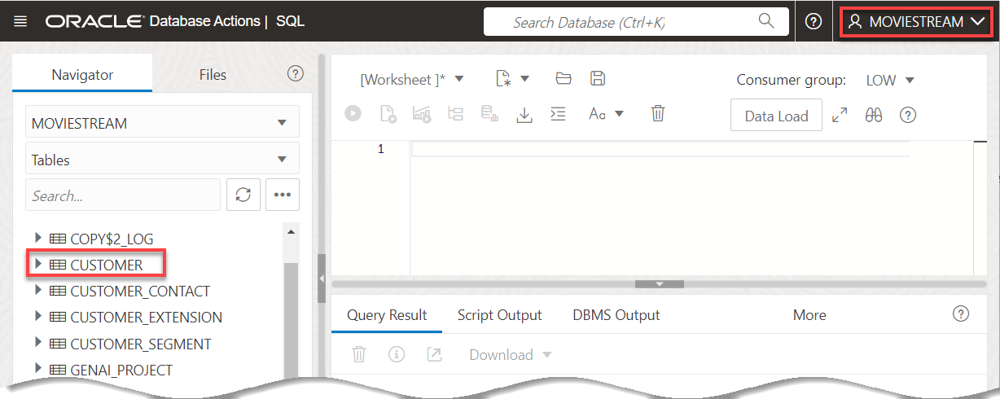
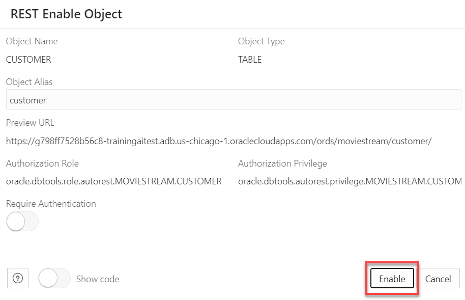
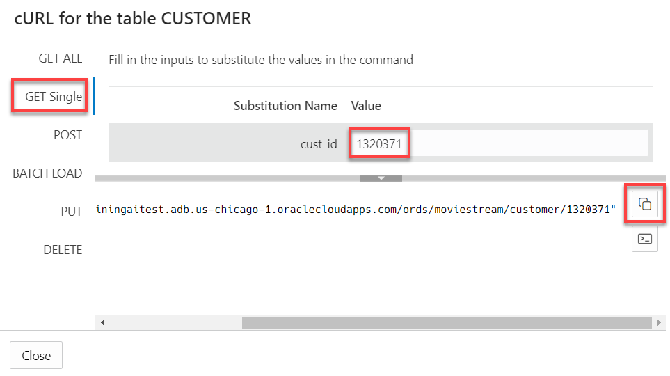
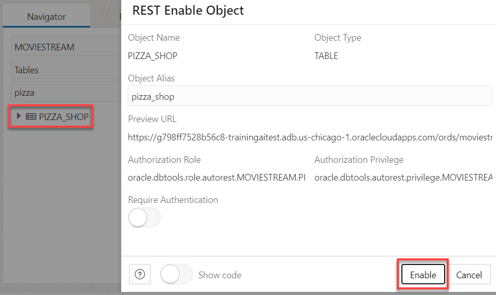
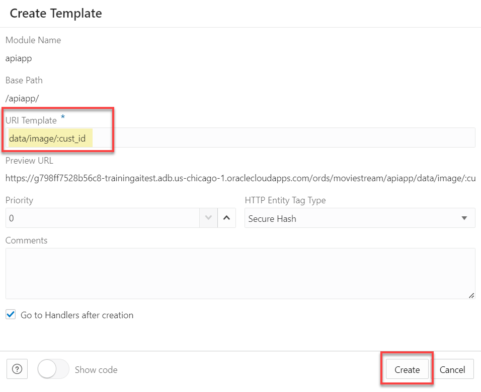
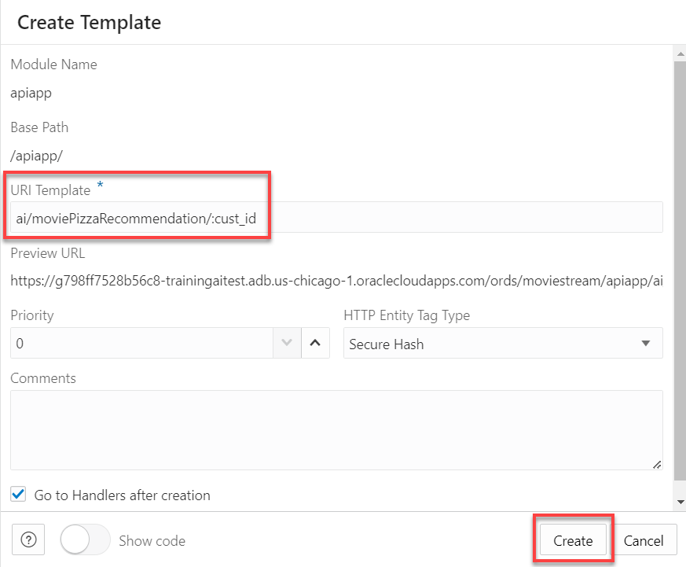
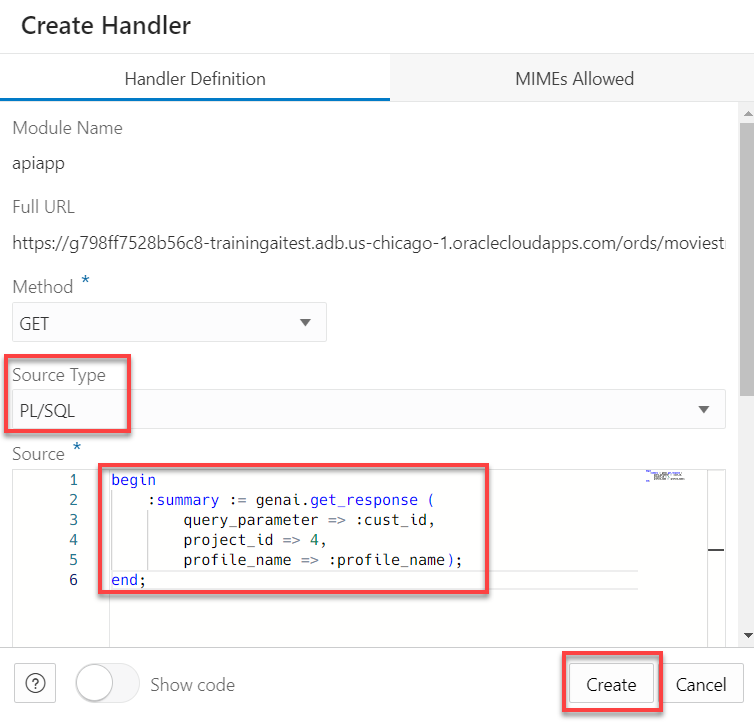
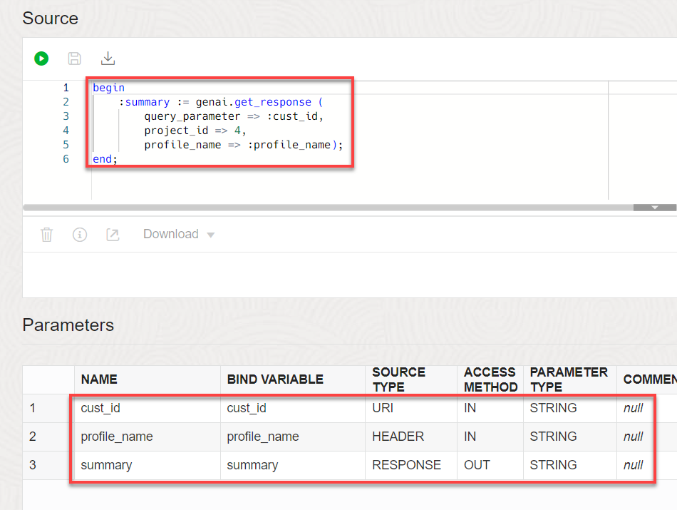

# Publish AI projects as RESTful services

## Introduction
You created a GenAI project that recommends movies and creates a localized pizza offer. Now, expose that project as a RESTful service.

This lab will implement two different types of RESTful services. First, AutoREST lets you publish a RESTful service quickly and efficiently with only a couple clicks. Second, RESTful modules give you a bit more flexiblity. For example, you can define signatures for those REST endpoints using Swagger or other OpenAPI tools - and then import those definitions into Autonomous Database. After import, you use Autonomous Database's REST editor to implement the handlers for the endpoints.

- AutoREST  

  

- RESTful services management 

  

Estimated Time: 20 minutes.

### Objectives

In this lab, you will:
* Expose tables as REST endpoint
* Test the REST endpoints
* Access the API using OpenAPI tools
* Design and test RESTful module for your AI project
* Export your project to OpenAPI tools

### Prerequisites
- This lab requires the completion of all of the preceding labs. 

## Task 1: Create customer and pizza shop REST endpoints using AutoREST
Start by providing access to customer data using AutoREST. This is the easiest way to enable RESTful access to data in Autonomous Database:

1. Ensure that you are logged in as **MOVIESTREAM** user. In the Navigator, select **CUSTOMER.** 

  

2. Right-click and select **REST** -> **Enable.**

  

3. In the **REST Enable Object** dialog, click **Enable**.

  

  That's it! Your table is now available via REST.

  >**Note:** The API can be secured by selecting **Require Authentication**. We will keep things simple and not require authentication, which is clearly not a best practice. To learn more about securing REST endpoints, go to [Configuring Secure Access to RESTful Services.](https://docs.oracle.com/en/database/oracle/oracle-rest-data-services/18.4/aelig/developing-REST-applications.html#GUID-5B39A5A6-C55D-452D-AE53-F49431A4DE97).

4. You can test the REST endpoint from a command prompt (we'll test it using other tools later). Right-click **CUSTOMER** and select **REST** -> **cURL command...**.
  

  Then, select **GET Single** and enter cust_id **1320371**

  

  Copy the URL to the clipboard.

5. Open a command prompt on your computer. Paste the curl command and hit enter. Assuming no firewalls are blocking your access to the service, you will see information about our customer Betsy Chan:
  

6. Repeat steps 1-3 for the table named **PIZZA_SHOP**

  


## Task 2: Create customer-movie REST endpoint using a module
AutoREST is fast and easy. Your APIs are immediately available to use. But, you may want more control over how your APIs are organized and structured. You can design your APIs using Autonomous Database's REST design tool. Start by creating an API module (see [Getting Started with RESTful Services](https://docs.oracle.com/en/database/oracle/oracle-rest-data-services/23.4/orddg/developing-REST-applications.html#GUID-25DBE336-30F6-4265-A422-A27413A1C187)).

1. Ensure that you are still logged in as **MOVIESTREAM** user. Click the hamburger menu and then click **REST**.
  

2. Go to the list of modules. In the REST tool, select the **Modules** tab. 
  

  A module named **api** was created by the Terraform script. Let's create a new module that the **MovieStreamAI** app will use. 

2. Click **Create Module.** 
  

3. Name the Module, Base Path, and make sure all the fields match the image below. Then, click **Create.**

    * **Name:** `apiapp`
    * **Base Path:** `/apiapp/`
    * **Protected By Privilege:** `Not Protected`
  
    
 
4. Click on the newly created module **apiapp**. From here, we will create multiple templates that will provide RESTful services. The endpoints will be designated by either data collection (named **data/**) or AI generated responses (named **ai/**). 

5. First, let's create the data collection api for the **recently watched movies**. Click **Create Template.** 

  

6. Enter the following name for the template: `data/image/:cust_id` and then click **Create**. 
  >**Note:** Use the exact name `data/image/:cust_id`. Our React app is expecting that name.

  

7. Click **Create Handler** to implement the API:

  

8. Paste the following into **Source** and click **Create**.

    ```
    <copy>
    SELECT 
        M.image_url,
        M.year,
        M.main_subject,
        M.awards,
        M.summary,
        M.gross,
        M.runtime
    FROM 
        MOVIESTREAM.STREAMS S
    JOIN 
        MOVIESTREAM.MOVIES M ON S.MOVIE_ID = M.MOVIE_ID
    WHERE 
        S.CUST_ID = :cust_id
    ORDER BY 
        S.DAY_ID DESC
    FETCH FIRST 3 ROWS ONLY
    </copy>
    ```

  

10. Add a parameter for the handler. Click **Create Parameter**.
  
  

11. Fill out the dialog as follows: 

  * **Parameter Name:** `:cust_id`
  * **Bind Variable Name:** `cust_id`
  * **Source Type:** `URI`
  * **Parameter Type:** `INT`

The completed form should look like the following:


Click **Create.** 

## Task 3: Test the new customer-movie API

1. Test the handler. Click **Open in new tab** icon.

  
 
  Then, enter `1000001` for the **cust_id**:

  

  

2. Notice the API displays a JSON response containing an URL for images of the 3 most recently watched movies for only 1 customer, along with some additional details about the movie. Close the new tab when completed.

## Task 4: Create REST API for movie recommendations with a pizza offer
This last task will create our final RESTful service. This uses GenAI to recommend movies and a local pizza offer.

1. Click **apiapp** in the breadcrumbs. Let's create another template for the AI generated response (**/ai/**).

2. Click **Create Template**. 

    

3. Enter the following name for the URI template: `ai/moviePizzaRecommendation/:cust_id`. Then, click **Create.** 
    >**Note:** Use the exact name `ai/moviePizzaRecommendation/:cust_id`. Our React app is expecting that name.

    

4. Click **Create Handler**.

    

5. Change the source type to **PL/SQL**, paste the following into **Source**, and click **Create**.  
    ```
    <copy>
    begin
        :summary := genai.get_response ( 
            query_parameter => :cust_id,
            project_id => 4,
            profile_name => :profile_name);
    end;
    </copy>
    ```    
    
    The code has 3 parameters that you will define in the next steps:
    - **:summary** - defines the response for easy parsing.
    - **:cust_id** - passes the variable from the uri into the pl/sql block.
    - **:profile_name** - allows for comparison between the two models in the app by passing the variable from the header.

6. Click **Create Parameter**.

    

7. Name the Parameter and the Bind Variable, change the source type from header to **URI**, and then click **Create**.

    - **Parameter Name:** `cust_id`
    - **Bind Variable Name:** `cust_id`
    - **Source Type:** `URI`

8. Repeat steps 6 and 7 for the following new parameters:

    - **Parameter Name:** `profile_name`
    - **Bind Variable Name:** `profile_name`
    - **Source Type:** `HEADER`

9.  Repeat steps 6 and 7 for the following new parameters:

    - **Parameter Name:** `summary`
    - **Bind Variable Name:** `summary`
    - **Source Type:** `RESPONSE`
    - **Parameter Type:** `STRING`
    - **Access Method:** `Output`

The completed **ai/moviePizzaRecommendation/:cust_id** module is shown below:



That's it. You'll test this and other APIs in our next lab using the OpenAPI integration.


## Summary
Your APIs are now available! You can test the APIs using the built-in OpenAPI tool or publish the APIs to your favorite OpenAPI tools.

You may now proceed to the next lab.

## Learn More
* [DBMS\_NETWORK\_ACL\_ADMIN PL/SQL Package](https://docs.oracle.com/en/database/oracle/oracle-database/19/arpls/DBMS_NETWORK_ACL_ADMIN.html#GUID-254AE700-B355-4EBC-84B2-8EE32011E692)
* [DBMS\_CLOUD\_AI Package](https://docs.oracle.com/en-us/iaas/autonomous-database-serverless/doc/dbms-cloud-ai-package.html)
* [Using Oracle Autonomous Database Serverless](https://docs.oracle.com/en/cloud/paas/autonomous-database/adbsa/index.html)
* [Overview of Generative AI Service](https://docs.oracle.com/en-us/iaas/Content/generative-ai/overview.htm)

## Acknowledgements

  * **Author:** Marty Gubar, Product Management 
  * **Contributors:** 
    * Stephen Stuart, Cloud Engineer 
    * Nicholas Cusato, Cloud Engineer 
    * Olivia Maxwell, Cloud Engineer 
    * Taylor Rees, Cloud Engineer 
    * Joanna Espinosa, Cloud Engineer 
    * Lauran K. Serhal, Consulting User Assistance Developer
* **Last Updated By/Date:** Nicholas Cusato, February 2024

Data about movies in this workshop were sourced from **Wikipedia**.

Copyright (C)  Oracle Corporation.

Permission is granted to copy, distribute and/or modify this document
under the terms of the GNU Free Documentation License, Version 1.3
or any later version published by the Free Software Foundation;
with no Invariant Sections, no Front-Cover Texts, and no Back-Cover Texts.
A copy of the license is included in the section entitled [GNU Free Documentation License](files/gnu-free-documentation-license.txt)
