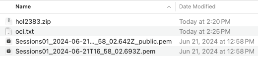
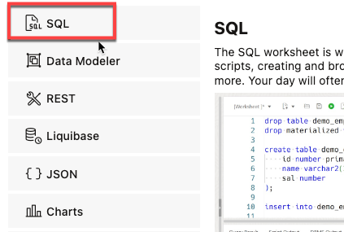

# Integrate OCI Generative AI with Autonomous Database

## Introduction

LLMs can produce incredibly creative responses to prompts, generate SQL from natural language, and so much more. In order to be most effective, you want to leverage LLMs with your organization's private data. The first step is to integrate your models with Autonomous Database. Here, we will connect OCI Generative AI models with Autonomous Database.

You can use different LLMs with Autonomous Database. This lets you pick the best model for your use case. Select AI profiles encapsulate the connections to each model; you specify which profile to use when generating results. In this lab, you will enable the user **`MOVIESTREAM`** to use multiple LLMs offered by the OCI Generative AI service. 

Estimated Time: 10 minutes.

### Objectives

In this lab, you will:
* Create a credential for accessing OCI GenAI 
* Create Select AI Profile for OCI GenAI
* Test the AI profile

### Prerequisites
- This lab requires the completion of the previous labs that deployed your Autonomous Database.

## Task 1: Download connection information

The MOVIESTREAM user will connect to OCI Generative AI in another tenancy using an OCI user's private key (for more information, see [creating credentials using DBMS\_CLOUD.CREAT\_CREDENTIAL and private keys ](https://docs.oracle.com/en/cloud/paas/autonomous-database/serverless/adbsb/dbms-cloud-subprograms.html#GUID-742FC365-AA09-48A8-922C-1987795CF36A)). This user has already been created and its credentials are available for download from the zip file contained in the **Your OCI GenAI key** in the menu on the left.

1. Click the **Your OCI GenAI key** section on the left. Then, download the zip file using the **Get Your OCI GenAI key** link.
    
    


2. Unzip the file. You'll find two files that contain the detailed information required to set up a connection to the OCI GenAI service:

    

    Open the files containing the private key and the oci user information using a text editor. Note, the names of the files may be slightly different than what you see above:
    * **oci.txt**: there will be a text file (named similarly to oci.txt) that contains the user id, fingerprint, tenancy, region and other fields
    * **.pem file**: There are two **.pem** files. You will want to open the file containing private key (i.e. the file that does not have the word **public** in it)

    You will use the information contained in these files to connect your Autonomous Database to the OCI GenAI service.

## Task 2: Create the credential used to connect to OCI GenAI

Let's now create the Autonomous Database credential used to connect to OCI GenAI.

1.  Start by logging into the database as the **MOVIESTREAM** user. Click the **View Login Info** in the top left of your browser. In the **Terraform Values** section, you'll find the **Database Actions** link, the **MOVIESTREAM** user name, and that user's password.

    

2. Click the **Database Actions** link and log in using the **MOVIESTREAM** credentials from above:

      

3. Go to the **SQL Worksheet** from the **Launchpad**
    
    

4. Create the credential used to connect to OCI GenAI. You will need to use information from both your .pem file and your OCI user configuration file. 

    ```sql
    <copy>
    BEGIN                                                                         
    DBMS_CLOUD.create_credential(                                               
        credential_name => 'OCIAI_CRED',                                          
        user_ocid       => '<your user ocid>',    
        tenancy_ocid    => '<your tenancy ocid>',
        fingerprint     => '<your finger print>',
        private_key     => '<your private key from .pem file>'          
    );                                                                          
    END;                                                                          
    /
    </copy>
    ```

    All of the information, except for the private_key, is in the oci text file:

    

    For the **private key**, copy the contents of the file - **excluding** the **BEGIN PRIVATE KEY** and **END PRIVATE KEY** lines:
    
    

    Copy and paste the code above into the SQL Worksheet. Update the fields to match your information and click **Run Statement**.

    


## Task 3: Create AI Profiles for OCI Generative AI

A Select AI profile encapsulates connection information for an AI provider. This includes: 
1. A security credential (e.g. the user principal you just created or a resource principal)
2. The name of the provider
3. The name of the LLM (optional)
4. A list of target tables that will be used for natural language queries (required when using NL2SQL)

You can create as many profiles as you need, which is useful when comparing the quality of the results of different models.

For a complete list of the Select AI profile attributes, see the [DBMS\_CLOUD\_AI\_Package] (https://docs.oracle.com/en/cloud/paas/autonomous-database/serverless/adbsb/dbms-cloud-ai-package.html#GUID-D51B04DE-233B-48A2-BBFA-3AAB18D8C35C) in the Using Oracle Autonomous Database Serverless documentation. 

1. In the SQL Worksheet, create an AI profile using the default model. The default uses the **Meta Llama 3 model**. Copy and paste the following code into your SQL Worksheet.

    Then, replace **your compartment** with the compartment ocid found in the oci text file that you unzipped in the previous step.

    After adding your compartment to the command, click the **Run Script** icon:
    
    ```sql
    <copy>
    begin    
        -- drops the profile if it already exists
        DBMS_CLOUD_AI.drop_profile(
            profile_name => 'genai',
            force => true
        );   

        -- Create an AI profile that uses the default LLAMA model on OCI
        dbms_cloud_ai.create_profile(
            profile_name => 'genai',
            attributes =>       
                '{"provider": "oci",
                "credential_name": "OCIAI_CRED",
                "comments":"true",
                "oci_compartment_id":"your compartment",            
                "object_list": [
                    {"owner": "MOVIESTREAM", "name": "GENRE"},
                    {"owner": "MOVIESTREAM", "name": "CUSTOMER"},
                    {"owner": "MOVIESTREAM", "name": "PIZZA_SHOP"},
                    {"owner": "MOVIESTREAM", "name": "STREAMS"},            
                    {"owner": "MOVIESTREAM", "name": "MOVIES"},
                    {"owner": "MOVIESTREAM", "name": "ACTORS"}
                ]
                }'
            );
            
    end;
    /   
    </copy>   
    ```
    
    

2. Create an AI profile, this time specifying that you want to use the **Meta Llama 3 model** using the **model** attribute. Copy and paste the following code into your SQL Worksheet. Replace **your compartment** with your value and then click the **Run Script** icon.

    ```
    <copy>
    BEGIN
        -- drops the profile if it already exists
        DBMS_CLOUD_AI.drop_profile(
            profile_name => 'ociai_llama',
            force => true
        );     

        -- Meta Llama 3 (this is the default model, so you could skip the model attribute if you like)                                                                     
        DBMS_CLOUD_AI.create_profile (                                              
            profile_name => 'ociai_llama',
            attributes   => 
            '{"provider": "oci",
                "credential_name": "OCIAI_CRED",
                "oci_compartment_id":"your compartment",            
                "object_list": [
                    {"owner": "moviestream", "name": "GENRE"},
                    {"owner": "moviestream", "name": "CUSTOMER"},
                    {"owner": "moviestream", "name": "PIZZA_SHOP"},
                    {"owner": "moviestream", "name": "STREAMS"},            
                    {"owner": "moviestream", "name": "MOVIES"},
                    {"owner": "moviestream", "name": "ACTORS"}
                ],
                "model": "meta.llama-3-70b-instruct"
                }');
    END;                                                                         
    /
    </copy>
    ```
    

3. Create an AI profile for the **Cohere model**. This model will not be used for SQL generation - it will only be used for generating innovative content. Copy and paste the following code into your SQL Worksheet. Replace **your compartment** with your value and then click the **Run Script** icon.
    
    ```
    <copy>
    BEGIN                                                                        
        -- drops the profile if it already exists
        DBMS_CLOUD_AI.drop_profile(profile_name => 'OCIAI_COHERE', force => true);    

        DBMS_CLOUD_AI.CREATE_PROFILE(                                              
            profile_name => 'OCIAI_COHERE',
            attributes   => '{"provider": "oci",
                                "credential_name": "OCIAI_CRED",
                                "oci_compartment_id":"your compartment",                                    
                                "model": "cohere.command-r-plus",
                                "oci_apiformat":"COHERE"
                            }');
    END;
    /
    </copy>
    ```
    


## Task 4: Test the AI profile

We will use the PL/SQL API to generate a response from the Cohere model. This example is using the **chat** action. It is not using any private data coming from your database.

1. Test the LLM and learn about Autonomous Database as the MOVIESTREAM user using the **Cohere model**. Copy and paste the following code into your SQL Worksheet, and then click the **Run Script** icon.

    ```
    <copy>
    SELECT DBMS_CLOUD_AI.GENERATE(
        prompt       => 'what is oracle autonomous database',
        profile_name => 'OCIAI_COHERE',
        action       => 'chat')
    FROM dual;
    </copy>
    ```
    

2. Compare the Cohere model to the **Llama model**. Copy and paste the following code into your SQL Worksheet, and then click the **Run Script** icon.

    ```
    <copy>
    SELECT DBMS_CLOUD_AI.GENERATE(
        prompt       => 'what is oracle autonomous database',
        profile_name => 'OCIAI_LLAMA',
        action       => 'chat')
    FROM dual;
    </copy>
    ```
    


## Summary
You learned how to integrate Autonomous Database with OCI Generative AI. And, you chatted with different models hosted on OCI Generative AI. Next, let's see how to use our private data with LLMs.
 
You may now proceed to the next lab.

## Learn More
* [DBMS\_NETWORK\_ACL\_ADMIN PL/SQL Package](https://docs.oracle.com/en/database/oracle/oracle-database/19/arpls/DBMS_NETWORK_ACL_ADMIN.html#GUID-254AE700-B355-4EBC-84B2-8EE32011E692)
* [DBMS\_CLOUD\_AI Package](https://docs.oracle.com/en-us/iaas/autonomous-database-serverless/doc/dbms-cloud-ai-package.html)
* [Using Oracle Autonomous Database Serverless](https://docs.oracle.com/en/cloud/paas/autonomous-database/adbsa/index.html)
* [Overview of Generative AI Service](https://docs.oracle.com/en-us/iaas/Content/generative-ai/overview.htm)

## Acknowledgements

  * **Author:** Marty Gubar, Product Management 
  * **Contributors:** 
    * Stephen Stuart, Cloud Engineer 
    * Nicholas Cusato, Cloud Engineer
    * Lauran K. Serhal, Consulting User Assistance Developer 
    * Olivia Maxwell, Cloud Engineer 
    * Taylor Rees, Cloud Engineer 
    * Joanna Espinosa, Cloud Engineer 
* **Last Updated By/Date:** Marty Gubar, July 2024

Data about movies in this workshop were sourced from **Wikipedia**.

Copyright (c) 2024  Oracle Corporation.

Permission is granted to copy, distribute and/or modify this document
under the terms of the GNU Free Documentation License, Version 1.3
or any later version published by the Free Software Foundation;
with no Invariant Sections, no Front-Cover Texts, and no Back-Cover Texts.
A copy of the license is included in the section entitled [GNU Free Documentation License](files/gnu-free-documentation-license.txt)
