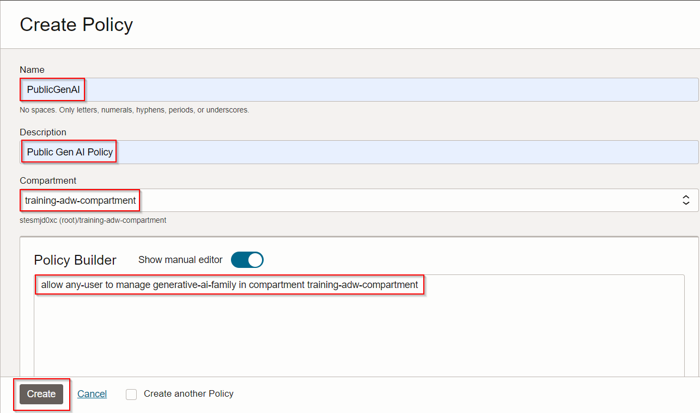
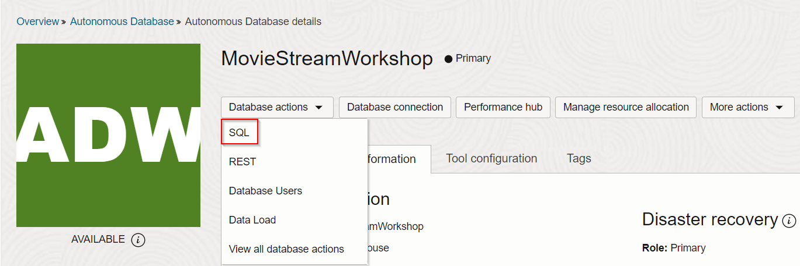
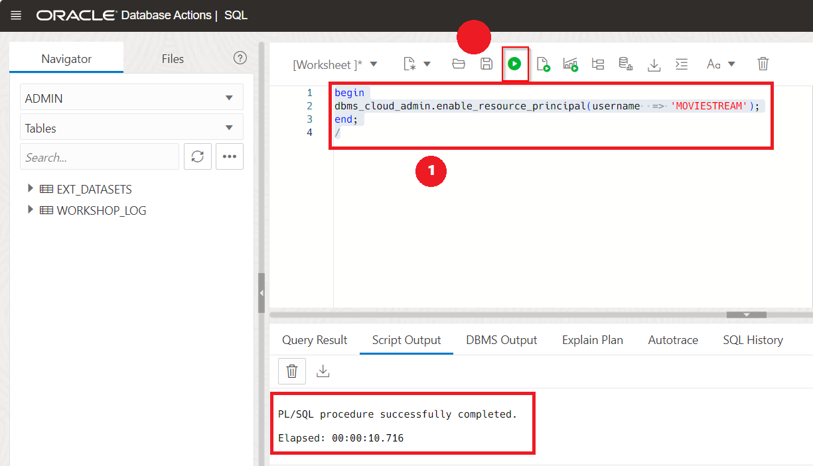
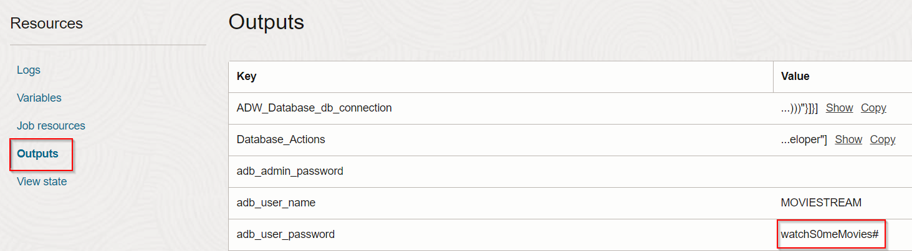
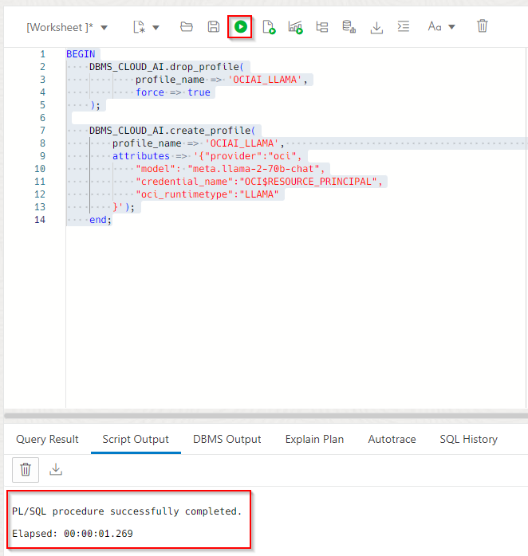
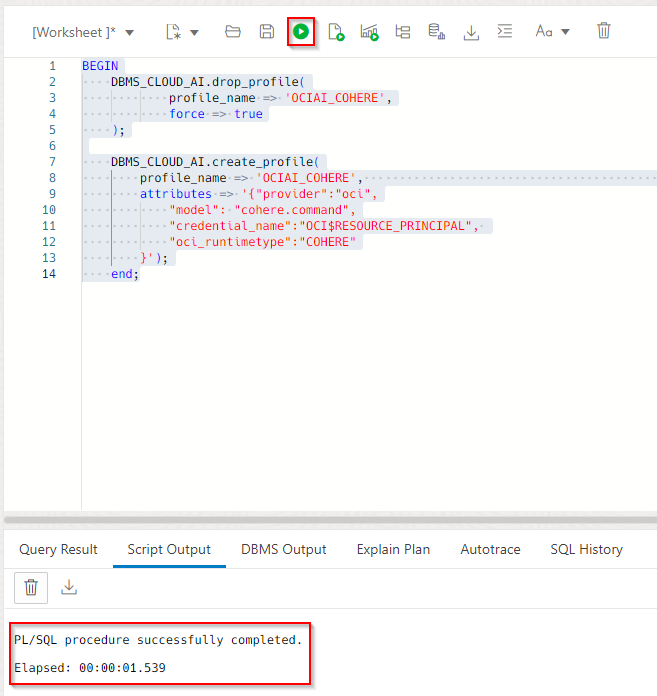
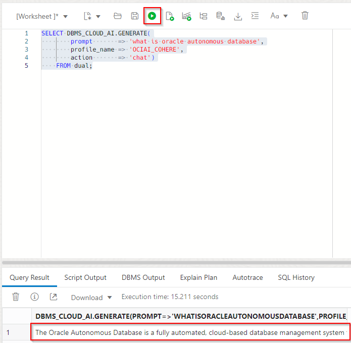
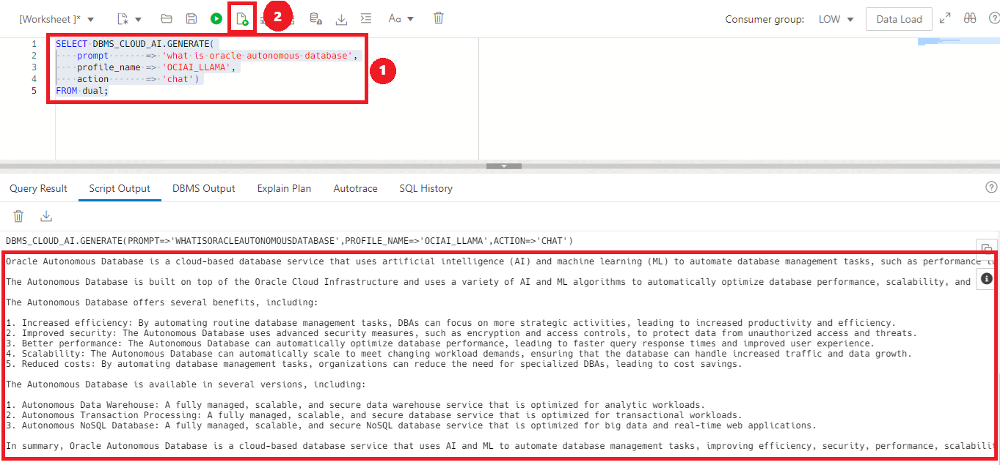

# Integrate OCI GenAI Service

## Introduction

You can use different large language models (LLM) with Autonomous Database. In this lab, you will enable the user **`MOVIESTREAM`** to use the LLM that you set up in the previous lab.

You will navigate to the SQL Worksheet in order to run queries that will update permissions allowing users to make REST calls to OCI GenAI. The credentials are safely stored under a user profile.

Estimated Time: 10 minutes.

### Objectives

In this lab, you will:
* Create policy to enable access to OCI GenAI
* Enable use of Resource Principals for MOVIESTREAM user
* Create an AI Profile for OCI GenAI
* Test the AI profile


### Prerequisites
- This lab requires the completion of **Lab 1: Set up Your Workshop Environment** in the **Contents** menu on the left.

## Task 1: Create policy to enable access to OCI GenAI

1. From the **Console,** open the **Navigation** menu and click **Identity & Security.** Under **Identity,** click **Policies.** 

2. Click on **Create policy** and paste the following into the fields:

>**Note:** Select the **Show Manual Editor** to open the field  in order to paste the policy.

    ```
    Name: <copy>PublicGenAI</copy>
    Description: <copy>Public Gen AI Policy</copy>
    Compartment: <copyEnsure you are in the correct compartment</copy>
    Policy: <copy>allow any-user to manage generative-ai-family in compartment training-adw-compartment</copy>
    ```
1. Click **Create**

    
    
**Note:** This policy is very broad. In a production environment, you will want to make this much more narrow.

## Task 2: Enable use of Resource Principals for MOVIESTREAM user

MOVIESTREAM user will connect to OCI GenAI using resource principals. In ADB, enable the use of Resource Principals for the MOVIESTREAM user.

1. Navigate to ADB using hamburger menu from the OCI console. 

2. Make sure you are in the right compartment and select the ADB we have created in lab #1. 

3. Under the database actions dropdown, select the **SQL** option. You should automatically be signed in as admin. 

    

4. The setup script enabled Resource Principals usage for MovieStream. To better understand the use of Resource Principal, let's disable and recreate it. Run the following statement to disable the use of Resource Principals for the MOVIESTREAM user: 

    ```
    <copy>
    begin
    dbms_cloud_admin.disable_resource_principal(username  => 'MOVIESTREAM');
    end;
    /
    </copy>
    ```


4. Now let's reenable the Resource Principal. Run the following statement to enable the use of Resource Principals for the MOVIESTREAM user:

    ```
    <copy>
    begin
    dbms_cloud_admin.enable_resource_principal(username  => 'MOVIESTREAM');
    end;
    /
    </copy>
    ```
    

5. Sign out of admin in the SQL worksheet at the top right of your page. 

## Task 3: Create an AI Profile for OCI GenAI

In the installation, the Terraform script created a couple Select AI profiles. Let's create a couple more. The code below shows the creation of the default profile. We've gone into more detail with specifying attributes for the new profiles. 

    ```
    -- GenAI projects
    dbms_cloud_ai.drop_profile(
        profile_name => 'genai',
        force => true
        );

    dbms_cloud_ai.create_profile(
        profile_name => 'genai',
        attributes =>       
            '{"provider": "oci",
            "credential_name": "OCI$RESOURCE_PRINCIPAL"
            }'
        );
    ```

1. Sign into the SQL worksheet as the MOVIESTREAM user (**Password:** watchS0meMovies#). Note, the MOVIESTREAM user was created as part of the setup and tables were created in that schema. Moviestream password can be found going to **Developer Services** from the hamburger menu -> **Resource Manager** -> **Stacks** -> selecting the stack we created, **Deploy-ChatDB-Autonomous-Database...** -> select the job we created, **ormjob2024117214431** -> then select **Outputs** under Resources. 

    

2. Create an AI profile for **Meta Llama 2 Chat model** by running the following statement in the SQL worksheet. 
    
    ```
    <copy>
    BEGIN
    DBMS_CLOUD_AI.drop_profile(
            profile_name => 'OCIAI_LLAMA',
            force => true
    );

    DBMS_CLOUD_AI.create_profile(
        profile_name => 'OCIAI_LLAMA',                                                             
        attributes => '{"provider":"oci",
            "model": "meta.llama-2-70b-chat",
            "credential_name":"OCI$RESOURCE_PRINCIPAL",
            "oci_runtimetype":"LLAMA"
        }');
    end;
    /
    </copy>
    ```
    

2. Create an AI profile for **Cohere model** by running the following statement in the SQL worksheet. 
    
    ```
    <copy>
    BEGIN
    DBMS_CLOUD_AI.drop_profile(
            profile_name => 'OCIAI_COHERE',
            force => true
    );

    DBMS_CLOUD_AI.create_profile(
        profile_name => 'OCIAI_COHERE',                                                             
        attributes => '{"provider":"oci",
            "model": "cohere.command",
            "credential_name":"OCI$RESOURCE_PRINCIPAL",
            "oci_runtimetype":"COHERE"
        }');
    end;
    /
    </copy>
    ```
    


## Task 4: Test the AI profile

We will use the PLSQL API to generate a response from a prompt:

1. Run the following statement as MOMVIESTREAM user in the SQL worksheet to test the LLM and learn about Autonomous Database.

    ```
    <copy>
    SELECT DBMS_CLOUD_AI.GENERATE(
        prompt       => 'what is oracle autonomous database',
        profile_name => 'OCIAI_COHERE',
        action       => 'chat')
    FROM dual;
    </copy>
    ```
    

2. To compare our Cohere model to our Llama model, run the following statement in the SQL worksheet.

    ```
    <copy>
    SELECT DBMS_CLOUD_AI.GENERATE(
        prompt       => 'what is oracle autonomous database',
        profile_name => 'OCIAI_LLAMA',
        action       => 'chat')
    FROM dual;
    </copy>
    ```
    

You may now proceed to the next lab.

## Learn More
* [DBMS\_NETWORK\_ACL\_ADMIN PL/SQL Package](https://docs.oracle.com/en/database/oracle/oracle-database/19/arpls/DBMS_NETWORK_ACL_ADMIN.html#GUID-254AE700-B355-4EBC-84B2-8EE32011E692)
* [DBMS\_CLOUD\_AI Package](https://docs.oracle.com/en-us/iaas/autonomous-database-serverless/doc/dbms-cloud-ai-package.html)
* [Using Oracle Autonomous Database Serverless](https://docs.oracle.com/en/cloud/paas/autonomous-database/adbsa/index.html)
* [Overview of Generative AI Service](https://docs.oracle.com/en-us/iaas/Content/generative-ai/overview.htm)

## Acknowledgements

  * **Author:** Marty Gubar, Product Management 
  * **Contributors:** 
    * Stephen Stuart, Cloud Engineer 
    * Nicholas Cusato, Cloud Engineer 
    * Olivia Maxwell, Cloud Engineer 
    * Taylor Rees, Cloud Engineer 
    * Joanna Espinosa, Cloud Engineer 
* **Last Updated By/Date:** Stephen Stuart, February 2024

Data about movies in this workshop were sourced from **Wikipedia**.

Copyright (C)  Oracle Corporation.

Permission is granted to copy, distribute and/or modify this document
under the terms of the GNU Free Documentation License, Version 1.3
or any later version published by the Free Software Foundation;
with no Invariant Sections, no Front-Cover Texts, and no Back-Cover Texts.
A copy of the license is included in the section entitled [GNU Free Documentation License](files/gnu-free-documentation-license.txt)
