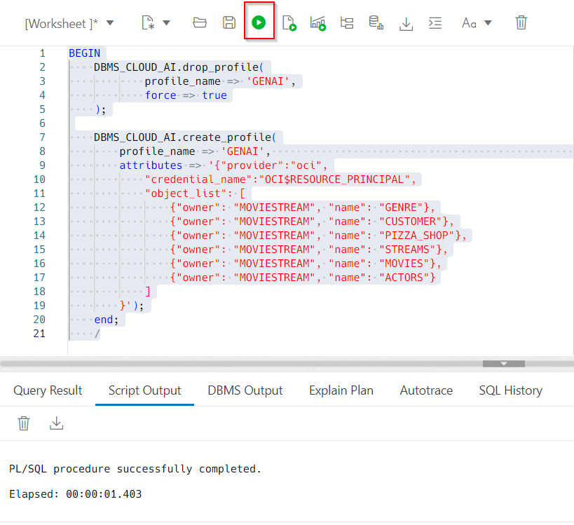
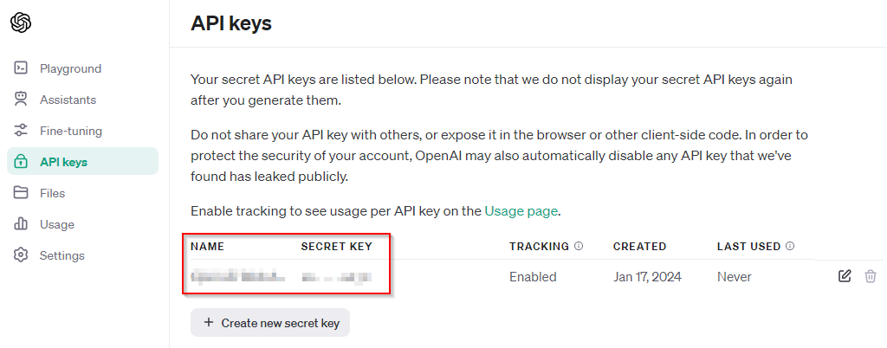
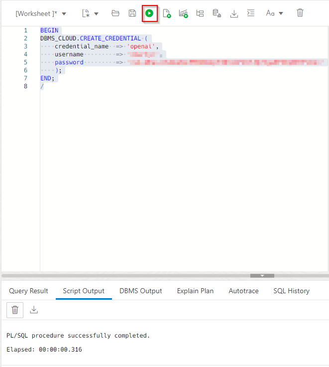
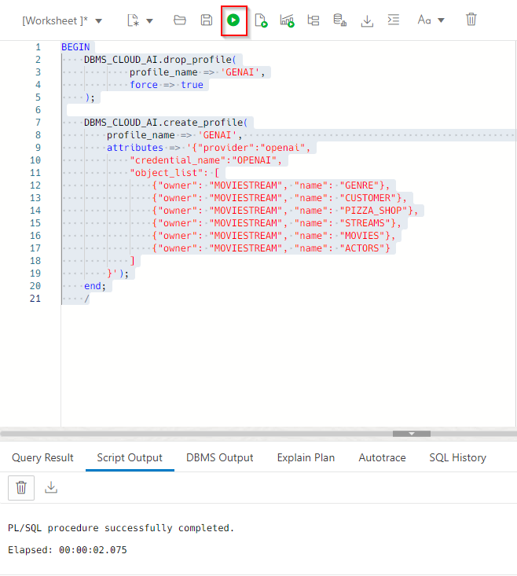

# Integrate OCI GenAI Service

## Introduction

You can use different large language models (LLM) with Autonomous Database. In this lab, you will enable the user **`MOVIESTREAM`** to use the LLM that you set up in the previous lab.

Estimated Time: 10 minutes.

### Objectives

In this lab, you will:
* As the `ADMIN` user, enable users to connect to the LLM REST endpoint
* Grant users privileges to use the **Select AI** APIs

### Prerequisites
- This lab requires the completion of **Lab 1: Set up Your Workshop Environment** in the **Contents** menu on the left.

## Task 1: Create policy to enable access to OCI GenAI

1. Naviagte from the OCI Console to Identity -> Policies using the hamburger menu. 

2. Click on **Create policy** and paste the following into the fields:

    ```
    Name: <copy>PublicGenAI</copy>
    Description: <copy>Public Gen AI Policy
    Compartment: Ensure you are in the correct compartment
    Policy: <copy>allow any-user to manage generative-ai-family in compartment training-adw-compartment</copy>
    ```
3. Click **Create**

    
    
    This policy is very broad. In a production environment, you will want to make this much more narrow.

## Task 2: Enable use of Resource Principals for MOVIESTREAM user

MOVIESTREAM user will connect to OCI GenAI using resource principals. In ADB, enable the use of Resource Principals for the MOVIESTREAM user.

1. Navigate to ADB using hamburger menu from the OCI console. 

2. Make sure you are in the right compartment and select the ADB we have created in lab #1. 

3. Under the database actions dropdown, select the **SQL** option. You should automatically be signed in as admin. 

    

4. Run the following statement to enable the use of Resource Principals for the MOVIESTREAM user:

    ```
    <copy>
    begin
    dbms_cloud_admin.enable_resource_principal(username  => 'MOVIESTREAM');
    end;
    /
    </copy>
    ```
    

5. Sign out of admin in the SQL worksheet at the top right of your page. 

## Task 3: Create an AI Profile for OCI GenAI

1. Sign into the SQL worksheet as the MOVIESTREAM user. Note, the MOVIESTREAM user was created as part of the setup and tables were created in that schema. Moviestream password can be found going to Resource Manager -> Stacks -> Stack details -> select the job we created -> then select Outputs under Resources. 

    

2. Create an AI profile by running the following statement in the SQL worksheet. 

    **NOTE: THIS DOESN'T WORK WELL YET. THIS IS THE CODE WE'LL WANT.**
    
    ```
    <copy>
    BEGIN
    DBMS_CLOUD_AI.drop_profile(
            profile_name => 'GENAI',
            force => true
    );

    DBMS_CLOUD_AI.create_profile(
        profile_name => 'GENAI',                                                             
        attributes => '{"provider":"oci",
            "credential_name":"OCI$RESOURCE_PRINCIPAL",
            "object_list": [
                {"owner": "MOVIESTREAM", "name": "GENRE"},
                {"owner": "MOVIESTREAM", "name": "CUSTOMER"},
                {"owner": "MOVIESTREAM", "name": "PIZZA_SHOP"},
                {"owner": "MOVIESTREAM", "name": "STREAMS"},
                {"owner": "MOVIESTREAM", "name": "MOVIES"},
                {"owner": "MOVIESTREAM", "name": "ACTORS"}
            ]
        }');
    end;
    /
    </copy>
    ```
    

3. To use OpenAI, run the following statement in the SQL worksheet and be sure to update with your personal information from lab 1 when creating the OpenAI API.

    ```
    <copy>
    BEGIN
    DBMS_CLOUD.CREATE_CREDENTIAL (
        credential_name  => 'openai',
        username         => '<insert personal information>',
        password         => '<insert personal information>'
        );
    END;
    /
    </copy>
    ```

    

    

4. To create an AI profile for OpenAI, run the following statement in the SQL worksheet. 

    ```
    <copy>
    BEGIN
    DBMS_CLOUD_AI.drop_profile(
            profile_name => 'GENAI',
            force => true
    );

    DBMS_CLOUD_AI.create_profile(
        profile_name => 'GENAI',                                                             
        attributes => '{"provider":"openai",
            "credential_name":"OPENAI",
            "object_list": [
                {"owner": "MOVIESTREAM", "name": "GENRE"},
                {"owner": "MOVIESTREAM", "name": "CUSTOMER"},
                {"owner": "MOVIESTREAM", "name": "PIZZA_SHOP"},
                {"owner": "MOVIESTREAM", "name": "STREAMS"},
                {"owner": "MOVIESTREAM", "name": "MOVIES"},
                {"owner": "MOVIESTREAM", "name": "ACTORS"}
            ]
        }');
    end;
    /
    </copy>
    ```
    

## Task 4: Test the AI profile

We will use the PLSQL API to generate a response from a prompt:

1. Run the following statement as MOMVIESTREAM user in the SQL worksheet to test the LLM and learn about Autonomous Database.

    ```
    <copy>
    SELECT DBMS_CLOUD_AI.GENERATE(
        prompt       => 'what is oracle autonomous database',
        profile_name => 'GENAI',
        action       => 'chat')
    FROM dual;
    </copy>
    ```

2. To generate a sentence-like repsonse, we can use **narrate** with our statement in the SQL worksheet 

    ```
    <copy>
    SELECT DBMS_CLOUD_AI.GENERATE(
        prompt       => 'what are our total views?',
        profile_name => 'GENAI',
        action       => 'narrate') as response
    FROM dual;
    </copy>
    ```


You may now proceed to the next lab.

## Learn More
* [DBMS\_NETWORK\_ACL\_ADMIN PL/SQL Package](https://docs.oracle.com/en/database/oracle/oracle-database/19/arpls/DBMS_NETWORK_ACL_ADMIN.html#GUID-254AE700-B355-4EBC-84B2-8EE32011E692)
* [DBMS\_CLOUD\_AI Package](https://docs.oracle.com/en-us/iaas/autonomous-database-serverless/doc/dbms-cloud-ai-package.html)
* [Using Oracle Autonomous Database Serverless](https://docs.oracle.com/en/cloud/paas/autonomous-database/adbsa/index.html)

## Acknowledgements
  * **Author:** Marty Gubar, Product Management Lauran K. Serhal, Consulting User Assistance Developer
  * **Contributors:** Stephen Stuart, Nicholas Cusato, Olivia Maxwell, Taylor Rees, Joanna Espinosa, Cloud Engineers 
* **Last Updated By/Date:** Stephen Stuart, January 2024

Data about movies in this workshop were sourced from **Wikipedia**.

Copyright (C)  Oracle Corporation.

Permission is granted to copy, distribute and/or modify this document
under the terms of the GNU Free Documentation License, Version 1.3
or any later version published by the Free Software Foundation;
with no Invariant Sections, no Front-Cover Texts, and no Back-Cover Texts.
A copy of the license is included in the section entitled [GNU Free Documentation License](files/gnu-free-documentation-license.txt)
