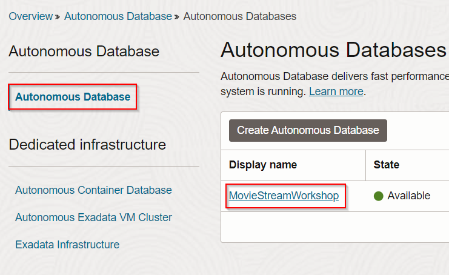
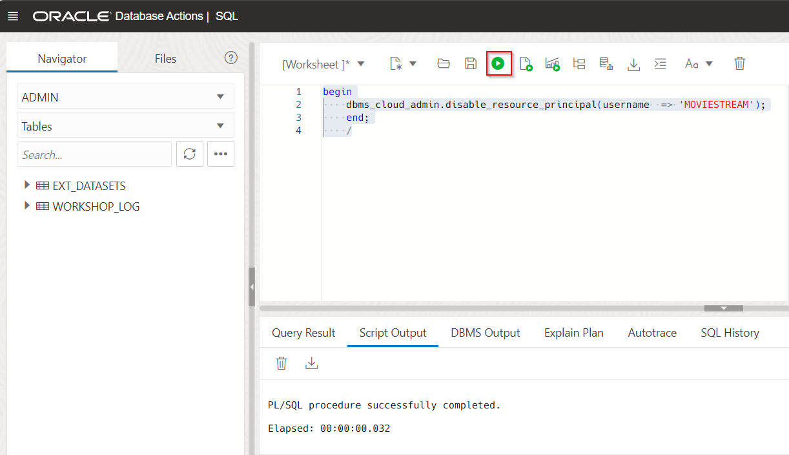
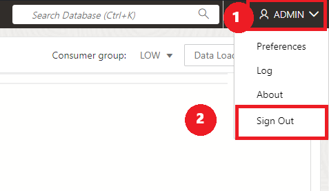

# Integrate OCI GenAI Service

## Introduction

You can use different large language models (LLM) with Autonomous Database. In this lab, you will enable the user **`MOVIESTREAM`** to use LLMs offered by the OCI Generative AI service.

You will navigate to the SQL Worksheet in order to run queries that will update permissions allowing users to make REST calls to OCI GenAI. The credentials are safely stored under a user profile.

Estimated Time: 10 minutes.

### Objectives

In this lab, you will:
* Create policy to enable access to OCI GenAI
* Enable use of Resource Principals for MOVIESTREAM user
* Create an AI Profile for OCI GenAI
* Test the AI profile


### Prerequisites
- This lab requires the completion of **Lab 1: Set up Your Workshop Environment** in the **Contents** menu on the left.

## Task 1: Create policy to enable access to OCI Generative AI
Create a policy that will 

1. From the **Console,** open the **Navigation** menu and click **Identity & Security.** Under **Identity,** click **Policies.** 

2. Click on **Create policy** and paste the following into the fields:

>**Note:** Select the **Show Manual Editor** to open the field  in order to paste the policy.

* **Name:** **`PublicGenAI`**
* **Description:** **`Public Gen AI Policy`**
* **Compartment:** **`training-adw-compartment`**
* **Policy:** **`allow any-user to manage generative-ai-family in compartment training-adw-compartment`**
    
3. Click **Create**

    
    
>**Note:** This policy allows any Autonomous Database in the specified compartment to access OCI Generative AI. In a production environment, ensure your policy's scope is minimally inclusive.

## Task 2: Enable the use of Resource Principals for the MOVIESTREAM user

MOVIESTREAM user will connect to OCI Generative AI using resource principals (for more information, see [Use Resource Principal to Access Oracle Cloud Infrastructure Resources](https://docs.oracle.com/en/cloud/paas/autonomous-database/serverless/adbsb/resource-principal.html#GUID-E283804C-F266-4DFB-A9CF-B098A21E496A)). In ADB, enable the use of resource principals for the MOVIESTREAM user.

1. From the **Console,** Open the **Navigation** menu and click **Oracle Database.** Under **Oracle Database,** click **Autonomous Database.**

2. On the **Autonomous Database** page, click your **MovieStreamWorkshop** ADB instance. 

    

3. On the **Autonomous Database details** page, click the **Database actions** drop-down list, and then click SQL. 

    

>**Note:** The setup script automatically enabled Resource Principals usage for MovieStream. The following 2 steps are optional.

4. To better understand the use of Resource Principal, let's disable the enablement created by the deployment script and recreate it. Run the following statement to disable the use of Resource Principals for the MOVIESTREAM user: 

    ```
    <copy>
    begin
    dbms_cloud_admin.disable_resource_principal(username  => 'MOVIESTREAM');
    end;
    /
    </copy>
    ```




4. Now let's reenable the Resource Principal. Run the following statement to enable the use of Resource Principals for the MOVIESTREAM user:

    ```
    <copy>
    begin
    dbms_cloud_admin.enable_resource_principal(username  => 'MOVIESTREAM');
    end;
    /
    </copy>
    ```
    


5. Sign out of the **ADMIN** user. On the **Oracle Database Actions | SQL banner**, click the drop-down list next to the **ADMIN** user, and then select **Sign Out** from the drop-down menu. 



## Task 3: Create an AI Profile for OCI Generative AI

A Select AI profile encapsulates connection information for an AI provider. This includes: 
1. a security credential (e.g. the resource principal)
2. the name of the provider
3. the name of the LLM

You can create as many profiles as you need, which is useful when comparing the quality of the results of different models.

Check out [the documentation](https://docs.oracle.com/en/cloud/paas/autonomous-database/serverless/adbsb/dbms-cloud-ai-package.html#GUID-D51B04DE-233B-48A2-BBFA-3AAB18D8C35C) for a complete list of Select AI profile attributes.

>**Note:** The deployment script created a Select AI profile using the code below: 

```
<copy>
BEGIN
    -- drop the AI profile
    DMBS_CLOUD_AI.drop_profile (
        profile_name => 'genai',
        force => true
        );

    -- create an AI profile that uses the default COHERE model on OCI
    DMBS_CLOUD_AI.create_profile(
        profile_name => 'genai',
        attributes =>       
            '{"provider": "oci",
            "credential_name": "OCI$RESOURCE_PRINCIPAL"
            }'
        );
END;
/        
</copy>
```

1. Sign into the SQL worksheet as the MOVIESTREAM user (**Password:** watchS0meMovies#). 

>**Note:** the MOVIESTREAM user was created as part of the setup and tables were created in that schema. Moviestream password can be found going to **Developer Services** from the hamburger menu -> **Resource Manager** -> **Stacks** -> selecting the stack we created, **Deploy-ChatDB-Autonomous-Database...** -> select the job we created, **ormjob2024117214431** -> then select **Outputs** under Resources. 

- Reference location of where to find the credentials:

    

2. Create an AI profile for **Meta Llama 2 Chat model** by running the following statement in the SQL worksheet. 
    
    ```
    <copy>
    BEGIN
        -- drops the profile if it already exists
        DBMS_CLOUD_AI.drop_profile(
                profile_name => 'OCIAI_LLAMA',
                force => true
        );

        -- create a new profile that uses a specific model
        DBMS_CLOUD_AI.create_profile(
            profile_name => 'OCIAI_LLAMA',                                                             
            attributes => '{"provider":"oci",
                "model": "meta.llama-2-70b-chat",
                "credential_name":"OCI$RESOURCE_PRINCIPAL",
                "oci_runtimetype":"LLAMA"
            }');
    END;
    /
    </copy>
    ```
    

3. Create an AI profile for **Cohere model** by running the following statement in the SQL worksheet. 
    
    ```
    <copy>
    BEGIN
        -- drops the profile if it already exists
        DBMS_CLOUD_AI.drop_profile(
                profile_name => 'OCIAI_COHERE',
                force => true
        );

        -- create a new profile that uses COHERE.COMMAND
        DBMS_CLOUD_AI.create_profile(
            profile_name => 'OCIAI_COHERE',                                                             
            attributes => '{"provider":"oci",
                "model": "cohere.command",
                "credential_name":"OCI$RESOURCE_PRINCIPAL",
                "oci_runtimetype":"COHERE"
            }');
    end;
    /
    </copy>
    ```
    


## Task 4: Test the AI profile

We will use the PL/SQL API to generate a response from the Cohere model.This example is using the **chat** action. It is not using any private data coming from your database.:

1. Run the following statement as MOMVIESTREAM user in the SQL worksheet to test the LLM and learn about Autonomous Database using the **Cohere model**.

    ```
    <copy>
    SELECT DBMS_CLOUD_AI.GENERATE(
        prompt       => 'what is oracle autonomous database',
        profile_name => 'OCIAI_COHERE',
        action       => 'chat')
    FROM dual;
    </copy>
    ```
    

2. Run the following statement in the SQL worksheet to compare the Cohere model to the **Llama model**. 

    ```
    <copy>
    SELECT DBMS_CLOUD_AI.GENERATE(
        prompt       => 'what is oracle autonomous database',
        profile_name => 'OCIAI_LLAMA',
        action       => 'chat')
    FROM dual;
    </copy>
    ```
    

You may now proceed to the next lab.

## Learn More
* [DBMS\_NETWORK\_ACL\_ADMIN PL/SQL Package](https://docs.oracle.com/en/database/oracle/oracle-database/19/arpls/DBMS_NETWORK_ACL_ADMIN.html#GUID-254AE700-B355-4EBC-84B2-8EE32011E692)
* [DBMS\_CLOUD\_AI Package](https://docs.oracle.com/en-us/iaas/autonomous-database-serverless/doc/dbms-cloud-ai-package.html)
* [Using Oracle Autonomous Database Serverless](https://docs.oracle.com/en/cloud/paas/autonomous-database/adbsa/index.html)
* [Overview of Generative AI Service](https://docs.oracle.com/en-us/iaas/Content/generative-ai/overview.htm)

## Acknowledgements

  * **Author:** Marty Gubar, Product Management 
  * **Contributors:** 
    * Stephen Stuart, Cloud Engineer 
    * Nicholas Cusato, Cloud Engineer 
    * Olivia Maxwell, Cloud Engineer 
    * Taylor Rees, Cloud Engineer 
    * Joanna Espinosa, Cloud Engineer 
    * Lauran K. Serhal, Consulting User Assistance Developer
* **Last Updated By/Date:** Nicholas Cusato, February 2024

Data about movies in this workshop were sourced from **Wikipedia**.

Copyright (C)  Oracle Corporation.

Permission is granted to copy, distribute and/or modify this document
under the terms of the GNU Free Documentation License, Version 1.3
or any later version published by the Free Software Foundation;
with no Invariant Sections, no Front-Cover Texts, and no Back-Cover Texts.
A copy of the license is included in the section entitled [GNU Free Documentation License](files/gnu-free-documentation-license.txt)
