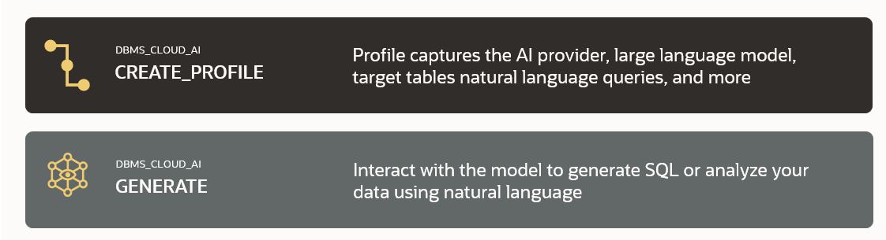

# Introduction

## About this Workshop

In this workshop, you will learn how to use large language models (LLMs)and natural language to analyze your organization's private data in Autonomous Database. Those LLMs may be hosted by OCI Generative AI, Google Gemini, Azure OpenAI or OpenAI. Your AI projects will be published as RESTful services that can then be invoked from any application. You will use a <if type="react">React</if> <if type="python">Django</if> app to surface these analytics.

> **NOTE:** This workshop requires access to a Large Language Model (LLM). You can use LLMs from OCI GenAI, OpenAI, Azure, or Google Gemini. If you want to use OCI GenAI, ensure that your tenancy is subscribed to one of the following regions (at the time the workshop was last updated): **US Midwest (Chicago)**, **Germany Central (Frankfurt)**, **UK South (London)**, **Brazil East (Sao Paulo)**, or **Japan Central (Osaka)** regions in order to run this workshop. See the [OCI documentation](https://docs.oracle.com/en-us/iaas/Content/Identity/Tasks/managingregions.htm) for more details. For the current list of regions with **Generative AI**, see [Regions with Generative AI](https://docs.oracle.com/en-us/iaas/Content/generative-ai/overview.htm).

<if type="react">
In our scenario, customers for MovieStream - a fictitious moviestreaming company -  will receive a targeted promotion with recommended movies. The recommendations will be generated by the LLM based on those movies that the customer previously enjoyed. In addition, a promotional offer will be made based on the customer's geographic location using Autonomous Database's spatial APIs. Architecturally, you will create an open, RESTful service that generates the targeted offer.

Use the RESTful service that you created to build an open-source and developer friendly application built with React and TypeScript. Using the MovieStream data, the end user is able to get tailored movie recomendations along with pizza recomendations. The open-source **OpenStreetMap** is used to help the user find local pizza shops and take full advantage of the spatial capability of the Autonomous Database. 

The purpose of this lab is to help you understand how to develop business logic required to integrate Generative AI with data from the Autonomous Database. You will use two key APIs to accomplish this task: 

* **`DBMS_CLOUD_AI.CREATE_PROFILE`**
* **`DBMS_CLOUD_AI.GENERATE`**.  

### What is Natural Language?

Natural language processing is the ability of a computer application to understand human language as it is spoken and written. It is a component of artificial intelligence (AI).

### What is Generative AI?

Generative AI enables users to quickly generate new content based on a variety of inputs. Inputs and outputs to these models can include text, images, sounds, animation, 3D models, and other types of data.

### Objectives

In this workshop, you will:

* Configure your Autonomous Database to leverage a generative AI model for querying data using natural language
* Define the business logic that will use **`DBMS_CLOUD_AI.GENERATE`** to generate recommendations using natural language
* Learn how to expose that business logic via RESTful services - using both AutoRest (automatically generated RESTful endpoints) and custom API modules. Those newly published services can be used across your organization
<if type="react">* Learn about deploying a React App from OCI Console to Object Storage. The application uses these RESTful services to deliver a targeted offer.</if>
<if type="python">* Use that custom with a python Django app</if>

<if type="react">
### Oracle MovieStream Business Scenario

The workshop's business scenario is based on Oracle MovieStream - a fictitious movie streaming service that is similar to services to which you currently subscribe. You'll be able to query all of the movie watching activity for customers and then use that information to generate personalized recommendations using AI. The business logic will suggest films from a promoted movie list as well as a pizza pairing for a nearby pizza shop. 
</if>
You may now proceed to the next lab.

## Learn more

* [Oracle Autonomous Database Documentation](https://docs.oracle.com/en/cloud/paas/autonomous-data-warehouse-cloud/index.html)
* [Additional Autonomous Database Tutorials](https://docs.oracle.com/en/cloud/paas/autonomous-data-warehouse-cloud/tutorials.html)
* [Overview of Generative AI Service](https://docs.oracle.com/en-us/iaas/Content/generative-ai/overview.htm)

## Acknowledgements

  * **Author:** Marty Gubar, Product Management
  * **Contributors:**
    * Stephen Stuart, Cloud Engineer
    * Nicholas Cusato, Cloud Engineer
    * Olivia Maxwell, Cloud Engineer
    * Taylor Rees, Cloud Engineer
    * Joanna Espinosa, Cloud Engineer
    * Lauran K. Serhal, Consulting User Assistance Developer
* **Last Updated By/Date:** Lauran K. Serhal, March 2025

Data about movies in this workshop were sourced from **Wikipedia**.

Copyright (c) 2025 Oracle Corporation.

Permission is granted to copy, distribute and/or modify this document
under the terms of the GNU Free Documentation License, Version 1.3
or any later version published by the Free Software Foundation;
with no Invariant Sections, no Front-Cover Texts, and no Back-Cover Texts.
A copy of the license is included in the section entitled [GNU Free Documentation License](files/gnu-free-documentation-license.txt)
