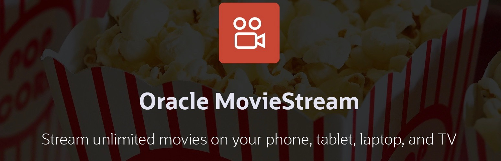

# Introduction

## About this Workshop

In this workshop, you will learn how to use large language models (LLMs) to generate promotional offers using your organization's private data. **Autonomous Database** makes this easy through an API called **`DBMS_CLOUD_AI.GENERATE`**. This API allows you to combine your data with prompt instructions for the LLM that generates the promotion.

Specifically, customers for MovieStream - a fictitious moviestreaming company -  will receive a targeted promotion with recommended movies. The recommendations will be generated by the LLM based on those movies that the customer previously enoyed. In addition, a promotional offer will be made based on the customer's geographic location using Autonomous Database's spatial APIs. Architecturally, you will create an open, RESTful service that generates the targeted offer.

An open-source, developer-friendly application built on React with typescript will use that RESTful service that you created. Using the MovieStream data, the end user is able to get tailored movie reccomendations along with pizza recomendations. The open-source OpenStreetMap is used to help the user find local pizza shops and take full advantage of the spatial capability of the Autonomous Database. 

The purpose of this lab is to highlight the business logic required to integrate Generative AI with data from the Autonomous Database using both **`DBMS_CLOUD_AI.CREATE_PROFILE`** and **`DBMS_CLOUD_AI.GENERATE`**.  

### What is Natural Language?

Natural language processing is the ability of a computer application to understand human language as it is spoken and written. It is a component of artificial intelligence (AI).

### What is Generative AI?

Generative AI enables users to quickly generate new content based on a variety of inputs. Inputs and outputs to these models can include text, images, sounds, animation, 3D models, and other types of data.

### Objectives

In this workshop, you will:

* Configure your Autonomous Database to leverage a generative AI model for querying data using natural language
* Define the business logic that will use **`DBMS_CLOUD_AI.GENERATE`** to generate recommendations using natural language
* Learn how to expose that business logic via RESTful services - using both AutoRest (automatically generated RESTful endpoints) and custom API modules. Those newly pulbished services can be used across your organization
* Learn about deploying a React App from OCI Console to Object Storage. The application uses these RESTful services to deliver a targeted offer. 

### Oracle MovieStream Business Scenario

The workshop's business scenario is based on Oracle MovieStream - a fictitious movie streaming service that is similar to services to which you currently subscribe. You'll be able to query all of the movie watching activity for customers and then use that information to generate personalized recommendations using AI. The business logic will suggest films from a promoted movie list as well as a pizza pairing for a nearby pizza shop. 

You may now proceed to the next lab.

## Learn more

* [Oracle Autonomous Database Documentation](https://docs.oracle.com/en/cloud/paas/autonomous-data-warehouse-cloud/index.html)
* [Additional Autonomous Database Tutorials](https://docs.oracle.com/en/cloud/paas/autonomous-data-warehouse-cloud/tutorials.html)
* [Overview of Generative AI Service](https://docs.oracle.com/en-us/iaas/Content/generative-ai/overview.htm)

## Acknowledgements

  * **Author:** Marty Gubar, Product Management 
  * **Contributors:** 
    * Stephen Stuart, Cloud Engineer 
    * Nicholas Cusato, Cloud Engineer 
    * Olivia Maxwell, Cloud Engineer 
    * Taylor Rees, Cloud Engineer 
    * Joanna Espinosa, Cloud Engineer 
    * Lauran K. Serhal, Consulting User Assistance Developer
* **Last Updated By/Date:** Nicholas Cusato, February 2024

Data about movies in this workshop were sourced from **Wikipedia**.

Copyright (C)  Oracle Corporation.

Permission is granted to copy, distribute and/or modify this document
under the terms of the GNU Free Documentation License, Version 1.3
or any later version published by the Free Software Foundation;
with no Invariant Sections, no Front-Cover Texts, and no Back-Cover Texts.
A copy of the license is included in the section entitled [GNU Free Documentation License](files/gnu-free-documentation-license.txt)
