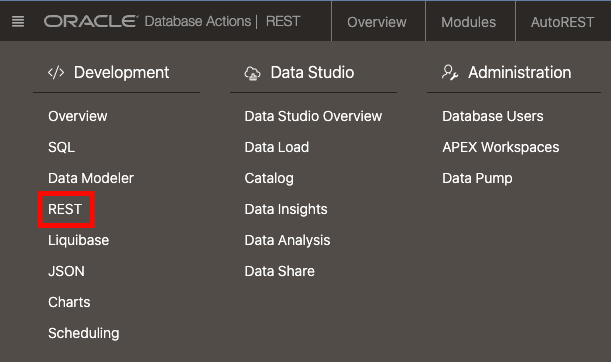

# Use Open API tools with your RESTful services

## Introduction
OpenAPI is a specification for building and documenting APIs. It allows developers to describe the structure of their APIs in a standardized format using JSON or YAML, making it easier to understand and work with APIs. OpenAPI specifications can be used to generate interactive documentation, client libraries, and server stubs, streamlining the API development process. There are many tools that you can use with OpenAPI, including Swagger, Postman, and more. 

It's easy to use OpenAPI with Autonomous Database RESTful development. Autonomous Database supports the OpenAPI 3.0 specification, allowing you to both import and export your API modules. This gives you flexibility in your API development:
1. Create your API modules in Autonomous Database, export their definitions, and then document them using your API tools.
2. Design your RESTful services in your OpenAPI tool and then import those definitions into Autonomous Database. Complete the API implementation in Autonomous Database's API design tool.

This lab will show you how to view and test your APIs using OpenAPI. We'll need to capture the endpoint URLs in order to update our web app in the next lab.

Estimated Time: 15 minutes.

### Objectives

In this lab, you will:

* Review and test your REST endpoint
* Export the API definitions for use by OpenAPI tools

### Prerequisites

- This lab requires completion of the previous labs in the **Contents** menu on the left.

## Task 1: Review the create bedtime story API using the OpenAPI view
Let's review the **apiapp** module using the OpenAPI view.

1. Make sure that you are still logged in to the Database Actions as the **MOVIESTREAM** user. Click the **Selector** (hamburger) menu and then select **REST**.

    

2. Go to the **Modules** tab. You'll see 2 modules.

    - the **api** module that was created by the setup script
    - the **apiapp** module that you created in the previous lab

        

2. Click the 3 dots on the **apiapp** tile and select **OpenAPI view** from the context menu.

    

3. Test the **/bedtimestory/create** API:
    - Click **POST** for API **/bedtimestory/create**
    - Click **Try it out**
    - **characters**: `["Chole", "Omar"]`
    - **cust_id**: `1083240`
    - **movies**: `["Frozen II", "Ice Age"]`.
    
    The completed form should look as follows.

    
    
4. Scroll down and click **Execute**.

5. Scroll down to the **Response Body** section to view the generated story - in this case **The Secret of the Glittering Glacier**. Your story will likely be very different!

    

## Task 2: Export your API definitions to an OpenAPI tool
It's easy to export your API signatures to an OpenAPI tool.

1. Go to the **apiapp** module tile and click the 3 dots. Select **Export Module > OpenAPI**
    
2. You are presented with the OpenAPI 3.0 export file. OpenAPI tools will provide a way to either copy and paste these definitions or import the file:
    
3. The example below shows our API used in the OpenAPI plug-in for VSCode. Using the tool, you can document the API, test it and more. 
    
    This is just one example. Import these definitions into any number of tools that support OpenAPI - including Swagger, Postman and more.

## Summary    
Autonomous Database makes it easy to develop and test your APIs and integrate them with your favorite OpenAPI tools

You may now proceed to the next lab.

## Learn More
* [DBMS\_NETWORK\_ACL\_ADMIN PL/SQL Package](https://docs.oracle.com/en/database/oracle/oracle-database/19/arpls/DBMS_NETWORK_ACL_ADMIN.html#GUID-254AE700-B355-4EBC-84B2-8EE32011E692)
* [DBMS\_CLOUD\_AI Package](https://docs.oracle.com/en-us/iaas/autonomous-database-serverless/doc/dbms-cloud-ai-package.html)
* [Using Oracle Autonomous Database Serverless](https://docs.oracle.com/en/cloud/paas/autonomous-database/adbsa/index.html)
* [Overview of Generative AI Service](https://docs.oracle.com/en-us/iaas/Content/generative-ai/overview.htm)

## Acknowledgements

* **Author:** Marty Gubar, Product Management
* **Contributors:**
    * Stephen Stuart, Cloud Engineer
    * Nicholas Cusato, Cloud Engineer
    * Lauran K. Serhal, Consulting User Assistance Developer
    * Olivia Maxwell, Cloud Engineer
    * Taylor Rees, Cloud Engineer
    * Joanna Espinosa, Cloud Engineer
* **Last Updated By/Date:** Marty Gubar, Aug 2024

Data about movies in this workshop were sourced from **Wikipedia**.

Copyright (c) 2024 Oracle Corporation.

Permission is granted to copy, distribute and/or modify this document
under the terms of the GNU Free Documentation License, Version 1.3
or any later version published by the Free Software Foundation;
with no Invariant Sections, no Front-Cover Texts, and no Back-Cover Texts.
A copy of the license is included in the section entitled [GNU Free Documentation License](files/gnu-free-documentation-license.txt)
