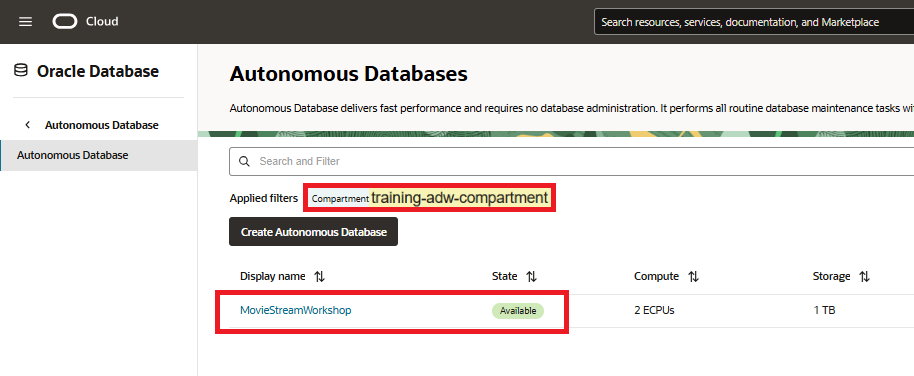

# Set up the Workshop Environment

<!---
comments syntax
--->

## Introduction

This workshop teaches you how to apply generative AI to your organization's private data for different types of use cases. 

> **NOTE:** In order to use OCI Generative AI, your tenancy must be subscribed to the **US Midwest (Chicago)** region. See the [OCI documentation](https://docs.oracle.com/en-us/iaas/Content/Identity/Tasks/managingregions.htm) for more details. You can use other AI providers if you do not have access to OCI GenAI.

To fast track using Select AI, you will deploy a ready-to-go environment using a terraform script that will:

* Provision your Autonomous Database instance with the required users and data
* Connects your Autonomous Database to OCI Generative AI service (assuming you are subscribed to the US Midwest (Chicago) region)
* Deploy the business logic for running different types of AI projects - like summarizing a support chat and suggesting things to do at a location
* Deploy RESTful endpoints for executing that business logic from your applications
* Deploys two APEX apps in a MOVIESTREAM workspace: 
    * Chat with your data in Autonomous Database 
    * Create and test GenAI projects

All of this is done so that you can immediately try all of the different components. You will also be developing many of these components on your own as part of the workshop.

The automation uses a predefined OCI Cloud Stack Template that contains all of the resources that you need. You'll use OCI Resource Manager to deploy this template and make your environment available in just a few minutes. You can use Resource Manager for your own projects. For more details, see the [Overview of Resource Manager](https://docs.oracle.com/en-us/iaas/Content/ResourceManager/Concepts/resourcemanager.htm) Oracle Cloud Infrastructure Documentation documentation.

Estimated Time: 15 minutes.

### Objectives

In this lab, you will:

* (optional) Create an OCI Compartment 
* Run the stack to perform all the prerequisites required to analyze data
* Define an IAM policy that enables access to OCI Generative AI

## (Optional) Task 1: Create an OCI Compartment

A compartment is a collection of cloud assets, such as compute instances, load balancers, databases, and so on. By default, a root compartment was created for you when you created your tenancy (for example, when you registered for the trial account). It is possible to create everything in the root compartment, but Oracle recommends that you create sub-compartments to help manage your resources more efficiently.

If you are using an Oracle LiveLabs-provided sandbox, you don't have privileges to create a compartment and should skip this first task. Oracle LiveLabs has already created a compartment for you and you should use that one. Even though you can't create a compartment, you can review the steps below to see how it is done.

1. Log in to the **Oracle Cloud Console**. On the **Sign In** page, select your tenancy, enter your username and password, and then click **Sign In**. The **Oracle Cloud Console** Home page is displayed.

2. Open the **Navigation** menu and click **Identity & Security**. Under **Identity**, click **Compartments**.

       

3. On the **Compartments** page, click **Create Compartment**.

   

4. In the **Create Compartment** dialog box, enter an appropriate name such as **`training-adw-compartment`** in the **Name** field and a description such as **`Training ADW Compartment`** in the **Description** field.

5. In the **Parent Compartment** drop-down list, select your parent compartment, and then click **Create Compartment**.

   

   The **Compartments** page is re-displayed and the newly created compartment is displayed in the list of available compartments. You can use the compartment for your cloud services!

   

## Task 2: Provision an ADB Instance and Load Data

Use an OCI Cloud Stack to set up your workshop environment. This step will create an ADB instance, load the moviestreaming data, and set up different application components as described in the Introduction.

1. Deploy the required cloud resources for this workshop using the OCI Resource Manager. Click the button below:

    <a href="https://cloud.oracle.com/resourcemanager/stacks/create?region=home&zipUrl=https://github.com/oracle-devrel/terraform-oci-oracle-cloud-foundation/releases/download/v1.0.0/Deploy-ChatDB-Autonomous-Database-oci-genai-demonstration-RM.zip&zipUrlVariables=%7B%22tag%22%3A%22gen-ai%22%2C%22db_compute_count%22%3A2%2C%22db_name%22%3A%22MovieStreamWorkshop%22%7D" class="tryit-button">Deploy workshop</a>

    >**Note:** If you would to learn more about creating Autonomous Databases and loading data, go to this [15 minute quick start](https://livelabs.oracle.com/pls/apex/dbpm/r/livelabs/view-workshop?wid=928)

    The automation uses a predefined OCI Cloud Stack Template that contains all of the resources that you will need in this workshop. You'll use OCI Resource Manager to deploy this template and make your environment available in just a few minutes. Your first step will be to log in to Oracle Cloud. Next, you will land on the Resource Manager page where you will kick off a job that will do the following:
    * Create a new Autonomous Database named **`MovieStreamWorkshop`** by default; however, you can replace the database name with your own name.
    * Create a new user named **`moviestream`**
    * Create movie related tables and views in the **`moviestream`** schema
    * Grant the required privileges to perform various actions in the workshop
    * Download the **Autonomous Database Select AI** APEX applications

    >**Note:** For detailed information about Resource Manager and managing stacks in Resource Manager, see the [Overview of Resource Manager](https://docs.oracle.com/en-us/iaas/Content/ResourceManager/Concepts/resourcemanager.htm#concepts__package) and [Managing Stacks](https://docs.oracle.com/en-us/iaas/Content/ResourceManager/Tasks/stacks.htm) documentation.

2. After you log in to your Oracle Cloud account, the **Create stack** page is displayed. In the **Stack information** **step 1** of the wizard, select the **I have reviewed and accept the Oracle Terms of Use** checkbox. In the **Create in compartment** drop-down list, select your desired compartment. Accept the default values for the rest of the fields, and then click **Next**.

  

3. In the **Configure variables** **step 2** of the wizard, provide the following:
    * **Region:** Select the target region for the new Autonomous Database instance. In our example, we chose the `us-chicago-1` region.
    * **Compartment:** Select the target compartment for the new Autonomous Database instance.
    * **Database Name:** The default database name is **`MovieStreamWorkshop`**. You can replace this name with your own name but that is optional. The database name must contain only letters and numbers, starting with a letter, and between 12 and 30 characters long. The name cannot contain the double quote (") character, space, underscore "_", or the username `admin`.
    
    
    >**Important:** Your database name that you choose must be unique in the tenancy that you are using; otherwise, you will get an error message.
    
    * **Do you want a always Free Oracle Autonomous Database instance?** Accept the default **`false`** value. Select **`true`** from the drop-down list if you want to deploy an Always Free database.

        

    * **Password:** Enter a password for the `ADMIN` user of your choice such as **`Training4ADW`**. **Important**: Make a note of this password as you will need it to perform later tasks.
    * For the other fields, accept the default selections.
    
    

4. Click **Next**.

   >**Note:** If clicking **Next** does not take you to the page 3 of the wizard, check the **Region** field. It may have been reset.

5. In the **Review** **step 3** of the wizard, review your configuration variables and make any necessary changes on the previous pages. If everything looks good, then it's time for you to create and apply your stack! Ensure that the **Run apply** check box is checked, and then click **Create**.

    

6. The **Job details** page is displayed. The initial status (in orange color) is **ACCEPTED** and then **IN PROGRESS**.

  

  If the job completes successfully, the status changes to **SUCCEEDED** (in green color). This process can take 5 to 10 minutes to complete.

  

7. Scroll-down to the **Resources** section at the bottom of **Job details** page, and then click **Outputs**. The keys and values are displayed in the **Outputs** section. Save the values for the following keys in a text editor of your choice as you will need this information later. For the **`select_ai_demo_url`** value, click the **Copy** button in that row to copy the value into the clipboard, and then paste it into your text editor. _This URL to launch the **Autonomous Database Select AI** demo application is **not required** for this lab._

    * **`adb_user_name`**
    * **`adb_user_password`**
    * **`select_ai_demo_url`**

        

8. Let's view the completed the newly created stack and job. From the Console, open the **Navigation** menu and click **Developer Services**. Under **Resource Manager**, click **Stacks**.

    

    The newly created stack is displayed in the **Stacks** page.
    
    
    
9.  Click the stack name. The **Stack details** page is displayed.

    

10.  In the **Jobs** section, click the job name. The **Job details** page is displayed.

    

    You can use the **Logs** section to view the created resources such as the **moviestream** user. You can also use the  **Output** link in the **Resources** section to find out the values of different keys.

    The **Logs** section is useful when you have a failed job and you try to find out why it failed. In the following failed job example, we scrolled down the log and then searched for text in red font color which describes the potential problem. In this specific example, we specified a database name with an underscore which does not meet the requirements for a database name.

    

11. Let's view the newly provisioned ADB instance. From the Console, open the **Navigation** menu and click **Oracle Database**. Under **Autonomous Database**, click **Autonomous Data Warehouse**. On the **Autonomous Databases** page, select the _compartment and region_ that you specified in the **Configure variables** step 2 of the wizard. The Autonomous Database that was provisioned by the stack is displayed: it's blurred out here - the field will match the name you gave it in the previous steps.

    

## Task 3: Create policy to enable access to OCI Generative AI 
You need to perform this task if you plan to use OCI Generative AI and not a 3rd party AI model. 

Create a policy that will allow you to use OCI Generative AI within your previously defined compartment. **Make sure your policy uses the compartment where your Autonomous Database is deployed.** The policy will be necessary for Autonomous Database to interact with OCI Generative AI.

1. From the **Console,** open the **Navigation** menu and click **Identity & Security.** Under **Identity,** click **Policies.**.

2. Click on **Create policy** and paste the following into the appropriate fields:

    >**Note:** Slide the **Show manual editor** control to display the text field in order to paste the policy.

    * **Name:** **`PublicGenAI`**
    * **Description:** **`Public Gen AI Policy`**
    * **Compartment:** **`select your own compartment`**
    * **Policy:** **`allow any-user to manage generative-ai-family in compartment training-adw-compartment`**
    
3. Click **Create**.

    
    
>**Note:** This policy allows any Autonomous Database in the specified compartment to access OCI Generative AI. In a production environment, ensure your policy's scope is minimally inclusive.

You may now proceed to the next lab.

# Learn More
* [DBMS\_NETWORK\_ACL\_ADMIN PL/SQL Package](https://docs.oracle.com/en/database/oracle/oracle-database/19/arpls/DBMS_NETWORK_ACL_ADMIN.html#GUID-254AE700-B355-4EBC-84B2-8EE32011E692)
* [DBMS\_CLOUD\_AI Package](https://docs.oracle.com/en-us/iaas/autonomous-database-serverless/doc/dbms-cloud-ai-package.html)
* [Using Oracle Autonomous Database Serverless](https://docs.oracle.com/en/cloud/paas/autonomous-database/adbsa/index.html)
* [Overview of Generative AI Service](https://docs.oracle.com/en-us/iaas/Content/generative-ai/overview.htm)

## Acknowledgements

  * **Authors:**
    * Marty Gubar, Product Management
    * Lauran K. Serhal, Consulting User Assistance Developer
  * **Contributors:**
    * Stephen Stuart, Cloud Engineer
    * Nicholas Cusato, Cloud Engineer
    * Olivia Maxwell, Cloud Engineer
    * Taylor Rees, Cloud Engineer
    * Joanna Espinosa, Cloud Engineer
* **Last Updated By/Date:** Stephen Stuart & Nicholas Cusato, May 2025

Data about movies in this workshop were sourced from **Wikipedia**.

Copyright (c) 2004 Oracle Corporation.

Permission is granted to copy, distribute and/or modify this document
under the terms of the GNU Free Documentation License, Version 1.3
or any later version published by the Free Software Foundation;
with no Invariant Sections, no Front-Cover Texts, and no Back-Cover Texts.
A copy of the license is included in the section entitled [GNU Free Documentation License](files/gnu-free-documentation-license.txt)
