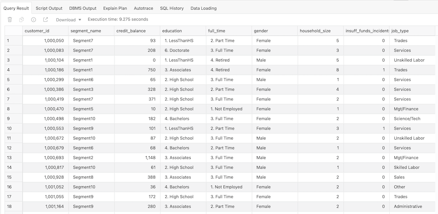

# Apply Machine Learning to Customer Demographics

## Introduction

Autonomous Data Warehouse contains built-in machine learning algorithms. The aim of this lab is to provide a simple introduction into using machine learning models to solve common business problems. There are many other workshops in LiveLabs that will help you explore machine learning in more detail: [see here](https://livelabs.oracle.com/pls/apex/dbpm/r/livelabs/livelabs-workshop-cards?c=y&p100_focus_area=27&p100_product=131).

Estimated Lab Time: 10 minutes

### Objectives

- Learn how to use the  `DBMS_DATA_MINING.CREATE_MODEL2` procedure

- Learn how to interpret the results that are automatically generated


## Overview

Autonomous Data Warehouse contains built-in machine learning algorithms. There is a separate workshop that can guide you through creating machine learning models to solve common business problems: [see here] (https://livelabs.oracle.com/pls/apex/dbpm/r/livelabs/view-workshop?wid=560). In this short lab, the objective is to use one of these built-in algorithms to help us understand the demographic factors that can explain why a customer triggers an "insufficient funds" event against their account. If we can identify the key demographic attributes associated with this type of event, we strive to improve data quality of those attributes in support of subsequent predictive machine learning efforts.

To do this analysis, we use a package called `DBMS_DATA_MINING`. This package helps in creating, evaluating, and querying Oracle Machine Learning for SQL (OML4SQL) machine learning models. In-database machine learning makes it easy for you to benefit from the power of machine learning-driven analytics.


## Task 1: Preparing Our Customer Data Set

1. The first step is to create a view that contains the main customer demographic attributes. This means removing the time attributes, transaction attributes and movie attributes from our movie sales data.  Copy and paste the following code into the SQL worksheet window:

    ```
    <copy>CREATE OR REPLACE VIEW vw_cust_funds AS
    SELECT DISTINCT
    customer_id,
    segment_name,
    credit_balance,
    education,
    full_time,
    gender,
    household_size,
    insuff_funds_incidents,
    job_type,
    late_mort_rent_pmts,
    marital_status,
    mortgage_amt,
    num_cars,
    num_mortgages,
    pet,
    rent_own,
    years_current_employer_band,
    years_customer,
    years_residence_band,
    commute_distance,
    commute_distance_band
    FROM movie_sales_fact;</copy>
    ```

2. You should get a message in the log window saying "View VW\_CUST\_FUNDS created". Check the number of rows returned by the above query/view, by running the following query, which should show that there are 4,845 unique customers:

    ```
    <copy>SELECT COUNT(*) FROM vw_cust_funds;</copy>
    ```

    You should see that there are 4,845 unique customer rows:

    

3. What does the data set in our table look like? Let's run another simple query:

    ```
    <copy>
    SELECT *
    FROM vw_cust_funds
    ORDER BY 1;
    </copy>
    ```

4. This will return something like the following output:

    

    **NOTE:** Unlike the movie sales data, we now have a single row per customer and you can see that in the column `insufficient_funds_incidents` there are single numeric values, which indicate how many times the customer ran out of funds in their account.

5. Run the following query to create a **vw\_cust\_funds2** view with a condition to check insufficient funds incidents. When the condition insufficient funds incident is true, the value is 1 and when there is no incident, the value is 0. 

    ```
    <copy>
    CREATE OR REPLACE VIEW vw_cust_funds2 AS
    SELECT
    customer_id,
    segment_name,
    credit_balance,
    education,
    full_time,
    gender,
    household_size,
    job_type,
    late_mort_rent_pmts,
    marital_status,
    mortgage_amt,
    num_cars,
    num_mortgages,
    pet,
    rent_own,
    years_current_employer_band,
    years_customer,
    years_residence_band,
    commute_distance,
    commute_distance_band,
        CASE insuff_funds_incidents WHEN 0 THEN 0 ELSE 1 END insuff_funds_indicator
    FROM vw_cust_funds;
    </copy>
    ```

    
    Obviously,  we are interested in the values of the `insuff_funds_indicator`. From a machine learning perspective, it is important to have both positive and negative examples, that is, when the event did occur, as well as when the event does not occur. Now that we know we have the right data set in place, we can proceed to build our model.

## Task 2: Building the Model

### Overview

In this case, we will use the `CREATE_MODEL2` procedure to help us understand which demographic attributes have the most impact to predict if a customer is likely to incur an insufficient funds event. The `CREATE_MODEL2` procedure uses the Attribute Importance algorithm Minimum Description Length to determine the relative importance of attributes in predicting the column to be explained, in this case, the target, `insuff_funds_indicator`.

To run this analysis, we need to provide the following information:

- `DBMS_DATA_MINING.SETTING_LIST`: defines model settings or hyperparameters for your model
- `v_setlst`: variable to store the setting list
- `ALGO_NAME`:  specifies the algorithm name. In this case, it is `ALGO_AI_MDL` indicating Minimum Description Length.

Then, the `CREATE_MODEL2` procedure takes the following parameters:

- `MODEL_NAME`:  A unique model name that you will give to the model. The name of the model is in the form [schema\_name.]model\_name. If you do not specify a schema, your own schema is used. Here, the model name is `AI_OUTPUT`. 

- `MINING_FUNCTION`:  Specifies the machine learning function or technique. Since this is an attribute importance ranking problem, specify `ATTRIBUTE_IMPORTANCE`.  

- `DATA_QUERY`: A query that provides training data for building the model. Here, the query is `select * from vw_cust_funds`. This is the name of the input table - our customer demographic view.

- `SET_LIST`: Specifies `SETTING_LIST`.

- `TARGET_COLUMN_NAME`:  For a supervised model, that is, where we have a known outcome. This is the target column in the build data. In this case, it is the column for insufficient funds events. 

These settings are described in [`DBMS_DATA_MINING.CREATE_MODEL2 Procedure`](https://docs.oracle.com/en/database/oracle/oracle-database/23/arpls/DBMS_DATA_MINING.html#GUID-560517E9-646A-4C20-8814-63FDA763BFD9).


1. Now that we understand the required inputs, let's run the model:

    ```
    <copy>DECLARE
  v_setlst DBMS_DATA_MINING.SETTING_LIST;
BEGIN
  v_setlst('ALGO_NAME') := 'ALGO_AI_MDL';
 
  DBMS_DATA_MINING.CREATE_MODEL2
  (MODEL_NAME          => 'AI_OUTPUT',
   MINING_FUNCTION      => 'ATTRIBUTE_IMPORTANCE',
   DATA_QUERY           => 'select * from vw_cust_funds2',
   SET_LIST             => v_setlst,
   CASE_ID_COLUMN_NAME  => 'customer_id',
   TARGET_COLUMN_NAME   => 'insuff_funds_indicator');
END;</copy>
    ```

2. The package will return a "PL/SQL procedure successfully completed" message to the log window once it has finished processing - which should take around 20 seconds.

    

## Task 3: Reviewing the Output

1. To view the results from our model, we simply need to query the model detail view `DM$VA`:

    ```
    <copy>SELECT ATTRIBUTE_NAME, ATTRIBUTE_IMPORTANCE_VALUE, ATTRIBUTE_RANK FROM
DM$VAAI_OUTPUT;</copy>
    ```
Learn more about [model detail views](https://docs.oracle.com/en/database/oracle/machine-learning/oml4sql/23/dmprg/model-detail-views.html#GUID-58E2B8C6-0329-43B2-9CDE-7F3B34E6B304).

2. This should return the following results:

    

What do the above columns mean?

### ATTRIBUTE\_IMPORTANCE\_VALUE

The `attribute_importance_value` column contains a value that indicates how useful the column is for determining the value of the target column (insufficient funds). Higher values indicate the attribute has a greater impact on the target for prediction. The value can range from 0 to 1.

An individual column's attribute importance value is independent of other predictor columns in the input table. The values are based on how strongly each individual column correlates with the target column.

An attribute importance value of 0 implies there is no useful correlation between the column's values and the target column's values. Such columns could be removed from the data set. An attribute importance value of 1 implies perfect correlation; such columns should be eliminated from consideration when building classification or regression models. In practice, an attribute importance equal to 1 is rarely returned.

### ATTRIBUTE\_RANK

The `attribute_rank` column simply shows the ranking of attribute importance value. Rows with equal values for `attribute_importance_value` have the same rank. Rank values are not skipped in the event of ties.

## Task 4: Interpreting the Results

What do the results tell us? The results above tell us that the top predictor columns that impact our ability to predict an insufficient funds event are late mortgage payments by a customer, their segment name and the mortgage amount. Note that the analysis doesn't focus on specific attribute values. When selecting columns to build a classification model to predict the likelihood of an insufficient funds event, we might start by including the top N columns, here, we might choose the top 10.  

The results show that demographic attributes such as `job_type`, `marital_status` and `education` have no impact on whether a customer is likely to incur an insufficient funds event.

## Recap

This lab has introduced you to the built-in capabilities of machine learning within Autonomous Data Warehouse. There are additional workshops in this series that will take you deeper into these unique capabilities: see [here](https://livelabs.oracle.com/pls/apex/dbpm/r/livelabs/view-workshop?wid=560).

Within this lab we have examined:

- How to use the `DBMS_DATA_MINING.CREATE_MODEL2` procedure and how to interpret the results that are automatically generated.
- How this feature helps us understand the relative importance of demographic factors that can explain why a customer might trigger an "insufficient funds" event.

Now that we have identified these key demographic attributes, we can do more analysis using SQL to go deeper. 

## **Acknowledgements**

- **Author** - Keith Laker, ADB Product Management
- **Adapted for Cloud by** - Richard Green, Principal Developer, Database User Assistance
- **Last Updated By/Date** - Sarika Surampudi, Principal User Assistance Developer, Database Documentation; June 2023
