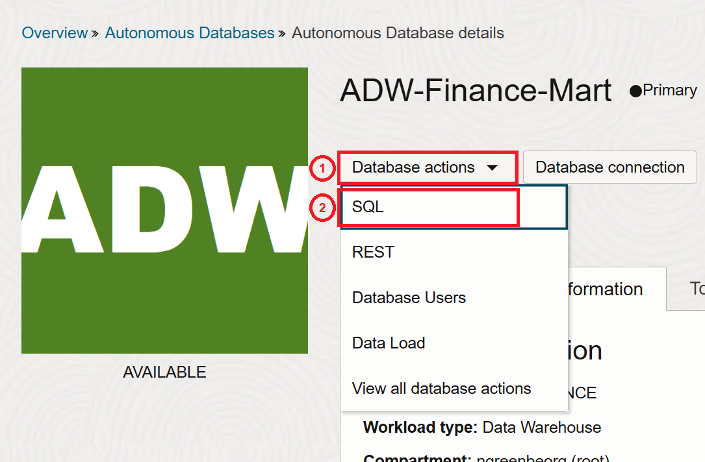
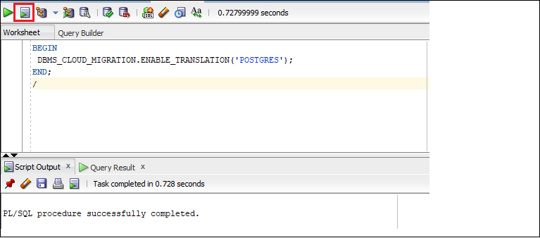
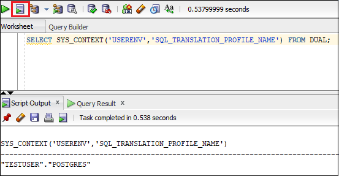


# Run PostgreSQL Statements in Autonomous Database Serverless

## Introduction
This lab introduces the `DBMS_CLOUD_MIGRATION.ENABLE_TRANSLATION` procedure that enables you to run your SQL statements written in PostreSQL statement in your Autonomous Database session.

**Note: 'DBMS_CLOUD_MIGRATION.ENABLE_TRANSLATION' is not supported in Database Actions and is not supported with the Oracle APEX Service.**

Estimated Time: 30 minutes


### Objectives

In this lab, you will:
- Connect with SQL Worksheet
- Enable Real-Time SQL Translation in Your Session
- Run PostgreSQL Statements in Your Session
- Disable Real-Time SQL Translation in Your Session

### Prerequisites

This lab assumes you have:

- Performed the previous lab on provisioning an Oracle Autonomous Database instance.
- You must be logged in as the ADMIN user or have EXECUTE privilege on the `DBMS_CLOUD_MIGRATION` package.

## Task 1: Connect with the SQL Worksheet

To complete the subsequent tasks you need to use SQL Worksheet.

1. Return to your SQL Worksheet. On the **Autonomous Databases** page, click the **`ADW_Finance_Mart`** database instance that you created in **Lab 1: Provision Autonomous Database**. Next, click the **Database actions** drop-down list, and then select **SQL**.




## Task 2: Use the `DBMS_CLOUD_MIGRATION.ENABLE_TRANSLATION` Procedure to Enable Real-Time Translation for Your Session

To run a PostgreSQL statement in your Autonomous Database you must first enable real-time SQL translation for your session. Use the `DBMS_CLOUD_MIGRATION.ENABLE_TRANSLATION` procedure to enable real-time translation for a session.

### Enable Real-Time SQL Translation in Your Session

1. Run `DBMS_CLOUD_MIGRATION.ENABLE_TRANSLATION` to enable real-time translation. Copy and paste the following code into your SQL Worksheet, and then click the **Run Script (F5)** icon in the Worksheet toolbar.

    ```
    <copy>
    BEGIN
        DBMS_CLOUD_MIGRATION.ENABLE_TRANSLATION('POSTGRES');
    END;
    /
    </copy>
    ```
  

  This enables the real-time SQL translation in your session.

  Verify the SQL translation language for your session. Copy and paste the following query into your SQL Worksheet, and then click the **Run Script (F5)** icon in the Worksheet toolbar.

      ```
    <copy>
        SELECT SYS_CONTEXT ('USERENV','SQL_TRANSLATION_PROFILE_NAME') FROM DUAL;
    </copy>
    ```

  

This shows the enabled translation language for your session.

## Task 2: Run PostgreSQL Statements in Your Session

### Run PostgreSQL Statements in Your Session

1. Enter and run PostgreSQL statements in your database session. Copy and paste the following code into your SQL Worksheet, and then click the **Run Script (F5)** icon in the Worksheet toolbar.

    ```
    <copy>
    CREATE TABLE film (film_id int, title varchar(255));
    </copy>
    ```
  

  This entered PostreSQL statement runs seamlessly as Oracle SQL in your session.

   Verify the table creation. Copy and paste the following code into your SQL Worksheet, and then click the **Run Script (F5)** icon in the Worksheet toolbar.

    ```
    <copy>
    DESC film;
    </copy>
    ```
  2. After the table **FILM** is created, you can insert records into the table. Copy and paste the following code into your SQL Worksheet, and then click the **Run Script (F5)** icon in the Worksheet toolbar.

     ```
    <copy>
    INSERT INTO film(film_id, title) VALUES (123, 'Tangled');
    INSERT INTO film(film_id, title) VALUES (234, 'Frozen');
    </copy>
    ```
    This inserts two records into the **FILM** table.

    Use SQL SELECT statement to retrieve records from the **FILM** table.  Copy and paste the following code into your SQL Worksheet, and then click the **Run Script (F5)** icon in the Worksheet toolbar.

     ```
    <copy>
    SELECT * FROM film AS f;
    </copy>
    ```

## Task 3: Disable Real-Time SQL Translation in Your Session

1. Run `DBMS_CLOUD_MIGRATION.DISABLE_TRANSLATION` to disable real-time translation for your session. Copy and paste the following code into your SQL Worksheet, and then click the **Run Script (F5)** icon in the Worksheet toolbar.

     ```
    <copy>
    BEGIN
        DBMS_CLOUD_MIGRATION.DISABLE_TRANSLATION;
    END;
    /
    </copy>
    ```
This disables the real-time SQL translation for your session.


## Acknowledgements

- Author       - Shilpa Sharma, Principal User Assistance Developer.
- Contributors - Lauran Serhal, Consulting User Assistance Developer.