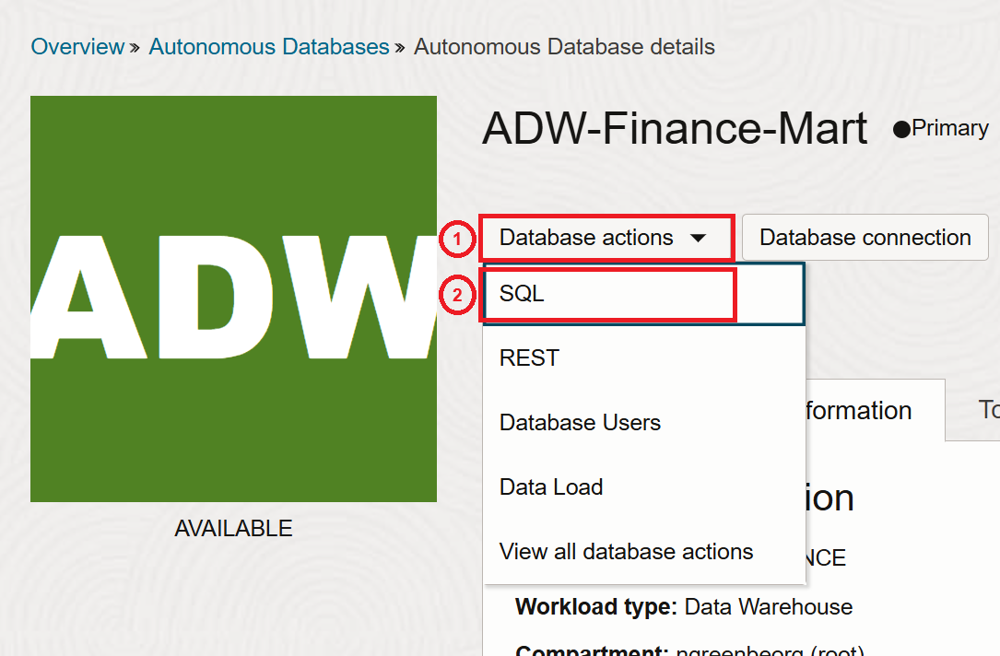
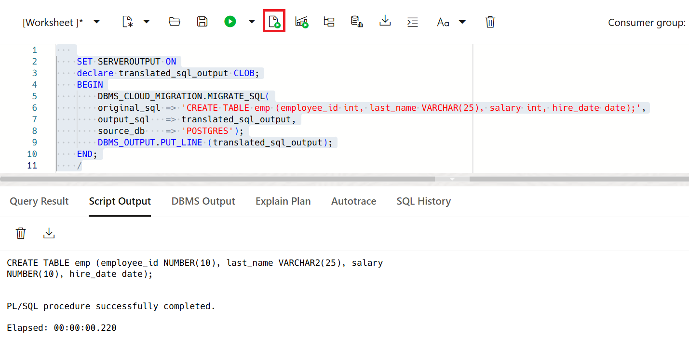
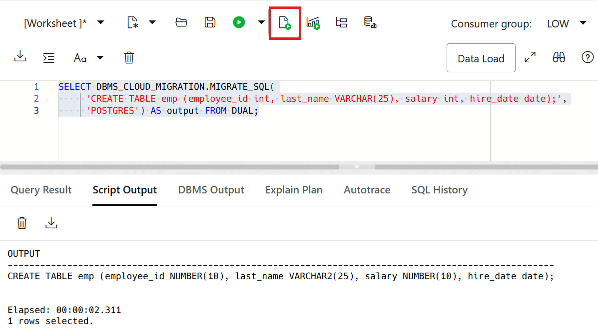


# Translate PostgreSQL Statements to Oracle SQL

## Introduction
This lab introduces the `DBMS_CLOUD_MIGRATION.MIGRATE_SQL` procedure that enables you to translate the SQL statements written for a non-Oracle database to Oracle SQL.

Estimated Time: 30 minutes


### Objectives

In this lab, you will:
- Connect with SQL Worksheet
- Use the `DBMS_CLOUD_MIGRATION.MIGRATE_SQL` Procedure to Translate a PostgreSQL statement to Oracle SQL
- Use the `DBMS_CLOUD_MIGRATION.MIGRATE_SQL` Function to Translate a PostgreSQL Statement to Oracle SQL

### Prerequisites

This lab assumes you have:

- Performed the previous lab on provisioning an Oracle Autonomous Database instance.
- You must be logged in as the ADMIN user or have EXECUTE privilege on the `DBMS_CLOUD_MIGRATION` package.

## Task 1: Connect with the SQL Worksheet

To complete the subsequent tasks you need to use SQL Worksheet.

1. Return to your SQL Worksheet. On the **Autonomous Databases** page, click the **`ADW_Finance_Mart`** database instance that you created in **Lab 1: Provision Autonomous Database**. Next, click the **Database actions** drop-down list, and then select **SQL**.

  


## Task 2: Use the `DBMS_CLOUD_MIGRATION.MIGRATE_SQL` Procedure to Translate a PostgreSQL statement to Oracle SQL

The procedure form of the `DBMS_CLOUD_MIGRATION.MIGRATE_SQL` subroutine accepts a PostgreSQL as input and translates the statement to Oracle SQL. With the `DBMS_CLOUD_MIGRATION.MIGRATE_SQL` procedure you can translate only one SQL statement per call.

### Run the `DBMS_CLOUD_MIGRATION.MIGRATE_SQL` procedure

1. Translate PostgreSQL statement to Oracle SQL. Copy and paste the following code into your SQL Worksheet, and then click the **Run Script (F5)** icon in the Worksheet toolbar.

    ```
    <copy>
    SET SERVEROUTPUT ON
    declare translated_sql_output CLOB;
    BEGIN
        DBMS_CLOUD_MIGRATION.MIGRATE_SQL(
        original_sql => 'CREATE TABLE emp (employee_id int, last_name VARCHAR(25), salary int, hire_date date);',
        output_sql   => translated_sql_output,
        source_db    => 'POSTGRES');
        DBMS_OUTPUT.PUT_LINE (translated_sql_output);
    END;
    /
    </copy>
    ```
  

  This accepts PostgreSQL statement as input, translates the PostgreSQL statement to Oracle SQL. The translated statement is then assigned to the `translated_sql_output` variable.
  You can display the output (translated statement) using `DBMS_OUTPUT.PUT_LINE`.

  ## Task 2: Use the `DBMS_CLOUD_MIGRATION.MIGRATE_SQL` Function to Translate a PostgreSQL statement to Oracle SQL

The `DBMS_CLOUD_MIGRATION.MIGRATE_SQL`function  enables you to translate a non-SQL statement to Oracle SQL. With the `DBMS_CLOUD_MIGRATION.MIGRATE_SQL` function you can translate only one SQL statement per call.

### Run the `DBMS_CLOUD_MIGRATION.MIGRATE_SQL` function

1. Translate PostgreSQL statement to Oracle SQL using the `DBMS_CLOUD_MIGRATION.MIGRATE_SQL` function. Copy and paste the following code into your SQL Worksheet, and then click the **Run Script (F5)** icon in the Worksheet toolbar.

    ```
    <copy>
    SELECT DBMS_CLOUD_MIGRATION.MIGRATE_SQL(
        'CREATE TABLE emp (employee_id int, last_name VARCHAR(25), salary int, hire_date date);',
        'POSTGRES') AS output
        FROM DUAL;
    </copy>
    ```
  

The function version of the `DBMS_CLOUD_MIGRATION.MIGRATE_SQL` subroutine accepts a PostgreSQL statement as a function parameter and translates the statement to Oracle SQL.

## Acknowledgements

- Author       - Shilpa Sharma, Principal User Assistance Developer.
- Contributors - Lauran Serhal, Consulting User Assistance Developer.