# Application Migration

## Introduction

This lab shows how to migrate the SQL code written in PostgreSQL to Oracle SQL in Oracle Autonomous Database.

Estimated Lab Time: 45 minutes (25 minutes if you are running this workshop in an **Oracle LiveLabs sandbox** hosted environment)


### About Application Migration

Application migration involves moving an application from one environment to another. The migration process includes a variety of tasks, including migrating SQL statements from a non-Oracle database to Oracle SQL.
You can translate SQL statements written in PostgreSQL to Oracle SQL and run the translated statements on Autonomous Database.
### Objectives

In this lab, you will:

- Connect to Your ADB Instance
- Translate PostgreSQL Statements to Oracle SQL
- Migrate PostgreSQL Files to Oracle SQL
- Run PostgreSQL Statements in Autonomous Database


### Prerequisites

This lab assumes you have:

- Performed the previous lab on provisioning an Oracle Autonomous Database

- Performed the previous lab on Work with Free Sample Data Sets

- You are logged in as the `ADMIN` user or `EXECUTE` privilege on `DBMS_CLOUD_MIGRATION`.


## Task 1: Connect to Your ADB Instance

To complete the subsequent tasks you need to use SQL Worksheet.

1. Return to `Database actions` and click `SQL` to start SQL Worksheet and log in as the `ADMIN` user.

   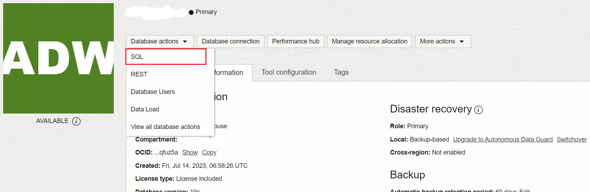

## Task 2: Translate PostgreSQL Statements to Oracle SQL

Use `DBMS_CLOUD_MIGRATION.MIGRATE_SQL` to translate a non-Oracle SQL statement to Oracle SQL. There are procedure and function variants of `DBMS_CLOUD_MIGRATION.MIGRATE_SQL`.

1. Execute the following command to translate the SQL command written in PostgreSQL to Oracle SQL:

    ```
    <copy>CREATE TABLE employees (EMPNO NUMBER(4) NOT NULL, ENAME VARCHAR2(10), JOB VARCHAR2(9), MGR NUMBER(4)) FLASHBACK ARCHIVE;</copy>
    ```

    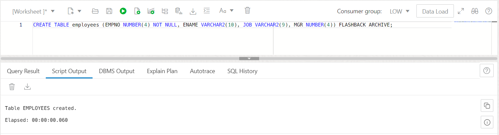

    This creates the `EMPLOYEES` table with Flashback Time Travel enabled.


## Task 3: Enable Flashback Time Travel for an Existing Table

You can enable Flashback Time Travel for an existing table also, if not already enabled.
In this task, you will first create the `DEPARTMENTS` table and then enable the Flashback Time Travel for the table.

1. Create the `DEPARTMENTS` table by executing the following command:


    ```
    <copy>CREATE TABLE departments (DEPNO NUMBER(4) PRIMARY KEY, DNAME VARCHAR2(10), MGR NUMBER(4), LOC_ID NUMBER(4)) FLASHBACK ARCHIVE;</copy>
    ```

    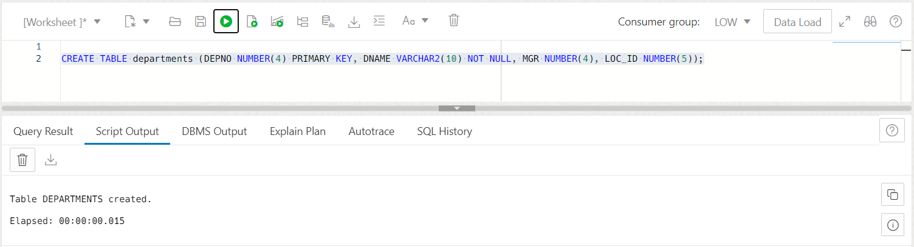

    This creates the `DEPARTMENTS` table.

2. Execute the following command to enable Flashback Time Travel on the existing `DEPARTMENTS` table, for which Flashback Time Travel is not currently enabled:

    ```
    <copy>ALTER TABLE departments FLASHBACK ARCHIVE;</copy>
    ```

    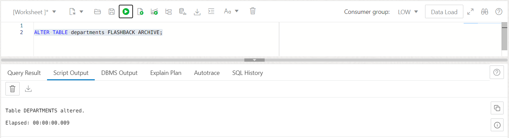

    This enables the Flashback Time Travel for the `DEPARTMENTS` table.

## Task 4: Retrieve a Past State of Data from a Table Using Flashback Query

Once the Flashback Time Travel is enabled for a table you can view the past states of data in the table.

You can use the `SELECT` statement with an `AS OF` clause to retrieve data, as it existed at an earlier time. The query explicitly references a past time through a time stamp or System Change Number (SCN) to return committed data that was current at that point in time.

In this task, you will insert records into the `EMPLOYEES` table, update the records and view the past states of table data.

1. Run the following code snippet in your SQL Worksheet to insert records into the `EMPLOYEES` table:

    ```
    <copy>INSERT INTO employees (empno, ename, job, mgr) VALUES (1001, 'Jhon', 'IT_MAN', NULL);
    INSERT INTO employees (empno, ename, job, mgr) VALUES (1002, 'King', 'HR_MAN', NULL);
    INSERT INTO employees (empno, ename, job, mgr) VALUES (1003, 'Joel', 'IT_MAN', NULL);
    INSERT INTO employees (empno, ename, job, mgr) VALUES (1004, 'Laurent', 'VP', NULL);
    INSERT INTO employees (empno, ename, job, mgr) VALUES (1005, 'Peter', 'VP', NULL);
    COMMIT;</copy>
    ```

    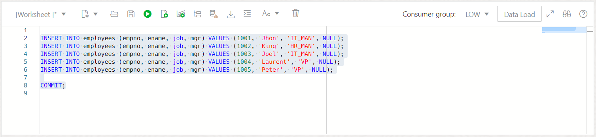

2. Keep a note of the current timestamp in order to see the current state of data in the future. Run the following command to retrieve the current timestamp of the database:

    ```
    <copy>SELECT SYSTIMESTAMP FROM dual;</copy>
    ```

    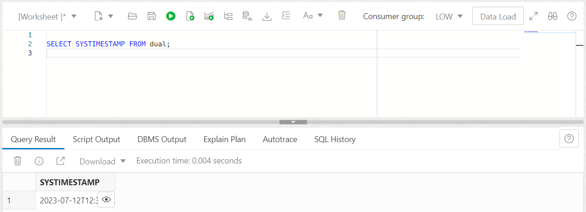

3. Update a record in the `EMPLOYEES` table. For example, to update the `MGR` field for EMPNO 1002, run the following command in your SQL Worksheet:

    ```
    <copy>UPDATE EMPLOYEES
    SET mgr=1004
    WHERE empno=1002;</copy>
    ```

    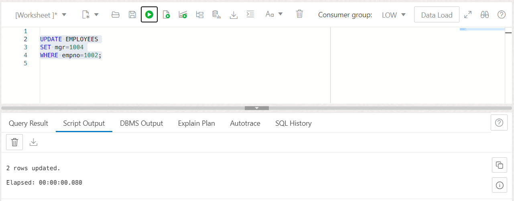


4. To verify the update execute the following command in your SQL Worksheet:

    ```
    <copy>SELECT * FROM EMPLOYEES
    WHERE empno=1002;</copy>
    ```

    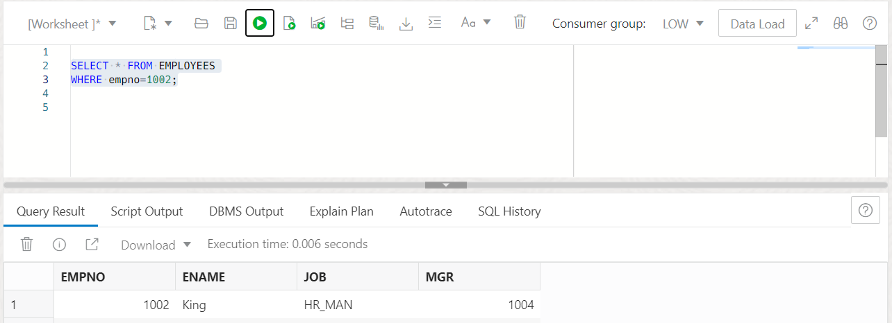


5. Now, you can use Oracle Flashback Query to examine the contents of the table as it existed at a previous timestamp. Run the following command in your SQL Worksheet:

    > **Note:** Copy the following command, however, substitute in your database's timestamp in place of the one used in this code example.

    ```
    <copy>SELECT * FROM employees
    AS OF TIMESTAMP
    TO_TIMESTAMP('2023-07-12 12:30:45','YYYY-MM-DD HH:MI:SS')
    WHERE empno=1002;</copy>
    ```
   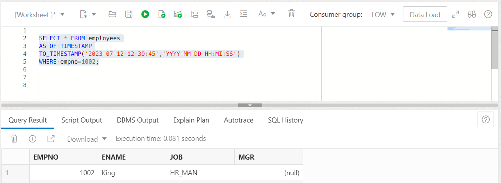
    Observe the result as it displays the `NULL` for the `MGR` field.

## Task 5: Disable Flashback Time Travel

You can disable the `FLASHBACK TIME TRAVEL` for a table using the `NO FLASHBACK ARCHIVE` clause.
In this task you will disable the `FLASHBACK TIME TRAVEL` for the `EMPLOYEES` table.

1. To disable Flashback Time Travel for the EMPLOYEE table, run the following code snippet in your SQL Worksheet:

    ```
    <copy>ALTER TABLE employees NO FLASHBACK ARCHIVE;</copy>
    ```

    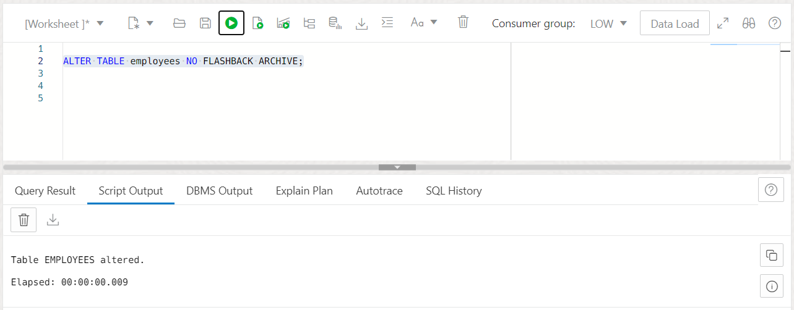

## Task 6: Restore a Table Using Flashback Table

You can use the `FLASHBACK TABLE` statement along with the `TO BEFORE DROP` clause to restore a dropped table.

When you drop a table, Oracle assigns a system-generated name to the table and the table becomes a part of the recycle bin. You can restore the dropped table using either the original user-specified name of the table or the system-generated name.
The dropped table is restored from recycle bin, along with all possible dependent objects.

In this task, you will drop the `DEPARTMENTS` table and then restore it back using the `FLASHBACK TABLE` command.

> **Note:** You must first disable `FLASHBACK ARCHIVE` for a table to drop the table that has `FLASHBACK ARCHIVE` enabled for it.
1. Disable Flashback Time Travel for the `DEPARTMENTS` table.

    ```
    <copy> ALTER TABLE departments NO fFLASHBACK ARCHIVE;/copy>
    ```
    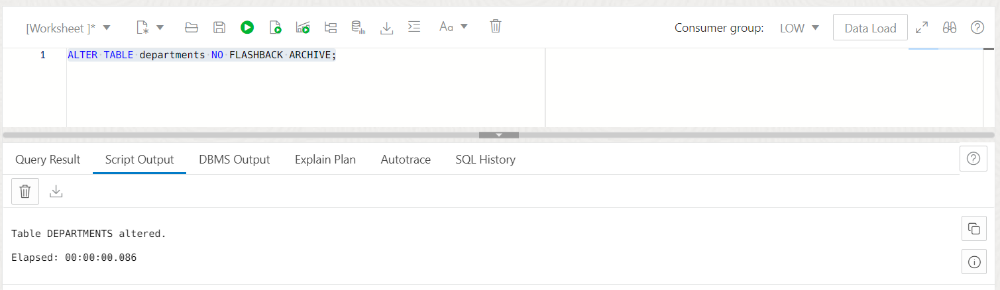
     This disables the `Flashback Time Travel` on the `DEPARTMENTS` table.


2. Drop the `DEPARTMENTS` table using the following command:

   ```
    <copy>DROP TABLE departments;</copy>
   ```
    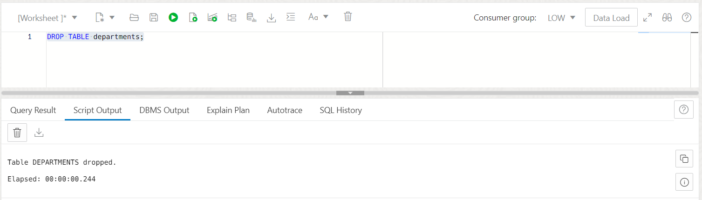
    The table is dropped and now a part of the recycle bin and has a system-generated name.

3. Query the `RECYCLEBIN` to view the dropped `DEPARTMENTS` table.

   ```
    <copy>SELECT object_name, original_name FROM RECYCLEBIN;</copy>
   ```
   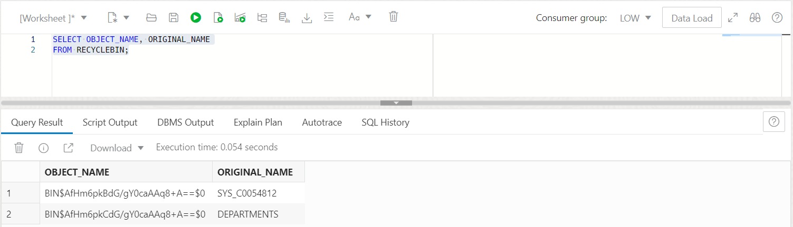
    This shows the dropped table `DEPARTMENTS` in the recycle bin.

4. Restore the `DEPARTMENTS` table.

   ```
    <copy>FLASHBACK TABLE departments TO BEFORE DROP</copy>
   ```
    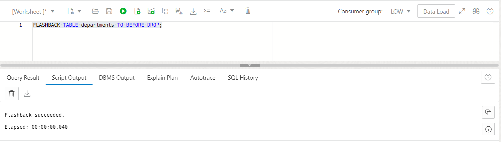
    This restores the `DEPARTMENTS` table from the recycle bin.

5. Verify the existence of the `DEPARTMENTS` table.

   ```
    <copy>DESC departments;/copy>
   ```
    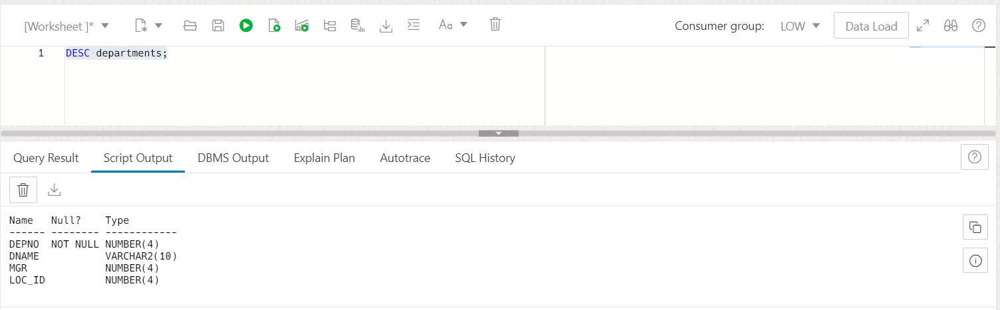

## Task 7: Modify Flashback Archive Retention Time

 A Flashback Archive is configured with retention time. Data archived in the Flashback Archive is retained for the retention time specified when the Flashback Archive was created. You can modify the retention time for Flashback Time Travel for your database.

1. To modify the retention time to 90 days for Flashback Time Travel, run the following code snippet in your SQL Worksheet:

   ```
    <copy>BEGIN
      DBMS_CLOUD_ADMIN.SET_FLASHBACK_ARCHIVE_RETENTION(
      retention_days => 90);
    END;
     /</copy>
   ```
   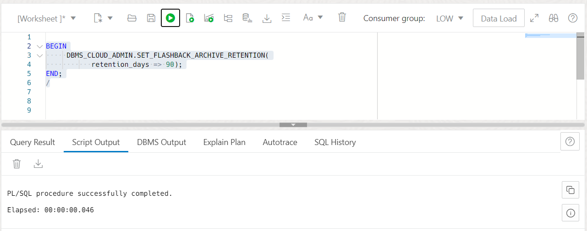

> Note: To modify the retention time for Flashback Time Travel you must be logged in as the `ADMIN` user or you must have execute privilege on `DBMS_CLOUD_ADMIN`.

## Task 8: Purge Historical Data

You can purge the `Flashback ARCHIVE` based on the timestamp or SCN or you can also purge all Flashback Time Travel data.

In this task you will learn about the steps to purge `Flashback Time Travel`.

1. To purge `Flashback Time Travel` historical data before a specified timestamp, run the following code snippet in your SQL Worksheet:

    ```
   <copy>DBMS_CLOUD_ADMIN.PURGE_FLASHBACK_ARCHIVE(scope => 'timestamp', before_timestamp => '01-Jul-2023 12:00:00');</copy>
    ```
    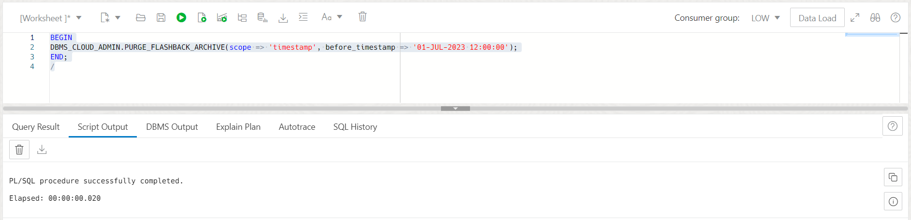
    This purges the flashback historical data based on the provided `timestamp` from the `Flashback Data Archive`.

2. To purge `Flashback Time Travel` historical data before a specified timestamp, run the following code snippet in your SQL Worksheet:

    ```

    <copy>DBMS_CLOUD_ADMIN.PURGE_FLASHBACK_ARCHIVE(scope => 'scn',before_scn=> '38567332107905');</copy>
    ```

    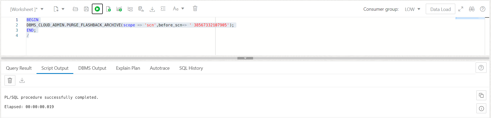
     This purges the flashback historical data based on the `scn` from the `Flashback Data Archive`.

3. To purge all `Flashback Time Travel` historical data, run the following code snippet in your SQL Worksheet:

    ```

    <copy>DBMS_CLOUD_ADMIN.PURGE_FLASHBACK_ARCHIVE(scope => 'ALL');</copy>
    ```

    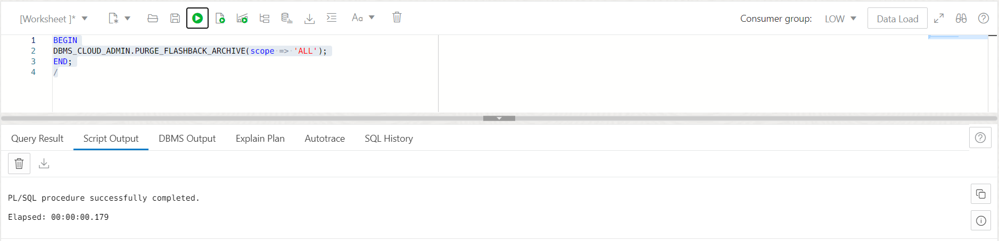
    This purges all the flashback historical data from the `Flashback Data Archive`.
> **Note:** To purge the `Flashback Data ARchive` you must be logged in as the `ADMIN` user or you must have execute privilege on `DBMS_CLOUD_ADMIN`.

## Want to Learn More?

- See the documentation [Use Flashback Time Travel](https://docs.oracle.com/en/cloud/paas/autonomous-database/adbsa/flashback-time-travel-autononomous.html#GUID-A98E1F8B-FAE4-4FFF-955D-3A0E5F8EBC4A)
- For more information see [How to Use Flashback Time Travel in Autonomous Database](https://blogs.oracle.com/datawarehousing/post/flashback-time-travel-autonomous-database#:~:text=Retention%20of%20Historical%20Changes%3A%20Flashback,the%20timestamp%20of%20each%20change.).

## Acknowledgments

- **Author** - Shilpa Sharma, Principal User Assistance Developer, Database Development
- **Contributor** - Lauran Serhal, Consulting User Assistance Developer, Database Development
- **Last Updated By/Date** - Shilpa Sharma, March, 2025
