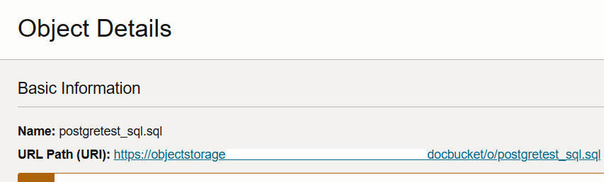
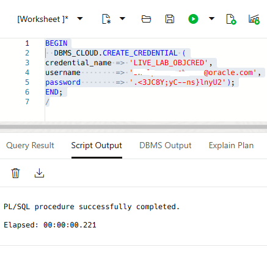
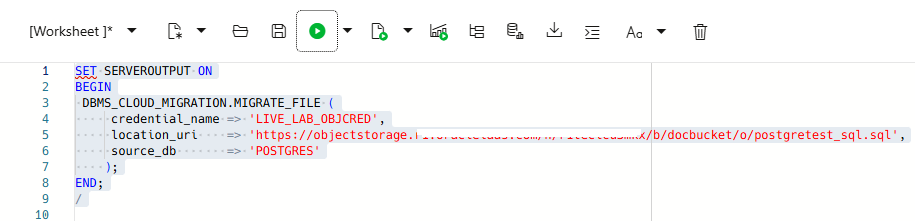
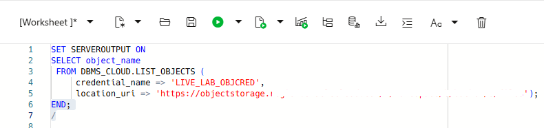

# Translate PostgreSQL files to Oracle SQL

## **Introduction**
This lab introduces the `DBMS_CLOUD_MIGRATION.MIGRATE_FILE` procedure enables you to translate a file containing PostgreSQL statements to Oracle SQL.

Estimated Time: 30 minutes


### **Objectives**

In this lab, you will:

- Upload a file containing PostgreSQL SQL statements to your Object Storage bucket
- Connect to your Autonomous Database using SQL Worksheet
- Create a credential to access Cloud Object Storage
- Use the `DBMS_CLOUD_MIGRATION.MIGRATE_FILE` Procedure to Translate a file that contains PostgreSQL statement to Oracle SQL

### **Prerequisites**

This lab assumes that:

- You have performed the previous lab on provisioning an Oracle Autonomous Database instance.
- You are logged in as the ADMIN user or have EXECUTE privilege on the `DBMS_CLOUD_MIGRATION` package.
- You are connected to your Autonomous Database using SQL Worksheet.

## Task 1: Upload a File Containing PostgreSQL SQL Statements to Object Storage

1. Open the **Navigation** menu in the Oracle Cloud console and click **Storage**. Under **Object Storage & Archive Storage**, click **Buckets**.

2. On the **Buckets** page, select the compartment that contains your bucket from the **Compartment** drop-down list in the **List Scope** section. Make sure you are in the region where your bucket was created.

3. On the **Buckets** page, click the bucket's name link to which you want to upload the files. The **Bucket Details** page is displayed.


  

4. Scroll down the page to the **Objects** section, and then click **Upload**.

  

5. In the **Upload Objects** panel, you can drag and drop a single or multiple files into the **Choose Files from your Computer** field or click **select files** to choose the file that you want to upload from your computer.

  

6. Click **Upload** to upload the selected file to the bucket.

7. When the file is uploaded, click **Close** to close the **Upload Objects** panel. The **Bucket Details** page is re-displayed. The newly uploaded file is displayed in the **Objects** section.

  

8. Note the URL path (URI) of your uploaded Postresql file. In the row showing the uploads, click more actions at the end of the row (ellipsis) and select **View Object Details**.

  

8. To return to the **Buckets** page, click **Object Storage** in the breadcrumbs.

## Task 2: Connect to your ADB Instance

  Navigate to your SQL Worksheet and login with your credentials.

## Task 3: Create a credential to access Cloud Object Storage

1. Create a credential to access Cloud Object Store. Copy and paste the following code into your SQL Worksheet, and then click the **Run Script (F5)** icon in the Worksheet toolbar.

  ```
    <copy>
BEGIN
  DBMS_CLOUD.CREATE_CREDENTIAL (
    credential_name => 'LIVE_LAB_OBJCRED',
    username        => 'yourusername@example.com',
    password        => '.<3JC8Y;yC--ns}lnyU2'
  );
END;
/
  </copy>
```
  

 This creates a credential object to access Cloud Object Store.

**Note:** The **username** and **password** arguments together specify your cloud service credentials.

For detailed information on creating credentials, see the [CREATE_CREDENTIAL Procedure](https://docs.oracle.com/en/cloud/paas/autonomous-database/serverless/adbsb/dbms-cloud-subprograms.html#GUID-742FC365-AA09-48A8-922C-1987795CF36A).

## Task 4: Use the `DBMS_CLOUD_MIGRATION.MIGRATE_FILE` Procedure to Translate a PostgreSQL File to Oracle SQL

1. Run the `DBMS_CLOUD_MIGRATION.MIGRATE_FILE` procedure to migrate the PostgreSQL file to Oracle SQL. Copy and paste the following code into your SQL Worksheet, and then click the **Run Script (F5)** icon in the Worksheet toolbar.

  ```
    <copy>
  SET SERVEROUTPUT ON
BEGIN
 DBMS_CLOUD_MIGRATION.MIGRATE_FILE (
    credential_name => 'LIVE_LAB_OBJCRED',
    location_uri    => 'https://objectstorage.region.oraclecloud.com/n/namespace/b/bucket/o/files/postgretest_sql.sql',
    source_db       => 'POSTGRES'
    );
END;
/
 </copy>
```
  

 This translates the PostgreSQL file to Oracle SQL and generates a new file with the name **postgretestsql_oracle.sql**.

 **Note:** Replace the **location_uri** parameter value with the location URI value you noted in **Step 8** of **Task 1**.

 Run the following SQL code to verify that the output file is generated.

  ```
   <copy>
  SELECT object_name FROM DBMS_CLOUD.LIST_OBJECTS (
    credential_name => 'LIVE_LAB_OBJCRED',
    location_uri    => 'https://objectstorage.region.oraclecloud.com/n/namespace/b/bucket/o/files');
  </copy>
```

   

 **Note:** Replace the **location_uri** parameter value with the location URI value you noted in **Step 8** of **Task 1**.

## Acknowledgements

- **Author:**       - Shilpa Sharma, Principal User Assistance Developer
- **Contributors:** - Lauran K. Serhal, Consulting User Assistance Developer
- **Last Updated By/Date:** - Shilpa Sharma, May 2025