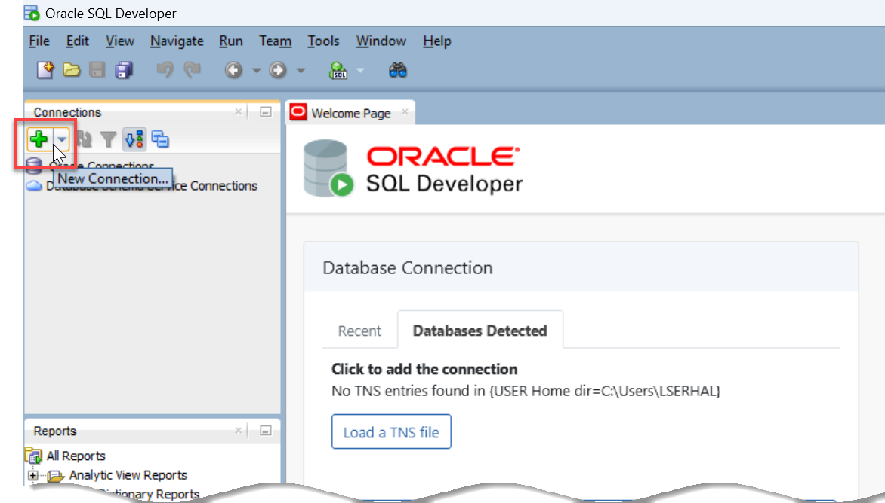

# Run PostgreSQL Statements in Autonomous Database Serverless

## Introduction
This lab introduces the `DBMS_CLOUD_MIGRATION.ENABLE_TRANSLATION` procedure that enables you to run PostgreSQL statements in your Autonomous database session.

**Note: `DBMS_CLOUD_MIGRATION.ENABLE_TRANSLATION` is not supported in Database Actions and is not supported with the Oracle APEX Service.**

Estimated Time: 30 minutes


### Objectives

In this lab, you will:
- Connect to your ADB Instance using SQLDeveloper
- Enable Real-Time SQL Translation in Your Session
- Run PostgreSQL Statements in Your Session
- Disable Real-Time SQL Translation in Your Session

### Prerequisites

This lab assumes that:

- You have performed the previous lab on provisioning an Oracle Autonomous Database instance.
- You are logged in as the ADMIN user or have EXECUTE privilege on the `DBMS_CLOUD_MIGRATION` package.
- You are connected to your Autonomous Database using SQL Worksheet.


## Task 1: Connect to Autonomous Database with SQL Developer

**Note:** In this lab we are establishing a secure SQL Developer connection to an autonomous database without a wallet, using TLS authentication.

When you provisioned your autonomous database instance with a network access type of "Secure access from everywhere", by default, mTLS authentication was required, and the only ways to enable TLS in addition to mTLS are either to define an access control list (ACL) or to use a private endpoint. For this lab, you will configure an IP ACL (access control list). Then you will be able to uncheck the "Require mutual TLS" checkbox, which in turn will enable TLS for connecting without a wallet.

* For detailed information on allowing TLS connections, see the [Update Network Options to Allow TLS or Require Only Mutual TLS (mTLS) Authentication on Autonomous Database](https://docs.oracle.com/en/cloud/paas/autonomous-database/serverless/adbsb/support-tls-mtls-authentication.html#GUID-3F3F1FA4-DD7D-4211-A1D3-A74ED35C0AF5)

To create a new TLS connection to Autonomous Database:

1. Define an **IP ACL** (access control list). Navigate to the **Autonomous Database details** page. Scroll-down to the **Network** section, and then click the **Edit** link next to **Access control list**.

 

2. In the **Edit access control list** panel, you might normally accept the default IP notation type of **IP Address**, and then click **Add My IP Address**. Your computer's IP address would be added as a value; However, for this lab that you might be running in any one of a variety of different environments, let's make a different selection.

 

3. For this lab, click the **IP notation type** drop-down list and select **CIDR block**. In the **Values** field, enter **0.0.0.0/0**.

 

4. Click **Save**. Wait a minute for the database status to change from **UPDATING** to **AVAILABLE**.

5. On the **Autonomous Database details** page, in the **Network** section, note that the **Access type** has automatically changed from the default access type that you used when provisioning the database, **Allow secure access from everywhere**, to **Allow secure access from specified IPs and VCNs**. Click the **Edit** link next to **Mutual TLS (mTLS) authentication**.

 

6. In the **Edit mutual TLS authentication** dialog box, deselect the checkbox that requires mutual TLS (mTLS) authentication and and click **Save**. Wait a minute for the database status to change from **UPDATING** to **AVAILABLE**.

 

When the update finishes, note that the Mutual TLS (mTLS) Authentication field has changed from **Required** to **Not required**.

 

Next, perform the following steps to obtain the **TLS connection string**.

7. On the **Autonomous Database details** page, click the **Database connection** button.

8. In the **Database connection** panel, scroll-down to the **Connection strings** section. Click the **TLS authentication** drop-down list, and then select **TLS**. This will enable SQL Developer and other applications to connect to your Autonomous Database securely without a wallet.

9. Choose one of the displayed connection strings, and optionally click **Show** to see the contents of the connection string. Next, click **Copy** to copy that connection string. Paste the connection string to a text editor of your choice such as notepad as you will need this information later.

 

 

10. Click **Close** to close the **Database connection** dialog box.

11. Start Oracle SQL Developer if you have not done that yet. In the **Connections** panel, click the **New Connection….** button (big green plus sign).

 

12. In **New / Select** Database Connection dialog box, specify the following information:

   - **Name**: Enter a name for this connection, such as connection without wallet using TLS.
   - **Username**: Enter the database username. You can either use the default administrator database account ADMIN provided as part of the service or create a new schema, and use it.
   - **Password**: Enter the password you created for the database user such as Training4ADB.
   - **Connection Type**: Select Custom JDBC.
   - **Custom JDBC URL**: Enter the following:
  **jdbc:oracle:thin:@** followed by the connection string you copied in **Step 9**.


 **Note**: When you copy the connection string, the values for **region** and **databasename** are for your Oracle Autonomous Database instance.

 13. Click **Test** to test your connection. If the **Status: Success** message is displayed in the bottom left hand side of the dialog box, click **Save** to save your connection. Next, click **Connect** to connect to the database.

  

 14. A **Connection Information** dialog box is displayed. Enter the password associated with the **admin** user, and then click **OK**.

 You are now connected to your database instance using your new database connection that you created and saved. You can drill down on the new connection in the Connections panel to display the objects in your database instance.

  

## Task 2: Enable Real-Time Translation in Your Session

To run a PostgreSQL statement in your Autonomous Database you must first enable real-time SQL translation in your session. Use the `DBMS_CLOUD_MIGRATION.ENABLE_TRANSLATION` procedure to enable real-time translation for a session.

### Enable Real-Time SQL Translation in Your Session

1. Run `DBMS_CLOUD_MIGRATION.ENABLE_TRANSLATION` to enable real-time translation in your session. Copy and paste the following code into your SQL Worksheet, and then click the **Run Script (F5)** icon in the Worksheet toolbar.

    ```
    <copy>
    BEGIN
        DBMS_CLOUD_MIGRATION.ENABLE_TRANSLATION('POSTGRES');
    END;
    /
    </copy>
    ```
  

  This enables the real-time SQL translation in your session.

  Verify the SQL translation language for your session. Copy and paste the following query into your SQL Worksheet, and then click the **Run Script (F5)** icon in the Worksheet toolbar.

      ```
    <copy>
      SELECT SYS_CONTEXT ('USERENV','SQL_TRANSLATION_PROFILE_NAME')
      FROM DUAL;
    </copy>
    ```

  

This shows the enabled translation language for your session.

## Task 3: Run PostgreSQL Statements in Your Session

### Run PostgreSQL Statements in Your Session

1. Enter and run PostgreSQL statements in your database session. Copy and paste the following code into your SQL Worksheet, and then click the **Run Script (F5)** icon in the Worksheet toolbar.

    ```
    <copy>
    CREATE TABLE emp (emp_id int, name varchar(255), salary money, hire_date date);
    </copy>
    ```

   

  This entered PostgreSQL statement runs seamlessly as Oracle SQL in your session.

   Verify the table creation. Copy and paste the following code into your SQL Worksheet, and then click the **Run Script (F5)** icon in the Worksheet toolbar.

    ```
    <copy>
    DESCRIBE emp;
    </copy>
    ```

    

    Please note that the **MONEY** PostgreSQL datatype is automatically converted to **NUMBER** datatype.

  2. After the table **EMP** is created, you can insert records into the table. Copy and paste the following code into your SQL Worksheet, and then click the **Run Script (F5)** icon in the Worksheet toolbar.

     ```
    <copy>
    INSERT INTO emp(emp_id, name, salary, hire_date) VALUES (101, 'King',  25000, sysdate);
    INSERT INTO emp(emp_id, name, salary, hire_date) VALUES (102, 'James', 30000, sysdate);
    INSERT INTO emp(emp_id, name, salary, hire_date) VALUES (103, 'Nancy', 35000, sysdate);
    INSERT INTO emp(emp_id, name, salary, hire_date) VALUES (104, 'Lauran',35000, sysdate);
    INSERT INTO emp(emp_id, name, salary, hire_date) VALUES (105, 'Neena', 30000, sysdate);
    </copy>
    ```

     

    This inserts five records into the **EMP** table.

    Use SQL SELECT statement to retrieve records from the **EMP** table.  Copy and paste the following code into your SQL Worksheet, and then click the **Run Script (F5)** icon in the Worksheet toolbar.

     ```
    <copy>
    Select emp_test.*
    FROM emp AS emp_test;
    </copy>
    ```

    

    This retrieves five records from the **EMP** table.

## Task 4: Disable Real-Time SQL Translation in Your Session

1. Run `DBMS_CLOUD_MIGRATION.DISABLE_TRANSLATION` to disable real-time translation in your session. Copy and paste the following code into your SQL Worksheet, and then click the **Run Script (F5)** icon in the Worksheet toolbar.

     ```
    <copy>
    BEGIN
        DBMS_CLOUD_MIGRATION.DISABLE_TRANSLATION;
    END;
    /
    </copy>
    ```

    
This disables the real-time SQL translation in your session.

**Note:**  An error is encountered if SQL language translation is not enabled for your session.


## Acknowledgements

- **Author:**       - Shilpa Sharma, Principal User Assistance Developer
- **Contributors:** - Lauran K. Serhal, Consulting User Assistance Developer
- **Last Updated By/Date:** - Shilpa Sharma, May 2025