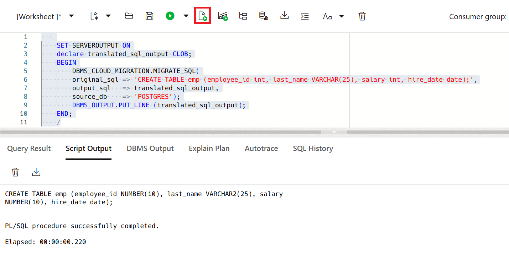
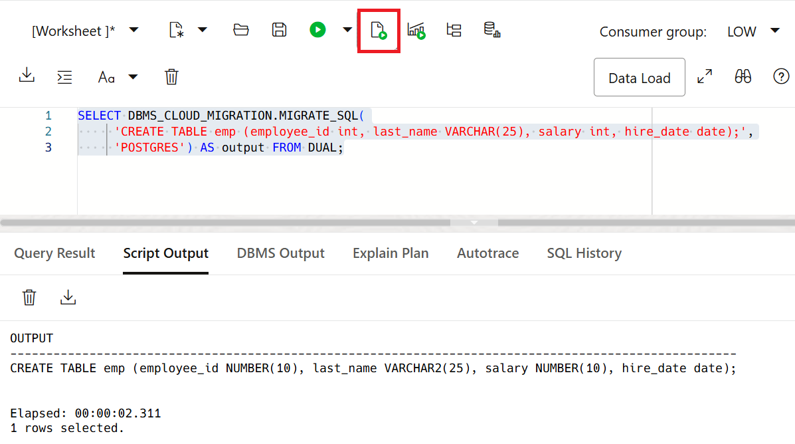


# Translate PostgreSQL Statements to Oracle SQL

## **Introduction**
This lab introduces the `DBMS_CLOUD_MIGRATION.MIGRATE_SQL` procedure that enables you to translate the SQL statements written for a non-Oracle database to Oracle SQL.

Estimated Time: 30 minutes


### **Objectives**

In this lab, you will:
- Connect to your ADB Instance using SQL Worksheet
- Use the `DBMS_CLOUD_MIGRATION.MIGRATE_SQL` Procedure to Translate a PostgreSQL statement to Oracle SQL
- Use the `DBMS_CLOUD_MIGRATION.MIGRATE_SQL` Function to Translate a PostgreSQL Statement to Oracle SQL

### **Prerequisites**

This lab assumes that:

- You have performed the previous lab on provisioning an Oracle Autonomous Database instance.
- You are logged in as the ADMIN user or have EXECUTE privilege on the `DBMS_CLOUD_MIGRATION` package.
- You are connected to your Autonomous Database using SQL Worksheet.

## Task 1: Connect to your ADB Instance

1. Navigate to your SQL Worksheet and login with your credentials.

## Task 2: Use the `DBMS_CLOUD_MIGRATION.MIGRATE_SQL` procedure to Translate a PostgreSQL statement to Oracle SQL

The `DBMS_CLOUD_MIGRATION.MIGRATE_SQL` procedure accepts a PostgreSQL statement as input and translates the statement to Oracle SQL.

**Note:**  With the `DBMS_CLOUD_MIGRATION.MIGRATE_SQL` procedure you can translate only one SQL statement per call.

### Run the `DBMS_CLOUD_MIGRATION.MIGRATE_SQL` procedure

1. Translate PostgreSQL statement to Oracle SQL. Copy and paste the following code into your SQL Worksheet, and then click the **Run Script (F5)** icon in the Worksheet toolbar.

    ```
    <copy>
    SET SERVEROUTPUT ON
    declare translated_sql_output CLOB;
    BEGIN
        DBMS_CLOUD_MIGRATION.MIGRATE_SQL(
        original_sql => 'CREATE TABLE emp (employee_id int, last_name VARCHAR(25), salary int, hire_date date);',
        output_sql   => translated_sql_output,
        source_db    => 'POSTGRES');
        DBMS_OUTPUT.PUT_LINE (translated_sql_output);
    END;
    /
    </copy>
    ```
  

  This accepts PostgreSQL statement as input and translates it to Oracle SQL. The translated statement is then assigned to the `translated_sql_output` variable.
  You can display the output (translated statement) using `DBMS_OUTPUT.PUT_LINE`.

## Task 3: Use the `DBMS_CLOUD_MIGRATION.MIGRATE_SQL` function to Translate a PostgreSQL statement to Oracle SQL

The `DBMS_CLOUD_MIGRATION.MIGRATE_SQL` function enables you to translate a non-SQL statement to Oracle SQL. With the `DBMS_CLOUD_MIGRATION.MIGRATE_SQL` function you can translate only one SQL statement per call.

**Note:**  With the `DBMS_CLOUD_MIGRATION.MIGRATE_SQL` function you can translate only one SQL statement per call.

### Run the `DBMS_CLOUD_MIGRATION.MIGRATE_SQL` function

1. Translate PostgreSQL statement to Oracle SQL using the `DBMS_CLOUD_MIGRATION.MIGRATE_SQL` function. Copy and paste the following code into your SQL Worksheet, and then click the **Run Script (F5)** icon in the Worksheet toolbar.

    ```
    <copy>
    SELECT DBMS_CLOUD_MIGRATION.MIGRATE_SQL(
        'CREATE TABLE emp (employee_id int, last_name VARCHAR(25), salary int, hire_date date);',
        'POSTGRES') AS output
        FROM DUAL;
    </copy>
    ```
  

The function version of the `DBMS_CLOUD_MIGRATION.MIGRATE_SQL` subroutine accepts a PostgreSQL statement as a function parameter and translates the statement to Oracle SQL.

## Acknowledgements

- **Author:**       - Shilpa Sharma, Principal User Assistance Developer
- **Contributors:** - Lauran K. Serhal, Consulting User Assistance Developer
- **Last Updated By/Date:** - Shilpa Sharma, May 2025